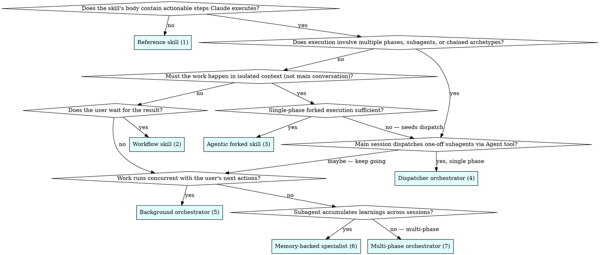
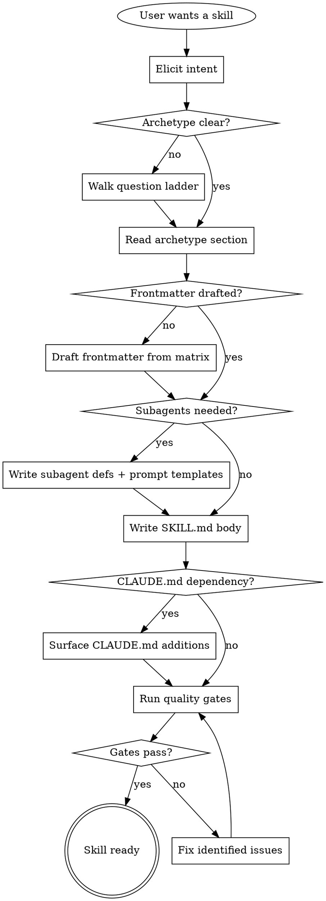
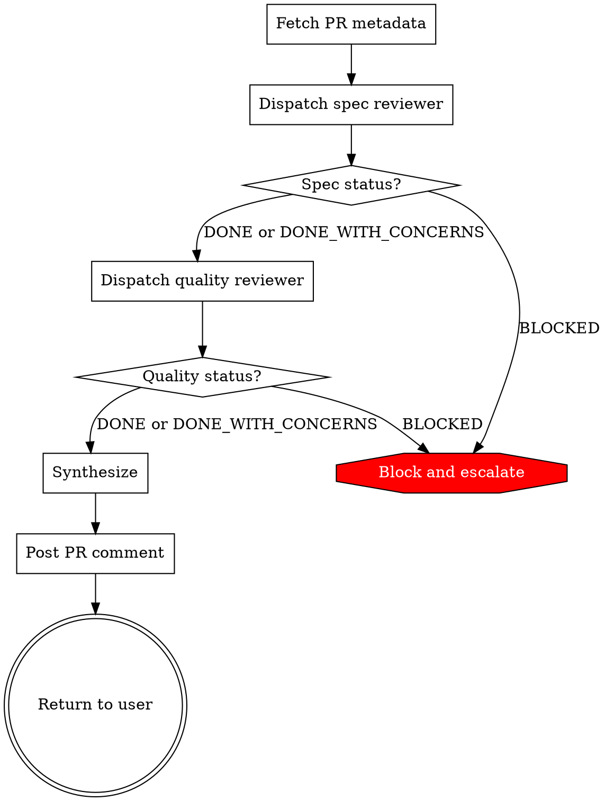
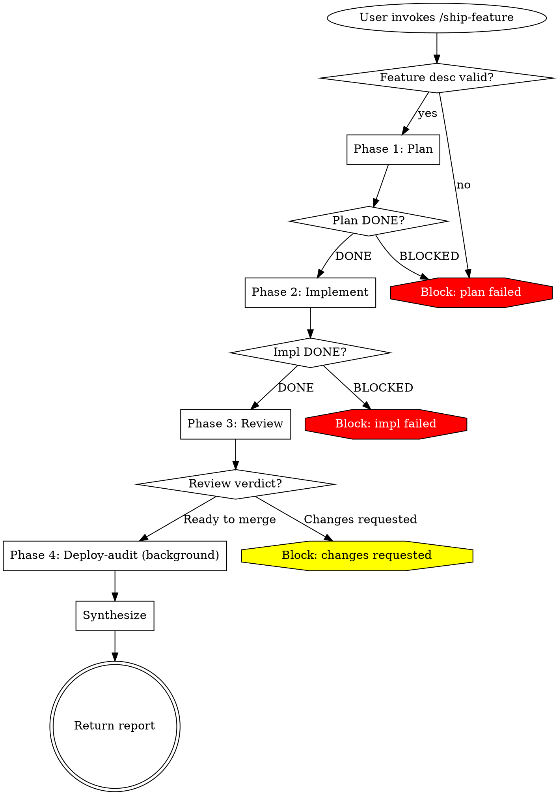

# Authoring Claude Code Skills — Complete Guideline

A single-document reference for authoring production-quality Claude Code skills. Covers the seven archetypes, the authoring process, the eleven quality gates, frontmatter design, dispatch prompts, and CLAUDE.md interaction.

This document is the canonical guideline. Read it top-to-bottom on first use; reference specific sections later.

---

## Table of contents

1. Foundations
2. The seven archetypes
3. Choosing the right archetype
4. The authoring process
5. Archetype 1: Reference skill
6. Archetype 2: Workflow skill
7. Archetype 3: Agentic / forked skill
8. Archetype 4: Dispatcher orchestrator
9. Archetype 5: Background orchestrator
10. Archetype 6: Memory-backed specialist
11. Archetype 7: Multi-phase orchestrator
12. Quality gates
13. Frontmatter matrix
14. Dispatch prompt patterns
15. CLAUDE.md interaction
16. Anti-patterns and red flags
17. Quick reference

---

## 1. Foundations

### What a Claude Code skill actually is

A Claude Code skill is more than a markdown file with two YAML fields. The archetype you pick determines seven downstream decisions: invocation, execution context, tool access, permission mode, memory, subagent coordination, and knowledge loading. Pick the archetype first. Everything else follows.

A deployment-ready skill produces frontmatter planned against exactly one of seven archetypes, body structure that matches the archetype, quality gates passed, and CLAUDE.md additions surfaced where the skill depends on project conventions. The output is something another engineer could merge without revision.

### The hard rule before writing

Do NOT write a SKILL.md body until you have:

1. Picked exactly ONE archetype (Section 3)
2. Written the full frontmatter — not just `name` and `description`
3. Read the archetype's section in this guideline

This applies to EVERY skill — including "simple" reference skills, skills you are "just editing", and skills where the archetype "feels obvious". Skipping this gate produces skills that mix archetypes, ship with under-specified frontmatter, and solve the wrong problem. No exceptions.

### Frontmatter is design, not metadata

The tempting failure is reaching for every frontmatter field that *might* apply, on the theory that more configuration makes the skill more robust. This reliably produces skills that trigger at the wrong times, load content into the wrong context, or silently deny permissions that the body depends on. Authority over frontmatter comes from the archetype, not from the author's hopes.

Pick an archetype, copy its frontmatter template verbatim from the archetype's section, then delete any field whose value you cannot justify in one sentence. If you cannot delete any fields, you have not chosen an archetype — you have chosen a shopping cart.

### The two context budgets

Every skill competes for two distinct context budgets, and they are easy to conflate:

**Budget 1 — SKILL.md content size.** When a skill is referenced, its body loads into the main session. Reference skills load on path match; workflow skills load on `/name`; subagent prompts load when dispatched. Token-count this; keep it tight (Section 12, Gate 2).

**Budget 2 — Subagent runtime context.** Every dispatched subagent runs in its own fresh context window. Three sources of inheritance load tokens *before* the subagent reads its prompt:

- **MCP server tool definitions** — by default, every connected MCP server's full tool catalogue is inherited into every dispatched subagent. With multiple servers connected (GitLab, Playwright, Pencil, Context7, etc.), this routinely runs to 30k–50k tokens per dispatch, paid even when the subagent uses no MCP tool.
- **`tools` inheritance** — when a subagent's `tools` is omitted or set to `inherit`, it gets the main session's full built-in tool set.
- **`skills` preload** — explicit but each preloaded skill loads its full content (not on-demand).

A multi-phase orchestrator that dispatches five subagents, each inheriting MCP tools by default, can burn 150k+ tokens of MCP definitions across one orchestrator run, in subagents that need only `Read`, `Grep`, and `Bash(git *)`. Setting `mcpServers: []` on each cuts this to zero with no functional change.

**Tools control permissions; MCP scoping controls context.** A subagent's `tools` field gates what it can do. Its `mcpServers` field gates how much context loads when it dispatches. Both need narrow scopes — the first for safety, the second for budget.

### Terminology

- **Skill** — markdown file with YAML frontmatter that Claude loads on demand
- **Subagent** — independent agent with its own context window, defined under `.claude/agents/`
- **Agent tool** — the tool the main session calls to dispatch a subagent (formerly `Task`; renamed in 2.1.63 but `Task` still works as an alias)
- **Forked subagent** — a fresh subagent spawned by `context: fork` in a skill's frontmatter; the skill body becomes its prompt
- **CLAUDE.md** — project-wide context file loaded at session start
- **Memory (subagent memory)** — persistent storage at `.claude/agent-memory/<name>/` for subagents with `memory: project|user|local`

---

## 2. The seven archetypes

The archetypes, in order of complexity:

| # | Archetype | Runs in | Primary use |
|---|-----------|---------|-------------|
| 1 | Reference skill | Main session, on demand | Standing knowledge (conventions, style guides) |
| 2 | Workflow skill | Main session, on `/name` | Inline multi-step procedure |
| 3 | Agentic / forked skill | Fresh forked subagent | Isolated task with read-only exploration |
| 4 | Dispatcher orchestrator | Main session + ≥1 subagent | Main skill coordinates subagent(s) via Agent tool |
| 5 | Background orchestrator | Concurrent subagent | Long-running work with pre-approved permissions |
| 6 | Memory-backed specialist | Cross-session subagent | Subagent accumulates knowledge across sessions |
| 7 | Multi-phase orchestrator | Main session as coordinator | Chains phases from archetypes 1–6 |

### Quick reference matrix

| Archetype | Runs in | Invoker | Memory | Blocking | Subagents |
|-----------|---------|---------|--------|----------|-----------|
| 1. Reference | Main session | Auto, on match | None (project via CLAUDE.md) | N/A | None |
| 2. Workflow | Main session | Usually `/name` | None (project via CLAUDE.md) | Blocking | None |
| 3. Agentic forked | Forked subagent | Either | None | Blocking | Self (one fork) |
| 4. Dispatcher | Main + subagents | Either | None per call | Blocking | One or more via Agent tool |
| 5. Background | Concurrent subagent | Usually `/name` | Optional | Non-blocking | One, via Agent tool, `background: true` |
| 6. Memory specialist | Cross-session subagent | Either | `user`/`project`/`local` | Blocking | Named subagent |
| 7. Multi-phase | Main session | Either | Mixed | Usually blocking | Multiple, mixed archetypes |

---

## 3. Choosing the right archetype

Walk this question ladder in order. Stop at the first archetype that answers YES for every question on its path. Each question is binary — if you need a third answer, your intent is under-specified.

### Question ladder



### Question-by-question guide

**Q1: Does the skill's body contain actionable steps Claude executes?**

- *No* — the body is standing knowledge: conventions, regex tables, API catalogues, style guides. Claude references it during unrelated work. → **Archetype 1: Reference skill**
- *Yes* — Claude runs something when the skill is loaded. Continue.

A skill that contains both "here are the rules" AND "here's how to run the check" is two skills. Extract the rules to a reference skill; make the runner a workflow/forked/dispatcher skill that preloads the reference.

**Q2: Does execution involve multiple phases, subagents, or chained archetypes?**

- *Yes* — skip to Q5.
- *No* — continue to Q3.

A "phase" is a boundary where the output of one chunk of work becomes the input of another. Running three commands in sequence is not multi-phase if they share one context. Running a planner, then an implementer, then a reviewer IS multi-phase.

**Q3: Must the work happen in isolated context (not main conversation)?**

- *Yes, single phase* — the skill runs a self-contained task in a forked subagent. Main conversation only sees the summary. → continue to Q4.
- *No* — continue to Q6.

Signals for isolated context: the work reads many files, generates verbose output, needs different tools, or would pollute main context with intermediate state the user won't reference.

**Q4: Single-phase forked execution sufficient?**

- *Yes* — one forked subagent does the whole job. → **Archetype 3: Agentic forked skill**
- *No — needs further dispatch* — even the forked work needs to coordinate. → jump to Q5.

**Q5: Main session dispatches one-off subagents via Agent tool?**

- *Yes, single phase* (one round of dispatch, synthesis, done) → **Archetype 4: Dispatcher orchestrator**
- *Maybe — keep going* — continue to Q7 and Q8.

**Q6: Does the user wait for the result?**

- *Yes* — inline workflow in the main conversation. → **Archetype 2: Workflow skill**
- *No* — continue to Q7.

**Q7: Work runs concurrent with the user's next actions?**

- *Yes* — subagent runs in the background while the user continues interacting. → **Archetype 5: Background orchestrator**
- *No* — continue to Q8.

**Q8: Subagent accumulates learnings across sessions?**

- *Yes* — a named subagent (not a forked one-off) with `memory: user|project|local` that builds knowledge over time. → **Archetype 6: Memory-backed specialist**
- *No* — multi-phase without background, without persistent memory, chaining multiple archetypes. → **Archetype 7: Multi-phase orchestrator**

### When two archetypes seem to fit

Pick the one with fewer moving parts. Every time. A reference skill beats a workflow skill beats a forked skill beats a dispatcher orchestrator beats a multi-phase orchestrator, when both would work.

Justifications for reaching up the complexity ladder:

- **Reference → Workflow**: there is a user-triggerable action Claude should take exactly the same way every time
- **Workflow → Forked**: the work generates context pollution that hurts subsequent main-conversation tasks
- **Forked → Dispatcher**: multiple specialist passes are needed, with distinct tool scopes or prompt framings
- **Dispatcher → Background**: the user's time is more valuable than the wait, and the work is safe to pre-approve
- **Any → Memory-backed**: the skill's effectiveness increases measurably with accumulated session history
- **Any → Multi-phase**: phases are genuinely separable and produce artifacts the next phase consumes

If you cannot name the justification, you are over-engineering. Drop one level.

### Anti-pattern: orchestrator by default

Teams that discover orchestrator patterns tend to reach for them reflexively. Most skills are reference or workflow skills. Orchestrators exist for a narrow set of problems — not as a flex. A repo with more than 20% orchestrator skills is almost certainly mis-classified; audit and collapse.

---

## 4. The authoring process

Eight steps, executed in order. Use TodoWrite (or your task tracker) to keep them visible.

### Step 1: Elicit intent

Until you can answer all six in one sentence each:

- **Trigger** — what natural-language request should load this skill? (Shapes the `description`.)
- **Invoker** — Claude auto-loads, user types `/name`, or both? (Shapes `disable-model-invocation`, `user-invocable`.)
- **Output** — what does the skill produce: file, commit, report, decision, nothing? (Shapes tool access.)
- **Context appetite** — does the work generate verbose intermediate output the main conversation should not see? (Signals forked or subagent archetype.)
- **Durability** — does the skill need to remember anything between sessions? (Signals memory-backed archetype or CLAUDE.md additions.)
- **Blocking** — must the user wait for the result, or can the work happen in parallel? (Signals background archetype.)

If you can't state all six, ask the user. Don't guess. Guessed intent is the dominant cause of archetype mismatch.

### Step 2: Pick the archetype

Walk the question ladder (Section 3). Pick exactly one. If two seem to fit equally, the one with fewer moving parts wins.

Announce the archetype out loud (in your response): "This is a Dispatcher Orchestrator." Announcing the archetype is not optional; it commits you to a specific set of frontmatter fields.

### Step 3: Read the archetype's section

Read the full archetype section (Sections 5–11). Each contains: when to pick it, frontmatter template, body structure, worked example, varied alternatives, common failures, sibling archetypes.

You should be able to recite the frontmatter fields required for this archetype without looking. If you can't, read the section again — once is not enough for archetypes 4 through 7.

### Step 4: Draft the frontmatter

Open the frontmatter matrix (Section 13). Copy the column for your archetype. Fill in every required field. For each optional field, write a one-sentence justification or delete the field.

**Description discipline (critical):** the `description` field describes WHEN to use the skill, not WHAT it does. Never summarize the workflow. If your description contains "first", "then", "after", or any step sequence, it is wrong. Claude reads the description to decide whether to load the skill; a workflow summary there becomes a shortcut Claude takes instead of reading the body.

```yaml
# ❌ WRONG — summarizes workflow in description
description: "Use when reviewing a PR. First runs a spec-compliance check, then runs a code-quality check, and synthesizes both."

# ✅ RIGHT — triggering conditions only
description: "You MUST use this when reviewing any pull request before merging, or when a user says 'review this PR', 'check my changes', or 'is this ready to merge'."
```

The description must pass the shortcut test: re-read it as a standalone instruction. Could Claude execute it as a workflow without reading the body? If yes, rewrite.

### Step 5: Draft subagent definitions

For archetypes 4, 5, 6, and 7, draft subagent definitions as separate files under `.claude/agents/`. These are independent of the SKILL.md and need their own frontmatter.

Critical fields: `tools`, `permissionMode`, `skills`, `memory`, `background`, `isolation`, and **`mcpServers`**.

Each subagent definition should read independently and still make sense. A subagent definition that only makes sense alongside its caller is a latent bug.

Each subagent's `mcpServers` is set explicitly — `[]` if none needed, scoped list otherwise. Omitting it inherits every connected MCP server's tool definitions, paid as context on every dispatch.

### Step 6: Write the SKILL.md body

Follow the archetype's mapped structure. The skeleton — Overview, When to Use, Process Flow, The Process, Common Mistakes, Red Flags, Integration — is the same across archetypes. The archetype-specific sections (Synthesis, Permissions Contract, Memory Contract, Phase Handoff, Subagent Context Budget) are detailed in each archetype section.

The body must not duplicate content from CLAUDE.md, this guideline, or sibling skills. Cross-reference instead.

### Step 7: Surface CLAUDE.md additions

If the skill depends on project conventions (build commands, file locations, naming rules, allowed technologies), those belong in CLAUDE.md, not in the skill. Surface — in your response to the user — what you recommend adding (Section 15). You do not write to CLAUDE.md yourself; the user decides.

Every "assumes the project uses X" statement in your skill body must have a corresponding CLAUDE.md recommendation surfaced.

### Step 8: Run quality gates

Walk the eleven gates (Section 12). Any failing gate blocks publication. No "I'll fix this later" entries.

### Handling edits to existing skills

When editing rather than authoring from scratch:

- **ARCHETYPE-PRESERVING** — changes are within the existing archetype (adding a step, fixing wording, tightening the description). Skip Steps 2 and 3. Run Steps 4, 6, 7, 8 on the changed sections only.
- **ARCHETYPE-CHANGING** — the edit moves the skill to a different archetype. Treat as new authoring. Run the full process. Delete the old body; do not migrate it section by section.
- **ARCHETYPE-AMBIGUOUS** — existing skill mixes archetypes. Pick the dominant archetype, extract the other into a sibling skill, run full process on both.

Never patch around a mixed archetype in place. The resulting skill outlives the patch.

### Process flow



The terminal state is "Skill ready". Do NOT proceed to additional skills until the current one is verified end-to-end. Batching untested skills is how whole directories rot at once.

---

## 5. Archetype 1: Reference skill

Standing knowledge Claude applies while doing unrelated work. No task. No workflow. The body is rules, patterns, or lookup tables that remain true regardless of what the user asks for.

### When to pick it

- Content is a style guide, convention catalogue, regex table, API reference, or naming rule
- Claude should apply the content automatically when the relevant work comes up
- The content does not instruct Claude to do anything — it informs how Claude does other things
- The content is stable enough that most engineers on the team would agree

Do NOT pick it when:

- The body contains any imperative step ("run", "commit", "deploy") — that is Archetype 2
- The content is project-wide and loaded every session — belongs in CLAUDE.md, not a skill
- The content is a workflow masquerading as rules ("Always: first run tests, then commit") — that is Archetype 2 in disguise

### Frontmatter template

```yaml
---
name: review-conventions
description: "Use when reviewing any pull request, code change, or commit in this repository. Covers naming, error handling, logging, and test requirements. Applies to all backend services."
paths: "src/**/*.{ts,js,py}"
---
```

Field notes:

- `name` — gerund or noun phrase reflecting the domain of knowledge
- `description` — "Use when…" with specific triggering contexts; no verbs of action
- `paths` — optional but often essential. Auto-activate only when working with files the reference applies to. If omitted, Claude may load irrelevant knowledge.
- `disable-model-invocation` — omit (default false). You want Claude to load this automatically.
- `user-invocable` — omit (default true). Users may want to print the reference.
- `allowed-tools` — omit. Reference skills do not execute tools.

Forbidden fields: `context: fork`, `agent:`, `background: true`, any subagent configuration. A forked reference skill has no task and returns nothing useful.

### Body structure

Token discipline matters: reference skills load frequently. Budget aggressively. Put heavy tables and long patterns in supporting files (`reference.md`, `patterns.md`) and link to them from SKILL.md. The SKILL.md body should be navigable at a glance.

Useful sections: Opening paragraph (what domain, how Claude uses it), Anti-Pattern (the tempting misreading), When to Use (file types, review contexts), the actual reference content (tables, rules, examples), Common Mistakes (violations with correct form), Key Principles (the rules), Red Flags (hard "never"s), Integration (sibling reference skills, CLAUDE.md complements).

Skip: Process Flow, The Process, Handling Status — there is no process.

### Worked example

`review-conventions/SKILL.md`:

```yaml
---
name: review-conventions
description: "Use when reviewing any pull request, code change, commit, or when writing new code in this repository. Covers naming, error handling, logging, and test requirements."
paths: "src/**/*.{ts,js,py}"
---

# Review Conventions

Standing rules for code in this repository. Claude applies these whenever writing or reviewing code.

## Naming

- Types and classes: PascalCase
- Functions and variables: camelCase
- Constants: SCREAMING_SNAKE_CASE
- Files: kebab-case.ts
- Test files: mirror the source, suffix `.test.ts` (not `.spec.ts`)

## Error handling

- Never catch an exception without either rethrowing a typed error or logging the context
- All thrown errors extend `BaseError` from `src/errors/` — raw `new Error(...)` is a review blocker
- `try/catch` around I/O; return Results from pure logic

## Logging

- Use the structured logger from `src/logging/`; never `console.log` in committed code
- Log level matches severity: debug for flow, info for events, warn for recoverable, error for exceptions
- PII (emails, phone numbers, full names) must be hashed before logging

## Tests

- Every public function has at least one test covering the happy path and one covering the documented failure mode
- Integration tests live in `tests/integration/`, named `<feature>.integration.test.ts`
- Tests do not import from each other — shared fixtures live in `tests/fixtures/`

## Red Flags

- Raw `new Error("something went wrong")` — specific typed errors only
- `console.log` or `print` in committed code — use the logger
- Test files using `.spec.ts` — this repo uses `.test.ts`
- PII in log lines without hashing

## Integration

- Paired with `skill:commit-conventions` — this skill covers code; that one covers commit messages.
- CLAUDE.md should contain the default branch and the test runner command; this skill does not duplicate them.
```

### Varied alternatives

- API conventions — endpoint naming, error response shapes, versioning rules
- Design tokens — canonical color palette, spacing scale, typography ramp for a UI codebase
- SQL style guide — CTE placement, aliasing rules, join formatting
- Terraform conventions — module boundaries, variable naming, state layout
- Writing style guide — for a docs site: voice, terminology, heading hierarchy

In each, the body is rules and examples, not actions.

### Common failures

- **Drifting into workflow** — "Before merging, run the test suite" is workflow content leaking in. Extract to Archetype 2.
- **Too broad to be useful** — "Write clean code" is not a reference. Reference rules must be specific enough that a reviewer could point at a line of code and say "this violates section 3".
- **Duplicating CLAUDE.md** — content that applies every session belongs in CLAUDE.md.
- **Kitchen-sink catalogue** — combining naming + errors + logging + testing + security + performance into one skill. Split by axis.
- **Description summarizes the rules** — "Use when you need to name something, handle an error, or write a log line" is a workflow summary. Describe the triggering context.

### Sibling archetypes

- **Workflow skill (2)** — if the "reference" contains steps to execute, it is a workflow
- **Memory-backed specialist (6)** — if the "reference" accumulates over time based on session learnings
- **CLAUDE.md** — if the content applies every session, it is not a skill

### CLAUDE.md interaction

Reference skills frequently pair with CLAUDE.md additions. Recommend the user add:

- Branch convention the skill assumes (e.g., `Default branch: main`)
- Test runner command (`Run tests with: npm test`)
- Project-wide always-true facts the reference references

Reference skills should NOT duplicate these. Cross-reference: "Assumes the branch and test conventions declared in CLAUDE.md."

---

## 6. Archetype 2: Workflow skill

An inline multi-step procedure Claude executes in the main conversation. User typically invokes with `/name`. The work is short to moderate in duration and produces an observable change (commit, deployed build, new file, posted report).

### When to pick it

- The work is a repeatable action the user initiates (not content Claude applies passively)
- The output is an artifact: a commit, a PR, a deploy, a release note
- Duration is short enough that the user waits inline (seconds to a minute; if longer, consider Archetype 5)
- The work doesn't produce verbose intermediate output that would pollute main conversation
- Permissions are enumerable

Do NOT pick it when:

- The work reads many files and produces noisy exploration output — use Archetype 3
- The work has multiple specialist passes with distinct skill sets — use Archetype 4
- The work runs long enough that the user should continue interacting meanwhile — Archetype 5

### Frontmatter template

```yaml
---
name: commit
description: "You MUST use this when the user says 'commit this', 'save my changes', or asks to commit. Produces a single conventional-commits-formatted commit on the current branch."
disable-model-invocation: true
argument-hint: "[optional: commit message override]"
allowed-tools: Bash(git add *) Bash(git commit *) Bash(git status *) Bash(git diff *) Bash(git log *)
---
```

Field notes:

- `disable-model-invocation: true` — workflow skills almost always have side effects (git writes, deploys). Make the user invoke deliberately.
- `argument-hint` — show expected arguments in `/` autocomplete
- `allowed-tools` — enumerate every Bash pattern the workflow uses. Overly broad patterns (`Bash(*)`) defeat the purpose.
- `user-invocable: true` — default; the user types `/commit`

Forbidden: `context: fork`, `agent:`, `memory:`, `background: true`. If you want background, use Archetype 5.

Optional: `model:` (set `haiku` if mechanical and fast), `effort: low` (for trivial workflows), `paths:` (auto-activate on certain file types — rare for workflows, common for reference).

### Body structure

Useful sections: Opening paragraph, optional HARD-GATE for non-negotiable preconditions, Checklist, optional Process Flow (skip if strictly linear), The Process (sequential numbered steps with Verify and On-failure for each), Common Mistakes, Example, Red Flags, Integration.

Critical: every step in The Process has a **Verify** (how Claude knows the step succeeded) and an **On-failure** (concrete next action). Workflows without verification produce plausible-looking output that silently breaks.

### Worked example

`commit/SKILL.md`:

```yaml
---
name: commit
description: "You MUST use this when the user says 'commit this', 'save my changes', or asks to commit. Produces a single conventional-commits-formatted commit on the current branch."
disable-model-invocation: true
argument-hint: "[optional: commit message override]"
allowed-tools: Bash(git add *) Bash(git commit *) Bash(git status *) Bash(git diff *) Bash(git log *)
---

# Commit

Stages uncommitted changes and produces one conventional-commits-formatted commit on the current branch. The user invokes with `/commit` optionally followed by a message override.

<HARD-GATE>
Do NOT run this skill on a detached HEAD, in the middle of a merge or rebase, or on a branch named `main` or `master`. In those states, commits either go nowhere or bypass review. Check with `git status` before staging.
</HARD-GATE>

## Checklist

YOU MUST complete these in order:

1. Verify branch and clean state
2. Review uncommitted changes
3. Generate or accept commit message
4. Stage and commit
5. Confirm commit landed

## The Process

### Step 1: Verify branch and clean state
- Run `git status`
- **Verify:** On a feature branch (not main/master), not in merge/rebase/detached HEAD
- **On failure:** Stop. Explain the state to the user. Do not commit.

### Step 2: Review changes
- Run `git diff --stat` and `git diff`
- **Verify:** At least one file changed
- **On failure:** No changes to commit. Stop and tell the user.

### Step 3: Generate commit message
- If the user passed `$ARGUMENTS`, use it as the message
- Otherwise, infer from the diff using conventional-commits format: `<type>(<scope>): <description>`
- Types: feat, fix, refactor, test, docs, chore, perf
- **Verify:** Message is one line, under 72 chars, starts with a valid type
- **On failure:** Ask the user for a message.

### Step 4: Stage and commit
- Run `git add -A`
- Run `git commit -m "<message>"`
- **Verify:** Exit code 0; `git log -1` shows the commit
- **On failure:** Report the error verbatim. Do not retry.

### Step 5: Confirm
- Run `git log -1 --oneline`
- Report the commit SHA and message to the user

## Common Mistakes

**❌ `git add -A` without reviewing** — stages files the user did not intend (build artifacts, editor swap files).
**✅ `git diff --stat` first; ask if unusual files appear.**

**❌ Inferring scope from the branch name** — branches often outlive their original scope.
**✅ Infer scope from the actual changed files.**

**❌ Rewriting the user's explicit `$ARGUMENTS` message** — if they passed one, use it verbatim.
**✅ Validate format; if valid, use as-is. If invalid, ask.**

## Red Flags

**Never:**
- Commit on `main` or `master` via this skill — bypasses review
- Force-push or amend a pushed commit — this skill is for new local commits
- Proceed past Step 1 if the working tree is in merge/rebase state
- Add files outside the repository — `git add` paths must be repo-relative

## Integration

- **Predecessor:** `skill:review-conventions` — run the code review before committing
- **Successor:** `skill:push-and-pr` — pushes the commit and opens a PR
- **CLAUDE.md:** assumes `Default branch: main` or `master` is declared
```

### Varied alternatives

- `/new-component` — scaffold a React/Vue component with tests and storybook file
- `/deploy-staging` — push current branch to staging environment (synchronous deploy)
- `/release-notes` — generate release notes from git log since last tag
- `/init-migration` — create a database migration file with templated up/down blocks
- `/bootstrap-readme` — seed a README from the repo's package.json and code structure

### Common failures

- **Silent permission prompts mid-workflow** — workflow runs `gh pr create` but `allowed-tools` doesn't include it. Permission prompt three steps in stalls the workflow. Enumerate every tool at authoring time.
- **Workflow that secretly dispatches** — an "inline workflow" that calls an MCP tool blocking for 30 seconds. Main conversation stalls. Reconsider Archetype 3 or 5.
- **Missing verification** — step says "commit" but doesn't verify the commit landed. Silent failures go un-noticed.
- **"On failure: investigate"** — vague recovery, no concrete action. Use "Report error verbatim and stop."
- **Running without a HARD-GATE on state-dependent workflows** — committing on detached HEAD, deploying on the wrong branch, releasing with dirty working tree.
- **Auto-invocation for destructive workflows** — `disable-model-invocation: true` is not optional for workflows that deploy, push, or delete.

### Sibling archetypes

- **Reference skill (1)** — if the "workflow" is rules applied during other work, not steps to execute
- **Agentic forked skill (3)** — if the workflow reads many files and exploration pollutes main context
- **Dispatcher orchestrator (4)** — if the workflow has multiple specialist passes
- **Background orchestrator (5)** — if the workflow runs longer than the user should wait

### CLAUDE.md interaction

Workflow skills commonly depend on default branch name, test runner command, deployment target endpoints, and package manager (npm, pnpm, yarn, poetry, cargo). Surface these as CLAUDE.md additions rather than inlining. A `/commit` skill that hardcodes `git push origin main` breaks every repo where `main` is `master` or `develop`.

---

## 7. Archetype 3: Agentic / forked skill

A skill whose body runs as the prompt in a fresh forked subagent context. The forked subagent receives an agent type (usually `Explore`, `Plan`, or `general-purpose`), executes the skill body as a self-contained task, and returns a summary to the main conversation. The main context never sees the intermediate exploration.

Set `context: fork` + `agent: <type>` in the skill's frontmatter. The skill body IS the task prompt.

### When to pick it

- The work is a self-contained task with a clear deliverable (summary, plan, list of findings)
- Execution reads many files or runs extensive searches that would pollute main conversation
- Read-only exploration is sufficient — the forked agent doesn't need to edit files
- One pass is enough — no coordination between multiple specialists
- The user waits for the result (if non-blocking is needed, use Archetype 5)

Do NOT pick it when:

- The skill body is guidance rather than a task — a forked skill without an actionable prompt returns nothing useful
- The work needs the main conversation's history — forked subagents start fresh. They have CLAUDE.md and git state, not your chat history.
- Multiple specialist passes with different tool scopes are needed — use Archetype 4

### Frontmatter template

```yaml
---
name: deep-review-pr
description: "Use when the user asks to deeply review a pull request, requests 'a thorough review' of code, or needs a detailed analysis of changes across many files. Reads the PR and related files in a forked context and returns a structured summary."
context: fork
agent: Explore
argument-hint: "[pr-number]"
allowed-tools: Bash(gh pr *) Bash(gh pr diff *) Bash(gh pr view *)
---
```

Field notes:

- `context: fork` — THE defining field. Without it, this is not a forked skill.
- `agent:` — pick the agent type. Common choices:
  - `Explore` — read-only, Haiku, optimized for code search. Best default. **Smallest context footprint** — minimal built-in toolset, designed for cheap exploration.
  - `Plan` — read-only, inherits main conversation's model. Use when the task is to produce a plan.
  - `general-purpose` — full tools, inherits model. Use when the forked task must edit files. **Largest context footprint** — inherits the full main-session toolset.
  - Custom subagent name — reference any subagent from `.claude/agents/`. Inherits exactly what that subagent declares.
- `allowed-tools` — tools available to the forked subagent. Must not exceed what `agent:` allows. `Explore` has read-only access regardless of what you list here.
- `argument-hint` — expected arguments, used via `$ARGUMENTS` or `$0`, `$1`, etc.

**Context-budget angle:** the fork's prompt is the skill body, but the fork ALSO loads built-in tool definitions and (by default) MCP server tool definitions before reading the prompt. Picking `Explore` over `general-purpose` is partly a permission decision and partly a context-budget decision: `general-purpose` may inherit MCP servers the forked task does not need. If you author a custom subagent for a forked skill, set `mcpServers: []` unless MCP is the point.

### Body structure

The skill body IS the forked subagent's prompt. Write it as a task brief, not as a skill guide. Address the forked subagent in the second person: "You are reviewing a PR. First, fetch the diff…" — not "This skill reviews PRs."

**Deliverable contract:** specify exactly what the forked subagent returns. A vague return contract produces vague summaries. Be concrete: "Return a markdown report with sections: Summary, Risks, Suggested fixes."

### Worked example

`deep-review-pr/SKILL.md`:

```yaml
---
name: deep-review-pr
description: "Use when the user asks to deeply review a pull request, requests 'a thorough review' of code, or needs a detailed analysis of changes across many files. Reads the PR and related files in a forked context and returns a structured summary."
context: fork
agent: Explore
argument-hint: "[pr-number]"
allowed-tools: Bash(gh pr *) Bash(gh pr diff *) Bash(gh pr view *)
---

# Deep PR Review

You are reviewing pull request #$0. Your job is to produce a structured review report that the main conversation will summarize for the user.

## Checklist

1. Fetch the PR metadata and full diff
2. Identify the files changed and their roles in the codebase
3. For each non-trivial file, read the surrounding context (imports, callers, related tests)
4. Check against `review-conventions` (loaded via the preloaded skills)
5. Produce the structured report

## The Process

### Step 1: Fetch PR context
- `gh pr view $0 --json title,body,author,files`
- `gh pr diff $0`
- **Verify:** Diff is non-empty; you have a file list
- **On failure:** Return a report stating the PR could not be fetched.

### Step 2: Categorize changed files
- Group files by subsystem (API, UI, infra, tests, docs)
- Flag files with changes in more than one subsystem — these need extra attention

### Step 3: Read surrounding context
- For each changed file, read imports and at least one caller
- For each changed function, check whether tests cover it
- Use `rg` liberally — you are in a fork, context is free

### Step 4: Apply review conventions
- Load `review-conventions` knowledge
- For each violation, capture: file, line, rule violated, severity

### Step 5: Produce the report
Return a markdown report with exactly these sections:

- **Summary** — one paragraph, what the PR does
- **Risks** — concrete risks, each with file and line
- **Convention violations** — from Step 4, grouped by severity
- **Suggested fixes** — actionable items, not abstract concerns
- **Unknowns** — things you could not determine from the code alone

Do not include praise. Do not include "LGTM" signoffs. The main conversation handles tone.

## Common Mistakes

**❌ Reviewing style opinions not in `review-conventions`** — the forked agent's job is to apply explicit rules, not add new ones.
**✅ Unknown violations go in Unknowns, not Convention violations.**

**❌ Returning a wall of text** — the main conversation has to re-parse it.
**✅ The five sections above are the contract. No other sections.**

**❌ Inferring author intent from the PR title** — the title may lie.
**✅ Review the diff. The title is hint, not authority.**

## Integration

- The main conversation runs this forked skill and receives the five-section report
- Main conversation summarizes it for the user — never pastes it verbatim
- Paired with `skill:review-conventions` — this skill applies those rules
```

At runtime: user says "deeply review PR 1042". A fresh `Explore` subagent is spawned. The subagent receives the rendered skill body as its prompt (with `$0` replaced by `1042`). It reads the PR, produces the five-section report, and returns. Main conversation summarizes.

### Varied alternatives

- `/explore-database-schema` — forked into `Explore`, reads migration history, produces a current-schema summary
- `/audit-dependencies` — forked into `Explore`, reads `package.json` + lockfile + CVE database, produces risk summary
- `/trace-request` — follows a request from entry to exit through middleware stack
- `/plan-refactor` — forked into `Plan`, produces an ordered refactor plan for a given subsystem
- `/onboard-me-to` — reads a given module and produces a new-engineer onboarding doc

### Common failures

- **Using `context: fork` for a reference skill** — forked subagent receives guidelines with no task and returns nothing
- **Assuming the forked subagent has main-conversation history** — it does not
- **Vague deliverable contract** — "Analyze the PR" produces varied formats across runs. Specify sections, headers, length, tone.
- **Picking `general-purpose` when `Explore` would do** — `Explore` is faster (Haiku), enforces read-only, and has a smaller context footprint
- **Forked skill that tries to interact with the user** — the fork cannot. `AskUserQuestion` fails in background contexts.
- **Returning structured data the main conversation cannot parse** — JSON inside a summary is often better as explicit markdown sections

### Sibling archetypes

- **Workflow skill (2)** — if exploration is light enough to do inline
- **Dispatcher orchestrator (4)** — if one fork is not enough
- **Background orchestrator (5)** — if the user should not wait
- **Memory-backed specialist (6)** — if the forked work should accumulate context across sessions instead of re-exploring

### CLAUDE.md interaction

Forked subagents inherit CLAUDE.md — this is critical. CLAUDE.md is how you pass stable context (conventions, repo layout, tool names) to the fork without stuffing it into every skill body. Recommend the user add subsystem boundaries ("API handlers live in `src/api/handlers/`"), default branch and PR conventions, and project-wide prohibitions ("never touch `generated/` files").

A forked skill that duplicates CLAUDE.md content in its body is wasting tokens and will drift.

---

## 8. Archetype 4: Dispatcher orchestrator

A skill that runs in the main conversation and dispatches one or more subagents via the Agent tool. Each subagent runs in its own context with its own tools and skills. The main session receives their summaries, synthesizes them, and returns a single coherent result.

This is the workhorse archetype for multi-specialist workflows. Two reviewers with different expertise. A planner and an implementer. A researcher and a writer.

### When to pick it

- The work needs ≥2 specialist passes with distinct tool scopes, skill preloads, or prompt framings
- The main conversation coordinates and synthesizes — it is not just a pass-through
- Each specialist's output is structured enough to merge
- The user waits for the result
- The specialists do not need cross-session memory

Do NOT pick it when:

- One specialist pass is enough — use Archetype 3
- The work is sequential across phases producing distinct artifacts — use Archetype 7
- There is no real synthesis — just concatenating specialist outputs is over-orchestration

### Frontmatter template

The skill itself:

```yaml
---
name: review-pr
description: "You MUST use this when reviewing a pull request before merging, or when the user says 'review this PR', 'check my changes', or 'is this ready to merge'. Covers spec compliance and code quality in sequence and posts a synthesis comment to the PR."
argument-hint: "[pr-number]"
allowed-tools: Bash(gh pr *) Bash(git diff *) Bash(git log *) Agent(spec-compliance-reviewer) Agent(code-quality-reviewer)
---
```

Accompanying subagent definitions under `.claude/agents/`:

```yaml
# .claude/agents/spec-compliance-reviewer.md
---
name: spec-compliance-reviewer
description: Reviews code changes against spec/requirement documents. Use proactively on PRs tagged 'needs-spec-check'.
tools: Read, Grep, Glob, Bash(gh pr view *), Bash(gh pr diff *)
model: sonnet
skills:
  - review-conventions
  - spec-document-locations
mcpServers: []
permissionMode: default
---

You verify that code changes implement what the linked spec document requires. When invoked:
1. Find the spec document linked in the PR description
2. Extract requirements from the spec
3. Map each requirement to code in the diff
4. Report gaps: requirements without corresponding code, code without corresponding requirements

Return a report with exactly these sections: Summary, Covered requirements, Gaps, Ambiguities.
```

```yaml
# .claude/agents/code-quality-reviewer.md
---
name: code-quality-reviewer
description: Reviews code changes for quality issues — naming, error handling, testing, performance.
tools: Read, Grep, Glob, Bash(gh pr view *), Bash(gh pr diff *)
model: sonnet
skills:
  - review-conventions
  - code-style-guide
mcpServers: []
permissionMode: default
---

You review code changes for quality against the loaded skill conventions. When invoked:
1. Read the diff
2. For each changed file, check against the conventions
3. Flag issues by severity: blocking, non-blocking, informational

Return a report with: Summary, Blocking issues, Non-blocking issues, Informational.
```

Field notes on the main skill: no `context: fork` (main skill runs in main conversation); `allowed-tools` covers what the main session does (dispatch + synthesize + post comment); subagents have their own tool lists; `argument-hint` is the PR number.

Field notes on subagents:

- `tools` — enumerate; NEVER inherit
- `skills:` — preload standing knowledge the subagent needs (subagents do NOT inherit skills from main session)
- `mcpServers:` — set explicitly. `[]` for subagents that don't call MCP tools (most reviewers, planners, auditors). Omitting this field inherits every connected MCP server's tool catalogue into the subagent's context — typically 30k+ tokens, paid every dispatch.
- `model:` — explicitly set; do not rely on `inherit` for deterministic dispatcher behavior
- `description` — used by Claude to decide when to delegate; "use proactively" encourages main session dispatch

### Body structure

Dispatcher orchestrators add two required sections beyond the standard skeleton: **Prompt Templates** (one per subagent) and **Synthesis**.

Required sections:

- Opening paragraph (what this produces; names the specialists)
- HARD-GATE for dispatch-order invariants
- Overview (specialists, inputs, outputs)
- vs. sibling-skill (name the closest sibling orchestrator and the trade-off)
- Checklist (in dispatch order)
- Process Flow (dot graph showing dispatch + synthesize)
- The Process (numbered phases: dispatch specialist 1 → dispatch specialist 2 → synthesize)
- Handling Subagent Status (DONE / DONE_WITH_CONCERNS / NEEDS_CONTEXT / BLOCKED)
- Synthesis (explicit section detailing how to merge specialist outputs)
- Prompt Templates (point at each subagent's dispatch prompt file)
- Common Mistakes
- Example (walk a full dispatch with realistic outputs)
- Red Flags
- Integration

### Worked example

`review-pr/SKILL.md`:

```yaml
---
name: review-pr
description: "You MUST use this when reviewing a pull request before merging, or when the user says 'review this PR', 'check my changes', or 'is this ready to merge'. Covers spec compliance and code quality in sequence and posts a synthesis comment to the PR."
argument-hint: "[pr-number]"
allowed-tools: Bash(gh pr *) Bash(git diff *) Bash(git log *) Agent(spec-compliance-reviewer) Agent(code-quality-reviewer)
---

# Review PR

Dispatches a spec-compliance reviewer and a code-quality reviewer against PR #$0 in sequence, synthesizes their reports into one PR comment, and posts it.

<HARD-GATE>
Do NOT dispatch reviewers in parallel. Spec-compliance runs first so its output informs the quality reviewer's context (it looks at the spec-cited lines with more scrutiny). Dispatching in parallel is faster but produces conflicting severity calls.
</HARD-GATE>

## Overview

Two specialists, one synthesis:
- `spec-compliance-reviewer` — verifies the PR implements the linked spec
- `code-quality-reviewer` — checks the code against repo conventions
- This skill synthesizes into one PR comment with a single verdict

## vs. `skill:deep-review-pr`

`deep-review-pr` is a single-fork exploration returning a report to the main conversation for the user. `review-pr` posts a decision-grade review to the PR with two specialist passes. Pick `review-pr` when the output should be visible to other reviewers on GitHub. Pick `deep-review-pr` when the user wants a personal deep-read before posting.

## Checklist

1. Fetch PR metadata
2. Dispatch `spec-compliance-reviewer`
3. Handle status; capture report
4. Dispatch `code-quality-reviewer` with spec results in context
5. Handle status; capture report
6. Synthesize
7. Post PR comment
8. Return synthesis summary to the user

## Process Flow



## The Process

### Phase 1: Fetch and dispatch spec reviewer
- `gh pr view $0 --json title,body,files`
- Extract spec document URL from PR body
- Dispatch `spec-compliance-reviewer` via the Agent tool with prompt from `./spec-reviewer-prompt.md`
- Pass PR number and spec URL as inputs
- **Verify:** Report has all four required sections (Summary, Covered, Gaps, Ambiguities)

### Phase 2: Dispatch quality reviewer
- Dispatch `code-quality-reviewer` via the Agent tool with prompt from `./quality-reviewer-prompt.md`
- Pass PR number + lines flagged by spec reviewer as "needs extra scrutiny"
- **Verify:** Report has all four required sections

### Phase 3: Synthesize
- Merge reports into one markdown comment (see Synthesis section below)
- Resolve severity conflicts: spec blockers outrank quality blockers; quality blockers outrank spec informational

### Phase 4: Post and return
- `gh pr comment $0 --body-file <synthesis.md>`
- **Verify:** Comment posted; capture comment URL
- Return the synthesis plus comment URL to the user

## Handling Subagent Status

**DONE** — Report is complete and well-formed. Proceed.

**DONE_WITH_CONCERNS** — Check the concerns. If they affect the review outcome (e.g., "could not access spec document"), treat as BLOCKED. If informational, note and proceed.

**NEEDS_CONTEXT** — Provide the missing input and re-dispatch. Common cause: spec URL not in PR body.

**BLOCKED** — Never retry without changing a variable:
1. Missing context → gather it, re-dispatch
2. Subagent model inadequate → re-dispatch with `model: opus`
3. Task too large → split the PR into sections, dispatch per section
4. Plan itself wrong → escalate to the user

## Synthesis

The PR comment has a fixed shape:

```markdown
## Review: <verdict>

**Verdict:** <Ready to merge | Changes requested | Blocked>

### Spec compliance
- Covered: N / M requirements
- Gaps: <list, or "None">

### Code quality
- Blocking issues: <list, or "None">
- Non-blocking: <count, see details below>

### Details
<quality issues, grouped by file>

### Ambiguities and unknowns
<merged from both reviewers>
```

**Verdict logic:**
- Any spec gap → "Changes requested"
- Any blocking quality issue → "Changes requested"
- Spec ambiguity that affects correctness → "Blocked"
- Otherwise → "Ready to merge"

Do NOT concatenate the raw reviewer reports. The PR author should not have to reconcile conflicting severity calls.

## Prompt Templates

- `./spec-reviewer-prompt.md` — dispatch prompt for spec-compliance-reviewer
- `./quality-reviewer-prompt.md` — dispatch prompt for code-quality-reviewer

## Red Flags

**Never:**
- Dispatch in parallel when the HARD-GATE says sequential
- Post the synthesis comment before both reports are DONE
- Auto-approve or auto-merge — this skill reviews; human decides
- Modify reviewer reports after synthesis to "soften" them
```

The accompanying prompt template files (`spec-reviewer-prompt.md`, `quality-reviewer-prompt.md`) contain the exact text the main session sends to each subagent via the Agent tool. See Section 14 for the canonical shape.

### Varied alternatives

- `/translate-doc` — dispatch translator + reviewer (native-speaker verification) + formatter
- `/research-topic` — dispatch three explorers in parallel across different docs/sources, then synthesize
- `/triage-incident` — dispatch log-scanner + metric-reader + recent-change-diff, then synthesize a root-cause hypothesis
- `/audit-config` — dispatch security auditor + cost auditor against infra config files

For each, the synthesis is the point. If you are not synthesizing, you don't need a dispatcher.

### Common failures

- **Dispatching subagents without preloading the right skills** — subagents do NOT inherit skills from main session
- **Subagents inheriting MCP server definitions by default** — every reviewer, planner, or auditor dispatched without `mcpServers: []` loads every connected MCP server's tool catalogue. With GitLab + Playwright + others connected, this is 30k+ tokens per dispatch. A two-reviewer dispatch pays it twice.
- **Relying on `inherit` for subagent model** — main may be Opus, dispatcher may want Haiku for speed
- **Passing the entire PR diff in the dispatch message** — burns main-conversation context. Let the subagent fetch via `gh pr diff` with its own tool access.
- **Synthesizing by pasting** — if the final output is "Reviewer A said X. Reviewer B said Y." you have concatenation, not synthesis
- **No status handling** — orchestrator assumes DONE; when a subagent hits BLOCKED, proceeds with empty report
- **Missing vs-sibling-skill block** — orchestrators often have nearly identical siblings; without explicit disambiguation, Claude picks arbitrarily

### Sibling archetypes

- **Agentic forked skill (3)** — if one specialist pass is enough
- **Multi-phase orchestrator (7)** — if the work has multiple distinct phases beyond one synthesis round
- **Background orchestrator (5)** — if the user should not wait
- **Memory-backed specialist (6)** — if a specialist benefits from accumulated session history (common for reviewers who learn a codebase over time)

### CLAUDE.md interaction

Surface these CLAUDE.md recommendations:

- Where specs live and how they are linked from PRs (so the spec reviewer can find them)
- The repo's severity vocabulary (what "blocking" means, what "non-blocking" means)
- The default reviewer assignment (whether a human is already in the loop)
- PR comment format / label conventions

Subagents inherit CLAUDE.md; rely on it for shared context. Skills do not — each subagent's `skills:` must be explicit.

---

## 9. Archetype 5: Background orchestrator

A skill that launches a subagent configured with `background: true`. The subagent runs concurrent with the user's main session. Permissions are pre-approved at launch — the background subagent cannot ask the user for approval mid-run, so any tool it needs must be declared upfront.

This archetype trades flexibility for non-blocking throughput.

### When to pick it

- The work takes long enough (minutes to hours) that the user should not wait
- The tools the subagent needs can be fully enumerated before it starts
- The subagent does not need to ask clarifying questions mid-run (those fail in background context)
- The output is a write or notification, not a synchronous reply (file update, GitHub comment, Slack message)

Do NOT pick it when:

- The subagent would need `AskUserQuestion` mid-run — fails in background, subagent continues blind
- The work is short enough to block on (< 30 seconds)
- Permissions cannot be fully enumerated — background subagents auto-deny unapproved tools
- The work should cease if the user's main session ends (background subagents persist)

### Frontmatter template

The skill itself:

```yaml
---
name: nightly-audit
description: "You MUST use this when the user says 'run the audit', 'check the codebase for issues', or 'scan for TODOs and FIXMEs overnight'. Launches a background subagent that scans the repo and files GitHub issues for findings."
disable-model-invocation: true
argument-hint: "[optional: file-glob]"
allowed-tools: Agent(nightly-auditor)
---
```

Accompanying subagent definition `.claude/agents/nightly-auditor.md`:

```yaml
---
name: nightly-auditor
description: Scans the codebase for TODOs, FIXMEs, security smells, and dead code; files GitHub issues for findings. Runs unattended.
tools: Read, Grep, Glob, Bash(gh issue *), Bash(gh issue create *), Bash(rg *)
model: haiku
effort: low
background: true
permissionMode: default
skills:
  - audit-conventions
mcpServers: []
memory: project
isolation: worktree
color: purple
---

You are the nightly auditor. When invoked, scan the codebase per the loaded audit-conventions skill, aggregate findings, and file GitHub issues.
```

Critical subagent fields:

- `background: true` — THE defining field
- `tools` — EVERY tool the subagent might use, enumerated. Do not add MCP tools via `inherit`.
- `mcpServers` — set explicitly. `[]` for the typical case (the auditor uses `gh` via Bash, not via an MCP server). Omitting this field inherits every connected MCP server into context — for a long-running background subagent invoked nightly, this is the most expensive form of waste in the entire skill system.
- `permissionMode: default` — do NOT use `bypassPermissions` for background subagents except under written exception. Pre-approval of specific tools is the correct pattern; bypass is a different, riskier thing.
- `isolation: worktree` — recommended for background subagents that modify files. Gives the subagent an isolated copy; main session is unaffected if work goes wrong.
- `memory: project` — common for background subagents that run repeatedly and should remember what they've already flagged
- `model: haiku` + `effort: low` — background subagents often benefit from cheap/fast models for long-running scans

On the main skill: `disable-model-invocation: true` (background launches should be user-intentional); `allowed-tools: Agent(nightly-auditor)` (allowlist this specific subagent).

### Body structure

Background orchestrators add two required sections: **Permissions Contract** and **Background Lifecycle**.

Required: Opening paragraph, HARD-GATE about permissions/state/safety preconditions, Overview, **Permissions Contract**, Checklist, Process Flow, The Process (launch steps only — the subagent's own process lives in its definition), Handling Subagent Status (with background-specific statuses), **Background Lifecycle** (how to check status, how to cancel, where results land), **Memory Contract** (if subagent has `memory:` — see Section 10), Common Mistakes, Red Flags, Integration.

### Worked example

`nightly-audit/SKILL.md`:

```yaml
---
name: nightly-audit
description: "You MUST use this when the user says 'run the audit', 'start the overnight scan', or 'scan for TODOs and FIXMEs'. Launches a background subagent that scans the repo, applies audit-conventions, and files GitHub issues for findings."
disable-model-invocation: true
argument-hint: "[optional: file-glob, default: src/**]"
allowed-tools: Agent(nightly-auditor)
---

# Nightly Audit

Launches the `nightly-auditor` subagent in the background to scan the codebase per `audit-conventions`. Findings become GitHub issues. The user continues working; results arrive asynchronously.

<HARD-GATE>
Do NOT launch this skill if:
- There are uncommitted changes in the working tree (the worktree isolation will copy them)
- The user has not explicitly authorized background execution in this session
- `gh` is unauthenticated (the subagent will fail to file issues silently)

Verify all three before dispatching. No exceptions.
</HARD-GATE>

## Permissions Contract

Every tool the background subagent uses. The user is approving these at launch — they cannot be added mid-run.

| Tool | Why the subagent needs it |
|------|----------------------------|
| `Read` | Read source files |
| `Grep`, `Glob` | Find candidate files and patterns |
| `Bash(rg *)` | Fast pattern search via ripgrep |
| `Bash(gh issue list *)` | Check whether an issue already exists before filing a duplicate |
| `Bash(gh issue create *)` | File new issues for findings |

**What the subagent cannot do:**
- Modify source files (no `Write`, `Edit`)
- Delete anything (no `rm`)
- Open PRs or merges (no `gh pr create *`)
- Run arbitrary shell commands (no unconstrained `Bash(*)`)

If a new audit pattern requires a new tool, update the subagent's `tools` list, commit, and relaunch. Never expand at runtime.

**On `permissionMode`:** the subagent uses `permissionMode: default`, not `bypassPermissions`.

## Checklist

1. Check preconditions (HARD-GATE)
2. Confirm with user that background execution is OK
3. Dispatch `nightly-auditor` via the Agent tool with `$0` as input
4. Report dispatch confirmation + agent ID to user
5. Return to user's main session

## The Process

### Phase 1: Precondition check
- Run `git status --porcelain` — must be empty
- Run `gh auth status` — must be authenticated
- Confirm the user invoked `/nightly-audit` knowingly
- **Verify:** All three pass
- **On failure:** Report which precondition failed; do not dispatch

### Phase 2: Dispatch
- Invoke the Agent tool with name `nightly-auditor`, input `$0`
- The subagent starts in background; permissions are pre-approved per the contract
- **Verify:** Agent tool returns an agent ID
- **On failure:** If dispatch fails, report the error verbatim; do not retry

### Phase 3: Confirm
- Report to the user: "Background auditor launched. Agent ID: <id>. Findings will appear as GitHub issues labeled `nightly-audit`."
- Return control

## Handling Subagent Status

**DONE** — All files scanned, all findings filed. Issue count reported.
**DONE_WITH_CONCERNS** — Scan completed but some files were unreadable or some issue creations failed.
**NEEDS_CONTEXT** — Rare for background; if subagent can't find `audit-conventions`, the skill preload is broken.
**BLOCKED on permissions** — The subagent tried a tool not in the contract. Bug in the Permissions Contract; add the tool, commit, relaunch.
**BLOCKED on state** — Uncommitted changes appeared after dispatch (worktree isolation should prevent this, but not always).

## Background Lifecycle

- **Check status:** `/agents` opens the running-agents panel; find the agent ID
- **View transcript:** `~/.claude/projects/<project>/<sessionId>/subagents/agent-<id>.jsonl`
- **Cancel:** Use the `/agents` panel's Stop button, or `Ctrl+B` when viewing the agent
- **Notification:** Findings appear as GitHub issues labeled `nightly-audit` as they are filed.

## Memory Contract

The `nightly-auditor` has `memory: project`, stored at `.claude/agent-memory/nightly-auditor/`.

**What is stored:**
- Files already flagged (to avoid duplicate issues)
- Patterns that matched historically
- Last-scanned commit SHA per file

**What is NOT stored:**
- Source code content (just paths and SHAs)
- User identifiers beyond git authorship
- Security vulnerabilities in detail (those go in private issues, not the memory)

**When read:** At start of each run.
**When written:** After each successful issue creation.
**Audit cadence:** Review monthly; delete memory older than 90 days.

## Red Flags

**Never:**
- Use `bypassPermissions` for a background subagent without a written exception
- Launch background work with uncommitted changes unless `isolation: worktree` is set
- Grant `Bash(*)` or `Bash(git *)` as unconstrained patterns — enumerate specific commands
- Auto-invoke background skills — they have side effects
- Proceed past the Permissions Contract check "for speed"
- Skip the Memory Contract because the subagent "only stores safe data"
```

### Varied alternatives

- `/overnight-lint` — background subagent runs the full linter fleet against a large codebase, files issues for violations
- `/periodic-dependency-bump` — checks for new dependency versions weekly, opens PRs for safe bumps
- `/slack-digest` — watches a Slack channel (via MCP), summarizes once per hour, posts summary back
- `/long-research` — conducts a multi-hour research task across web + codebase, produces a report file

### Common failures

- **Permissions Contract drift** — added a scan for a new pattern that needs a new tool, forgot to update `tools`, subagent BLOCKED silently
- **Memory leakage** — subagent remembers things that should have been ephemeral; memory file grows unbounded
- **Background subagent with synchronous output expectation** — skill reports "scan complete" when subagent hasn't completed
- **Forgetting `isolation: worktree` for writes** — background subagent writes to main repo; user's concurrent work is clobbered
- **Launching background work from auto-invocation** — Claude decides to run a long-running task based on a casual message; user did not consent

### Sibling archetypes

- **Dispatcher orchestrator (4)** — if the user waits; synchronous is simpler
- **Multi-phase orchestrator (7)** — if the background work is one phase of a larger process
- **Memory-backed specialist (6)** — if the subagent should accumulate across sessions but runs synchronously

### CLAUDE.md interaction

Surface these recommendations:

- Tool authentication state the subagent depends on (`gh`, `aws`, `slack`, etc.)
- Label/tag conventions the subagent uses when filing issues/comments
- The cadence convention (is "nightly" literal or approximate?)
- Any repo-wide "do not modify" paths the subagent must respect

Background subagents inherit CLAUDE.md; they do not inherit the main session's history or skills.

---

## 10. Archetype 6: Memory-backed specialist

A named subagent with `memory: user|project|local` that accumulates knowledge across sessions. The skill is usually thin — it invokes the specialist and relies on the specialist's `MEMORY.md` to supply codebase-specific context the specialist has learned over time.

This is the archetype where time is your ally. The specialist gets better at your codebase with each session. The skill only works well AFTER the specialist has accumulated context.

### When to pick it

- The work benefits measurably from remembered context (patterns, decisions, recurring issues)
- The specialist performs the same class of task repeatedly (code review, ops triage, documentation writing)
- Early-run quality is acceptable even though it will improve
- The memory contents are defensible — nothing that should not persist
- You have an audit plan for the memory (someone will read it and prune stale entries)

Do NOT pick it when:

- The work is novel every time — there's nothing useful to remember
- The "memory" you want is conversation history — that's not what `memory:` provides; use CLAUDE.md or session resumption
- You cannot commit to reviewing the memory contents periodically — unaudited memory rots into misinformation

### Memory scope choice

| Scope | Directory | Use when |
|-------|-----------|----------|
| `user` | `~/.claude/agent-memory/<name>/` | Specialist knowledge applies across all the user's projects (e.g., their preferred style) |
| `project` | `.claude/agent-memory/<name>/` | Knowledge is project-specific AND should be shared via version control |
| `local` | `.claude/agent-memory-local/<name>/` | Knowledge is project-specific AND should NOT be checked in |

Default: `project`. It makes specialist knowledge shareable and reviewable. Use `user` only when knowledge really is cross-project. Use `local` only when there's data you cannot commit.

### Frontmatter templates

The skill (`code-reviewer/SKILL.md`):

```yaml
---
name: code-reviewer
description: "You MUST use this when reviewing a changed file, diff, or module in this repository, or when the user says 'review this' or 'look this over'. Dispatches the `code-reviewer` specialist which applies learned patterns from prior reviews."
argument-hint: "[file-or-glob]"
allowed-tools: Agent(code-reviewer)
---
```

The subagent (`.claude/agents/code-reviewer.md`):

```yaml
---
name: code-reviewer
description: Senior code reviewer for this repository. Applies learned patterns and conventions. Use proactively after code changes.
tools: Read, Grep, Glob, Bash(git diff *), Bash(git log *)
model: sonnet
skills:
  - review-conventions
mcpServers: []
memory: project
permissionMode: default
color: green
---

You are the senior code reviewer for this repository.

# Review process

When invoked:
1. **Consult memory first.** Read `MEMORY.md`. Note any patterns or recurring issues relevant to the file(s) under review.
2. Read the target code.
3. Apply the `review-conventions` skill content.
4. Apply the memory-recorded patterns.
5. Produce the review.
6. Update `MEMORY.md` if this review surfaced a new learning.

# Memory Contract

## Read trigger
At the start of EVERY review, before reading any target code, load `MEMORY.md` and any relevant topic files.

## Write trigger
After completing a review. Update only if this review revealed a genuinely new pattern or a refinement of an existing one. Do not rewrite existing entries; append.

## Contents allowlist
- Codebase patterns (e.g., "this repo uses functional error handling in `src/api/`, exceptions in `src/infra/`")
- Recurring conventions not in `review-conventions`
- Architectural decisions you reviewed
- Classes of issues frequently found

## Contents denylist
- **Personally identifiable information** — no names, emails, user IDs
- **Secrets or credentials** — never, under any circumstance
- **Specific bugs or incidents** — those belong in the issue tracker
- **Stale conventions** — anything older than 6 months that hasn't been reaffirmed; prune on audit
- **Direct code quotes beyond a few lines** — memory is commentary, not a copy

## Audit cadence
Quarterly. The owning team reviews `MEMORY.md` and topic files, removes stale entries, consolidates related ones.

## Size discipline
`MEMORY.md` stays under 200 lines (the auto-load limit). Move detail to topic files:
- `patterns.md` — codebase patterns
- `conventions.md` — implicit conventions
- `architecture.md` — architectural decisions

`MEMORY.md` indexes these with one-line summaries.

# Review output

Return a structured review with sections: Summary, Issues (blocking/non-blocking), Suggestions, Memory updates (what you added or refined).
```

Critical subagent fields:

- `memory: project` — enables persistent memory directory; Read, Write, Edit tools are auto-enabled so the subagent can manage memory files
- `skills:` — standing knowledge the subagent always needs, independent of memory
- `tools` — enumerated; subagents with memory have automatic Read/Write/Edit for the memory directory but still need explicit tools for everything else
- `mcpServers` — set explicitly. `[]` for the typical specialist that does not call MCP tools. Memory-backed specialists are invoked repeatedly across sessions; an unscoped `mcpServers` field pays the inheritance cost on every invocation.
- `model:` — explicit; memory-backed specialists usually justify Sonnet or Opus because quality compounds

The skill is almost always thin — it dispatches the specialist and gets out of the way.

### Body structure

Memory-backed specialists add one required section beyond the standard skeleton: **Memory Contract**. This belongs in the subagent definition AND a summary of it in the skill body.

In the skill's SKILL.md: Opening paragraph, Overview (note that specialist quality improves over time), Checklist (usually just "dispatch the specialist with the target"), The Process (brief dispatch steps), **Memory Contract (summary)** (5-bullet version pointing to the subagent definition for full contract), Handling Status, Common Mistakes, Red Flags (emphasize memory-audit obligations), Integration.

In the subagent definition, the full Memory Contract section has these parts: Read trigger (exactly when the subagent consults memory), Write trigger (exactly when it updates), Contents allowlist (what may be stored), Contents denylist (what MUST NOT be stored), Audit cadence (how often memory is reviewed by a human), Size discipline (200-line auto-load limit; topic files for detail).

### Worked example — skill body

`code-reviewer/SKILL.md`:

```yaml
---
name: code-reviewer
description: "You MUST use this when reviewing a changed file, diff, or module in this repository, or when the user says 'review this' or 'look this over'. Dispatches the `code-reviewer` specialist which applies learned patterns from prior reviews."
argument-hint: "[file-or-glob]"
allowed-tools: Agent(code-reviewer)
---

# Code Reviewer

Dispatches the `code-reviewer` specialist subagent, which has persistent project memory. The specialist gets better at this codebase over time — early reviews may miss nuances that accumulated reviews will catch.

## Checklist

1. Verify the target is specified (`$0` is non-empty)
2. Dispatch `code-reviewer` with `$0` as input
3. Report the review back to the user

## The Process

### Step 1: Verify input
- `$0` must identify a file, diff, or glob
- **On failure:** Ask the user what to review.

### Step 2: Dispatch
- Invoke the Agent tool with name `code-reviewer`, input `$0`
- The specialist consults its memory, reads the code, applies `review-conventions`, and updates memory with new learnings

### Step 3: Report
- Return the review verbatim (the specialist produces reader-facing output)

## Memory Contract (summary)

The `code-reviewer` specialist maintains `MEMORY.md` at `.claude/agent-memory/code-reviewer/`.

- **Stores:** codebase patterns, recurring conventions, architectural decisions reviewed, class of issues frequently found
- **Does NOT store:** PII, secrets, specific bug content, stale conventions older than 6 months
- **Read:** at the start of every review
- **Written:** after every review, with new learnings only (not restatements)
- **Audit:** quarterly — the team reviews `MEMORY.md` and prunes

Full contract is in `.claude/agents/code-reviewer.md`.

## Red Flags

**Never:**
- Skip memory audit for more than 6 months — drift is guaranteed
- Let the specialist write to memory without reading the contract first
- Use `memory: local` for a team-shared specialist — team members will diverge
- Delete `MEMORY.md` without archiving — it represents real accumulated value
- Bypass the specialist and re-review "to get a second opinion" — update the memory instead
```

### Varied alternatives

- `tone-of-voice-writer` — documentation writer with `memory: project` that learns the product's voice over time
- `ops-oncall-responder` — incident triage specialist that remembers past incidents, runbook links, recurring root causes
- `dependency-upgrade-reviewer` — reviews dependency bumps, remembers what broke last time with each library
- `api-documenter` — writes API docs, remembers which endpoints changed when, what style the docs use

In each, the specialist's value compounds with use. Early runs are mediocre; late runs are team-quality.

### Common failures

- **Memory drift without audit** — `MEMORY.md` accumulates contradictions and stale rules. Reviewer enforces outdated conventions.
- **No write-trigger discipline** — specialist updates memory every run, including restatements. Memory fills with noise.
- **Using `local` scope for team-shared specialist** — each team member's specialist diverges
- **Confusing specialist memory with auto-memory** — they live in different directories
- **Allowing `tools: inherit`** — specialist has access to everything the main session had
- **Omitting `mcpServers`** — invoked repeatedly across sessions, the specialist pays inheritance cost on each invocation
- **Letting memory grow past auto-load limits without topic files** — critical early context drops off the top of `MEMORY.md`

### Sibling archetypes

- **Agentic forked skill (3)** — if fresh-context-every-time is correct (avoids memory drift)
- **Dispatcher orchestrator (4)** — if the specialist is one of several; you can still give one of them `memory:`
- **Multi-phase orchestrator (7)** — if the memory-backed specialist is one phase of a larger process

### CLAUDE.md interaction

Memory-backed specialists need CLAUDE.md to document:

- **The audit owner.** Name a person or team responsible for the quarterly `MEMORY.md` audit. Without a named owner, the audit never happens.
- **The memory scope.** If `memory: project`, make sure `.claude/agent-memory/` is committed to git. If `local`, make sure `.claude/agent-memory-local/` is `.gitignore`d.
- **The specialist's use policy.** When the team should invoke the specialist vs. an ad-hoc reviewer.

The Memory Contract lives in the subagent definition; CLAUDE.md carries the organizational commitments that make the contract workable.

---

## 11. Archetype 7: Multi-phase orchestrator

A skill that runs in the main conversation and chains distinct phases, where each phase may itself be any of archetypes 1 through 6. The orchestrator owns the phase boundaries, the status handling across phases, and the final synthesis. It is the most complex archetype — pick it only when the work genuinely has phases the simpler archetypes cannot express.

### When to pick it

- The work has ≥2 genuinely distinct phases producing distinct artifacts (plan, implementation, review, deployment)
- Each phase's output is the next phase's input
- Phases may use different archetypes
- The orchestrator adds coordination value beyond the sum of its phases — not just sequential dispatches
- The user waits for the full sequence OR the orchestrator explicitly hands off to background at a specific phase

Do NOT pick it when:

- A dispatcher orchestrator would suffice (single round of specialists, one synthesis) — use Archetype 4
- The "phases" are just sequential steps in one task — use Archetype 2
- You're composing archetypes out of architectural preference rather than necessity

### Frontmatter template

```yaml
---
name: ship-feature
description: "You MUST use this when the user says 'ship this feature', 'take this feature to production', or 'plan, implement, review, and deploy'. Chains planning → implementation → review → background deploy."
disable-model-invocation: true
argument-hint: "[feature-description]"
allowed-tools: Agent(planner), Agent(implementer), Agent(review-pr), Agent(nightly-auditor), Bash(git *), Bash(gh *)
---
```

`allowed-tools: Agent(...)` is an explicit allowlist of every subagent the orchestrator may dispatch. Phase-specific subagents are defined in `.claude/agents/` and reference each other only through this orchestrator. Do not wire subagents directly to each other — the orchestrator mediates.

### Body structure

Multi-phase orchestrators are the largest skill type and require the most structure. Every optional section becomes required.

Required: Opening paragraph, **HARD-GATE** (phase order or precondition invariants), Overview (one sentence per phase, identifying archetype), **Anti-Pattern** (the tempting "we can skip phase X" framing), When to Use, **vs. sibling-skill**, Checklist (phases in order), **Process Flow** (dot graph showing all phases and status transitions), The Process (one ### heading per phase), Handling Subagent Status (per-phase: what DONE means, how BLOCKED cascades), **Phase Handoff** (how each phase's output becomes the next phase's input), **Subagent Context Budget** (`mcpServers` scoping per subagent and the per-run cost arithmetic), Synthesis, Permissions Contract (if any phase uses background or bypass), Memory Contract summary (if any phase uses memory), Common Mistakes, Example, Red Flags, Integration.

### Worked example

`ship-feature/SKILL.md`:

```yaml
---
name: ship-feature
description: "You MUST use this when the user says 'ship this feature', 'take this from idea to prod', or asks for the full plan-implement-review-deploy sequence. Chains four phases: planning, implementation, review, background post-deploy audit."
disable-model-invocation: true
argument-hint: "[feature-description]"
allowed-tools: Agent(planner), Agent(implementer), Agent(review-pr), Agent(nightly-auditor), Bash(git *), Bash(gh *)
---

# Ship Feature

Takes a feature description and drives it through planning, implementation, review, and a post-merge background audit. Four phases, four artifacts, one final report.

<HARD-GATE>
Do NOT skip phases. Do NOT parallelize phases. Do NOT invoke this skill for any work shorter than a PR (use `/commit` or `/review-pr` directly).

The phase order is invariant: plan → implement → review → deploy-audit. Running review before implementation is a request to waste time. No exceptions.
</HARD-GATE>

## Overview

Four phases:
- **Phase 1: Plan** — forked `planner` (Archetype 3) produces an implementation plan
- **Phase 2: Implement** — `implementer` subagent writes code
- **Phase 3: Review** — dispatches `review-pr` (Archetype 4 itself — this is a multi-phase orchestrator that dispatches a dispatcher orchestrator)
- **Phase 4: Deploy-audit** — dispatches `nightly-auditor` (Archetype 5) to audit the merged change in background

## Anti-Pattern: "We Can Skip Planning For Small Features"

The tempting failure is to classify a feature as "too small to need a plan" and start at Phase 2. This is where scope creep enters. Phase 1 is cheap — a forked `Plan` agent returns in minutes — and its artifact is a record of intent against which the implementation is checked. Skipping Phase 1 is not a time saving; it is a quality choice to ship without a spec.

If the feature is genuinely too small for this orchestrator, use `/commit` or `/review-pr` directly. Do not shrink this orchestrator to fit.

## vs. sibling orchestrators

- **vs. `skill:review-pr` (Archetype 4):** `review-pr` is the review phase alone. `ship-feature` chains plan + implement around it.
- **vs. `skill:quick-fix`:** `quick-fix` is a workflow skill (Archetype 2) for single-file changes. `ship-feature` is for multi-file features.

## Checklist

1. Validate feature description
2. Phase 1: Plan
3. Phase 2: Implement (handoff plan)
4. Phase 3: Review (handoff diff)
5. Phase 4: Deploy-audit (handoff PR URL)
6. Synthesize final report
7. Return to user

## Process Flow



## The Process

### Phase 1: Plan
- Dispatch the `planner` subagent via the Agent tool
- Input: `$0` (feature description) + CLAUDE.md context (inherited)
- The planner forks into `Plan` agent, reads the codebase, produces an implementation plan
- **Artifact:** `plans/<feature-slug>.md`
- **Verify:** Plan has sections: Goal, Files to change, Risks, Test strategy, Rollback
- **On failure (BLOCKED):** Return to user with the planner's report; do not proceed

### Phase 2: Implement
- Dispatch the `implementer` subagent via the Agent tool
- **Handoff:** plan file path + feature slug
- Subagent uses `isolation: worktree` so concurrent user work is not affected
- Subagent writes code per the plan, runs tests, opens a PR
- **Artifact:** a PR URL
- **Verify:** PR exists; PR description references the plan file; all CI gates pass
- **On failure (BLOCKED):** If CI fails, return logs to user; do not retry without human input

### Phase 3: Review
- Dispatch `review-pr` (which is itself a dispatcher orchestrator)
- **Handoff:** PR number from Phase 2
- `review-pr` runs spec-compliance-reviewer and code-quality-reviewer, posts a synthesis comment
- **Artifact:** review verdict + posted PR comment
- **Verify:** Verdict is "Ready to merge" or "Changes requested"
- **On "Changes requested":** Return to user with the review; do NOT auto-loop back to Phase 2

### Phase 4: Deploy-audit (background)
- After human merges the PR, dispatch `nightly-auditor` in background
- **Handoff:** merged commit SHA
- The auditor scans the newly-merged code for regressions, files issues if needed
- This phase is non-blocking; the orchestrator does not wait for completion
- **Artifact:** background agent ID

### Phase 5: Synthesize (in main session)

Produce the final report with sections: Feature, Plan link, Implementation link, Review verdict, Deploy audit ID, Next action for user.

## Handling Subagent Status

Applies per-phase:

**DONE** — Proceed to next phase.
**DONE_WITH_CONCERNS** — Read the concerns. If they affect the next phase's input, escalate to user before proceeding. Informational concerns: note in the final report and proceed.
**NEEDS_CONTEXT** — Provide missing input (usually from the previous phase's artifact), re-dispatch.
**BLOCKED** — Does not cascade automatically. Each phase's BLOCKED handling is explicit above. Never retry without changing a variable.

## Phase Handoff

Each phase's artifact is the next phase's input. Explicit handoffs:

| From → To | Handoff artifact |
|-----------|------------------|
| Phase 1 → 2 | `plans/<feature-slug>.md` path; feature slug |
| Phase 2 → 3 | PR number; branch name |
| Phase 3 → 4 | Merged commit SHA (obtained after human merge; Phase 4 may be delayed) |

The orchestrator owns handoffs. Subagents do not call each other directly.

## Subagent Context Budget

Multi-phase orchestrators are where MCP and tool inheritance hurts most: every phase dispatches a fresh subagent, and every subagent that omits `mcpServers` inherits the entire connected MCP catalogue into its context.

**Cost arithmetic for `/ship-feature`:**
- Phase 1: planner subagent (forked) — 1 dispatch
- Phase 2: implementer subagent — 1 dispatch
- Phase 3: review-pr orchestrator dispatches 2 reviewer subagents — 2 dispatches
- Phase 4: nightly-auditor (background) — 1 dispatch

That is **5 subagent dispatches per `/ship-feature` run**. With ~32k tokens of MCP definitions connected and no scoping, the orchestrator burns ~160k tokens of MCP definitions across one feature ship — in subagents that almost certainly do not call MCP tools.

**Required for every multi-phase orchestrator:**

1. Every subagent definition under `.claude/agents/` declares `mcpServers:` explicitly. `[]` for phases that do not call MCP. Scoped list when a phase genuinely needs one.
2. Every subagent's `tools` is enumerated. No `inherit`. Multi-phase work amplifies the cost of broad inheritance across phases.
3. Phase model selection accounts for context cost. A Haiku planner with `mcpServers: []` is fundamentally different from a Sonnet planner that inherits everything.

**Audit checklist before publishing:**
- Every phase's subagent definition has `mcpServers:` set
- No subagent uses `tools: inherit`
- Total MCP token cost per orchestrator run is calculated and recorded in a comment in SKILL.md
- Background phases especially have `mcpServers: []` — they cannot use MCP tools that require auth prompts anyway

## Permissions Contract

Phase 4 is background. Its permissions are pre-approved via the `nightly-auditor` subagent definition. Phases 1–3 run synchronously and permission-prompt normally.

## Memory Contract (summary)

`nightly-auditor` (Phase 4) has `memory: project`. Full contract in its subagent definition.

## Red Flags

**Never:**
- Parallelize phases
- Skip Phase 1 for "small" features — use a simpler skill instead
- Auto-loop on Phase 3 Changes-Requested
- Launch Phase 4 before human merge
- Dispatch subagents not in the `allowed-tools` Agent list
- Synthesize by concatenating phase reports
- Edit a phase's artifact during subsequent phases (no "fix the plan during implementation")
```

### Varied alternatives

- `/launch-incident-response` — phases: triage (forked exploration) → root-cause (dispatcher) → mitigation (workflow) → postmortem (background memory-backed writer)
- `/publish-blog-post` — phases: draft (writer subagent) → edit (reviewer subagent) → image generation (background) → publish (workflow)
- `/migrate-service` — phases: inventory (forked) → plan (forked planner) → migration scripts (dispatcher of specialists per concern: db/config/code) → verification (background audit)
- `/onboard-new-engineer` — phases: collect context (forked exploration) → assemble doc (dispatcher with style + content specialists) → personalize (workflow) → schedule 1:1s (via MCP)

### Common failures

- **Multi-phase as "orchestrator-flex"** — picking this when a dispatcher or workflow would work. Symptoms: phases are thin, handoffs are trivial, synthesis just concatenates.
- **Implicit handoffs** — orchestrator "just knows" the PR number Phase 2 created. Handoffs are explicit in the Phase Handoff section.
- **Auto-loops between phases** — "Changes requested" restarts Phase 2 automatically. User has no control. This is a surveillance loop.
- **Omitting status handling for mid-pipeline BLOCKED** — what happens when Phase 2 BLOCKED but Phase 1 already succeeded? Orchestrator must answer.
- **Phase subagents inheriting MCP definitions across all phases** — the highest-impact context failure. Five dispatches × 30k inherited MCP tokens = 150k tokens paid for nothing.
- **Orchestrator eats too much context** — orchestrator reads every phase's artifact back into main session, blowing the budget. Synthesis takes summaries, not full artifacts.

### Sibling archetypes

- **Dispatcher orchestrator (4)** — if one synthesis round covers the work
- **Workflow skill (2)** — if the phases are really sequential steps in one task
- **Chained invocations** — if a real orchestrator isn't needed, document the sequence in CLAUDE.md and let the user invoke skills in order

### CLAUDE.md interaction

Multi-phase orchestrators demand substantial CLAUDE.md context: phase artifact locations, handoff formats, ownership (who reviews plans, who merges PRs, who triages post-merge audit issues), authentication state for every phase. An under-specified CLAUDE.md breaks a multi-phase orchestrator far more than it breaks simpler skills. Front-load the setup.

---

## 12. Quality gates

Eleven pre-publish checks every skill MUST pass. Do not ship a skill with known gate failures.

### Gate 1: Description discipline

The `description` field decides whether Claude loads the skill at all. Get this wrong and the skill is invisible or triggers on the wrong requests.

Check:

- Starts with "Use when…" or "You MUST use this when…"
- Contains specific triggering conditions (symptoms, request phrases, file types, errors)
- Does NOT summarize the workflow
- Does NOT use first or second person ("I can help…", "you should use…")
- Under 500 characters where possible; hard cap at 1,024 characters
- Combined with `when_to_use`, total caps at 1,536 characters

Shortcut test: re-read the description as a standalone instruction. Could Claude execute it as a workflow without reading the body? If yes, rewrite.

Keyword coverage: include the natural language users type — error messages, symptoms, tool names, synonyms.

Fails when description contains "first", "then", "after that", "next" or other sequence words; description enumerates steps; description is so generic ("for code review") it fires on unrelated work; description is so specific it requires exact phrasing the user will never use.

### Gate 2: Token budget

Every skill competes for context. These budgets are not suggestions.

| Skill location | Target word count |
|----------------|-------------------|
| Skills invoked in every session (getting-started) | < 150 words |
| Frequently-loaded reference skills | < 200 words |
| Standard skills (most cases) | < 500 words |
| Heavy reference skills with supporting files | SKILL.md < 500 words; files load on demand |

Check: run `wc -w SKILL.md`. Verify under target.

Over budget? Compress by moving heavy reference into supporting files (loaded on demand), cross-referencing other skills instead of duplicating, replacing examples with single-line command references, eliminating redundant phrasings.

Do NOT delete authority language from Red Flags to save words — that's where it earns its keep. Do NOT delete the Process section because "Claude is smart enough" — specificity is the point.

YAML frontmatter has a hard cap of 1,024 characters total. Over that, values get truncated or the skill fails to load.

**Note on subagent context:** Gate 2 measures the SKILL.md file that loads when the skill is referenced. It does NOT measure the per-dispatch context loaded into each subagent. That cost is governed by Gate 11 and is typically 10–100× larger.

### Gate 3: Persuasion calibration

Different skill types need different linguistic registers.

| Skill archetype | Primary register | Avoid |
|-----------------|------------------|-------|
| Reference (1) | Neutral, declarative | Authority, urgency |
| Workflow (2) | Moderate authority in steps; neutral elsewhere | Heavy-handed "YOU MUST" on every line |
| Forked (3) | Clear imperatives | Guidance ambiguity |
| Dispatcher (4) | Authority on dispatch rules and synthesis | Authority on what subagents should think |
| Background (5) | Maximum authority on permissions + safety | Softening when describing what's pre-approved |
| Memory-backed (6) | Authority on Memory Contract; neutral on knowledge | Treating contract as a suggestion |
| Multi-phase (7) | Authority on phase boundaries and status handling | Micromanaging within phases |

Specific language families:

- **Authority** (YOU MUST, Never, No exceptions) — for discipline-enforcing rules and safety. Calibrate: Red Flags sections use authority freely; guidance sections use it sparingly.
- **Commitment** (announce the archetype, use TodoWrite for the checklist) — for multi-step processes where skipping a step has downstream consequences.
- **Scarcity** (IMMEDIATELY, before proceeding) — for time-bound actions where "later" degrades correctness.
- **Social proof** (every time, without exception, all of these mean…) — to name universal failure modes.
- **Unity** (we, our codebase) — for collaborative skills; avoid for discipline skills (mixes signals).
- **Liking** — do not use. Sycophancy dilutes compliance.
- **Reciprocity** — do not use.

Check: Red Flags section uses authority language (at least three imperatives); guidance sections do not bury the reader in "MUST"s; no sycophantic opens or closes; first-person plural appears only in collaborative skills.

### Gate 4: Frontmatter completeness

Frontmatter is design. A skill with gaps here malfunctions silently.

Check every field required by your archetype (Section 13).

Subagent frontmatter checks (archetypes 4–7): `tools` OR `disallowedTools` explicit; `permissionMode` never `bypassPermissions` without written justification; `skills:` enumerated for any knowledge the subagent needs (subagents do NOT inherit skills from parent); `memory:` present iff Memory Contract section in body; `background: true` present iff Permissions Contract section in body; `isolation: worktree` present if subagent may modify files.

Fails when any archetype-required field is missing; any field is present without a justification you can state in one sentence; `tools` is omitted and the subagent "just inherits".

### Gate 5: CLAUDE.md dependency surfaced

Every "assumes the project uses X" statement in the body has a corresponding recommendation handed to the user for CLAUDE.md. No inline convention values that will drift (file paths, tool names, branch names, package managers). CLAUDE.md recommendations are specific: "Add: `Default branch: main`", not "document your default branch".

Fails when skill body contains hardcoded values that should be conventions, or when skill body contains "see CLAUDE.md" without specifying what should have been added.

### Gate 6: Model-range behavior

Skills run on different models depending on context: Haiku for fast subagents, Sonnet for most work, Opus for heavy reasoning. A skill that only works on one model is a bug.

- **Haiku check** — read the skill as if you have minimal reasoning capacity. Are instructions specific enough to follow mechanically? If Haiku would need to "figure out" what a step means, the step is too abstract.
- **Sonnet check** — clear and non-redundant? Sonnet is the common case.
- **Opus check** — does the skill over-explain? Opus can infer heavily.

If the skill dispatches subagents, explicitly set `model:` on the subagent definition. Do not rely on `inherit` for Haiku-intended subagents — main conversations often run Sonnet.

### Gate 7: Synthesis and status handling

For archetypes 4 and 7: a Synthesis section names what's being synthesized, from which subagents, into what shape. The final output is one artifact, not N reports concatenated. Conflicts between subagent outputs are resolved explicitly.

For archetypes 4, 5, 7: a Handling Status section covers DONE, DONE_WITH_CONCERNS, NEEDS_CONTEXT, and BLOCKED. BLOCKED handling does not retry without changing a variable.

Fails when orchestrator ends with "Here's what each subagent said:" — that's concatenation. Or when BLOCKED triggers an automatic retry loop. Or when status cases are listed but not actually handled ("If BLOCKED, investigate" is not handling).

### Gate 8: Sibling awareness

Before publishing, verify no existing skill in the same scope covers the same trigger. Personal skills (`~/.claude/skills/`): no name or trigger overlap. Project skills (`.claude/skills/`): no overlap. `vs. <sibling-skill-name>` block in the SKILL.md for any skill whose trigger is genuinely adjacent.

Fails when two skills in the same scope have overlapping descriptions and Claude must choose between them; a dispatcher orchestrator duplicates work a simpler workflow already does; a reference skill duplicates CLAUDE.md content.

### Gate 9: Permissions enumerated

For archetypes 4, 5, 7 (dispatching skills) and 3 (forked):

- `allowed-tools` in skill frontmatter lists every Bash pattern the skill body invokes
- Subagent `tools` lists the minimum set — never `inherit` without written justification
- `bypassPermissions` appears only with a comment explaining the specific risk accepted
- Background subagents have ALL required permissions listed upfront

Fails when skill runs `gh pr view` but `allowed-tools` only lists `Bash(gh *)` (overly broad); subagent uses MCP tools but `mcpServers` is not scoped; background subagent encounters a permission prompt at runtime.

### Gate 10: Edit integrity

Applies only to edits, not new skills. Edit classified as ARCHETYPE-PRESERVING, ARCHETYPE-CHANGING, or ARCHETYPE-AMBIGUOUS. ARCHETYPE-CHANGING edits run as new authoring (not section-by-section migration). ARCHETYPE-AMBIGUOUS skills are extracted before editing, not patched. Changed sections re-pass Gates 1–9 and 11 even if unchanged sections did not.

Fails when a workflow skill silently gains subagent dispatching in a "small edit" — now a hybrid; or a reference skill gains a task in a single paragraph — now a mixed archetype.

### Gate 11: Subagent context budget

A separate concern from Gate 2's SKILL.md word count. Gate 2 is about the file that loads when the skill is referenced. **This gate is about the runtime context inside each dispatched subagent** — and it routinely dwarfs Gate 2 in scale.

Every subagent runs in its own context window. Three sources of inheritance load tokens into that window before the subagent even reads its prompt:

1. **MCP server tool definitions** — by default, every connected MCP server's tool definitions are inherited into every dispatched subagent. With servers like GitLab (~25k tokens), Playwright (~5k), Context7, Pencil, Canva, etc., this runs to 30k–50k tokens per dispatch.
2. **`tools` inheritance** — when `tools` is omitted or set to `inherit`, the subagent gets the main session's full built-in tool set.
3. **`skills` preload** — explicit, but each preloaded skill loads its full content (not on-demand). Preload only what the subagent's task actually requires.

Check:

- Every subagent definition has `mcpServers:` explicitly set. If the subagent uses no MCP tools, it is `mcpServers: []`. If it uses some, it is a scoped list (`mcpServers: [gitlab]`, not the implicit "all").
- `tools` is enumerated, never `inherit`. Built-in tools are listed minimally.
- `skills:` lists only what the task requires.

Fails when subagent omits `mcpServers` and the project has connected servers (silent inheritance); subagent uses `tools: inherit` (broad permission AND broad context); multi-phase orchestrator dispatches 3+ subagents that each inherit MCP (multiplies cost across phases); background subagent inherits MCP it cannot use anyway (permission-prompted servers fail in background).

**Cost example:** A repo with GitLab + Playwright + Context7 connected (~32k MCP tokens). A multi-phase orchestrator with four subagents, each inheriting MCP by default: ~128k tokens of MCP definitions paid across one orchestrator run, in subagents that often need only `Read`, `Grep`, and `Bash(git *)`. Setting `mcpServers: []` on each cuts this to zero with no functional change.

When MCP scoping is wrong (rare): a subagent whose actual job is to call MCP tools (e.g., a `gitlab-issues-agent`) — keep the relevant servers, not all of them. A subagent the user explicitly wants to have full MCP access for exploratory work — document why in a comment.

The default is always "scope down". Inheritance must be justified per subagent, in writing, in the subagent definition.

### Gate checklist — copy for each skill

```
[ ] Gate 1: Description discipline — passes shortcut test, specific triggers
[ ] Gate 2: Token budget — under target word count
[ ] Gate 3: Persuasion calibration — register matches archetype
[ ] Gate 4: Frontmatter completeness — every archetype-required field present and justified
[ ] Gate 5: CLAUDE.md dependency surfaced — conventions promoted, not inlined
[ ] Gate 6: Model-range behavior — works across Haiku, Sonnet, Opus
[ ] Gate 7: Synthesis and status handling — for orchestrators only
[ ] Gate 8: Sibling awareness — no overlap with existing skills
[ ] Gate 9: Permissions enumerated — no implicit inheritance
[ ] Gate 10: Edit integrity — if editing, classify and run accordingly
[ ] Gate 11: Subagent context budget — `mcpServers` scoped per subagent, `tools` enumerated, `skills` minimal
```

All eleven gates must pass. A single failure blocks publication.

---

## 13. Frontmatter matrix

Field-by-archetype reference. Use as the source of truth when drafting frontmatter.

### Skill-level frontmatter (in `SKILL.md`)

Legend: **R** = required, **O** = optional (with justification), **F** = forbidden.

| Field | 1 Ref | 2 Workflow | 3 Forked | 4 Dispatcher | 5 Background | 6 Memory | 7 Multi-phase |
|-------|:-:|:-:|:-:|:-:|:-:|:-:|:-:|
| `name` | **R** | **R** | **R** | **R** | **R** | **R** | **R** |
| `description` | **R** | **R** | **R** | **R** | **R** | **R** | **R** |
| `when_to_use` | O | O | O | O | O | O | O |
| `argument-hint` | F | O | **R** | **R** | O | O | **R** |
| `disable-model-invocation` | F | **R** (`true`) | O | O | **R** (`true`) | O | **R** (`true`) |
| `user-invocable` | O (default `true`) | O | O | O | O | O | O |
| `allowed-tools` | F | **R** | **R** | **R** | **R** (scoped to `Agent(...)`) | **R** (`Agent(...)` only) | **R** |
| `model` | F | O | O (via `agent:`) | O | O | O | O |
| `effort` | F | O | O | O | O | O | O |
| `context: fork` | **F** | **F** | **R** | **F** | **F** | **F** | **F** (phases may fork individually) |
| `agent:` | **F** | **F** | **R** (if `context: fork`) | **F** | **F** | **F** | **F** |
| `paths` | **R** (usually) | O | O | O | F | O | O |
| `hooks` | O | O | O | O | O | O | O |
| `shell` | F | O | F | O | O | O | O |

### Subagent-level frontmatter (in `.claude/agents/*.md`)

Relevant to archetypes 4, 5, 6, 7.

| Field | 4 Dispatcher | 5 Background | 6 Memory | 7 Multi-phase (per subagent) |
|-------|:-:|:-:|:-:|:-:|
| `name` | **R** | **R** | **R** | **R** |
| `description` | **R** | **R** | **R** | **R** |
| `tools` | **R** (enumerated) | **R** (enumerated, narrow) | **R** (enumerated) | **R** |
| `disallowedTools` | O | O | O | O |
| `model` | **R** (explicit) | **R** (usually `haiku`) | **R** (usually `sonnet` / `opus`) | **R** per subagent |
| `permissionMode` | O (`default`) | **R** (`default`; not `bypassPermissions`) | O (`default`) | depends on subagent |
| `maxTurns` | O | O | O | O |
| `skills` | **R** (preload standing knowledge) | **R** | **R** | **R** |
| `mcpServers` | **R** (scoped, often `[]`) | **R** (scoped, often `[]`) | **R** (scoped, often `[]`) | **R** per subagent |
| `hooks` | O | O | O | O |
| `memory` | F | O | **R** | per phase |
| `background` | F | **R** (`true`) | F | per phase |
| `effort` | O | O (usually `low`) | O | per subagent |
| `isolation` | O | **R** (`worktree`) if writes | O | per phase |
| `color` | O | O | O | O |
| `initialPrompt` | O | O | O | O |

### Field-by-field notes

**`name`** — lowercase letters, digits, hyphens only. Max 64 chars. No spaces, no underscores, no dots. Gerund or noun phrase reflecting the skill's domain.

**`description`** — when to use, never what to do. Starts with "Use when…" or "You MUST use this when…". Must pass the shortcut test (Gate 1). Keep under 500 chars where possible; hard cap at 1,024.

**`when_to_use`** — optional extension. Combined total (description + when_to_use) caps at 1,536 chars before truncation.

**`argument-hint`** — shown in `/` autocomplete. Required for any skill that reads `$0`, `$1`, `$ARGUMENTS`.

**`disable-model-invocation`** — default `false` (Claude may auto-load). Set `true` for any skill with side effects the user should invoke deliberately.

**`user-invocable`** — default `true`. Set `false` only for skills that should fire only on auto-match.

**`allowed-tools`** — enumerated Bash patterns. Must be narrow — `Bash(gh pr view *)` not `Bash(gh *)`. For dispatch skills, use `Agent(<subagent-name>)`.

**`context: fork`** — the defining field for Archetype 3. Requires `agent:` co-present.

**`agent:`** — agent type for the fork. `Explore` (default for read), `Plan`, `general-purpose`, or the name of any subagent in `.claude/agents/`.

**`paths`** — glob filter for auto-activation. Strongly recommended for reference skills.

**`tools`** (subagent) — ENUMERATED. Never rely on `inherit`. Subagents do not inherit main session tools. List every Bash pattern, every MCP tool, every built-in. `Write` and `Edit` are auto-enabled when `memory:` is set, but list them when used beyond memory. **`tools` controls which tools the subagent may execute. It does NOT control which MCP server tool definitions are loaded into context.** For that, set `mcpServers`.

**`disallowedTools`** — optional explicit denylist. Prefer `tools` allowlist.

**`model`** — explicit. `haiku`, `sonnet`, `opus`, or `inherit`. Avoid `inherit` unless main session's model is guaranteed to match.

**`permissionMode`** — `default`, `acceptEdits`, `bypassPermissions`, `plan`. Background subagents must use `default` (with enumerated `tools`) — not `bypassPermissions`.

**`maxTurns`** — caps subagent turn count. Use to prevent runaway loops.

**`skills`** — array of skill names to preload. Subagents do NOT inherit the main session's loaded skills.

**`mcpServers`** — Required for every subagent definition. The default behavior is dangerous: when omitted, the subagent inherits ALL connected MCP servers' tool definitions into its context window. Each connected server adds its full tool catalogue — GitLab alone is ~25k tokens, Playwright ~5k. Multi-server projects routinely inherit 30k–50k tokens of MCP definitions per subagent dispatch, paid even when the subagent uses none of them.

Set explicitly:
- `mcpServers: []` — no MCP tools (most common for code reviewers, planners, auditors)
- `mcpServers: [gitlab]` — scoped list of servers the subagent actually calls
- (Omit only with a written justification — e.g., the subagent is itself a general-purpose MCP exploration agent)

This is separate from the `tools` allowlist.

**`hooks`** — lifecycle hooks (pre-dispatch, post-dispatch, on-status-change).

**`memory`** — `user`, `project`, `local`. Requires a Memory Contract section in the subagent body.

**`background`** — boolean. When `true`, subagent runs concurrent with main session. Requires Permissions Contract.

**`effort`** — `low`, `medium`, `high`. Combines with `model` to determine reasoning budget.

**`isolation`** — `worktree`, `copy`, default. Required for background subagents that write files.

**`color`** — UI color in `/agents` panel. Aesthetic only.

**`initialPrompt`** — optional prompt sent on start. Usually unnecessary.

### Common frontmatter errors

- `name` with underscores or capitals — reject at load time
- `description` summarizing workflow — fails Gate 1
- `allowed-tools: Bash(*)` — overly broad, defeats scoping
- `context: fork` without `agent:` — skill won't fork correctly
- Subagent `tools` missing — relies on inheritance; silent broken behavior
- Subagent `mcpServers` missing — silent inheritance of every connected MCP server's tool definitions; routinely 30k+ tokens per dispatch. Set `mcpServers: []` if none needed.
- Subagent `skills` missing — subagent has no standing knowledge despite what the skill body references
- `background: true` with `bypassPermissions` — unjustified; use enumerated `tools` + `permissionMode: default`
- `memory:` set without a Memory Contract in body — fails Gate 4
- `model: inherit` on a background subagent — main session model may be Opus; you pay Opus rates for a scan job

---

## 14. Dispatch prompt patterns

The canonical shape for the message the main session sends to a subagent via the Agent tool (archetypes 4, 5, 7). Store each dispatch prompt as a separate file next to the SKILL.md (typically `./<role>-prompt.md`), then reference it from the Process section.

Why a separate file: dispatch prompts are often 200–500 words and would dominate SKILL.md if inlined; versioning them separately lets you iterate on the prompt without touching the skill's body; the subagent prompt is effectively an interface contract — separating it makes the contract visible.

### Canonical shape

```markdown
# <Role> Dispatch Prompt

<One-sentence statement of the role, written in second person>

## Inputs

- `$0` — <what the first argument is>
- `$1` — <what the second argument is, if any>
- <any other context the orchestrator passes>

## Your task

<2–5 sentences. What the subagent should do. Written as instructions to the subagent, not descriptions of the subagent.>

## Success criteria

<Concrete, verifiable conditions. Not "do a good job" — "return a report containing sections X, Y, Z".>

## Return format

<The EXACT shape the main session expects back. Markdown sections with headings, or JSON schema, or a single-sentence verdict. Be precise — the main session parses this.>

## What NOT to do

<Actions the subagent might be tempted to take but should not. Useful for preventing scope creep.>

## On ambiguity or missing input

<How the subagent should handle gaps. For background subagents: "skip and note" (no interactive prompts). For synchronous subagents: "state the ambiguity in Unknowns; do not guess.">
```

### Worked example

`review-pr/spec-reviewer-prompt.md`:

```markdown
# Spec Reviewer Dispatch Prompt

You are the spec-compliance-reviewer for PR #$0. Verify that the code changes implement what the linked spec requires.

## Inputs

- `$0` — the PR number
- The PR body contains a spec document URL (you extract it)

## Your task

Fetch the PR metadata and diff. Extract the spec document URL from the PR body. Read the spec. Map each requirement in the spec to code in the diff. Identify gaps in both directions: requirements without corresponding code, and code without corresponding requirements.

## Success criteria

Return a report that:
- Has all four required sections (see Return format)
- Names specific files and line numbers for each gap
- Does not invent requirements not in the spec
- Does not flag requirements outside the diff's scope

## Return format

```
## Summary
<one paragraph: what the PR intends, what the spec specifies>

## Covered requirements
- <requirement> — <file:line or file:lines> <brief evidence>
...

## Gaps
- <requirement in spec, no code> — severity: <blocking|non-blocking>
- <code with no spec requirement> — severity: <blocking|non-blocking|informational>

## Ambiguities
- <spec statement that's unclear, or cannot be verified from the diff alone>
```

## What NOT to do

- Do not review code quality — the code-quality-reviewer handles that
- Do not invent requirements not in the spec
- Do not suggest new features ("the spec should also require X")
- Do not request changes unrelated to spec compliance

## On ambiguity or missing input

- If the PR has no spec link, return: "BLOCKED: no spec document linked in PR body"
- If the spec is inaccessible, return "BLOCKED: spec at <url> returned <status>"
- If a spec statement is genuinely ambiguous, list it in Ambiguities; do not guess interpretations
```

### Referring to prompt files from the skill body

In the SKILL.md Process section:

```markdown
### Phase 1: Fetch and dispatch spec reviewer
- Dispatch `spec-compliance-reviewer` via the Agent tool with prompt from `./spec-reviewer-prompt.md`
- Pass `$0` as the PR number argument
- **Verify:** Report has the four required sections
```

Claude reads `./spec-reviewer-prompt.md` and sends its rendered content (with `$0`, `$1` substituted) as the dispatch message.

### Multi-phase orchestrator prompt pattern

For Archetype 7, each phase has its own prompt file:

```
ship-feature/
├── SKILL.md
├── planner-prompt.md         # Phase 1
├── implementer-prompt.md     # Phase 2
├── review-pr-prompt.md       # Phase 3 — minimal, since review-pr is itself an orchestrator
└── audit-prompt.md           # Phase 4 — passed to nightly-auditor in background
```

The orchestrator's Process section names each prompt file in its phase.

### Argument substitution reference

Inside prompt files:

- `$0`, `$1`, `$2`, ... for positional arguments
- `$ARGUMENTS` for all arguments joined as one string
- `$FILE` for the currently-referenced file (if the skill was loaded via path match)

### Common failures

- **Prompt inlined in SKILL.md** — token budget blows up; prompt becomes hard to iterate
- **Vague success criteria** — "Return a helpful report" produces inconsistent outputs
- **No return format contract** — main session can't reliably parse the subagent's response
- **Omitting "On ambiguity"** — subagent hallucinates interpretations under pressure
- **Prompt contains skill-author apologetics** — "This is a difficult task, do your best." Direct task instructions only.

---

## 15. CLAUDE.md interaction

In Step 7 of the authoring process, you surface recommended CLAUDE.md additions to the user — you do not write to CLAUDE.md yourself.

### The division of responsibility

| Content | Where it lives |
|---------|----------------|
| Standing conventions used by many skills (branch names, test runners, package manager) | CLAUDE.md |
| Convention catalogues specific to a domain (naming rules, error handling patterns) | Reference skill (Archetype 1), loaded on-path |
| Workflows the user invokes | Workflow skill (Archetype 2) |
| Subagent definitions | `.claude/agents/` |
| Dispatch prompts | Skill directory (`./<role>-prompt.md`) |
| Specialist learned knowledge | Subagent memory (`.claude/agent-memory/<name>/`) |
| Human operational commitments (quarterly audits, ownership) | CLAUDE.md |

CLAUDE.md is the project-wide stable context that every skill and subagent can rely on. Skills reference it; they do not duplicate it.

### What each archetype typically needs from CLAUDE.md

**Archetype 1 (Reference):** default branch name; test runner command; project-wide always-true facts; subsystem layout if `paths:` filter depends on it.

**Archetype 2 (Workflow):** conventions the workflow executes against (branch names, commit message format, deploy endpoints); tool authentication state (`gh auth`, cloud credentials, registry tokens); package manager.

**Archetype 3 (Forked):** subsystem boundaries (so the forked subagent knows where to look); file-type conventions; `gh` / `git` / MCP authentication state.

**Archetype 4 (Dispatcher):** where dispatched subagents find their inputs (spec locations, convention files); severity vocabulary; default reviewer assignment; PR comment format / label conventions.

**Archetype 5 (Background):** tool authentication state the background subagent depends on (CANNOT prompt the user); label/tag conventions for background outputs; cadence convention; "do not modify" paths the subagent must respect.

**Archetype 6 (Memory-backed):** the audit owner; memory scope (`project` committed; `local` gitignored); the specialist's use policy.

**Archetype 7 (Multi-phase):** phase artifact locations (where plans live, where generated reports go, branch naming); handoff formats; ownership (who reviews plans, who merges PRs, who triages post-merge audit issues); authentication state for every phase.

### Canonical CLAUDE.md skeleton

```markdown
# <Project Name> — Claude Code Context

## Tech stack
- Language: <e.g., TypeScript (strict mode)>
- Runtime: <e.g., Node 20>
- Package manager: <e.g., pnpm>
- Test runner: <e.g., vitest>
- Linter/formatter: <e.g., biome>

## Repository layout
- `src/api/` — HTTP handlers
- `src/core/` — business logic
- `src/infra/` — database, external services
- `tests/unit/` — unit tests, mirror source layout
- `tests/integration/` — integration tests
- `docs/specs/` — feature specs (PRs must link one)
- `plans/` — implementation plans (from /ship-feature Phase 1)

## Conventions
- Default branch: `main`
- Feature branches: `feat/<slug>`, fix branches: `fix/<slug>`
- Commit format: conventional commits
- Tests use: `.test.ts` suffix (never `.spec.ts`)

## Tool state
- `gh` authenticated as repo bot
- `aws` / `gcloud` / other: <whether they're expected to work>

## Skill dependencies (auto-activated)
- `review-conventions` on `src/**/*.{ts,js,py}`

## Agent memory
- `.claude/agent-memory/` committed to git
- Memory owners: <list of specialists and their owning teams>
- Audit cadence: quarterly

## Phase conventions (for /ship-feature and similar)
- Plans in `plans/`
- PR body references the plan: `Plan: plans/<slug>.md`
- Post-merge audit uses label `post-merge-audit`

## Paths never modified by any skill
- `generated/`, `dist/`, `build/`, `*.min.*`
```

### Checklist for surfacing CLAUDE.md recommendations

For every skill you author:

1. Does the skill body reference any convention (branch name, file location, command)? → Recommend adding to CLAUDE.md if not already there.
2. Does any subagent need authentication state? → Recommend confirming auth is documented.
3. Does any subagent have `memory:`? → Recommend declaring memory owner and audit cadence.
4. Does any subagent have `background: true`? → Recommend declaring auth state, paths-never-modified, cadence.
5. Does the skill have multi-phase handoffs? → Recommend documenting handoff format.
6. Is there a severity vocabulary the skill uses? → Recommend declaring what each severity means.

Hand the user a list of specific additions, quoted verbatim, for them to paste.

### Anti-patterns

- **"Just document your conventions in CLAUDE.md"** — vague; user won't do it. Give them the exact text to paste.
- **Duplicating content between SKILL.md and CLAUDE.md** — drift guaranteed. Skill references CLAUDE.md; CLAUDE.md holds the source of truth.
- **Inlining convention values in skill bodies** — every skill re-encodes the same conventions, they drift apart. Skills say "per the default branch declared in CLAUDE.md"; CLAUDE.md says the value.
- **Writing to CLAUDE.md directly from the skill** — user loses review opportunity. Surface recommendations; user applies them.
- **CLAUDE.md over 200 lines** — Claude auto-loads the first 200 lines; beyond that requires `@import`.

### CLAUDE.md import pattern

If CLAUDE.md grows past 200 lines, split into imports:

```markdown
# My Project

@tech-stack.md
@conventions.md
@repository-layout.md
```

With `tech-stack.md`, `conventions.md`, `repository-layout.md` in the same directory.

---

## 16. Anti-patterns and red flags

Consolidated list of failure modes, drawn from across the archetypes.

### Authoring-time anti-patterns

- **Skipping the archetype pick because "it's obvious"** — skills that bypass the archetype decision consistently mix archetypes
- **Kitchen-sink frontmatter** — adding every field that *might* apply produces skills that trigger at the wrong times
- **Description summarizes the workflow** — Claude treats the description as the skill and never reads the body
- **Adding `context: fork` to a reference skill** — a forked skill with no task returns nothing useful
- **Putting project conventions inline in the skill body** — forces every skill to re-encode the same conventions; they drift over time
- **Patching around mixed archetypes** — extract, do not merge

### Permissions and context anti-patterns

- **Granting `bypassPermissions` to a background subagent** — silent failures become untraceable
- **Subagents inheriting MCP tool definitions by default** — every subagent dispatch loads ALL connected MCP server tool definitions; routinely 30k+ tokens per dispatch, paid even when no MCP tools are used
- **`tools: inherit` on a subagent** — broad permission AND broad context
- **`allowed-tools: Bash(*)`** — defeats scoping; use narrow patterns
- **MCP scoping omitted on background subagents** — pure waste, since auth-prompted MCP tools fail in background anyway

### Dispatch and synthesis anti-patterns

- **Dispatcher orchestrators without a Synthesis step** — subagent results pile up unsynthesized; user reconciles them
- **Synthesizing by concatenation** — "Reviewer A said X. Reviewer B said Y." is not synthesis
- **Auto-loops between phases** — multi-phase orchestrator restarts a phase automatically on review feedback; user has no control
- **Implicit handoffs** — orchestrator "just knows" the artifact from a previous phase; brittle when phases run in different subagents
- **Dispatching subagents without preloading their skills** — subagents do NOT inherit skills from main session

### Memory anti-patterns

- **Subagent memory without a Memory Contract** — subagents accumulate stale patterns, PII, irrelevant insights; nobody audits
- **No write-trigger discipline** — specialist updates memory every run, including restatements; memory fills with noise
- **Using `local` scope for team-shared specialist** — each team member's specialist diverges
- **Memory drift without audit** — `MEMORY.md` accumulates contradictions and stale rules

### Process anti-patterns

- **Dispatching reviewers in parallel when sequential is required** — produces conflicting severity calls
- **Phases dispatched in parallel for "speed"** — produces plans that don't match implementations that get reviewed against a different spec
- **BLOCKED retries without changing a variable** — infinite loops or wasted compute
- **Auto-invocation for destructive workflows** — `disable-model-invocation: true` is not optional

### Authority red flags (concentrated for emphasis)

**Never:**
- Write a SKILL.md body before picking an archetype
- Summarize the workflow in the `description` field
- Use `context: fork` on a skill whose body is guidance rather than a task
- Grant `bypassPermissions` to a background subagent
- Inline project conventions the skill should pull from CLAUDE.md
- Ship a dispatcher orchestrator without a Synthesis step
- Add `memory:` to a subagent without a Memory Contract section
- Omit `mcpServers` on a subagent (set `[]` if none needed)
- Use `tools: inherit` on a subagent
- Batch-create multiple skills without verifying each one end-to-end
- Patch around a mixed-archetype skill — extract, do not merge
- Skip quality gates because "it's just a small skill"

**If the user pushes back on these rules:**
- Explain the specific failure the rule prevents — do not invoke authority alone
- If they accept the trade-off knowingly (e.g., bypass for a trusted internal workflow), document the exception in a comment at the top of the SKILL.md frontmatter
- Never silently bypass a rule. Either the rule applies or the author has documented why not.

---

## 17. Quick reference

Pin this section open while authoring.

### The eight steps

1. Elicit intent (six questions)
2. Pick the archetype (Section 3)
3. Read the archetype's section (Sections 5–11)
4. Draft the frontmatter (Section 13)
5. Draft subagent definitions if applicable
6. Write the SKILL.md body
7. Surface CLAUDE.md additions (Section 15)
8. Run quality gates (Section 12)

### The seven archetypes (one-liner each)

1. **Reference** — standing knowledge, no task
2. **Workflow** — inline `/name` procedure
3. **Agentic forked** — `context: fork` + `agent:`
4. **Dispatcher** — main session uses Agent tool for ≥2 specialists
5. **Background** — `background: true` subagent with pre-approved permissions
6. **Memory-backed specialist** — subagent with `memory: user|project|local`
7. **Multi-phase** — chains archetypes 1–6

### The eleven gates (one-liner each)

1. Description discipline (when, not how)
2. Token budget (SKILL.md word count)
3. Persuasion calibration (register matches archetype)
4. Frontmatter completeness (every required field, justified)
5. CLAUDE.md dependency surfaced (no inline conventions)
6. Model-range behavior (Haiku, Sonnet, Opus)
7. Synthesis and status handling (orchestrators only)
8. Sibling awareness (no overlap)
9. Permissions enumerated (no implicit inheritance)
10. Edit integrity (classify the edit type)
11. Subagent context budget (`mcpServers` scoped)

### Defining frontmatter fields

- Reference → `paths`
- Workflow → `disable-model-invocation: true`, `allowed-tools` enumerated
- Forked → `context: fork`, `agent:`
- Dispatcher → `allowed-tools: Agent(...)`, subagent definitions
- Background → subagent has `background: true`, `mcpServers: []`, `isolation: worktree`
- Memory-backed → subagent has `memory: project` (typically), Memory Contract in body
- Multi-phase → `disable-model-invocation: true`, multiple `Agent(...)` in `allowed-tools`, Subagent Context Budget section

### The two budgets

| Budget | What it measures | Governing gate |
|--------|-----------------|----------------|
| SKILL.md content | What loads when the skill is referenced | Gate 2 |
| Subagent runtime | What loads into a dispatched subagent's context | Gate 11 |

The second is typically 10–100× larger than the first. Most context savings come from scoping `mcpServers` on subagents.

### The defining mistake to avoid

For every subagent in archetypes 4–7: set `mcpServers` explicitly. `[]` if it doesn't call MCP tools. A scoped list otherwise. Omitting it inherits every connected MCP server's full tool catalogue per dispatch — typically 30k+ tokens of pure waste, multiplied across phases in multi-phase orchestrators.

This is the highest-leverage single rule in the guideline.

---

*End of guideline.*
