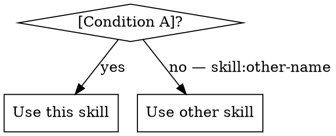
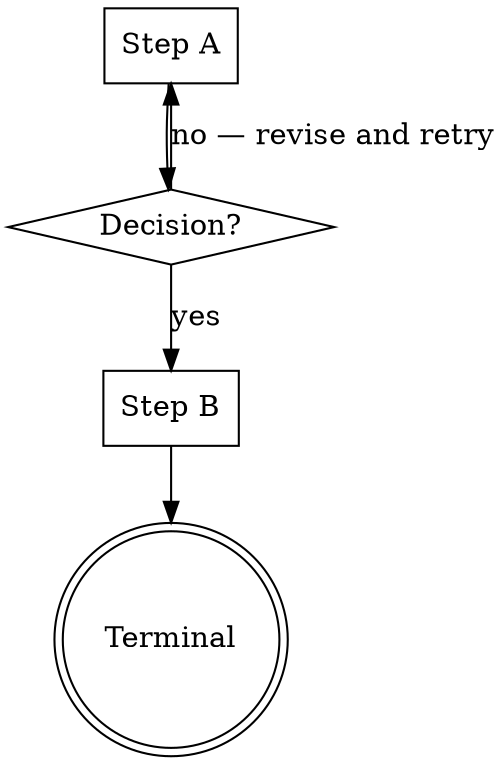

# Skill Title

[Opening paragraph — 1–3 sentences. What this skill does and what it produces. First thing read after the skill loads, so orient; don't abstract.]

<!-- Include HARD-GATE only for constraints that must never be skipped. Place immediately after the opening paragraph so it is impossible to miss. Delete the block if no such rule exists. -->
<HARD-GATE>
Do NOT [action] until [condition]. This applies to EVERY [case] regardless of perceived [common exception a user might invoke].
</HARD-GATE>

---

## Overview

<!-- Optional. Include if the opening paragraph didn't cover when to use, prerequisites, and expected outcome. Delete otherwise. -->

[2–5 sentences expanding on the opening: when to use, prerequisites (e.g., "must run in a worktree"), and what the skill produces.]

**Core principle:** [One sentence that captures the guiding rule behind every decision in this skill.]

---

## Anti-Pattern: "[Named tempting framing]"

<!-- Optional. Include when a specific framing will tempt the user or Claude to derail the skill (e.g., "This Is Too Simple To Need A Design"). Name it memorably in the heading. Delete if no such framing exists. -->

[2–4 sentences: what the wrong framing sounds like, why it's tempting, why it fails. End with what to do instead.]

---

## When to Use

<!-- For simple routing, a dot graph is overkill. Replace with bullet lists:

**Use when:**
- [Condition A — specific, not "when working on code"]
- [Condition B]

**Do NOT use when:**
- [Condition C] — use `skill:other-name` instead
- [Condition D]
-->

<!-- Optional: include a "vs. [sibling-skill]" block when there is a confusable sibling skill. Delete if no such sibling exists.

**vs. [sibling-skill-name]:**
- [Key distinguishing property 1]
- [Key distinguishing property 2]
- [Trade-off that differentiates the two]
-->

---

## Checklist

<!-- Optional. A scan-friendly ordered task map that precedes the detailed process. Delete if The Process is short enough to stand alone.

Note: Checklist, Process Flow, and The Process are complementary, not alternatives. Checklist answers *what* (ordered tasks). Process Flow answers *when/where* (branching decisions). The Process answers *how* (rules per phase). Include as many as the skill actually needs. -->

You MUST complete these in order:

1. [Step 1 — imperative phrasing, short]
2. [Step 2]
3. [Step 3]
4. [Step 4]

---

## Process Flow

<!-- Optional. Include for branching flows where the structure is not obvious from reading steps linearly. Delete if the process is strictly linear. -->

**The terminal state is [describe].** Do NOT proceed to [wrong next skill] — the only next step after this skill is [correct next skill].

---

## The Process

<!-- Choose ONE of three formats based on the flow's shape:

  (a) Sequential steps — numbered, each has a clear gate before the next. Use when order matters.
  (b) Thematic groupings — bold-headed phases with bulleted rules. Use when the skill is a set of principles rather than a sequence.
  (c) Numbered phases — "### 1. [Name]" with prose per phase. Use for parallel-capable or loosely-ordered work.

Only one format. Pick the one that matches how the skill actually runs. -->

### Step 1: [Name]

- [Specific action — no vague directives like "handle edge cases"]
- **Verify:** [observable state, command output, or file content that confirms success]
- **On failure:** [concrete next action — not "investigate"]

### Step 2: [Name]

- [Specific action]
- **Verify:** […]
- **On failure:** […]

### Step 3: [Name]

- [Specific action]
- **Verify:** […]
- **On failure:** […]

<!-- Format (b) — thematic groupings — looks like:

**Understanding the idea:**
- [Rule]
- [Rule]
- [Rule]

**Exploring approaches:**
- [Rule]
- [Rule]

Format (c) — numbered phases — looks like:

### 1. [Phase name]
[Prose explaining what happens in this phase.]

### 2. [Phase name]
[Prose.]
-->

---

## Handling [Role] Status

<!-- Include when the skill dispatches subagents, runs tasks that can fail, or otherwise has more than one possible outcome. Delete if the process has a single linear success path. -->

**DONE** — Proceed to the next step.

**DONE_WITH_CONCERNS** — Read the concerns before proceeding. If they affect correctness or scope, resolve them first. If informational only (e.g., "this file is getting large"), note them and proceed.

**NEEDS_CONTEXT** — Provide the missing context and re-dispatch. Do not guess.

**BLOCKED** — Never force a retry without changing a variable:
1. If context is missing → provide it and re-dispatch
2. If a more capable model is needed → re-dispatch with a better model
3. If the task is too large → split it and re-dispatch each piece
4. If the plan itself is wrong → escalate to the human

---

## Prompt Templates

<!-- Optional. Include when the skill dispatches subagents via sibling prompt template files. Delete otherwise. -->

- `./implementer-prompt.md` — dispatch implementer subagent
- `./spec-reviewer-prompt.md` — dispatch spec compliance reviewer subagent
- `./code-quality-reviewer-prompt.md` — dispatch code quality reviewer subagent

---

## Common Mistakes

<!-- Optional but usually valuable. Keep each item short — the ❌/✅ pair is the whole point. If an entry needs more than one sentence, it belongs as a named Anti-Pattern instead. -->

**❌ [Wrong approach]** — [why it fails, one clause]
**✅ [Correct approach]** — [what to do instead]

**❌ [Wrong approach]**
**✅ [Correct approach]**

**❌ [Wrong approach]**
**✅ [Correct approach]**

---

## Example

<!-- Optional. Include a realistic worked example when the skill's application is non-obvious. One concrete example beats three abstract ones. For skills with multi-turn flows, show the full dialogue or dispatch sequence. -->

**Scenario:** [Realistic context]
**Action taken:** [What the skill prescribed]
**Outcome:** [Result, including any artifact produced or state change]

---

## Key Principles

<!-- Optional. A distilled bullet list of guiding principles — the positive-framing counterpart to Red Flags. Use when the skill has a set of recurring values worth summarizing after the detailed process. Delete if the Core principle and Red Flags together already cover this. -->

- **[Principle name]** — [one-clause explanation]
- **[Principle name]** — [one-clause explanation]
- **[Principle name]** — [one-clause explanation]

---

## Red Flags

**Never:**
- [Action that must never be taken — start with a verb]
- [Another never — be specific about the violation, not abstract]
- Skip [review stage] — "close enough" is not done
- Proceed past a blocker by guessing — stop and ask

<!-- Optional sub-lists for recurring situational prescriptions: -->

**If [role] asks questions:**
- Answer clearly and completely
- Provide additional context if needed
- Do not rush them into implementation

**If [role] fails:**
- [Expected response — never retry without changing something]

---

## Integration

<!-- Remove any lines that do not apply. Skills with no predecessors, successors, or siblings can omit this section entirely. -->

**Required before:** `skill:prerequisite-name` — [reason]
**Required after:** `skill:followup-name` — [reason]
**Subagents should use:** `skill:child-skill` — [what delegated agents invoke it for]
**Alternative workflow:** `skill:alternative-name` — [when to pick it instead]