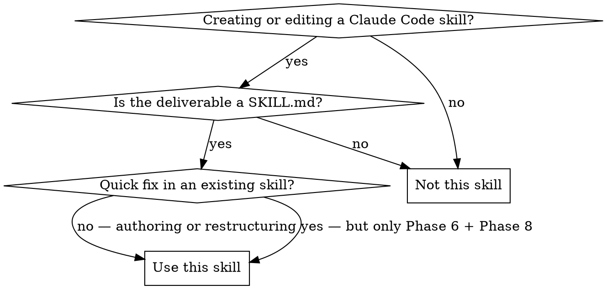
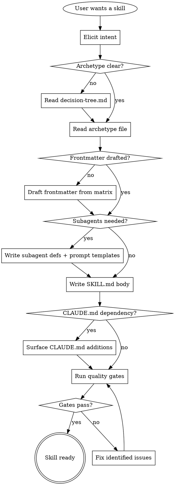

# Authoring Claude Code Skills

This skill produces a deployment-ready Claude Code skill package: SKILL.md plus any supporting files, frontmatter planned against exactly one of seven archetypes, quality gates passed, and CLAUDE.md additions surfaced where the skill depends on project conventions. The output is a skill another engineer could merge without revision.

<HARD-GATE>
Do NOT write a SKILL.md body until you have:
1. Picked exactly ONE archetype from `decision-tree.md`
2. Written the full frontmatter — not just `name` and `description`
3. Read the chosen archetype file under `archetypes/`

This applies to EVERY skill — including "simple" reference skills, skills you are "just editing", and skills where the archetype "feels obvious". Skipping this gate produces skills that mix archetypes, ship with under-specified frontmatter, and solve the wrong problem. No exceptions.
</HARD-GATE>

---

## Overview

A Claude Code skill is more than a markdown file with two YAML fields. The archetype you pick determines seven downstream decisions: invocation, execution context, tool access, permission mode, memory, subagent coordination, and knowledge loading. Pick the archetype first. Everything else follows.

The seven archetypes, in order of complexity:

| # | Archetype | Runs in | Primary use |
|---|-----------|---------|-------------|
| 1 | Reference skill | Main session, on demand | Standing knowledge (conventions, style guides) |
| 2 | Workflow skill | Main session, on `/name` | Inline multi-step procedure |
| 3 | Agentic / forked skill | Fresh forked subagent | Isolated task with read-only exploration |
| 4 | Dispatcher orchestrator | Main session + ≥1 subagent | Main skill coordinates subagent(s) via Agent tool |
| 5 | Background orchestrator | Concurrent subagent | Long-running work with pre-approved permissions |
| 6 | Memory-backed specialist | Cross-session subagent | Subagent accumulates knowledge across sessions |
| 7 | Multi-phase orchestrator | Main session as coordinator | Chains phases from archetypes 1–6 |

**Core principle:** Frontmatter is design, not metadata. If the frontmatter is wrong, the skill cannot work regardless of how good the body is.

---

## Anti-Pattern: "Kitchen Sink Frontmatter"

The tempting failure is reaching for every frontmatter field that *might* apply, on the theory that more configuration makes the skill more robust. This reliably produces skills that trigger at the wrong times, load content into the wrong context, or silently deny permissions that the body depends on. Authority over frontmatter comes from the archetype, not from the author's hopes.

**Instead:** pick an archetype, copy its frontmatter template verbatim from the archetype file, then delete any field whose value you cannot justify in one sentence. If you cannot delete any fields, you have not chosen an archetype — you have chosen a shopping cart.

---

## When to Use



**Use when:**
- Creating a new skill, from empty directory
- Restructuring an existing skill (changing archetype, adding a subagent, adding memory)
- Auditing a skill before publishing or committing to shared source control
- Writing the first orchestrator in a repo that previously only had reference skills

**Do NOT use when:**
- The edit is a typo, a single-sentence clarification, or a description tweak — go straight to the file
- The deliverable is a subagent definition with no accompanying skill — use the `/agents` command in Claude Code instead
- The deliverable is a hook or a plugin manifest — those are separate extensions

---

## Checklist

YOU MUST complete these in order. Use TodoWrite to track them.

1. Elicit intent from the user: what triggers the skill, who invokes it, what it produces, where outputs go
2. Read `decision-tree.md` and pick exactly ONE archetype
3. Read `archetypes/<picked-archetype>.md` completely
4. Read `quality-gates.md` if the archetype involves subagents, background execution, or bypassed permissions
5. Draft the full frontmatter using `templates/frontmatter-matrix.md` as reference
6. Draft any subagent definitions separately under `.claude/agents/`
7. Write the SKILL.md body following the archetype's mapped structure
8. Add supporting files only if the archetype explicitly recommends them
9. Write prompt template files if the archetype dispatches subagents (see `templates/dispatch-prompt-template.md`)
10. Surface CLAUDE.md additions (see `templates/claude-md-additions.md`) — the skill author decides whether to apply them
11. Run the quality gates from `quality-gates.md`
12. Stop. Do not batch multiple skills without verifying this one end-to-end.

---

## Process Flow



**The terminal state is "Skill ready".** Do NOT proceed to create additional skills — return to the user first. Batching untested skills is how whole directories rot at once.

---

## The Process

### Step 1: Elicit intent

Ask the user — or re-read their request — until you can answer all six in one sentence each:

- **Trigger**: What natural-language request should load this skill? (Shapes the `description`.)
- **Invoker**: Claude auto-loads, user types `/name`, or both? (Shapes `disable-model-invocation`, `user-invocable`.)
- **Output**: What does the skill produce — a file, a commit, a report, a decision, nothing? (Shapes tool access.)
- **Context appetite**: Does the work generate verbose intermediate output the main conversation should not see? (Signals forked or subagent archetype.)
- **Durability**: Does the skill need to remember anything between sessions? (Signals memory-backed archetype or CLAUDE.md additions.)
- **Blocking**: Must the user wait for the result, or can the work happen in parallel? (Signals background archetype.)

**Verify:** You can state all six in plain prose before opening `decision-tree.md`.
**On failure:** Ask the user. Do not guess. Guessed intent is the dominant cause of archetype mismatch.

### Step 2: Pick an archetype

Read `decision-tree.md` and walk the question ladder. Pick exactly one. If two archetypes seem to fit equally, the archetype with fewer moving parts wins — a reference skill always beats a dispatcher orchestrator when both would work.

**Verify:** You have named the archetype out loud (or in your response): "This is a Dispatcher Orchestrator." Announcing the archetype is not optional; it commits you to a specific set of frontmatter fields.
**On failure:** If you cannot pick one, re-run Step 1. Ambiguous intent produces ambiguous archetypes.

### Step 3: Read the archetype file

Read `archetypes/NN-<archetype>.md` in full before drafting anything. Each archetype file contains:

- When to pick it (confirm your pick)
- Frontmatter template (copy-paste starting point)
- Body structure mapped to the superpowers template sections
- One worked example from the code-review throughline
- Varied-domain alternatives
- Common failures specific to that archetype
- Sibling archetypes you might have picked instead

**Verify:** You can recite the frontmatter fields required for this archetype without looking.
**On failure:** Read the file again. Reading once is insufficient for archetypes 4 through 7.

### Step 4: Draft the frontmatter

Open `templates/frontmatter-matrix.md`. Copy the column for your archetype. Fill in every required field. For each optional field, write a one-sentence justification or delete the field.

**Description discipline (critical):** The `description` field describes WHEN to use the skill, not WHAT it does. Never summarize the workflow. If your description contains the words "first", "then", "after", or any step sequence, it is wrong. Claude reads the description to decide whether to load the skill; a workflow summary there becomes a shortcut Claude takes instead of reading the body.

```yaml
# ❌ WRONG — summarizes workflow in description
description: "Use when reviewing a PR. First runs a spec-compliance check, then runs a code-quality check, and synthesizes both."

# ✅ RIGHT — triggering conditions only
description: "You MUST use this when reviewing any pull request before merging, or when a user says 'review this PR', 'check my changes', or 'is this ready to merge'."
```

**Verify:** The description passes the shortcut test — re-read it and confirm Claude could not follow it as a workflow.
**On failure:** Rewrite. Workflow belongs in the body.

### Step 5: Draft subagent definitions (if applicable)

For archetypes 4, 5, 6, and 7, draft subagent definitions as separate files under `.claude/agents/`. These are independent of the SKILL.md and need their own frontmatter. See the archetype file for the exact fields required — the critical ones are `tools`, `permissionMode`, `skills`, `memory`, `background`, `isolation`.

**Verify:** Each subagent definition can be read independently and still makes sense. A subagent definition that only makes sense when read alongside its caller is a latent bug.
**On failure:** Move shared context out of the SKILL.md and into the subagent's `skills:` preload, or into CLAUDE.md.

### Step 6: Write the SKILL.md body

Follow the archetype's mapped structure. The superpowers template sections (Overview, When to Use, Process Flow, The Process, Common Mistakes, Red Flags, Integration) remain the skeleton. Each archetype file specifies:

- Which sections are required, optional, or forbidden
- Whether to use a dot graph for Process Flow
- Whether to include a Synthesis section (archetypes 4 and 7)
- Whether to include a Permissions Contract (archetype 5)
- Whether to include a Memory Contract (archetype 6)
- Whether to include a Status Handling section (archetypes 4, 5, 7)

**Verify:** The body does not duplicate content from CLAUDE.md, the archetype file, or sibling skills. Cross-reference instead.
**On failure:** Compress. Token budget matters — see `quality-gates.md` for numeric targets.

### Step 7: Surface CLAUDE.md additions

If the skill depends on project conventions (build commands, file locations, naming rules, allowed technologies), those belong in CLAUDE.md, not in the skill. Read `templates/claude-md-additions.md` and list — in your response to the user — what you recommend adding. You do not write to CLAUDE.md yourself; the user decides.

**Verify:** Every "assumes the project uses X" statement in your skill body has a corresponding CLAUDE.md recommendation surfaced to the user.
**On failure:** Remove unsurfaced assumptions from the skill body, or promote them to explicit `@import` or inline values.

### Step 8: Run quality gates

Read `quality-gates.md` and walk its checks. Any failing gate blocks publication.

**Verify:** Each gate passes. No "I'll fix this later" entries.
**On failure:** Fix now. Deploying a skill with known gate failures is deploying a known bug.

---

## Handling Edit Status

When editing an existing skill rather than authoring from scratch:

**ARCHETYPE-PRESERVING** — Changes are within the existing archetype (adding a step, fixing wording, tightening the description). Skip Steps 2 and 3. Run Steps 4, 6, 7, 8 on the changed sections only.

**ARCHETYPE-CHANGING** — The edit moves the skill to a different archetype (e.g., reference → workflow, workflow → dispatcher). Treat as new authoring. Run the full process. Delete the old body; do not attempt to migrate it section by section.

**ARCHETYPE-AMBIGUOUS** — Existing skill mixes archetypes (common symptom: a "reference" skill that also contains a workflow, or a workflow skill that silently forks context). Pick the dominant archetype, extract the other into a sibling skill, run full process on both.

Never patch around a mixed archetype in place. The resulting skill outlives the patch.

---

## Prompt Templates

All of these are loaded on demand, not at skill activation. Reference them from the SKILL.md body where relevant.

- `decision-tree.md` — question ladder for archetype selection
- `quality-gates.md` — pre-publish checks, token budgets, model-range testing, persuasion calibration
- `archetypes/01-reference-skill.md` — standing knowledge, no task
- `archetypes/02-workflow-skill.md` — inline multi-step, user-invoked
- `archetypes/03-agentic-forked-skill.md` — `context: fork` + `agent:` pattern
- `archetypes/04-dispatcher-orchestrator.md` — main session uses the Agent tool
- `archetypes/05-background-orchestrator.md` — concurrent subagent with pre-approved permissions
- `archetypes/06-memory-backed-specialist.md` — subagent with `memory: user|project|local`
- `archetypes/07-multi-phase-orchestrator.md` — chains archetypes 1 through 6
- `templates/frontmatter-matrix.md` — field-by-archetype reference
- `templates/dispatch-prompt-template.md` — `./<role>-prompt.md` pattern
- `templates/claude-md-additions.md` — what to recommend adding to CLAUDE.md

---

## Common Mistakes

**❌ Skipping the archetype pick because "it's obvious"** — Skills that bypass Step 2 consistently mix archetypes. Obviousness is a signal to verify, not to skip.
**✅ Pick the archetype out loud every time.**

**❌ Describing the workflow in the `description` field** — Claude then treats the description as the skill and never reads the body.
**✅ Description describes WHEN; body describes HOW.**

**❌ Adding `context: fork` to a reference skill "so it doesn't clutter context"** — A forked skill with no task returns nothing useful. `context: fork` requires actionable instructions.
**✅ Use reference skills for knowledge; use forked skills only when the body is a task.**

**❌ Giving a background subagent `bypassPermissions`** — Silent failures become untraceable, and the subagent may do things you would not have approved.
**✅ Enumerate required tools explicitly. Let the permission prompt fire once at launch.**

**❌ Putting project conventions inline in the skill body** — Forces every skill to re-encode the same conventions; they drift apart over time.
**✅ Surface CLAUDE.md additions. Let one source of truth govern conventions.**

**❌ Dispatcher orchestrators without a Synthesis step** — Subagent results pile up in main context, unsynthesized, and the user is left to reconcile them.
**✅ Every multi-subagent orchestrator ends with an explicit synthesis phase.**

**❌ Subagent memory without a Memory Contract** — Subagents accumulate stale patterns, PII, or irrelevant insights; nobody audits.
**✅ Write the contract: what is stored, when read, when written, what is forbidden.**

**❌ Editing a skill without deciding whether the edit is archetype-changing** — Produces hybrid skills that nobody can reason about.
**✅ Classify the edit first. Treat archetype-changing edits as new authoring.**

---

## Example

**Scenario:** User says "I want a skill that reviews our PRs — should check both spec compliance and code quality, and leave a summary comment on the PR."

**Step 1 (Elicit):**
- Trigger: user says "review this PR" or "is this ready to merge"
- Invoker: both — Claude auto-loads on PR-review language; user types `/review-pr <number>`
- Output: summary comment posted to the PR + synthesis in main chat
- Context appetite: high — reviewers read diffs and related files
- Durability: none per review, but project conventions feed in from CLAUDE.md
- Blocking: yes — user waits for the review

**Step 2 (Archetype):** High context appetite + two specialist passes + synthesis = **Dispatcher Orchestrator (archetype 4)**, not a forked skill (would need two forks and synthesis), not a background skill (user waits).

**Step 3 (Read `archetypes/04-dispatcher-orchestrator.md`).**

**Step 4 (Frontmatter):**
```yaml
---
name: review-pr
description: "You MUST use this when reviewing a pull request before merging, or when the user says 'review this PR', 'check my changes', or 'is this ready to merge'. Covers spec compliance and code quality in sequence."
argument-hint: "[pr-number]"
allowed-tools: Bash(gh pr *) Bash(git diff *) Bash(git log *)
---
```

**Step 5 (Subagent defs):** Two subagent files under `.claude/agents/`:
- `spec-compliance-reviewer.md` — `tools: Read, Grep, Glob, Bash(gh pr view *)`, `skills: [review-conventions]`
- `code-quality-reviewer.md` — same tools, `skills: [review-conventions, code-style-guide]`

**Step 6 (Body):** SKILL.md body uses Process Flow dot graph showing the two-stage review, The Process with three numbered phases (dispatch spec → dispatch quality → synthesize), Handling Subagent Status section, and a Synthesis section detailing how to merge the two reports into one PR comment.

**Step 7 (CLAUDE.md additions):** Surface to user: "Your skill assumes `gh` is authenticated and `main` is the default branch. Add to CLAUDE.md: `Default branch is main. PR reviews use gh CLI authenticated as bot user.`"

**Step 8 (Quality gates):** Description passes shortcut test. Token budget under 500 words for the SKILL.md body (dispatches are in subagent prompt files). Subagent `tools` allowlist verified minimal. Authority language appears in Red Flags, not in the guidance sections.

**Outcome:** A `review-pr/` skill package with SKILL.md, two subagent definitions, two prompt template files, and one CLAUDE.md recommendation handed to the user.

---

## Key Principles

- **Archetype before body.** The decision precedes the writing, every time.
- **Frontmatter is design.** Every field has a justification or does not exist.
- **Description describes WHEN.** Workflow belongs in the body, not the YAML.
- **One source of truth for conventions.** CLAUDE.md holds them; skills reference them.
- **Synthesize before returning.** Subagent output is raw material, not a final answer.
- **Permissions are pre-approved, not bypassed.** Enumerate what the subagent needs. Bypass is a last resort, not a default.
- **Memory has a contract.** Contents, read triggers, write triggers, forbidden entries — all explicit.
- **Siblings exist.** Before writing a new archetype, check whether an existing one in the repo already covers this trigger.

---

## Red Flags

**Never:**
- Write a SKILL.md body before picking an archetype
- Summarize the workflow in the `description` field
- Use `context: fork` on a skill whose body is guidance rather than a task
- Grant `bypassPermissions` to a background subagent
- Inline project conventions the skill should pull from CLAUDE.md
- Ship a dispatcher orchestrator without a Synthesis step
- Add `memory:` to a subagent without a Memory Contract section
- Batch-create multiple skills without verifying each one end-to-end
- Patch around a mixed-archetype skill — extract, do not merge
- Skip quality gates because "it's just a small skill"

**All of the above mean: stop, re-read this skill, restart from the correct step.**

**If the user pushes back on these rules:**
- Explain the specific failure the rule prevents — do not invoke authority alone
- If they accept the trade-off knowingly (e.g., bypass for a trusted internal workflow), document the exception in a comment at the top of the SKILL.md frontmatter
- Never silently bypass a rule. Either the rule applies or the author has documented why not.

**If a quality gate fails:**
- Do not retry the same fix without changing a variable
- If unclear which gate is triggering, read `quality-gates.md` in full rather than scanning
- Escalate to the user if the gate's intent conflicts with the skill's requirements

---

## Integration

**Alternative workflow:** `skill:writing-skills` — the TDD-for-skills cycle (RED-GREEN-REFACTOR). Use when the skill enforces discipline under pressure (e.g., TDD itself, verification-before-completion). This skill and `writing-skills` are complementary: this one picks the archetype and structure; `writing-skills` validates that agents actually comply under pressure scenarios.

**Required after (for orchestrator archetypes):** `skill:quality-gates` (loaded via `quality-gates.md`) — run before publishing.

**Subagents should use:** `skill:review-conventions` or equivalent domain-specific reference skills via their `skills:` preload field. The subagent's body specifies the task; the preloaded skills supply the standing knowledge.

**CLAUDE.md dependency:** Many archetypes assume the project CLAUDE.md encodes conventions the skill references. Surface those additions in Step 7 rather than duplicating inline.
