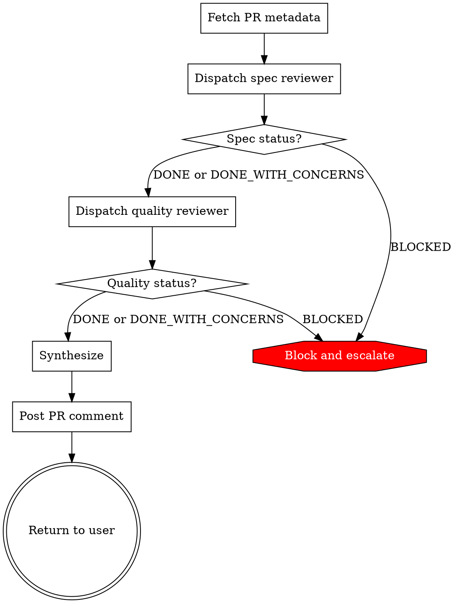

# Archetype 4: Dispatcher Orchestrator

A skill that runs in the main conversation and dispatches one or more subagents via the Agent tool (formerly called the Task tool; renamed in 2.1.63, but `Task` still works as an alias). Each subagent runs in its own context with its own tools and skills. The main session receives their summaries, synthesizes them, and returns a single coherent result to the user.

This is the workhorse archetype for multi-specialist workflows. Two reviewers with different expertise. A planner and an implementer. A researcher and a writer. A dispatcher orchestrator composes them.

---

## When to pick this

- The work needs ≥2 specialist passes with distinct tool scopes, skill preloads, or prompt framings
- The main conversation coordinates and synthesizes — it is not just a pass-through
- Each specialist's output is structured enough to merge
- The user waits for the result (if not, Archetype 5)
- The specialists do not need cross-session memory (if they do, Archetype 6 or 7)

**Do NOT pick this archetype when:**
- One specialist pass is enough — use Archetype 3
- The work is sequential across phases producing distinct artifacts — use Archetype 7
- There is no real synthesis — just concatenating specialist outputs is a smell of over-orchestration

---

## Frontmatter template

```yaml
---
name: review-pr
description: "You MUST use this when reviewing a pull request before merging, or when the user says 'review this PR', 'check my changes', or 'is this ready to merge'. Covers spec compliance and code quality in sequence and posts a synthesis comment to the PR."
argument-hint: "[pr-number]"
allowed-tools: Bash(gh pr *) Bash(git diff *) Bash(git log *)
---
```

**Accompanying subagent definitions under `.claude/agents/`:**

`.claude/agents/spec-compliance-reviewer.md`:
```yaml
---
name: spec-compliance-reviewer
description: Reviews code changes against spec/requirement documents. Use proactively on PRs tagged 'needs-spec-check'.
tools: Read, Grep, Glob, Bash(gh pr view *), Bash(gh pr diff *)
model: sonnet
skills:
  - review-conventions
  - spec-document-locations
mcpServers: []
permissionMode: default
---

You verify that code changes implement what the linked spec document requires. When invoked:
1. Find the spec document linked in the PR description
2. Extract requirements from the spec
3. Map each requirement to code in the diff
4. Report gaps: requirements without corresponding code, code without corresponding requirements

Return a report with exactly these sections: Summary, Covered requirements, Gaps, Ambiguities.
```

`.claude/agents/code-quality-reviewer.md`:
```yaml
---
name: code-quality-reviewer
description: Reviews code changes for quality issues — naming, error handling, testing, performance.
tools: Read, Grep, Glob, Bash(gh pr view *), Bash(gh pr diff *)
model: sonnet
skills:
  - review-conventions
  - code-style-guide
mcpServers: []
permissionMode: default
---

You review code changes for quality against the loaded skill conventions. When invoked:
1. Read the diff
2. For each changed file, check against the conventions
3. Flag issues by severity: blocking, non-blocking, informational

Return a report with: Summary, Blocking issues, Non-blocking issues, Informational.
```

**Field notes on the main skill:**
- No `context: fork` — the main skill runs in main conversation
- `allowed-tools` covers what the main session does (dispatch + synthesize + post comment); subagents have their own tool lists
- `argument-hint` — the PR number, passed via `$0`

**Field notes on subagents:**
- `tools` — enumerate; NEVER inherit
- `skills:` — preload standing knowledge the subagent needs (subagents do NOT inherit skills from main session)
- `mcpServers:` — set explicitly. `[]` for subagents that do not call MCP tools (most reviewers, planners, auditors). Omitting this field inherits every connected MCP server's tool catalogue into the subagent's context — typically 30k+ tokens, paid every dispatch. See `quality-gates.md` Gate 11.
- `model:` — explicitly set; do not rely on `inherit` for deterministic dispatcher behavior
- `description` — used by Claude to decide when to delegate; "use proactively" encourages main session dispatch

---

## Body structure

Dispatcher orchestrators add two required sections beyond the superpowers template: **Prompt Templates** (one per subagent) and **Synthesis**.

| Superpowers section | In a dispatcher orchestrator |
|---------------------|------------------------------|
| Opening paragraph | What this produces; names the specialists |
| HARD-GATE | Use for dispatch-order invariants (e.g., spec check before quality check) |
| Overview | Name the specialists, their inputs, their outputs |
| Anti-Pattern | Often: "Dispatch and concatenate" — no synthesis |
| When to Use | Required — which trigger conditions; which sibling orchestrators NOT to use instead |
| vs. sibling-skill | **Required** — name the closest sibling orchestrator and the trade-off |
| Checklist | Required — in dispatch order |
| Process Flow | Required — a dot graph showing dispatch + synthesize |
| The Process | Numbered phases: dispatch specialist 1 → dispatch specialist 2 → synthesize |
| Handling Subagent Status | **Required** — DONE / DONE_WITH_CONCERNS / NEEDS_CONTEXT / BLOCKED |
| **Synthesis** | **Required** — explicit section detailing how to merge specialist outputs |
| Prompt Templates | **Required** — point at each subagent's dispatch prompt file |
| Common Mistakes | Required |
| Example | Required — walk a full dispatch with realistic outputs |
| Red Flags | Required |
| Integration | Predecessor/successor skills; sibling subagents |

---

## Worked example — code review throughline

`review-pr/SKILL.md`:

```yaml
---
name: review-pr
description: "You MUST use this when reviewing a pull request before merging, or when the user says 'review this PR', 'check my changes', or 'is this ready to merge'. Covers spec compliance and code quality in sequence and posts a synthesis comment to the PR."
argument-hint: "[pr-number]"
allowed-tools: Bash(gh pr *) Bash(git diff *) Bash(git log *)
---

# Review PR

Dispatches a spec-compliance reviewer and a code-quality reviewer against PR #$0 in sequence, synthesizes their reports into one PR comment, and posts it.

<HARD-GATE>
Do NOT dispatch reviewers in parallel. Spec-compliance runs first so its output informs the quality reviewer's context (it looks at the spec-cited lines with more scrutiny). Dispatching in parallel is faster but produces conflicting severity calls.
</HARD-GATE>

## Overview

Two specialists, one synthesis:
- `spec-compliance-reviewer` — verifies the PR implements the linked spec
- `code-quality-reviewer` — checks the code against repo conventions
- This skill synthesizes into one PR comment with a single verdict

## vs. `skill:deep-review-pr`

`deep-review-pr` is a single-fork exploration returning a report to the main conversation for the user. `review-pr` posts a decision-grade review to the PR with two specialist passes. Pick `review-pr` when the output should be visible to other reviewers on GitHub. Pick `deep-review-pr` when the user wants a personal deep-read before posting.

## Checklist

1. Fetch PR metadata
2. Dispatch `spec-compliance-reviewer`
3. Handle status; capture report
4. Dispatch `code-quality-reviewer` with spec results in context
5. Handle status; capture report
6. Synthesize
7. Post PR comment
8. Return synthesis summary to the user

## Process Flow



## The Process

### Phase 1: Fetch and dispatch spec reviewer
- `gh pr view $0 --json title,body,files`
- Extract spec document URL from PR body
- Dispatch `spec-compliance-reviewer` via the Agent tool with prompt from `./spec-reviewer-prompt.md`
- Pass PR number and spec URL as inputs
- **Verify:** Report has all four required sections (Summary, Covered, Gaps, Ambiguities)

### Phase 2: Dispatch quality reviewer
- Dispatch `code-quality-reviewer` via the Agent tool with prompt from `./quality-reviewer-prompt.md`
- Pass PR number + lines flagged by spec reviewer as "needs extra scrutiny"
- **Verify:** Report has all four required sections

### Phase 3: Synthesize
- Merge reports into one markdown comment (see Synthesis section below)
- Resolve severity conflicts: spec blockers outrank quality blockers; quality blockers outrank spec informational

### Phase 4: Post and return
- `gh pr comment $0 --body-file <synthesis.md>`
- **Verify:** Comment posted; capture comment URL
- Return the synthesis plus comment URL to the user

## Handling Subagent Status

**DONE** — Report is complete and well-formed. Proceed.

**DONE_WITH_CONCERNS** — Check the concerns. If they affect the review outcome (e.g., "could not access spec document"), treat as BLOCKED. If informational ("diff was unusually large, consider splitting"), note and proceed.

**NEEDS_CONTEXT** — Provide the missing input and re-dispatch. Common cause: spec URL not in PR body. Ask the user, then re-dispatch.

**BLOCKED** — Never retry without changing a variable:
1. Missing context → gather it, re-dispatch
2. Subagent model inadequate → re-dispatch with `model: opus`
3. Task too large → split the PR into sections, dispatch per section
4. Plan itself wrong → escalate to the user

## Synthesis

The PR comment has a fixed shape:

```markdown
## Review: <verdict>

**Verdict:** <Ready to merge | Changes requested | Blocked>

### Spec compliance
- Covered: N / M requirements
- Gaps: <list, or "None">

### Code quality
- Blocking issues: <list, or "None">
- Non-blocking: <count, see details below>

### Details
<quality issues, grouped by file>

### Ambiguities and unknowns
<merged from both reviewers>
```

**Verdict logic:**
- Any spec gap → "Changes requested"
- Any blocking quality issue → "Changes requested"
- Spec ambiguity that affects correctness → "Blocked" (ask PR author to clarify)
- Otherwise → "Ready to merge"

Do NOT concatenate the raw reviewer reports. The PR author should not have to reconcile conflicting severity calls.

## Prompt Templates

- `./spec-reviewer-prompt.md` — dispatch prompt for spec-compliance-reviewer
- `./quality-reviewer-prompt.md` — dispatch prompt for code-quality-reviewer

## Common Mistakes

**❌ Parallel dispatch for "speed"** — the HARD-GATE exists for a reason; see above.
**✅ Sequential, with spec results fed to quality reviewer.**

**❌ Pasting both reviewer outputs into the PR comment without synthesis**
**✅ One verdict, one organized comment; details consolidated.**

**❌ Retrying BLOCKED without changing inputs**
**✅ Diagnose the cause; change a variable before retrying.**

**❌ Claiming a verdict the reviewers don't support**
**✅ The synthesis logic is mechanical; the skill does not override reviewer severity.**

## Red Flags

**Never:**
- Dispatch in parallel when the HARD-GATE says sequential
- Post the synthesis comment before both reports are DONE
- Auto-approve or auto-merge — this skill reviews; human decides
- Modify reviewer reports after synthesis to "soften" them

## Integration

- **Predecessor:** `skill:deep-review-pr` — use for personal pre-read; `review-pr` handles the formal review
- **Successor:** `skill:merge-pr` (if you have one) — `review-pr` decides readiness; `merge-pr` acts on it
- **CLAUDE.md:** Recommend adding the spec-document convention (where specs live, how they're linked from PRs)
- **Preloaded subagent skills:** `review-conventions`, `spec-document-locations`, `code-style-guide`
```

The accompanying prompt template files (`spec-reviewer-prompt.md`, `quality-reviewer-prompt.md`) contain the exact text the main session sends to each subagent via the Agent tool. See `templates/dispatch-prompt-template.md` for the canonical shape.

---

## Varied-domain alternatives

- **`/translate-doc`** — dispatch translator + reviewer (native speaker verification) + formatter
- **`/research-topic`** — dispatch three explorers in parallel across different docs/sources, then synthesize
- **`/triage-incident`** — dispatch log-scanner + metric-reader + recent-change-diff, then synthesize a root-cause hypothesis
- **`/audit-config`** — dispatch security auditor + cost auditor against infra config files

For each, the synthesis is the point. If you are not synthesizing, you don't need a dispatcher — a workflow with sequential Agent-tool calls would suffice.

---

## Common failures specific to this archetype

**❌ Dispatching subagents without preloading the right skills** — subagents do NOT inherit skills from main session. If the reviewer needs `review-conventions`, add it to `skills:` in the subagent definition.

**❌ Subagents inheriting MCP server definitions by default** — every reviewer, planner, or auditor dispatched without `mcpServers: []` loads every connected MCP server's tool catalogue into its context. With GitLab + Playwright + others connected, this is 30k+ tokens per dispatch. A two-reviewer dispatch pays it twice. The subagent does not need any of these tools — it pays the context cost regardless. **Fix:** `mcpServers: []` on every subagent that does not call MCP tools.

**❌ Relying on `inherit` for subagent model** — main conversation may be on Opus, dispatcher may want Haiku for speed, reviewer may need Opus for reasoning. Be explicit.

**❌ Passing the entire PR diff in the dispatch message** — you're burning main-conversation context. Let the subagent fetch via `gh pr diff` with its own tool access.

**❌ Synthesizing by pasting** — if the final output is "Reviewer A said X. Reviewer B said Y." you have concatenation, not synthesis. Write the synthesis logic explicitly.

**❌ No status handling** — the skill assumes DONE; when a subagent hits BLOCKED, the orchestrator proceeds with an empty report.

**❌ Missing vs. sibling-skill block** — orchestrators often have nearly identical siblings; without explicit disambiguation, Claude picks arbitrarily.

---

## Sibling archetypes you might have picked instead

- **Agentic forked skill (3)** — if one specialist pass is enough
- **Multi-phase orchestrator (7)** — if the work has multiple distinct phases beyond one synthesis round
- **Background orchestrator (5)** — if the user should not wait for the specialists
- **Memory-backed specialist (6)** — if one of the specialists benefits from accumulated session history (common for reviewers who learn a codebase over time)

---

## CLAUDE.md interaction

Dispatcher orchestrators should surface these CLAUDE.md recommendations:

- Where specs live and how they are linked from PRs (so the spec reviewer can find them)
- The repo's severity vocabulary (what "blocking" means, what "non-blocking" means)
- The default reviewer assignment (so the orchestrator knows whether a human reviewer is already in the loop)

Subagents inherit CLAUDE.md; you can rely on it for shared context. Skills do not — each subagent's `skills:` must be explicit.
