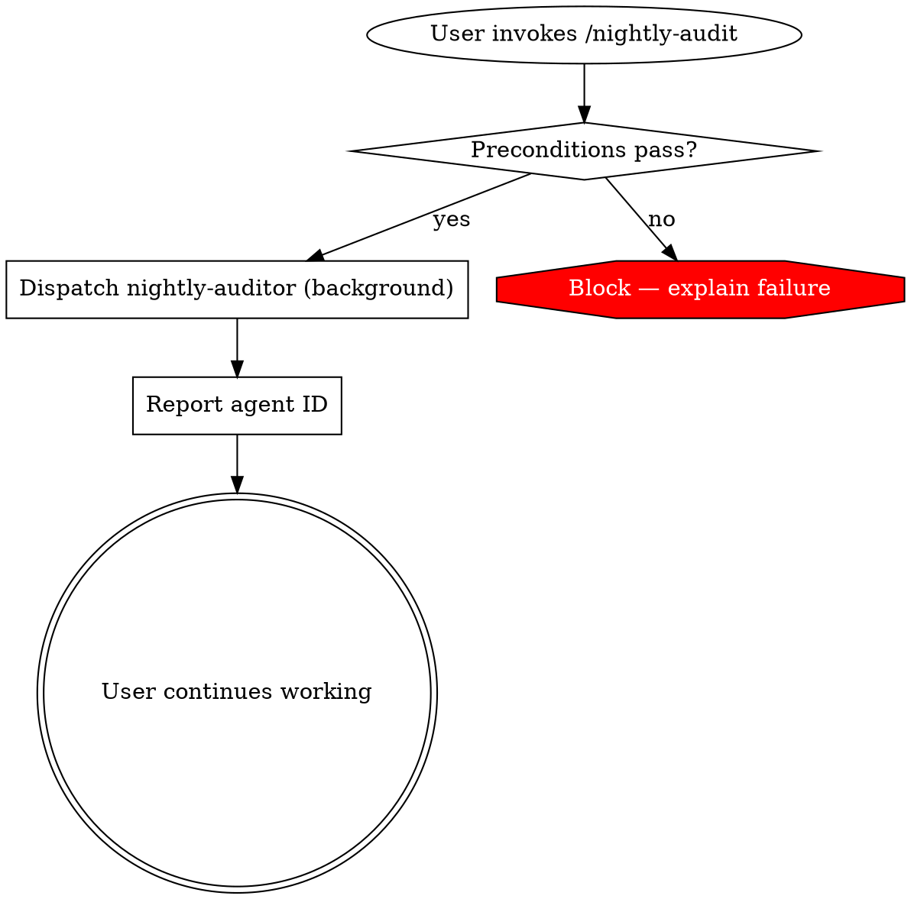

# Archetype 5: Background Orchestrator

A skill that launches a subagent configured with `background: true`. The subagent runs concurrent with the user's main session. Permissions are pre-approved at launch — the background subagent cannot ask the user for approval mid-run, so any tool it needs must be declared upfront.

This archetype trades flexibility for non-blocking throughput. Get the Permissions Contract right and it's powerful; get it wrong and the subagent fails silently.

---

## When to pick this

- The work takes long enough (minutes to hours) that the user should not wait
- The tools the subagent needs can be fully enumerated before it starts
- The subagent does not need to ask clarifying questions mid-run (those fail in background context)
- The output is a write or notification, not a synchronous reply (file update, GitHub comment, Slack message)

**Do NOT pick this archetype when:**
- The subagent would need `AskUserQuestion` mid-run — it fails in background, subagent continues blind
- The work is short enough to block on (< 30 seconds) — Archetype 4 is simpler
- Permissions cannot be fully enumerated — background subagents auto-deny unapproved tools
- The work should cease if the user's main session ends (background subagents persist)

---

## Frontmatter template

```yaml
---
name: nightly-audit
description: "You MUST use this when the user says 'run the audit', 'check the codebase for issues', or 'scan for TODOs and FIXMEs overnight'. Launches a background subagent that scans the repo and files GitHub issues for findings."
disable-model-invocation: true
argument-hint: "[optional: file-glob]"
allowed-tools: Agent(nightly-auditor)
---
```

**Accompanying subagent definition:** `.claude/agents/nightly-auditor.md`:

```yaml
---
name: nightly-auditor
description: Scans the codebase for TODOs, FIXMEs, security smells, and dead code; files GitHub issues for findings. Runs unattended.
tools: Read, Grep, Glob, Bash(gh issue *), Bash(gh issue create *), Bash(rg *)
model: haiku
effort: low
background: true
permissionMode: default
skills:
  - audit-conventions
mcpServers: []
memory: project
isolation: worktree
color: purple
---

You are the nightly auditor. When invoked, scan the codebase per the loaded audit-conventions skill, aggregate findings, and file GitHub issues.

# ... (subagent body continues)
```

**Critical field notes on the subagent:**

- `background: true` — THE defining field
- `tools` — EVERY tool the subagent might use, enumerated. Do not add MCP tools via `inherit`; declare explicitly via `mcpServers:` if needed.
- `mcpServers` — explicitly set. `[]` for the typical case (the auditor uses `gh` via Bash, not via an MCP server). Omitting this field inherits every connected MCP server into context — for a long-running background subagent invoked nightly, this is the most expensive form of waste in the entire skill system. See `quality-gates.md` Gate 11.
- `permissionMode: default` — do NOT use `bypassPermissions` for background subagents except under written exception. Pre-approval of specific tools is the correct pattern; bypass is a different, riskier thing.
- `isolation: worktree` — recommended for background subagents that modify files. Gives the subagent an isolated copy; main session is unaffected if the work goes wrong.
- `memory: project` — common for background subagents that run repeatedly and should remember what they've already flagged. See the Memory Contract section below.
- `model: haiku` + `effort: low` — background subagents often benefit from cheap/fast models for long-running scans. Justify any choice other than these.

**On the main skill:**
- `disable-model-invocation: true` — background launches should be user-intentional. Auto-launching background work is a surprise.
- `allowed-tools: Agent(nightly-auditor)` — allowlist the Agent tool to this specific subagent. Prevents accidental dispatch of other subagents from this skill.

---

## Body structure

Background orchestrators add two required sections beyond the superpowers template: **Permissions Contract** and **Background Lifecycle**.

| Superpowers section | In a background orchestrator |
|---------------------|------------------------------|
| Opening paragraph | What launches, what it produces, what the user sees |
| HARD-GATE | **Required** — about permissions, state, or safety preconditions |
| Overview | Describe the work, output destination, and how the user is notified |
| **Permissions Contract** | **Required** — every tool the subagent uses, justified |
| Checklist | Launch sequence |
| Process Flow | Dot graph showing launch → background run → completion notification |
| The Process | The launch steps only — the subagent's own process lives in its definition |
| Handling Subagent Status | **Required** — includes background-specific statuses (running, paused, failed-permission) |
| **Background Lifecycle** | **Required** — how to check status, how to cancel, where results land |
| **Memory Contract** | Required if subagent has `memory:` — see Archetype 6 for the shape |
| Common Mistakes | Required |
| Red Flags | Required — background work is where silent failures live |
| Integration | How results surface to the user; successor skills that consume output |

---

## Worked example — code review throughline

`nightly-audit/SKILL.md`:

```yaml
---
name: nightly-audit
description: "You MUST use this when the user says 'run the audit', 'start the overnight scan', or 'scan for TODOs and FIXMEs'. Launches a background subagent that scans the repo, applies audit-conventions, and files GitHub issues for findings."
disable-model-invocation: true
argument-hint: "[optional: file-glob, default: src/**]"
allowed-tools: Agent(nightly-auditor)
---

# Nightly Audit

Launches the `nightly-auditor` subagent in the background to scan the codebase per `audit-conventions`. Findings become GitHub issues. The user continues working; results arrive asynchronously.

<HARD-GATE>
Do NOT launch this skill if:
- There are uncommitted changes in the working tree (the worktree isolation will copy them)
- The user has not explicitly authorized background execution in this session
- `gh` is unauthenticated (the subagent will fail to file issues silently)

Verify all three before dispatching. No exceptions.
</HARD-GATE>

## Overview

The `nightly-auditor` runs in the background, scans files matching `$0` (default `src/**`), and files GitHub issues. The user is not blocked. Issues appear in the repo's issue tracker as they are filed.

## Permissions Contract

Every tool the background subagent uses. The user is approving these at launch — they cannot be added mid-run.

| Tool | Why the subagent needs it |
|------|----------------------------|
| `Read` | Read source files |
| `Grep`, `Glob` | Find candidate files and patterns |
| `Bash(rg *)` | Fast pattern search via ripgrep |
| `Bash(gh issue list *)` | Check whether an issue already exists before filing a duplicate |
| `Bash(gh issue create *)` | File new issues for findings |

**What the subagent cannot do:**
- Modify source files (no `Write`, `Edit`)
- Delete anything (no `rm`)
- Open PRs or merges (no `gh pr create *`)
- Run arbitrary shell commands (no unconstrained `Bash(*)`)

If a new audit pattern requires a new tool, update the subagent's `tools` list, commit, and relaunch. Never expand at runtime.

**On `permissionMode`:** the subagent uses `permissionMode: default`, not `bypassPermissions`. Pre-approval of specific tools is the correct pattern; bypass is a different, riskier thing.

## Checklist

1. Check preconditions (HARD-GATE)
2. Confirm with user that background execution is OK
3. Dispatch `nightly-auditor` via the Agent tool with `$0` as input
4. Report dispatch confirmation + agent ID to user
5. Return to user's main session

## Process Flow



## The Process

### Phase 1: Precondition check
- Run `git status --porcelain` — must be empty
- Run `gh auth status` — must be authenticated
- Confirm the user invoked `/nightly-audit` knowingly
- **Verify:** All three pass
- **On failure:** Report which precondition failed; do not dispatch

### Phase 2: Dispatch
- Invoke the Agent tool with name `nightly-auditor`, input `$0`
- The subagent starts in background; permissions are pre-approved per the contract
- **Verify:** Agent tool returns an agent ID
- **On failure:** If dispatch fails, report the error verbatim; do not retry

### Phase 3: Confirm
- Report to the user: "Background auditor launched. Agent ID: <id>. Findings will appear as GitHub issues labeled `nightly-audit`."
- Return control

## Handling Subagent Status

**DONE** — All files scanned, all findings filed. Issue count reported.

**DONE_WITH_CONCERNS** — Scan completed but some files were unreadable or some issue creations failed. User gets the partial result.

**NEEDS_CONTEXT** — Rare for background; if the subagent can't find `audit-conventions`, the skill preload is broken. Fix the subagent definition and relaunch.

**BLOCKED on permissions** — The subagent tried a tool not in the contract. This is a bug in the Permissions Contract. Add the tool, commit, relaunch. Do NOT add the tool without committing.

**BLOCKED on state** — Uncommitted changes appeared after dispatch (worktree isolation should prevent this, but not always). Investigate.

## Background Lifecycle

- **Check status:** `/agents` opens the running-agents panel; find the agent ID
- **View transcript:** `~/.claude/projects/<project>/<sessionId>/subagents/agent-<id>.jsonl`
- **Cancel:** Use the `/agents` panel's Stop button, or `Ctrl+B` when viewing the agent
- **Notification:** Findings appear as GitHub issues labeled `nightly-audit` as they are filed. No chat notification by default.

## Memory Contract

The `nightly-auditor` has `memory: project`, stored at `.claude/agent-memory/nightly-auditor/`.

**What is stored:**
- Files already flagged (to avoid duplicate issues)
- Patterns that matched historically
- Last-scanned commit SHA per file

**What is NOT stored:**
- Source code content (just paths and SHAs)
- User identifiers beyond git authorship
- Security vulnerabilities in detail (those go in private issues, not the memory)

**When read:** At start of each run — check what was previously flagged to skip duplicates.
**When written:** After each successful issue creation.
**Audit cadence:** Review monthly; delete memory older than 90 days.

## Common Mistakes

**❌ Using `bypassPermissions` because enumerating tools "is tedious"** — silent failures become untraceable.
**✅ Enumerate. The Permissions Contract is a feature, not a chore.**

**❌ Launching background work without `isolation: worktree` when the subagent writes files** — modifications clobber the user's work.
**✅ Worktree isolation is default for write-capable background subagents.**

**❌ Auto-invoking background work** — surprises the user; wastes compute.
**✅ `disable-model-invocation: true`; user launches deliberately.**

**❌ Subagent tries to use AskUserQuestion mid-run** — fails in background; subagent continues blind.
**✅ Subagent prompt explicitly avoids interactive tools. Any ambiguity resolves to "skip and note."**

**❌ No Memory Contract for a subagent with `memory:`** — memory fills up, drifts, leaks.
**✅ Contract covers contents, read/write triggers, prohibited data, audit cadence.**

## Red Flags

**Never:**
- Use `bypassPermissions` for a background subagent without a written exception
- Launch background work with uncommitted changes unless `isolation: worktree` is set
- Grant `Bash(*)` or `Bash(git *)` as unconstrained patterns — enumerate specific commands
- Auto-invoke background skills — they have side effects
- Proceed past the Permissions Contract check "for speed"
- Skip the Memory Contract because the subagent "only stores safe data"

## Integration

- **Predecessor:** none typically; background skills are entry points
- **Successor:** `skill:triage-audit-issues` (if you have one) — processes the issues the auditor filed
- **Sibling:** `skill:review-pr` (Archetype 4) — synchronous review; this is asynchronous audit
- **CLAUDE.md:** Recommend adding the issue-label conventions (`nightly-audit` label) and `gh` authentication requirement
- **Preloaded subagent skills:** `audit-conventions` (standing rules for what to flag)
```

---

## Varied-domain alternatives

- **`/overnight-lint`** — background subagent runs the full linter fleet against a large codebase, files issues for violations
- **`/periodic-dependency-bump`** — background subagent checks for new dependency versions weekly, opens PRs for safe bumps
- **`/slack-digest`** — background subagent watches a Slack channel (via MCP), summarizes once per hour, posts summary back
- **`/long-research`** — background subagent conducts a multi-hour research task across web + codebase, produces a report file

In each, the pattern holds: enumerate tools, pre-approve permissions, worktree-isolate writes, contract the memory.

---

## Common failures specific to this archetype

**❌ Permissions Contract drift** — you added a scan for a new pattern that needs a new tool, forgot to update `tools`, subagent BLOCKED silently. **Fix:** every subagent launch reads its own definition; version-control the definitions.

**❌ Memory leakage** — subagent remembers things that should have been ephemeral; memory file grows unbounded. **Fix:** the Memory Contract names write triggers and audit cadence; enforce them.

**❌ Background subagent with synchronous output expectation** — skill's Phase 3 reports "scan complete" when the subagent hasn't completed. **Fix:** background skills confirm launch, not completion. Completion arrives asynchronously.

**❌ Forgetting `isolation: worktree` for writes** — background subagent writes to main repo; user's concurrent work is clobbered. **Fix:** worktree isolation for any background subagent with Write/Edit or anything under `Bash(git *)`.

**❌ Launching background work from auto-invocation** — Claude decides to run a long-running background task based on a casual user message; user did not consent. **Fix:** `disable-model-invocation: true` is near-mandatory for this archetype.

---

## Sibling archetypes you might have picked instead

- **Dispatcher orchestrator (4)** — if the user waits; synchronous is simpler
- **Multi-phase orchestrator (7)** — if the background work is one phase of a larger process
- **Memory-backed specialist (6)** — if the subagent should accumulate across sessions but runs synchronously (not background)

---

## CLAUDE.md interaction

Background orchestrators surface these CLAUDE.md recommendations:

- Tool authentication state the subagent depends on (`gh`, `aws`, `slack`, etc.)
- Label/tag conventions the subagent uses when filing issues/comments
- The cadence convention (is "nightly" literal or approximate?)
- Any repo-wide "do not modify" paths the subagent must respect

Background subagents inherit CLAUDE.md; they do not inherit the main session's history or skills.
