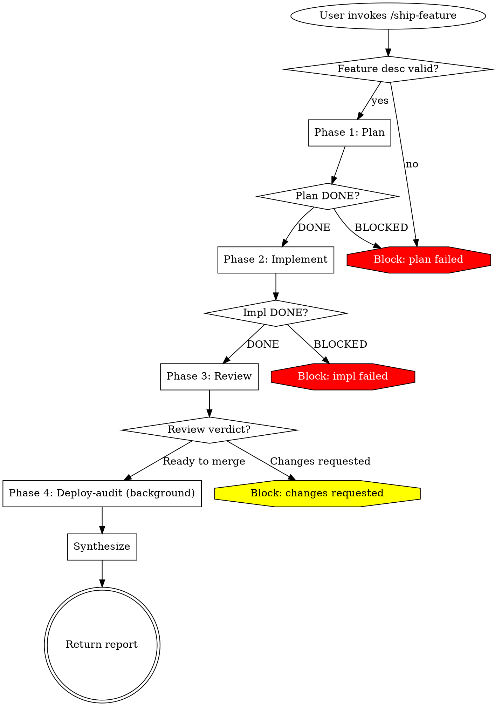

# Archetype 7: Multi-Phase Orchestrator

A skill that runs in the main conversation and chains distinct phases, where each phase may itself be any of archetypes 1 through 6. The orchestrator owns the phase boundaries, the status handling across phases, and the final synthesis. It is the most complex archetype — pick it only when the work genuinely has phases the simpler archetypes cannot express.

---

## When to pick this

- The work has ≥2 genuinely distinct phases producing distinct artifacts (plan, implementation, review, deployment)
- Each phase's output is the next phase's input
- Phases may use different archetypes (e.g., Phase 1 forked exploration, Phase 2 dispatcher review, Phase 3 background deploy)
- The orchestrator adds coordination value beyond the sum of its phases — not just sequential dispatches
- The user waits for the full sequence OR the orchestrator explicitly hands off to background at a specific phase

**Do NOT pick this archetype when:**
- A dispatcher orchestrator would suffice (single round of specialists, one synthesis) — use Archetype 4
- The "phases" are just sequential steps in one task — use Archetype 2
- You're composing archetypes out of architectural preference rather than necessity — simpler always wins

---

## Frontmatter template

```yaml
---
name: ship-feature
description: "You MUST use this when the user says 'ship this feature', 'take this feature to production', or 'plan, implement, review, and deploy'. Chains planning → implementation → review → background deploy."
disable-model-invocation: true
argument-hint: "[feature-description]"
allowed-tools: Agent(planner), Agent(implementer), Agent(review-pr), Agent(nightly-auditor), Bash(git *), Bash(gh *)
---
```

**Field notes:**
- `disable-model-invocation: true` — multi-phase work has side effects (commits, PRs, deploys); user invokes deliberately
- `allowed-tools: Agent(...)` — explicit allowlist of every subagent the orchestrator may dispatch
- No `context: fork` — the orchestrator runs in main conversation; individual phases may fork via their own archetypes

**Phase-specific subagents** are defined in `.claude/agents/` and reference each other only through this orchestrator. Do not wire subagents directly to each other — the orchestrator mediates.

---

## Body structure

Multi-phase orchestrators are the largest skill type and require the most structure. Every optional superpowers section becomes required.

| Superpowers section | In a multi-phase orchestrator |
|---------------------|------------------------------|
| Opening paragraph | Name the phases; name the final output |
| HARD-GATE | **Required** — phase order or precondition invariants |
| Overview | Required — one sentence per phase, identifying archetype |
| Anti-Pattern | **Required** — the tempting "we can skip phase X" framing |
| When to Use | Required |
| vs. sibling-skill | **Required** — orchestrators sit near dispatchers and must disambiguate |
| Checklist | Required — phases in order |
| Process Flow | **Required** — dot graph showing all phases and status transitions |
| The Process | **Numbered phases** (format (c) from superpowers template) — one ### heading per phase |
| Handling Subagent Status | **Required** — per-phase: what DONE means, how BLOCKED cascades |
| Phase Handoff | **Required** — how each phase's output becomes the next phase's input |
| **Subagent Context Budget** | **Required** — `mcpServers` scoping per subagent and the per-run cost arithmetic |
| Synthesis | Required at the end — what the orchestrator returns to the user |
| Permissions Contract | Required if any phase uses background or bypass |
| Memory Contract (summary) | Required if any phase uses memory |
| Common Mistakes | Required |
| Example | Required — walk the full sequence |
| Red Flags | Required |
| Integration | Required — predecessor/successor orchestrators, phase subagents |

---

## Worked example — code review throughline

`ship-feature/SKILL.md`:

```yaml
---
name: ship-feature
description: "You MUST use this when the user says 'ship this feature', 'take this from idea to prod', or asks for the full plan-implement-review-deploy sequence. Chains four phases: planning, implementation, review, background post-deploy audit."
disable-model-invocation: true
argument-hint: "[feature-description]"
allowed-tools: Agent(planner), Agent(implementer), Agent(review-pr), Agent(nightly-auditor), Bash(git *), Bash(gh *)
---

# Ship Feature

Takes a feature description and drives it through planning, implementation, review, and a post-merge background audit. Four phases, four artifacts, one final report.

<HARD-GATE>
Do NOT skip phases. Do NOT parallelize phases. Do NOT invoke this skill for any work shorter than a PR (use `/commit` or `/review-pr` directly).

The phase order is invariant: plan → implement → review → deploy-audit. Running review before implementation is a request to waste time. No exceptions.
</HARD-GATE>

## Overview

Four phases:
- **Phase 1: Plan** — forked `planner` (Archetype 3) produces an implementation plan
- **Phase 2: Implement** — `implementer` subagent (Archetype 4 pattern, dispatched from main session with isolation: worktree) writes code
- **Phase 3: Review** — dispatches `review-pr` (Archetype 4 itself — this is a multi-phase orchestrator that dispatches a dispatcher orchestrator)
- **Phase 4: Deploy-audit** — dispatches `nightly-auditor` (Archetype 5) to audit the merged change in background

## Anti-Pattern: "We Can Skip Planning For Small Features"

The tempting failure is to classify a feature as "too small to need a plan" and start at Phase 2. This is where scope creep enters. Phase 1 is cheap — a forked `Plan` agent returns in minutes — and its artifact is a record of intent against which the implementation is checked. Skipping Phase 1 is not a time saving; it is a quality choice to ship without a spec.

If the feature is genuinely too small for this orchestrator, use `/commit` or `/review-pr` directly. Do not shrink this orchestrator to fit.

## When to Use

- Feature requires ≥2 files of new code
- Feature needs review by someone other than the author
- Feature will be deployed after merge
- User has time to wait for the full sequence (minutes to an hour depending on complexity)

## vs. sibling orchestrators

- **vs. `skill:review-pr` (Archetype 4):** `review-pr` is the review phase alone. `ship-feature` chains plan + implement around it. Use `review-pr` when a PR already exists; use `ship-feature` when starting from a feature request.
- **vs. `skill:quick-fix`:** `quick-fix` is a workflow skill (Archetype 2) for single-file changes. `ship-feature` is for multi-file features.

## Checklist

1. Validate feature description
2. Phase 1: Plan
3. Phase 2: Implement (handoff plan)
4. Phase 3: Review (handoff diff)
5. Phase 4: Deploy-audit (handoff PR URL)
6. Synthesize final report
7. Return to user

## Process Flow



## The Process

### Phase 1: Plan

- Dispatch the `planner` subagent via the Agent tool
- Input: `$0` (feature description) + CLAUDE.md context (inherited)
- The planner forks into `Plan` agent, reads the codebase, produces an implementation plan
- **Artifact:** `plans/<feature-slug>.md` (the plan file)
- **Verify:** Plan has sections: Goal, Files to change, Risks, Test strategy, Rollback
- **On failure (BLOCKED):** Return to user with the planner's report; do not proceed

### Phase 2: Implement

- Dispatch the `implementer` subagent via the Agent tool
- **Handoff:** plan file path + feature slug
- Subagent uses `isolation: worktree` so concurrent user work is not affected
- Subagent writes code per the plan, runs tests, opens a PR
- **Artifact:** a PR URL
- **Verify:** PR exists; PR description references the plan file; all CI gates pass
- **On failure (BLOCKED):** If CI fails, return logs to user; do not retry without human input

### Phase 3: Review

- Dispatch `review-pr` (which is itself a dispatcher orchestrator)
- **Handoff:** PR number from Phase 2
- `review-pr` runs spec-compliance-reviewer and code-quality-reviewer, posts a synthesis comment
- **Artifact:** review verdict + posted PR comment
- **Verify:** Verdict is "Ready to merge" or "Changes requested"
- **On "Changes requested":** Return to user with the review; do NOT auto-loop back to Phase 2

### Phase 4: Deploy-audit (background)

- After human merges the PR, dispatch `nightly-auditor` in background
- **Handoff:** merged commit SHA
- The auditor scans the newly-merged code for regressions, files issues if needed
- This phase is non-blocking; the orchestrator does not wait for completion
- **Artifact:** background agent ID

### Phase 5 (synthesis, in main session)

Produce the final report with sections:
- **Feature:** $0
- **Plan:** link to plan file
- **Implementation:** link to PR
- **Review:** verdict + link to posted comment
- **Deploy audit:** background agent ID and status-check instructions
- **Next action for user:** typically "merge the PR; audit will run on merge"

## Handling Subagent Status

Applies per-phase:

**DONE** — Proceed to next phase.
**DONE_WITH_CONCERNS** — Read the concerns. If they affect the next phase's input (e.g., plan has an ambiguity that blocks implementation), escalate to user before proceeding. Informational concerns: note in the final report and proceed.
**NEEDS_CONTEXT** — Provide missing input (usually from the previous phase's artifact), re-dispatch.
**BLOCKED** — Does not cascade automatically. Each phase's BLOCKED handling is explicit above. Never retry without changing a variable.

## Phase Handoff

Each phase's artifact is the next phase's input. Explicit handoffs:

| From → To | Handoff artifact |
|-----------|------------------|
| Phase 1 → 2 | `plans/<feature-slug>.md` path; feature slug |
| Phase 2 → 3 | PR number; branch name |
| Phase 3 → 4 | Merged commit SHA (obtained after human merge; Phase 4 may be delayed) |

The orchestrator owns handoffs. Subagents do not call each other directly.

## Subagent Context Budget

Multi-phase orchestrators are where MCP and tool inheritance hurts most: every phase dispatches a fresh subagent, and every subagent that omits `mcpServers` inherits the entire connected MCP catalogue into its context.

**Cost arithmetic for `/ship-feature`:**
- Phase 1: planner subagent (forked) — 1 dispatch
- Phase 2: implementer subagent — 1 dispatch
- Phase 3: review-pr orchestrator dispatches 2 reviewer subagents — 2 dispatches
- Phase 4: nightly-auditor (background) — 1 dispatch

That is **5 subagent dispatches per `/ship-feature` run**. With ~32k tokens of MCP definitions connected and no scoping, the orchestrator burns ~160k tokens of MCP definitions across one feature ship — in subagents that almost certainly do not call MCP tools (planner reads code, implementer writes code, reviewers compare against conventions, auditor scans for patterns).

**Required for every multi-phase orchestrator:**

1. **Every subagent definition under `.claude/agents/` declares `mcpServers:` explicitly.** `[]` for phases that do not call MCP. Scoped list (`[gitlab]`) when a phase genuinely needs one.
2. **Every subagent's `tools` is enumerated.** No `inherit`. Multi-phase work amplifies the cost of broad inheritance across phases.
3. **Phase model selection accounts for context cost.** A Haiku planner with `mcpServers: []` is fundamentally different from a Sonnet planner that inherits everything; the budget difference matters across many runs.

**Audit checklist before publishing a multi-phase orchestrator:**
- Every phase's subagent definition has `mcpServers:` set
- No subagent uses `tools: inherit`
- Total MCP token cost per orchestrator run is calculated and recorded in a comment in SKILL.md
- Background phases (Phase 4 in this example) especially have `mcpServers: []` — background subagents cannot use MCP tools that require auth prompts anyway, so inheritance is pure waste

See `quality-gates.md` Gate 11 for the underlying gate.

## Permissions Contract

Phase 4 is background. Its permissions are pre-approved via the `nightly-auditor` subagent definition. See `archetypes/05-background-orchestrator.md` and `.claude/agents/nightly-auditor.md`.

Phases 1–3 run synchronously and permission-prompt normally.

## Memory Contract (summary)

`nightly-auditor` (Phase 4) has `memory: project`. Full contract in its subagent definition. Relevant to ship-feature:
- The auditor remembers what it has flagged; will not duplicate issues for this feature
- Quarterly audit of the auditor's memory is the repo owner's responsibility

## Common Mistakes

**❌ Letting Phase 3's "Changes requested" verdict auto-loop to Phase 2** — creates infinite review cycles; user loses control.
**✅ Changes requested = hand off to user.**

**❌ Launching Phase 4 before the PR is actually merged** — auditor runs against unmerged code, flags false positives.
**✅ Phase 4 waits for merge confirmation.**

**❌ Dispatching phases in parallel for "speed"** — violates the HARD-GATE; produces plans that don't match implementations that get reviewed against a different spec.
**✅ Sequential, with explicit handoffs.**

**❌ Synthesizing by concatenation** — the final report is a coordinated narrative, not four stapled reports.
**✅ One report, phase artifacts linked, one next-action.**

**❌ Omitting vs-sibling-skill** — orchestrators collide; Claude picks arbitrarily.
**✅ Explicitly name sibling orchestrators and when each wins.**

## Example

**User:** `/ship-feature Add "remember me" checkbox to login; persist 30-day session token`

**Phase 1 (Plan):** planner produces `plans/remember-me.md` with sections covering auth changes, DB migration, session refresh logic, test cases. Verdict DONE. [~3 minutes]

**Phase 2 (Implement):** implementer in worktree isolation writes code, adds tests, opens PR #1208. CI passes. Verdict DONE. [~15 minutes]

**Phase 3 (Review):** review-pr runs spec-compliance-reviewer against the plan, code-quality-reviewer against review-conventions. Synthesizes to a PR comment: "Ready to merge, one non-blocking suggestion about error message wording." Verdict Ready-to-merge. [~4 minutes]

**Phase 4 (Deploy-audit):** After human merges, nightly-auditor dispatched in background against the merged commit. Agent ID returned to user. [async, ~10 minutes]

**Final report to user:** Five-section summary with all artifact links and next action ("Merge PR #1208; background auditor will file any post-merge concerns as issues").

## Red Flags

**Never:**
- Parallelize phases
- Skip Phase 1 for "small" features — use a simpler skill instead
- Auto-loop on Phase 3 Changes-Requested
- Launch Phase 4 before human merge
- Dispatch subagents not in the `allowed-tools` Agent list
- Synthesize by concatenating phase reports
- Edit a phase's artifact during subsequent phases (no "fix the plan during implementation")

## Integration

- **Predecessor:** none — this is an entry-point orchestrator
- **Successor:** post-merge deployment scripts (outside this skill)
- **Phases dispatch:** `planner`, `implementer`, `review-pr`, `nightly-auditor` subagents
- **CLAUDE.md:** Recommend adding plan file location convention, PR body template (must link plan), and merge owner policy
- **Siblings:** `skill:quick-fix` (simpler, single-file); `skill:review-pr` (review phase alone)
```

---

## Varied-domain alternatives

- **`/launch-incident-response`** — phases: triage (forked exploration) → root-cause (dispatcher) → mitigation (workflow) → postmortem (background memory-backed writer)
- **`/publish-blog-post`** — phases: draft (writer subagent) → edit (reviewer subagent) → image generation (background) → publish (workflow)
- **`/migrate-service`** — phases: inventory (forked) → plan (forked planner) → migration scripts (dispatcher of specialists per concern: db/config/code) → verification (background audit)
- **`/onboard-new-engineer`** — phases: collect context (forked exploration of their team's repos) → assemble doc (dispatcher with style + content specialists) → personalize (workflow with their preferences) → schedule 1:1s (via MCP)

---

## Common failures specific to this archetype

**❌ Multi-phase as "orchestrator-flex"** — picking this when a dispatcher or workflow would work. Symptoms: phases are thin, handoffs are trivial, synthesis just concatenates.
**✅ Justify each phase by its artifact. If a phase's artifact is consumed only by the next phase and nothing else, question whether it's really a phase.**

**❌ Implicit handoffs** — the orchestrator "just knows" the PR number Phase 2 created. No. Handoffs are explicit in the Phase Handoff section.

**❌ Auto-loops between phases** — "Changes requested" restarts Phase 2 automatically. User has no control. This is a surveillance loop, not an orchestrator.
**✅ Human decision points between phases.**

**❌ Omitting status handling for mid-pipeline BLOCKED** — what happens when Phase 2 BLOCKED but Phase 1 already succeeded? The orchestrator must answer: Phase 1 artifact persists, Phase 2 handed back to user, Phases 3–4 not started.

**❌ Phases sharing tools implicitly** — Phase 2 uses `Bash(git *)`; Phase 3 assumes Phase 2 committed. Without explicit handoff, this brittle coupling breaks when phases run in different subagents.

**❌ Orchestrator eats too much context** — the orchestrator itself reads every phase's artifact back into main session, blowing the budget. **Fix:** synthesis takes summaries, not full artifacts. Artifact links are sufficient.

**❌ Phase subagents inheriting MCP definitions across all phases** — the highest-impact context failure in multi-phase work. Five dispatches × 30k inherited MCP tokens = 150k tokens paid for nothing. None of the typical phases (plan/implement/review/audit) call MCP tools. **Fix:** `mcpServers: []` on every subagent definition unless that phase's job is calling MCP.

---

## Sibling archetypes you might have picked instead

- **Dispatcher orchestrator (4)** — if one synthesis round covers the work
- **Workflow skill (2)** — if the phases are really sequential steps in one task
- **Chained invocations** — if a real orchestrator isn't needed, document the sequence in CLAUDE.md and let the user invoke skills in order

---

## CLAUDE.md interaction

Multi-phase orchestrators demand substantial CLAUDE.md context:

- **Phase artifact locations.** Where plan files live, where generated reports go, branch naming for implementations.
- **Handoff formats.** How the implementer knows where to find the plan; how the reviewer knows which spec applies.
- **Ownership.** Who reviews plans, who merges PRs, who triages post-merge audit issues.
- **Authentication state.** `gh`, deploy credentials, Slack (if notifications are in scope) — all must be set up before invocation.

An under-specified CLAUDE.md breaks a multi-phase orchestrator far more than it breaks simpler skills. Front-load the setup.
