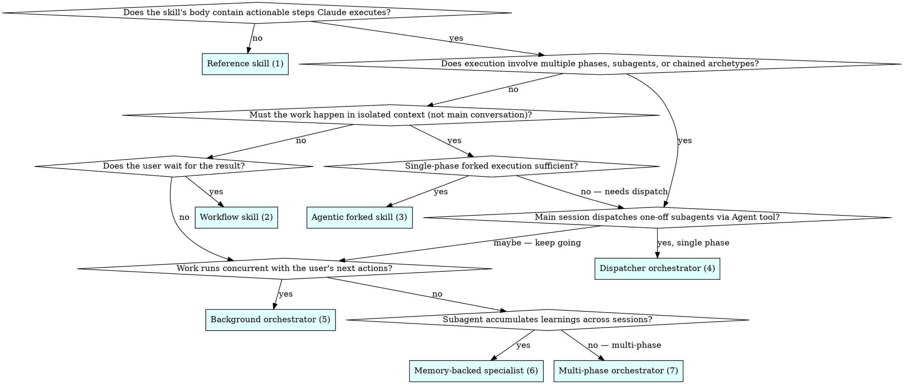

# Archetype Decision Tree

Walk this question ladder in order. Stop at the first archetype that answers YES for every question on its path. Each question is binary — if you need a third answer, your intent is under-specified and you must return to Step 1 of the main process.

---

## Question ladder

---

## Question-by-question guide

**Q1: Does the skill's body contain actionable steps Claude executes?**

- **No** — The body is standing knowledge: conventions, regex tables, API catalogues, style guides. Claude references it during unrelated work. → **Archetype 1: Reference skill**
- **Yes** — Claude runs something when the skill is loaded. Continue.

Edge case: a skill that contains both "here are the rules" AND "here's how to run the check" is two skills. Extract the rules to a reference skill; make the runner a workflow/forked/dispatcher skill that preloads the reference.

**Q2: Does execution involve multiple phases, subagents, or chained archetypes?**

- **Yes** — Skip to Q5.
- **No** — Continue to Q3.

A "phase" is a boundary where the output of one chunk of work becomes the input of another. Running three commands in sequence is not multi-phase if they all share one context. Running a planner, then an implementer, then a reviewer IS multi-phase.

**Q3: Must the work happen in isolated context (not main conversation)?**

- **Yes, single phase** — The skill runs a self-contained task in a forked subagent. Main conversation only sees the summary. → Continue to Q4.
- **No** — Continue to Q6.

Signals for isolated context: the work reads many files, generates verbose output, needs different tools than the main conversation, or would pollute the main context with intermediate state the user will never reference.

**Q4: Single-phase forked execution sufficient?**

- **Yes** — One forked subagent does the whole job. → **Archetype 3: Agentic forked skill**
- **No — needs further dispatch** — Even the forked work needs to coordinate. → Jump to Q5.

**Q5: Main session dispatches one-off subagents via Agent tool?**

- **Yes, single phase** (one round of dispatch, synthesis, done) → **Archetype 4: Dispatcher orchestrator**
- **Maybe — keep going** (the work has more structure than a single dispatch round) → Continue to Q7 and Q8.

**Q6: Does the user wait for the result?**

- **Yes** — Inline workflow in the main conversation. → **Archetype 2: Workflow skill**
- **No** — Continue to Q7.

**Q7: Work runs concurrent with the user's next actions?**

- **Yes** — Subagent runs in the background while the user continues interacting. Permissions pre-approved. → **Archetype 5: Background orchestrator**
- **No** — Continue to Q8.

**Q8: Subagent accumulates learnings across sessions?**

- **Yes** — A named subagent (not a forked one-off) with `memory: user|project|local` that builds knowledge over time. → **Archetype 6: Memory-backed specialist**
- **No** — The work is multi-phase without background, without persistent memory, chaining multiple archetypes. → **Archetype 7: Multi-phase orchestrator**

---

## Quick reference table

| Archetype | Runs in | Invoker | Memory | Blocking | Subagents |
|-----------|---------|---------|--------|----------|-----------|
| 1. Reference | Main session | Auto, on match | None (project via CLAUDE.md) | N/A | None |
| 2. Workflow | Main session | Usually `/name` | None (project via CLAUDE.md) | Blocking | None |
| 3. Agentic forked | Forked subagent | Either | None | Blocking | Self (one fork) |
| 4. Dispatcher | Main + subagents | Either | None per call | Blocking | One or more via Agent tool |
| 5. Background | Concurrent subagent | Usually `/name` | Optional | Non-blocking | One, via Agent tool, `background: true` |
| 6. Memory specialist | Cross-session subagent | Either | `user`/`project`/`local` | Blocking | Named subagent |
| 7. Multi-phase | Main session | Either | Mixed | Usually blocking | Multiple, mixed archetypes |

---

## When two archetypes seem to fit

Pick the one with fewer moving parts. **Every time.** A reference skill beats a workflow skill beats a forked skill beats a dispatcher orchestrator beats a multi-phase orchestrator, when both would work.

Justifications for reaching up the complexity ladder:

- **Reference → Workflow**: There is a user-triggerable action Claude should take exactly the same way every time.
- **Workflow → Forked**: The work generates context pollution that hurts subsequent main-conversation tasks.
- **Forked → Dispatcher**: Multiple specialist passes are needed, with distinct tool scopes or prompt framings.
- **Dispatcher → Background**: The user's time is more valuable than the wait, and the work is safe to pre-approve.
- **Any → Memory-backed**: The skill's effectiveness increases measurably with accumulated session history.
- **Any → Multi-phase**: Phases are genuinely separable and produce artifacts the next phase consumes.

If you cannot name the justification, you are over-engineering. Drop one level.

---

## Anti-pattern: "Orchestrator by default"

Teams that discover orchestrator patterns tend to reach for them reflexively. Most skills are reference or workflow skills. Orchestrators exist for a narrow set of problems — not as a flex. A repo with more than 20% orchestrator skills is almost certainly mis-classified; audit and collapse.
