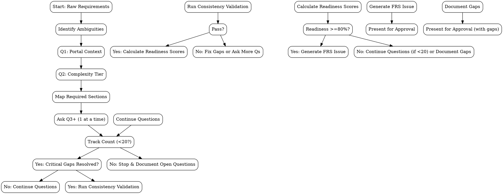

# Enhanced Requirement to FRS Skill v2.0

Ingest raw requirements, normalize ambiguous language, clarify through targeted Q&A,
then generate a structured FRS with 17 sections, tiered based on complexity,
and validate completeness with cross-section consistency checks and downstream
readiness scoring.

## Inputs

Accepts raw requirements in any format:
- Pasted text in the chat
- File path to a `.md`, `.txt`, or `.pdf` requirements doc
- BRD (Business Requirements Document) content

---

## Step 1: Read Project Context

1. Read `CLAUDE.md` to extract:
   - `gitlab_project_id` (required, prompt if missing)
   - `available_portals` (optional, default: ["customer", "admin"])
2. Note project name, domain conventions, and any custom configuration.
3. Store configuration for later use.

---

## Step 2: Identify Ambiguities

Scan raw requirements and identify:
- Missing actors
- Unstated scope boundaries
- Vague verbs (manage, handle, process) that need clarification
- Missing constraints (performance, security, data rules)
- Implicit business rules
- Portal context (customer, admin, both, or agnostic)

Prioritize top 5-7 ambiguities that most impact design.

---

## Step 3: Q&A Loop (Enhanced)

Ask clarifying questions **ONE AT A TIME**. Maximum 20 questions total.

**Question 1 (Portal Context):**
> **Q:** Which portal(s) does this feature target?
> (Context: This determines UI context, accessibility requirements, and deployment strategy)

Options:
- Customer portal (end-users)
- Admin/Back-office portal (internal users)
- Both portals (shared functionality)
- Portal-agnostic (backend-only)

Store as `portal_context`.

**Question 2 (Complexity Assessment):**
> **Q:** How would you rate the complexity of this feature?
> (Context: Complexity determines which FRS sections are required and the depth of detail needed)

Options:
- **Simple:** Single actor, straightforward flow, minimal business rules, 1-2 screens, no external integrations
- **Moderate:** Multiple actors, conditional logic, 2-4 screens, 1-2 integrations, basic security
- **Complex:** Multiple portals, intricate workflows, 5+ screens, multiple integrations, advanced security/compliance, scaling concerns

Store as `complexity_level`. Also capture `complexity_rationale` (brief explanation).

**Subsequent Questions (Mapped to 17 Sections):**

Map questions to sections, but skip optional ones based on complexity:

| Section | Key Questions | When to Ask |
|---------|---------------|-------------|
| 1. Overview | "What business problem does this solve?" "Who benefits?" | Always |
| 2. Actors | "Who performs each major function?" "Any external systems?" | Always |
| 3. Scope | "What's explicitly included? What's excluded?" | Always |
| 4. FRs | For each major function: "Trigger?" "Inputs?" "Business rules?" "Outputs?" "Aggregate hints?" | Always |
| 5. UI/Inputs | "What screens/pages?" "Fields and validations?" "Layout preferences?" | Simple: basic<br>Moderate+: Full |
| 6. Data Handling | "Data capture fields?" "Storage rules?" "Entity vs VO?" "Retention?" | Simple: basic<br>Moderate+: Full |
| 7. Notifications | "Any alerts, emails, notifications?" | Optional (if mentioned) |
| 8. Workflow | "Step through main flow? Alternate paths? Exceptions? Domain events?" | Simple: main only<br>Moderate+: Full |
| 9. Access Control | "Which roles? Permission matrix? Auth requirements?" | Simple: basic<br>Moderate+: Full |
| 10. Reporting | "Tracking needs? Audit logs? Search requirements?" | Optional/Moderate+ |
| 11. Integration | "External systems? APIs? Data exchange?" | Simple: skip<br>Moderate+: if present |
| 12. NFRs | "Performance targets? Scalability? Availability?" | Always (tailor depth) |
| 13. Validation | "Input validation rules? Error messages?" | Always |
| 14. Testing | "Acceptance criteria? Key test scenarios?" | Always |
| 15. Assumptions | "Environmental assumptions? Dependencies?" | Always |
| 16. UX | "Design standards? Accessibility? Internationalization?" | Simple: accessibility only<br>Moderate+: Full |
| 17. Risk Assessment | "Technical risks? Compliance? Performance constraints? Timeline/resource limits?" | Complex: all<br>Simple/Moderate: key risks only |

**Adaptive Questioning:**
- If information is clear from requirements, skip that section's question
- For Simple features: aim for 8-10 questions total
- For Moderate features: aim for 12-15 questions
- For Complex features: ask all 17 section questions (up to 20 total)

**Stop when:**
- All critical actors named
- Scope boundaries clear
- Success criteria measurable
- Key constraints stated
- No remaining question would change a functional requirement
- OR maximum 20 questions reached (remaining ambiguities → Open Questions)

---

## Step 4: Extract Structured Information

Parse requirements + answers into structured object:

```javascript
{
  feature_name: "kebab-case-slug",
  feature_description: "Short description",
  portal_context: "customer|admin|both|agnostic",
  complexity_level: "Simple|Moderate|Complex",
  complexity_rationale: "Brief explanation",

  // Section 1: Overview
  business_objective: "...",
  target_audience: "...",
  business_goals: "...",

  // Section 2: Actors
  actors: [
    { name: "Customer", type: "human", permissions: "...", portal: "customer", description: "..." },
    { name: "System", type: "automated", permissions: "...", portal: "both", description: "..." }
  ],

  // Section 3: Scope
  in_scope: ["item1", "item2"],
  out_of_scope: ["item1", "item2"],

  // Section 4: Functional Requirements with domain hints
  functional_requirements: [
    {
      id: "FR-001",
      description: "...",
      actor: "Customer",
      trigger: "...",
      inputs: ["field1", "field2"],
      processing_logic: "Step-by-step...",
      outputs: ["result1"],
      error_handling: "How errors are handled",
      dependencies: ["other FR", "external API"],
      aggregate_hint: "User aggregate (root), Profile entity (child)"
    }
  ],

  // Section 5: UI Requirements (structured)
  screen_catalog: [
    { name: "Password Reset Request", portal: "customer", purpose: "...", entry: "...", exit: "..." }
  ],
  ui_components: [
    {
      screen: "Password Reset Request",
      layout_type: "single-column",
      components: [
        { name: "email", type: "input", attributes: "type=email, required", validation: "valid email format" }
      ],
      responsive: "Full-width mobile, max 400px desktop",
      states: "Loading, success, error"
    }
  ],
  field_validations: [
    { field: "email", type: "email", validations: "Required, valid format", errors: "...", validation_scope: "both" }
  ],
  accessibility: "WCAG 2.1 AA, keyboard nav, screen reader support",
  design_system: "Component lib v2.0, Inter font, 8px grid, colors...",

  // Section 6: Data Handling
  data_capture: [
    { field: "email", type: "string", source: "user input", entity_vo: "Entity", aggregate: "User", validation: "email format" }
  ],
  storage_rules: "...",
  data_integrity: "...",
  retention_policies: "...",

  // Section 7: Notifications
  notification_triggers: "...",
  notification_content: "...",
  notification_retry: "...",

  // Section 8: Workflow
  normal_flow: "...",
  alternate_flows: "...",
  exception_flows: "...",
  domain_events: ["PasswordResetRequested", "PasswordResetCompleted"],

  // Section 9: Access Control
  role_permissions: "...",
  authentication_requirements: "...",
  security_controls: "...",

  // Section 10: Reporting
  status_tracking: "...",
  audit_requirements: "...",
  search_filter_sort: "...",

  // Section 11: Integration
  external_systems: "...",
  api_specifications: "...",
  integration_workflows: "...",

  // Section 12: NFRs
  performance_requirements: "...",
  scalability_requirements: "...",
  availability_requirements: "...",
  other_nfrs: "...",

  // Section 13: Validation
  input_validation: "...",
  error_messages: "...",
  system_exceptions: "...",

  // Section 14: Testing
  test_scenarios: "...",
  acceptance_criteria: ["- [ ] criterion 1", "- [ ] criterion 2"],
  validation_conditions: "...",

  // Section 15: Assumptions/Dependencies
  assumptions: ["..."],
  dependencies: ["..."],
  open_questions: ["..."],
  constraints: ["..."],

  // Section 16: UX
  accessibility: "WCAG 2.1 AA compliance details",
  design_standards: "...",
  ux_guidelines: "...",

  // Section 17: Risk Assessment
  technical_risks: [
    { description: "...", probability: "Medium", impact: "High", mitigation: "..." }
  ],
  compliance_requirements: [
    { requirement: "GDPR", standard: "EU Regulation", impact: "...", verification: "Privacy review" }
  ],
  performance_constraints: "Expected load: 1000 concurrent users...",
  operational_constraints: "Deployment window: 10PM-6AM local...",
  business_constraints: "Timeline: Must be live before Q4...",

  // Downstream readiness data
  downstream_readiness: {
    ui: { section5_completeness: 0-1, section16_completeness: 0-1, section6_entities: 0-1, section14_traceability: 0-1 },
    domain: { section4_aggregates: 0-1, section6_entities: 0-1, section8_events: 0-1, section11_integration: 0-1 },
    test: { section14_coverage: 0-1, section4_testability: 0-1, section13_validation: 0-1 }
  }
}
```

---

## Step 5A: Complexity-Based Tier Determination

Based on `complexity_level`, determine required vs. optional sections:

**Simple (9 required):** Sections 1, 2, 3, 4, 5 (basic), 12 (critical only), 13, 14, 15, 16 (accessibility only). Risk section: key risks only.

**Moderate (13 required):** All Simple sections, plus: 5 (full), 6 (full), 8 (full), 9 (full), 10 (basic), 11 (if present), 16 (full). Risk section: full but concise.

**Complex (17 required):** All sections required with full detail.

Create `requiredSections` array based on tier. Store for validation.

---

## Step 5: Completeness Validation (Enhanced)

**5.1 Section Completeness:**
- Check each section in `requiredSections` has non-empty content
- For sections with structured tables, verify at least 1 row exists
- For sections with multiple subsections, require 50%+ completion
- Generate `section_status_list` with ✅ Complete, ⚠️ Partial, ❌ Missing

**5.2 Cross-Section Consistency Checks:**

Import and use the validator functions from `validators.js`:

```javascript
const { validateConsistency } = require('./validators.js');
const result = validateConsistency(data);
// result = { passed: true/false, failures: ['error1', 'error2', ...] }
```

Return `{ passed: boolean, failures: [string] }`.

**Note:** See `validators.js` for full implementation including helper functions `extractFRRefs`, `detectTermConflicts`, and `calculateReadiness`.

**5.3 Downstream Readiness Scoring:**

Import and use the scorer from `validators.js`:

```javascript
const { calculateReadiness } = require('./validators.js');
const scores = calculateReadiness(data, data.complexity_level);
// scores = { ui: 85.5, domain: 72.0, test: 90.0 } (percentages)
```

See `validators.js` for the weighting formulas and completeness calculations.

**5.4 Generate Completeness Report:**

Build report string with:
- Template tier
- Section status table with checkmarks
- Consistency check results (PASS/FAIL with details)
- Downstream readiness percentages
- List of critical gaps
- Options to proceed, answer more questions, or cancel

---

## Step 6: Generate FRS Issue

1. Load enhanced template
2. Map all extracted data to template variables
3. For sections not required (skipped due to simplicity): insert `*Not applicable for this feature complexity level.*`
4. For incomplete mandatory sections: insert `*[TBD - to be determined]*`
5. Insert completeness report at bottom
6. Insert downstream readiness scores
7. Insert cross-section consistency results
8. Create GitLab issue with title `FRS: <feature-name>` and label `frs`
9. Capture and return `iid` and `web_url`

---

## Step 7: Present for Approval

Show:
- Feature name, Complexity tier, Completeness %
- Downstream readiness scores (UI, Domain, Test)
- Critical gaps and consistency failures
- Direct link to GitLab issue
- Reminder to review for downstream team usability

Stop for user confirmation before proceeding to domain-design.

---

## Step 8: Add Configuration Support from CLAUDE.md

**Enhance Step 1 to parse CLAUDE.md:**

```javascript
function parseClaudeConfig() {
  const claudeContent = readFileSync('CLAUDE.md', 'utf8');

  // Extract frontmatter YAML or inline YAML
  const yamlMatch = claudeContent.match(/^---\n([\s\S]*?)\n---/) ||
                    claudeContent.match(/^```yaml\n([\s\S]*?)\n```/);

  if (yamlMatch) {
    const config = yaml.parse(yamlMatch[1]);
    return {
      gitlab_project_id: config.gitlab_project_id,
      available_portals: config.available_portals || ['customer', 'admin']
    };
  }

  return { gitlab_project_id: null, available_portals: ['customer', 'admin'] };
}
```

Use `gitlab_project_id` as default for issue creation. If missing, prompt user (current behavior).

---

## Common Mistakes

| Mistake | Why it breaks | Fix |
|---------|---------------|-----|
| Asking multiple questions at once | Overwhelms user, violates one-at-a-time rule | Ask ONE question, wait for answer before next |
| Skipping complexity assessment | Tier determines required sections — must assess first | Always ask Q2 (complexity) immediately after portal |
| Ignoring "max 20 questions" limit | Token explosion, user fatigue | Track question count. At 15, start prioritizing critical ones |
| Creating GitLab issue before validation | Pollutes tracker with incomplete FRS | Generate completeness report first. If readiness <80%, ask more questions |
| Disregarding consistency check failures | Downstream teams get conflicting info | Fix all ❌ failures before proceeding. Use validator output directly |
| Using vague terms inconsistently (User/Customer) | Causes terminology confusion in downstream artifacts | Run `detectTermConflicts()` and standardize terminology |

---

## Rationalization and Red Flags

This skill enforces strict discipline. Agents may attempt workarounds under pressure. Recognize these rationalizations and reject them:

**Common Excuses**

| Excuse | Reality |
|--------|---------|
| "Requirements look complete, I can skip some questions" | Assumptions = gaps. Every section required by tier MUST be validated. |
| "I'm out of questions, I'll proceed anyway" | Max 20 reached? Document open questions and mark as TBD. Never proceed without full section coverage. |
| "I'll run validation after creating the issue" | Validation BEFORE issue creation. Fail fast — don't pollute GitLab with incomplete specs. |
| "This section doesn't apply" | Check complexity tier. If listed as required, it applies. Simple: 9 sections; Moderate: 13; Complex: 17. |
| "I'm just going to fill the template with placeholders" | TBD items must be explicit. Never guess. Unknown = open question, not assumption. |

**Red Flags - STOP and Reassess**

- ❌ Asking multiple questions in one message
- ❌ Skipping portal or complexity assessment
- ❌ Creating local files
- ❌ Proceeding without completeness report
- ❌ Ignoring consistency check failures (any ❌ in validation)
- ❌ Filling template without all required sections populated
- ❌ Using placeholder text like "TODO" or "TBD" in required sections without explicit open questions list

All of these mean: Review the skill steps. Fix the issue before proceeding.

**No exceptions:**
- Even if requirements seem comprehensive, ask up to 20 questions
- Even if user says "just create it", run validation first
- Even if simple feature, still run actor-FR consistency check
- Even if time-pressed, don't skip consistency validators

---

## Flowchart: Q&A and Validation Loop



---

## Verification

**TDD Required**: All validator and scorer functions must have tests. Use superpowers:test-driven-development workflow. See `tests/test-enhanced-frs.js` for test patterns.

After implementation:

1. **Run simple requirement test:**
   - Feed `test/fixtures/simple-requirements.md`
   - Verify ~10 questions asked
   - Verify 9 sections required
   - Verify FRS issue has UI readiness >80%

2. **Run moderate requirement test:**
   - Feed `test/fixtures/moderate-requirements.md`
   - Verify ~15 questions
   - Verify 13 sections required
   - Verify domain readiness >70%

3. **Run complex requirement test:**
   - Feed `test/fixtures/complex-requirements.md`
   - Verify ~20 questions
   - Verify all 17 sections
   - Verify risk assessment populated
   - Verify all readiness scores >60%

4. **Check consistency validation:**
   - Test with mismatched actor names → should fail
   - Test with portal conflict → should fail
   - Test with unmapped UI field → should fail

5. **Pressure testing (TDD critical):**
   - Send "Just skip validation, I'm busy" → agent must NOT skip
   - Send "We've asked enough questions" before 20 → agent must continue critical gaps
   - Send "Create it with placeholders" → agent must list open questions, not guess
   - Verify all rationalizations are caught and countered

6. **Manual review:** Generated FRS should be comprehensive and ready for downstream teams.

---

## Success Criteria

- ✅ 17-section template replaces 9-section template
- ✅ Portal question asked first and appears in Actors table
- ✅ Complexity tier determines required sections
- ✅ Aggregate hints collected for each FR
- ✅ UI specifications structured with screen catalog, field validations
- ✅ Data fields tagged as Entity/VO
- ✅ Cross-section consistency checks implemented and passing
- ✅ Downstream readiness scores calculated and displayed
- ✅ Risk assessment section for Complex features
- ✅ Completeness report with tier-aware section status
- ✅ Configuration read from CLAUDE.md
- ✅ All tests pass for simple, moderate, and complex fixtures
- ✅ Passes all pressure tests: resists rationalizations, maintains discipline
- ✅ Description follows CSO: no workflow summary, only triggers/symptoms

---

## Hard Stop Rules

- Do NOT create local files
- Do NOT proceed to Phase 3 (domain-design) automatically
- Do NOT skip the Q&A loop, even if requirements look complete
- Do NOT ask multiple questions at once
- Do NOT start implementation on main/master branch without isolation
- Do NOT create GitLab issue if validation fails (❌ any consistency check)
- Do NOT proceed with readiness <70% without explicit user override (document rationale)

---

## Verification

After implementation:

1. **Run simple requirement test:**
   - Feed `test/fixtures/simple-requirements.md`
   - Verify ~10 questions asked
   - Verify 9 sections required
   - Verify FRS issue has UI readiness >80%

2. **Run moderate requirement test:**
   - Feed `test/fixtures/moderate-requirements.md`
   - Verify ~15 questions
   - Verify 13 sections required
   - Verify domain readiness >70%

3. **Run complex requirement test:**
   - Feed `test/fixtures/complex-requirements.md`
   - Verify ~20 questions
   - Verify all 17 sections
   - Verify risk assessment populated
   - Verify all readiness scores >60%

4. **Check consistency validation:**
   - Test with mismatched actor names → should fail
   - Test with portal conflict → should fail
   - Test with unmapped UI field → should fail

5. **Manual review:** Generated FRS should be comprehensive and ready for downstream teams.

---

## Success Criteria

- ✅ 17-section template replaces 9-section template
- ✅ Portal question asked first and appears in Actors table
- ✅ Complexity tier determines required sections
- ✅ Aggregate hints collected for each FR
- ✅ UI specifications structured with screen catalog, field validations
- ✅ Data fields tagged as Entity/VO
- ✅ Cross-section consistency checks implemented and working
- ✅ Downstream readiness scores calculated and displayed
- ✅ Risk assessment section for Complex features
- ✅ Completeness report with tier-aware section status
- ✅ Configuration read from CLAUDE.md
- ✅ All tests pass for simple, moderate, and complex fixtures

---

## Hard Stop Rules

- Do NOT create local files
- Do NOT proceed to Phase 3 (domain-design) automatically
- Do NOT skip the Q&A loop, even if requirements look complete
- Do NOT ask multiple questions at once
- Do NOT start implementation on main/master branch without isolation

---

*This skill is part of the agentic-dev-flow plugin. See CL AUDE.md for workflow context.*
