# Generate FRS

Generate FRS turns rough product input — meeting notes, feature ideas, React prototypes, or full briefs — into approved, business-language Functional Requirements Specifications, one per business operation, synced directly to GitLab as issues under per-module milestones. Every FRS is gated through source classification, module confirmation, self-review, domain-expert enforcement, open-question resolution, and a per-FRS user disposition before anything is synced.

**GitLab is the single source of truth.** FRS content lives only as GitLab issues. No local files are created.

**Announce at start:** "I'm using the generate-frs skill to classify your sources, parse them into modules, generate business-language FRS documents, and sync approved specs to GitLab."

---

<HARD-GATE>
- Do NOT generate any FRS until `confirmed_module_list` is resolved. This applies even when the input appears unambiguous — a single-looking input may still contain multiple modules.
- Do NOT proceed past Phase 0 without a verified GitLab project ID and a working GitLab MCP connection.
- Do NOT proceed past Phase 1 without a classified `source_manifest` — every input must be routed through Source Classification.
- If Source Classification detects an existing FRS (17-section structure), HALT and redirect to `skill:review-frs`.
- Do NOT create GitLab milestones inside the FRS generation loop. ALL milestones are created ONCE, before the loop begins.
- Do NOT sync a skipped FRS to GitLab under any circumstances. Skipped means no issue, no trace.
- Do NOT present an FRS to the user until Self-Review Checklist, Domain-Expert Enforcement, AND Open Questions resolution have all passed. "Close enough" is not done.
- Do NOT create duplicate milestones or issues — idempotency checks are mandatory before every creation.
- Do NOT continue past 3 total attempts (1 + 2 retries) on any single GitLab MCP call — halt the session and emit a resume block.
</HARD-GATE>

---

## Overview

Use this skill whenever business operations need to be captured as traceable, testable, business-language requirements. It handles the full lifecycle: preflight (template + CLAUDE.md + GitLab MCP + validation rules) → classify sources (prose / code / files / mixed) → parse input → detect modules → resolve initials collisions → build FRS manifest → create milestones once (idempotent) → generate each FRS with automatic enrichment → resolve open questions → present each for approval → sync approved ones to GitLab (idempotent) → emit a summary.

**Prerequisites:**
- `../references/FRS-TEMPLATE.md` must exist and be readable.
- `../references/FRS-VALIDATION-RULES.md` must exist — the canonical rule contract shared with `skill:review-frs`.
- `CLAUDE.md` must contain a GitLab project ID (or the user must supply one when asked).
- A GitLab MCP connection must be available. If unavailable, the skill halts before generation — it does not run offline.

**Expected outcome:** One GitLab milestone per confirmed module, one GitLab issue per approved FRS linked to its module's milestone, and a final summary mapping FRS → issue IDs. No local files.

**Core principle:** FRS describes WHAT the business needs — never HOW it is built. All language must be actor-facing, outcome-oriented, and free of any technical implementation detail. If a sentence could appear in a database schema, an API contract, or a deployment guide, it does not belong in an FRS.

---

## Anti-Pattern: "This FRS Is Simple Enough To Skip The Constraint"

You will be tempted — on small, obvious operations like "log out" or "view profile" — to produce an FRS with one business rule, one edge case, or no exception flow, because the operation "doesn't really need" more. This framing fails every time. The Skill Constraint is a baseline guarantee, not an enrichment target. Simple operations still have unstated policy rules (session timeout behaviour, audit retention, concurrent-session handling) and edge cases (logout while a request is in flight, logout on a revoked token). Infer them. Every FRS meets ≥2 business rules, ≥2 edge cases, ≥1 exception flow — without exception.

---

## When to Use

**Use when:**
- User asks to write, generate, or document functional requirements
- User wants a product / feature / system broken into modules or milestones
- User has meeting notes, user stories, a feature brief, or a UI prototype to formalise
- User wants GitLab milestones and issues created from requirements
- User uses the words "FRS", "BRS", "business requirements", "spec doc", "requirements document"
- Input is rough or incomplete — the skill infers structure when nothing formal is provided

### Supported Source Types

The skill accepts — singly or in combination:

| Source | How it's provided | Handling |
|---|---|---|
| Natural-language text | Pasted in chat | Direct parsing (Phase 2) |
| React / TypeScript components | Pasted code block, or `.tsx`/`.jsx`/`.ts` file upload | Code Extraction in Phase 1 — operations from forms/handlers, Form Fields from inputs, Business Rules from validation, Exception Flows from error handling |
| Meeting notes / briefs | Pasted text, or `.md` / `.txt` file upload | Direct read; parsed as prose |
| Word documents | `.docx` file upload | Routed through `skill:docx` for text extraction, then parsed as prose |
| PDFs | `.pdf` file upload | Routed through `skill:pdf-reading` for text extraction, then parsed as prose |
| Mixed sources | Any combination of the above | Extracted separately; merged in Phase 2 — **code reveals structure, prose reveals intent** |

**Do NOT use when:**
- User wants to review, audit, or validate an **existing FRS** → use `skill:review-frs`
- User wants a technical design document or architecture diagram → use a tech-spec skill instead
- User wants a test plan or QA checklist — FRS is input to testing, not the test plan itself
- User wants Agile user stories only — though you may offer FRS → user stories conversion after generation
- Source Classification detects a 17-section FRS structure in the input → redirect to `skill:review-frs`

---

## Checklist

You MUST complete these in order:

0. **Preflight** — verify FRS template, validation rules file, GitLab project ID (`CLAUDE.md`), GitLab MCP connectivity
1. **Source Classification** — detect source types, dispatch extractors, build `source_manifest`; redirect if existing FRS detected
2. **Parse & Module Resolution** — apply scope gate, detect modules, resolve `confirmed_module_list` (gate on ambiguity)
3. **Manifest & Milestones** — assign initials (collision gate), build FRS manifest, create milestones idempotently
4. **Enrichment** — extract rules from input, or infer via Skill Constraint
5. **FRS Generation Loop** — per FRS: generate → self-review → enforce → resolve open questions → present → record disposition → sync idempotently if approved
6. **Final Output** — summary (milestones, FRS → issue map, counters) — or Halt Resume block if interrupted

---

## Process Flow

```dot
digraph frs_process {
    rankdir=TB;
    node [fontname="Helvetica"];

    input [label="Input", shape=ellipse];
    preflight [label="Phase 0: Preflight", shape=box, style=filled, fillcolor="#d1ecf1"];
    classify [label="Phase 1: Source Classification", shape=box, style=filled, fillcolor="#d1ecf1"];
    existing_frs [label="Existing FRS\ndetected?", shape=diamond];
    redirect [label="HALT — redirect to\nskill:review-frs", shape=box, style=filled, fillcolor="#f8d7da"];
    parse [label="Phase 2: Parse input\n(modules + operations)", shape=box];
    scope [label="Scope gate\n(count check)", shape=diamond];
    ambiguity [label="Multiple modules?", shape=diamond];
    gate_module [label="USER GATE:\nConfirm modules", shape=box, style=filled, fillcolor="#fff3cd"];
    manifest [label="Phase 3: Manifest", shape=box];
    collision [label="Initials collision?", shape=diamond];
    gate_initials [label="USER GATE:\nDisambiguate", shape=box, style=filled, fillcolor="#fff3cd"];
    milestones [label="Create milestones\n(idempotent)", shape=box];
    enrich [label="Phase 4: Enrichment", shape=box];
    loop [label="Phase 5: FRS Loop\ngen → review → enforce →\nresolve OQs → present", shape=box];
    oq [label="Open Questions?", shape=diamond];
    gate_oq [label="USER GATE:\nResolve via AskUserQuestion", shape=box, style=filled, fillcolor="#fff3cd"];
    disposition [label="Disposition?", shape=diamond];
    sync [label="Sync to GitLab\n(idempotent)", shape=box];
    sync_fail [label="Failed 3x?", shape=diamond];
    halt [label="HALT\nEmit Resume Block", shape=box, style=filled, fillcolor="#f8d7da"];
    more [label="More FRS?", shape=diamond];
    final [label="Phase 6:\nFinal Output", shape=doublecircle];

    input -> preflight;
    preflight -> classify;
    classify -> existing_frs;
    existing_frs -> redirect [label="yes"];
    existing_frs -> parse [label="no"];
    parse -> scope;
    scope -> ambiguity;
    ambiguity -> gate_module [label="yes"];
    ambiguity -> manifest [label="no"];
    gate_module -> manifest;
    manifest -> collision;
    collision -> gate_initials [label="yes"];
    collision -> milestones [label="no"];
    gate_initials -> milestones;
    milestones -> enrich;
    enrich -> loop;
    loop -> oq;
    oq -> gate_oq [label="yes"];
    oq -> disposition [label="no"];
    gate_oq -> disposition;
    disposition -> sync [label="approved"];
    disposition -> loop [label="change request"];
    disposition -> more [label="skip"];
    sync -> sync_fail;
    sync_fail -> halt [label="yes"];
    sync_fail -> more [label="no"];
    more -> loop [label="yes"];
    more -> final [label="no"];
}
```



**Terminal states:** Final Output Summary (normal), Halt Resume Block (interrupted), or Redirect (existing FRS detected → review-frs).

---

## The Process

### Phase 0 — Preflight

Four checks must all pass before anything else happens. Any failure halts with a clear instruction.

**0a. Template exists.** `../references/FRS-TEMPLATE.md` readable. Missing → halt: *"FRS template not found at `../references/FRS-TEMPLATE.md`. Skill cannot proceed."*

**0b. Validation rules exist.** `../references/FRS-VALIDATION-RULES.md` readable. Missing → halt: *"Validation rules not found at `../references/FRS-VALIDATION-RULES.md`. This file is the shared contract for generate-frs and review-frs."*

**0c. GitLab project ID from CLAUDE.md.** Read `CLAUDE.md`. Extract the project ID (commonly `gitlab_project_id: 12345` or `Project ID: 12345`). If absent → ask: *"I couldn't find a GitLab project ID in CLAUDE.md. Please provide it (or add it to CLAUDE.md before re-running)."* Store as `gitlab_project_id`.

**0d. GitLab MCP connectivity.** Verify a GitLab MCP tool is available. If not → halt: *"No GitLab MCP connection is available. Please connect a GitLab MCP server, then re-run this skill."* This skill does NOT generate FRS offline.

**Verify:** All four pass and `gitlab_project_id` is set.

### Phase 1 — Source Classification

Classify the input before treating any of it as prose. This phase produces a `source_manifest` mapping each source chunk to its type and extracted candidates.

**1a. Detect sources.** Inspect:
- Files at `/mnt/user-data/uploads/` — list them, note extensions
- Fenced code blocks in the pasted content (```tsx, ```typescript, ```jsx, ```javascript, ```ts, ```js)
- Unfenced JSX-shaped paste (matches `<[A-Z][a-zA-Z]*` or `function [A-Z][a-zA-Z]*\s*\(` + JSX return)
- 17-section FRS structure (sequential headers matching Purpose → Scope → … → Revision History)
- Plain prose (everything else)

**1b. Existing-FRS redirect.** If a 17-section FRS structure is detected anywhere in the input, HALT and ask:

> *"This input looks like an existing FRS (17-section structure detected). Did you want to review or validate it instead? Use `skill:review-frs`.*
> *Options:*
> *(a) Switch to `review-frs`*
> *(b) Use this FRS as reference material for generating a NEW FRS anyway*
> *(c) Cancel"*

Only proceed on option (b). On (a) → stop and instruct the user to invoke `review-frs`. On (c) → stop cleanly.

**1c. Route each source.**

| Source | Action |
|---|---|
| Uploaded `.pdf` | Route to `skill:pdf-reading` to extract text; classify extracted text |
| Uploaded `.docx` | Route to `skill:docx` to extract text; classify extracted text |
| Uploaded `.md` / `.txt` | Read directly; classify as prose or code depending on content |
| Uploaded `.tsx` / `.jsx` / `.ts` / `.js` | Read directly; run Code Extraction |
| Fenced code block in paste | Extract; run Code Extraction |
| JSX-shaped paste | Run Code Extraction |
| Plain prose | Mark for Phase 2 Parse |

**1d. Code Extraction Rules (React / TypeScript).** First-class support; other languages can be accepted but extraction will be looser. For each code source:

| Signal in code | FRS element produced |
|---|---|
| `<form>` + onSubmit handler | One FRS candidate (a business operation) |
| `<input>`, `<select>`, `<textarea>` inside a form | Form Fields (Section 11) — capture name, type, required-ness |
| Prop types / TypeScript interfaces on form | Strengthens Form Fields with type constraints |
| Non-form `<button onClick={...}>` triggering async work | Candidate operation |
| `fetch` / `axios` / `useMutation` / `useQuery` / `trpc.xxx.mutate` | System boundary; implies exception paths |
| Validation schemas (zod, yup, joi, class-validator) | Business Rules (Section 14) |
| Inline `if` / `throw` / `return error` in submit paths | Exception Flows or Business Rules |
| Error UI (`<ErrorMessage>`, `setError`, try/catch) | Exception Flows (Section 9) |
| Role/permission checks (`hasRole`, `user.isAdmin`, `Can` components) | Actors (Section 3) + Preconditions (Section 4) |
| Route definitions (`<Route path>`, file-based routing) | May indicate module grouping — carried into Phase 2 |
| Loading / pending / submitting state | Hints at the trigger → postcondition path |

**Output of extraction:** a list of operation candidates, each with source location, pre-populated Form Fields / Business Rules / Exception Flows drafts.

**1d.1. Import traversal (one level).** When a code source imports another **local file** (relative path like `./checklist-store`, `../hooks/useFoo`, not a third-party package like `react` or `@tanstack/query`), read the imported file and run Code Extraction on it as well. List every traversed file in `source_manifest` so the user sees what was actually scanned.

- **Cap depth at 1.** Do not recurse into files imported by the imported file. The point is to catch state stores, custom hooks, and validation modules that sit one hop from the entry source — not to walk the entire dependency graph.
- **Skip third-party imports** (anything from `node_modules`, anything starting with `@scope/` or a bare package name).
- **Why this rule exists.** A single React component often references operations defined in a sibling store or hook (e.g. CRUD handlers in a Zustand store, mutation logic in a custom hook). Skipping these means the FRS run misses entire modules — observed in practice: a checklist component importing a store with six admin CRUD operations would yield 3 FRS without traversal and 9 FRS with it. The model may discover this on its own when reasoning is strong, but the rule should not depend on model judgment.

**1e. Code-only caveat.** When code is the sole source, be **aggressive about surfacing Open Questions**. Code reveals *structure* (what operations exist, what fields they take) but rarely *intent* (why, policy, edge-case handling). Every business rule inferred from code alone is tagged `[inferred from code — confirm with stakeholder]` in Section 16 until corroborated by prose or user input.

**1f. Mixed-source reconciliation.** When both code and prose are provided:
- **Code → structure**: populates operation manifest, Form Fields, obvious exception flows.
- **Prose → intent**: populates Business Rules, Policy, Actors, Purpose.
- **Conflicts** (e.g., prose says "only managers can submit" but code has no role check): surface as Open Questions in Phase 5 Step D.

**Verify:** `source_manifest` contains at least one routed source. Every source has either extracted candidates (code) or is marked for prose parsing.

### Phase 2 — Parse & Module Resolution

Using the `source_manifest` from Phase 1, scan all prose inputs and extracted code candidates for distinct business domains — these become modules (= milestones). Collect business operations per module.

**Scope gate.** If the total implies more than **3 modules** or more than **12 total FRS**, pause and ask: *"This input spans roughly {N} modules and {M} operations. Multi-module runs at this scale risk context exhaustion before completion (each FRS is rendered in full and gates per FRS, plus the inter-module checkpoint, consume context). Options: (a) Scope down to the highest-priority module(s), (b) Split the run — process module 1 now, then resume in a fresh session for the rest, (c) Proceed with the full set and accept the risk of mid-run halt."* Proceed only on the user's answer.

**Why these numbers.** Empirically, a Sonnet-class model with the full Phase 5 gating produces ~9 FRS before context hits 95%+ in a single session. The threshold of "3 modules / 12 FRS" gives a safety margin and surfaces the trade-off explicitly rather than letting the user discover it at the end of a one-hour run.

If a single module is detected, auto-select. If multiple, trigger the BLOCKING user gate:

```
Modules detected:

1. <Module A>    (from: prose paragraph 2, UserForm.tsx)
2. <Module B>    (from: notes bullet 4)
3. <Module C>    (from: AdminPanel.tsx)

Confirm, or add / remove / merge.
```

Source provenance in the gate helps the user catch mis-classified code.

**Verify:** `confirmed_module_list` is non-empty.
**On failure:** If the user's response is ambiguous, re-present with clarifying options. Do not guess.

### Phase 3 — Manifest, Initials Collision & Milestones

**3a. Assign module initials.** Uppercased first letter of each word (`User Management` → `UM`, `Trade Finance` → `TF`).

**3b. Collision disambiguation gate.** If any two modules share initials, present:

```
Initials collision:
- User Management → UM
- Unit Management → UM

Proposed disambiguation:
  User Management → USM
  Unit Management → UNM

Confirm, or provide your own initials.
```

Algorithm: append the next distinguishing letter from the word that differs. Always confirm with the user before locking.

**3c. Build manifest.** Expand modules into operations. IDs reset per module: `FRS-[INITIALS]-01`, `FRS-[INITIALS]-02`, … Kebab-case operation slugs are used only in issue titles; no file paths.

Set all statuses to `pending-approval`. Present the manifest for visibility (non-blocking).

**3c.1. Cross-session FRS-ID collision check.** Before creating any milestone, query all GitLab issues in `gitlab_project_id` (any state) whose title matches the pattern `FRS-[INITIALS]-NN: *` for any of the planned module initials. If any historical issue exists for an FRS-ID this run plans to use:

Call `ask_user_input_v0` once, listing the colliding IDs and the existing issue numbers + states (e.g. *"FRS-LIC-01 already exists as issue #27 (closed) with title 'FRS-LIC-01: Branch Verifies Issuance Checklist' from a previous run. This run plans to create FRS-LIC-01 with title 'Branch Maker Verification of Import LC Issuance Checklist'."*) Options:

- **Continue with the same numbering** — accept that two issues will share the FRS-ID. Downstream tools must distinguish by issue number, not by FRS-ID alone.
- **Shift this run's numbering** — start the new run's IDs at one above the highest existing number (e.g. FRS-LIC-04 onwards). Re-render the manifest.
- **Cancel and reconcile manually** — halt the skill so the user can close, rename, or delete the prior issues before re-running.

Default to surfacing this even when prior issues are closed — closed issues remain searchable and a duplicate FRS-ID is a real ambiguity, not a cosmetic one.

**3d. Create milestones idempotently.** For each module, follow this three-branch decision:

1. Query existing milestones in `gitlab_project_id` with `state: active`. Match by exact `title == <Module Name>` → **reuse**. Record `(module → milestone_id, reused-active)`.
2. No active match → query milestones with `state: closed`. Match by exact `title == <Module Name>` → **HALT and call `ask_user_input_v0`** with the question *"A milestone titled '{Module Name}' exists but is closed (#{id}, from a previous session). How should this run handle it?"* and exactly these options: "Reopen and reuse", "Create new with disambiguated title (e.g. '{Module Name} v2')", "Cancel this module". Record the user's choice and act accordingly. Do NOT silently reuse a closed milestone — GitLab will not auto-attach issues to a closed milestone, and issues will be orphaned.
3. No match in either state → create via MCP tool. Record `(module → milestone_id, created)`.

**Rationale.** GitLab enforces title uniqueness across active AND closed states, so the `state: active` filter alone is not sufficient — `create_milestone` will fail with a duplicate-title error if a closed milestone exists with the same name. The explicit closed-state branch surfaces this to the user before issues are created.

**Verify:** Every confirmed module has exactly one `milestone_id`. No duplicates.
**On failure:** Exhausted retries → halt with Resume Block. Do NOT proceed with partial milestones.

### Phase 4 — Enrichment

If Phase 1 extraction produced rules (from validation schemas, etc.) or if meeting notes / briefs contained rules, extract each and tag to its module: `enrichment_map: module → [rules]`. Otherwise infer business constraints, policy rules, and user-facing outcomes via Skill Constraint as a floor.

**Verify:** Mapping exists for every confirmed module (extracted or inferred).
**On failure:** Never block on missing enrichment — infer.

### Phase 5 — FRS Generation Loop

For every module, for every FRS:

**Step A — Generate.** Draft the full FRS using `../references/FRS-TEMPLATE.md`. Business language throughout, scoped to the locked module. Integrate any Form Fields, Business Rules, and Exception Flows from the Phase 1 extraction.

**Source provenance (Section 17 — Revision History).** When generating the initial v1.0 row, append a `Source` column entry listing:

- The relative path of the primary source file (or "pasted prose" / "meeting notes" if no file).
- For code sources, every traversed import that contributed candidates (from Phase 1d.1).
- The git commit SHA when available (read via `git rev-parse HEAD` from the project root if running locally; otherwise omit).

Format example for the v1.0 row:

> *"1.0 | 2026-04-25 | generate-frs | Initial draft. Source: `ui/src/components/bank/IssuanceChecklist.tsx` + traversed `ui/src/stores/checklist-store.ts`; commit `a3f8b21`."*

This single line makes regeneration, re-validation, and downstream traceability trivial. Without it, a stakeholder reviewing the FRS in six months has no way to know which version of the code it was generated from.

**Inter-FRS dependency direction (Section 5) — write-time check.** Before listing any FRS-YY as an Inter-FRS dependency of the FRS you are drafting (FRS-XX), apply this rule:

- If FRS-YY must complete *before* FRS-XX can begin → FRS-YY is **Upstream**. List it.
- If FRS-XX must complete *before* FRS-YY can begin → FRS-YY is **Downstream**. **Do NOT list it as a dependency of FRS-XX** — it is a dependent, not a dependency. (Optionally note it as "triggers FRS-YY on success" in the postcondition, but never in Section 5 as something FRS-XX depends on.)
- If FRS-XX and FRS-YY run alongside each other with no precedence → **Parallel**.

The trade-finance example: if FRS-LIC-01 (Branch verifies) must complete before FRS-LIC-02 (CTF verifies) can begin, then FRS-LIC-02 lists FRS-LIC-01 as Upstream, and FRS-LIC-01 does NOT list FRS-LIC-02 as anything in Section 5. The arrow points from the dependent to its prerequisite, never the reverse.

**Step B — Self-Review.** Apply the full Self-Review Checklist from `../references/FRS-VALIDATION-RULES.md` (mirrored in *Validation Rules* below). If any item fails → refine inline → re-run.

**Output format is mandatory — never write "✅ PASSED" alone.** For every one of the 11 checklist items, produce a one-line verdict followed by *evidence*:

- **PASS** — cite 1–2 specific phrases or section references from the FRS that demonstrate compliance. (e.g. *"Item 3 PASS — Section 13 NFRs read 'completion confirmed within a timeframe that does not disrupt the actor's task' and 'operation available during business hours'; no millisecond targets, HTTP codes, framework names, or interaction mechanisms (drag-and-drop, double-click, hover) found."*)
- **FAIL** — cite the violating phrase verbatim and which section it appears in. (e.g. *"Item 3 FAIL — Section 7 step 1 contains 'Bank Admin uses drag-and-drop to set a complete new section order' (interaction mechanism); FR-LCA-06-03 contains 'persisted within 5 seconds' (timing target)."*)

A bare "PASS" with no evidence is itself a Self-Review failure — go back and produce evidence. Items 3 (zero technical detail — including interaction mechanisms) and 9 (NFR rubric) are the most commonly rubber-stamped; spend extra scrutiny on those two.

**Step C — Domain-Expert Enforcement.** Apply enforcement rules from `../references/FRS-VALIDATION-RULES.md`. If any violation → strip / rewrite → re-enforce. **Cap: 3 enforcement passes per FRS.** After 3, surface: *"FRS-XX cannot cleanly scope to {module}. Options: (a) move operation to a different module, (b) split into multiple FRS, (c) skip."*

**Step D — Resolve Open Questions (MANDATORY TOOL CALL).** You MUST call `ask_user_input_v0` for every unresolved entry in Section 16 before advancing to Step E. Batch up to 3 questions per call, with 2–4 recommended options plus "Defer" on each. Skipping this step is a skill failure — silently deferring all questions is not allowed. Integrate answers into the FRS body and remove resolved questions from Section 16. Items the user explicitly defers stay in Section 16 marked `[deferred — pending wiki resolution]`. (Forward plan: `skill:llm-wiki-query` will auto-resolve deferrals.)

**Step E — Present for Approval (MANDATORY TOOL CALL).** Show the FRS body to the user, then immediately call `ask_user_input_v0` with the question "Disposition for FRS-XX-NN?" and exactly these options: "Approve", "Request change", "Skip". You MUST NOT write "Disposition: APPROVED" yourself — only the user's selection sets the disposition. Skipping this gate or self-approving is a skill failure that invalidates the entire run.

**Verify:** Every FRS has a recorded disposition (approved / change-resolved / skipped) before advancing.

**Step F — Inter-module checkpoint (MANDATORY TOOL CALL when multi-module).** When all FRS for a module are complete and **at least one further module remains**, call `ask_user_input_v0` with the question *"Module {N} of {M} complete. {X} FRS synced to GitLab so far. Continue with module {N+1} ({Module Name}), or halt and resume in a fresh session?"* and these options: "Continue", "Halt and emit Resume Block".

**Why.** Mandatory user gates per FRS plus full-FRS rendering inside a single context window puts large multi-module runs at risk of context exhaustion before Phase 6. A checkpoint between modules lets the user opt to halt cleanly while everything synced so far is intact, rather than blowing through context on the final FRS. A run of more than ~6 FRS in one session is the practical danger zone; checkpoint regardless of FRS count.

If the user chooses "Halt", emit the Resume Block (see *GitLab Sync — Halt — Resume Block Format*) listing completed modules, completed FRS with issue numbers, and remaining modules to be picked up in a fresh session.

### Phase 6 — Final Output

Normal exit:

```
Milestones (GitLab project #{gitlab_project_id}):
  <Module A>  →  #M1  (reused)
  <Module B>  →  #M2  (created)

FRS Issues:
  <Module A>:
    FRS-UM-01  <operation>  →  #<issue_id>  (created)
    FRS-UM-02  <operation>  →  #<issue_id>  (reused)
    FRS-UM-03  <operation>  →  skipped

  <Module B>:
    FRS-IC-01  <operation>  →  #<issue_id>

Total FRS generated : {N} across {M} modules
Milestones          : {M}
Issues created      : {N}
Issues reused       : {N}   (idempotency matches)
Skipped             : {N}
Business Rules      : {N}
Edge Cases          : {N}
Open Questions      : {N}   (deferred — pending wiki resolution)
Sources consumed    : {N prose, N code, N files}
```

**Verify before declaring done:**
- Every approved FRS has exactly one GitLab issue — no duplicates, no orphans.
- Every FRS meets Skill Constraint minimums.
- No FRS contains technical implementation detail.
- Every FRS is locked to exactly one module.
- Module list matches `confirmed_module_list` exactly.
- Skipped FRS have no issue.
- Reused issues cross-checked by title + milestone.

---

## Handling Outcomes

**APPROVED** — Create GitLab issue under the module's milestone (idempotent). Store `(FRS_title → issue_id)`. Proceed.

**CHANGE REQUEST** — Apply changes inline. Re-present. Await confirmation. If the same FRS loops more than twice, ask the user to clarify intent rather than iterating blindly.

**SKIPPED** — Mark as skipped. No issue. Proceed.

**CHECKLIST FAIL (internal)** — Never present. Refine → re-run until every item passes.

**ENFORCEMENT VIOLATION (internal)** — Strip → rewrite → re-enforce. Cap at 3 passes → surface to user.

**GITLAB SYNC FAIL** — See *GitLab Sync — Execution*. Retry up to 2 more times (3 total per call). On exhaustion, halt and emit Resume Block.

**ABORT MID-SESSION** — Stop immediately. Milestones/issues already created in GitLab persist — inform the user that those artefacts must be manually removed if unwanted. Emit a truncated summary.

**EXISTING FRS DETECTED (Phase 1)** — Halt and redirect to `skill:review-frs`. Do not proceed with generation unless the user explicitly opts to use the FRS as reference material for a NEW FRS.

---

## GitLab Sync — Execution

Every GitLab MCP call: **idempotency check → call with retry → record result**.

### Retry Policy

- **Scope:** Per-call. Each milestone creation, each issue creation, each read gets its own 2-retry budget (3 total attempts).
- **On exhaustion:** Halt the session. Emit Resume Block. Do NOT continue the loop.
- **Between attempts:** Brief pause is fine; no exponential backoff required.

### Creating a milestone (Phase 3, idempotent)

1. Query milestones in `gitlab_project_id` with `state: active`. Match by exact title = `<Module Name>` → reuse; record `(module → milestone_id, reused-active)`.
2. No active match → query with `state: closed`. Match by exact title = `<Module Name>` → call `ask_user_input_v0` (Reopen / Disambiguate / Cancel). Act on the choice; never silently reuse a closed milestone.
3. No match in either state → create via MCP tool (common names: `create_milestone`, `gitlab_create_milestone`):
   - `project_id`: `gitlab_project_id`
   - `title`: `<Module Name>` (or disambiguated form if user chose that path)
   - `description`: `FRS milestone for <Module Name> module. Initials: [MODULE-INITIALS]`

### Creating an issue (Phase 5, idempotent)

1. Query issues under `milestone_id`.
2. Match by exact title = `FRS-[INITIALS]-{ID}: {Business Operation Title}` → reuse.
3. No match → create via MCP tool (common names: `create_issue`, `gitlab_create_issue`):
   - `project_id`: `gitlab_project_id`
   - `title`: `FRS-[INITIALS]-{ID}: {Business Operation Title}`
   - `description`: `<full FRS content, in memory — never written to disk>`
   - `milestone_id`: `<stored milestone_id>`
   - `labels`: see Labels

### Labels

Only these project labels are available:

`Bug`, `Client Meeting`, `Code Review`, `Deferred`, `Discussion`, `Documentation`, `IN PROGRESS`, `IN QA`, `Load Testing`, `NEED DEPLOYMENT`, `Optimization`, `R&D`, `READY FOR QA`, `Re-Open`, `Sprint Replanning`, `Standup`, `TO DO`

**Default for every FRS issue:** `Documentation`, `TO DO`

**Conditional additions:**
- Deferred open questions in Section 16 → add `Discussion`
- User defers the entire FRS to a later sprint → add `Deferred`

Never invent labels. Never pass labels outside this list.

### Halt — Resume Block Format

```
=== SKILL HALT — GitLab MCP Unavailable ===

Halt reason   : <e.g., "Issue creation for FRS-UM-02 failed after 3 attempts: <e>">
Halt point    : <Phase name, e.g., "Phase 5 — FRS loop, FRS-UM-02">
GitLab project: #{gitlab_project_id}

Confirmed modules:
  - <Module A>  (initials: UM)
  - <Module B>  (initials: IC)

Milestones:
  <Module A>  →  #M1   (reused)
  <Module B>  →  #M2   (created)

Manifest & dispositions so far:
  FRS-UM-01  <operation>  synced     issue #42
  FRS-UM-02  <operation>  approved   SYNC FAILED (halt point)
  FRS-UM-03  <operation>  pending
  FRS-IC-01  <operation>  pending

Last action: <specific MCP call that failed>
Last error : <error surface from MCP server>

Resume instructions:
  1. Reconnect the GitLab MCP server (or verify it is reachable).
  2. Start a new Claude session and paste this entire Halt block as context.
  3. Re-invoke the generate-frs skill — idempotency checks skip any milestones/
     issues that already exist, continuing from FRS-UM-02.
```

---

## Validation Rules

This skill enforces `../references/FRS-VALIDATION-RULES.md` as the canonical contract. The summaries below mirror that file for readability. **When rules change, update the rules file first.**

### FRS Structure — 17 Sections

Purpose → Scope → Actors → Preconditions → Dependencies → Trigger → Main Flow → Alternative Flows → Exception Flows → Postconditions → Form Fields → Functional Requirements → Non-Functional Requirements → Business Rules → Edge Cases → Open Questions → Revision History.

### Skill Constraint

| Element | Minimum |
|---|---|
| Business rules | ≥ 2 |
| Edge cases | ≥ 2 |
| Exception flows | ≥ 1 |

### Self-Review Checklist (Phase 5 Step B)

Every FRS must answer YES to all:

1. Exactly one business operation
2. All requirements testable by a business stakeholder
3. Zero technical / implementation details (DB, API, framework, infra, language, **or interaction mechanisms** — drag-and-drop, double-click, hover, keyboard shortcut, swipe)
4. Exception flows cover invalid input, unauthorised access, failure
5. Postconditions stated as business outcomes
6. Skill Constraint met
7. Section 5 documents BOTH inter-FRS and system dependencies
8. All referenced FRS IDs exist
9. NFRs pass the NFR Rubric
10. All actors belong to the locked module
11. No cross-module rules, outcomes, or dependencies

### Domain-Expert Enforcement (Phase 5 Step C)

| Violation | Action |
|---|---|
| Cross-module actor | Strip → in-module actor |
| Cross-module business rule | Strip → rewrite in scope |
| Cross-module outcome | Restate as in-module postcondition or inter-FRS dependency |
| Technical detail (DB/API/framework) | Strip → rewrite as business outcome |
| Interaction mechanism (drag-and-drop, double-click, hover, keyboard shortcut) in flow or FR | Strip the mechanism; restate as business outcome — *what* the actor accomplishes, not *how they gesture* |
| Dangling FRS-ID in Section 5 | Correct or strip |
| Missing Section 5 | Add with at least system dependencies |
| NFR failing rubric | Rewrite in business language |
| Bundled operations | Split into separate FRS — see Bundling Detection Rule below |

Cap: 3 enforcement passes per FRS.

**Bundling Detection Rule.** An FRS describes exactly one business operation. Treat the following as evidence of bundling and split the FRS:

- The Main Flow contains two or more *distinct user actions* that produce *different state transitions* (e.g. "verify each item" → entries persisted, *and* "submit checklist" → checklist locked from edit). These are two operations even if they happen on the same screen.
- Two operations have *different actors* (e.g. one step is "Branch staff selects values", another is "Manager approves"). Different actor = different operation.
- Two operations have *different triggers* (one is initiated on form submit, another by a scheduled or downstream event).
- The Postconditions section reads as two paragraphs describing two unrelated end-states.

When in doubt, ask: *"Could a stakeholder reasonably approve one of these operations and reject the other?"* If yes, split. The trade-finance smell test: "verify a checklist" and "submit a verified checklist for downstream review" are two operations — splitting them lets reviewers approve the verification UX independently of the submission/locking policy.

### NFR Rubric (Section 13)

Business language: *"The actor's request must not be lost if they navigate away mid-submission."*
Technical in disguise: *"Use Redis-backed session persistence."*

Rule of thumb: an NFR belongs in the FRS if a non-technical stakeholder could meaningfully sign off on it.

### Dependencies Section Contract (Section 5)

Two categories mandatory. State "None" for inter-FRS when no cross-FRS dependencies exist — silence is not valid.

---

## User Gates — Where They Fire

**Gates:**
1. Existing FRS redirect (Phase 1, 17-section structure detected).
2. Missing project ID (Phase 0c, `CLAUDE.md` lacks it).
3. Scope gate (Phase 2, input implies >3 modules or >12 FRS).
4. Module ambiguity (Phase 2, multiple modules detected).
5. Initials collision (Phase 3b).
6. Cross-session FRS-ID collision (Phase 3c.1, prior issues exist with the same FRS-IDs).
7. Closed-milestone reuse decision (Phase 3d, exact-title match in closed state).
8. Open Questions resolution (Phase 5 Step D, per unresolved question).
9. Per-FRS approve / change / skip (Phase 5 Step E).
10. Inter-module checkpoint (Phase 5 Step F, between modules in multi-module runs).
11. Enforcement-cap fallback (Phase 5 Step C, after 3 failed passes).

**No gates for:** source classification itself, automatic generation steps, enrichment inference, milestone creation when no collision exists, idempotency matches, self-review checklist runs, import traversal.

---

## Common Mistakes

**❌ Treating React code as prose** — misses forms, handlers, and validation schemas; produces vague FRS.
**✅ Run Code Extraction in Phase 1 before touching Phase 2.**

**❌ Generating from code only and asserting Business Rules without confirmation.**
**✅ Tag code-inferred rules as Open Questions with `[inferred from code — confirm with stakeholder]`.**

**❌ "The system shall store the user record in a PostgreSQL table"** — implementation.
**✅ "The system shall retain the registered user's details so they are available for future interactions."**

**❌ Saving FRS content to a local file.**
**✅ FRS lives only as GitLab issue content.**

**❌ Creating a milestone mid-loop, or without idempotency check.**
**✅ All milestones once in Phase 3, each check-then-create.**

**❌ Proceeding with an existing FRS detected in input.**
**✅ Halt and redirect to `skill:review-frs`.**

**❌ Continuing after 3 failed MCP attempts.**
**✅ Halt. Emit Resume Block.**

**❌ Labels outside the approved list.**
**✅ `Documentation` + `TO DO` default. Conditionals: `Discussion`, `Deferred`.**

**❌ Referencing FRS-XX in Section 5 without confirming it exists.**
**✅ Verify all referenced FRS IDs before presenting; flag non-existent as Open Question.**

---

## Red Flags

**Never:**
- Write FRS content to any local file.
- Proceed past Phase 0 without a verified project ID and live GitLab MCP connection.
- Skip Source Classification, even when the input is "obviously" prose.
- Continue past an existing-FRS detection without explicit user opt-in to re-use as reference.
- Include technical implementation detail in any FRS.
- Bundle multiple business operations into a single FRS.
- Create more than one milestone per module, or duplicate issues.
- Skip the Skill Constraint because an operation "feels simple" — infer to meet the floor.
- Let cross-module actors, rules, or outcomes leak into a module-locked FRS.
- Advance past a failed checklist or enforcement violation.
- Sync a skipped FRS to GitLab.
- Assert code-inferred Business Rules as fact without surfacing them as Open Questions.
- Continue after 3 failed GitLab attempts on a single call.
- Use a label outside the approved project list.

**If the user responds ambiguously at a gate:** re-present with clarifying options. Do not assume. Do not advance.

**If GitLab sync fails:** retry up to 2 more times (3 total per call). On exhaustion, halt and emit Resume Block.

---

## Integration

**Required before:** User has source material (prose, React/TS code, uploaded files, or any combination). `CLAUDE.md` contains `gitlab_project_id`. GitLab MCP is connected.

**Required after:** Stakeholder sign-off on approved FRS issues in GitLab before any downstream skill consumes them.

**References:**
- `../references/FRS-TEMPLATE.md` — the 17-section structure for every generated FRS.
- `../references/FRS-VALIDATION-RULES.md` — canonical validation contract, shared with `skill:review-frs`.

**Companion skills:**
- **`skill:review-frs`** — for validating or auditing **existing** FRS (GitLab issues, pasted content, uploaded files). If your input is an existing FRS, use that skill, not this one.
- **`skill:llm-wiki-query`** (planned) — will resolve deferred Open Questions automatically; until then, deferrals stay in Section 16 with the `Discussion` label.

**Alternative workflows:**
- `skill:tech-spec` — when the user needs implementation design rather than business requirements.
- `skill:user-story-generator` — when Agile user stories are the desired output instead of FRS.
