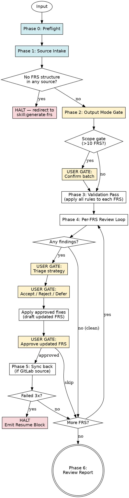

# Review FRS

Review FRS validates **existing** Functional Requirements Specifications against the canonical rule contract and produces a structured findings report — optionally with proposed fixes the user can accept, reject, or defer per finding. It works on GitLab issues (single or by milestone), pasted FRS content, or uploaded files, and — when the source is GitLab — can sync approved fixes back to the issue.

**This skill does NOT generate new FRS.** If your input is raw material (notes, code, briefs) and no FRS exists yet, use `skill:generate-frs`.

**Announce at start:** "I'm using the review-frs skill to validate your FRS against the canonical rule contract and produce findings with proposed fixes."

<HARD-GATE>
- Do NOT proceed past Phase 0 without `../references/FRS-VALIDATION-RULES.md` readable — it is the rule contract.
- Do NOT proceed past Phase 1 without `source_manifest` resolved — every input must be routed and loaded.
- If the input is NOT an existing FRS (no 17-section structure detected in any source), HALT and redirect to `skill:generate-frs`.
- Do NOT apply any fix to a GitLab issue without explicit per-finding or batch user approval.
- Do NOT continue past 3 total attempts (1 + 2 retries) on any single GitLab MCP call — halt the session and emit a resume block.
- Do NOT modify a skipped FRS, and do NOT sync changes for an FRS the user has not approved in Phase 4.
</HARD-GATE>

---

## Overview

Use this skill whenever an existing FRS needs to be validated — before sign-off, during QA, as part of a periodic audit, or after manual edits. It handles: preflight → load FRS from source(s) → run full validation pass → present findings by severity → per-finding disposition → apply approved fixes → sync back (if GitLab source) → emit report.

**Prerequisites:**
- `../references/FRS-VALIDATION-RULES.md` must exist — the canonical rule contract.
- `../references/FRS-TEMPLATE.md` must exist — for structure comparison.
- If source is a GitLab issue or milestone: `CLAUDE.md` must contain `gitlab_project_id`, and a GitLab MCP connection must be available.
- If source is a paste or file only: GitLab MCP is not required.

**Expected outcome:** A Review Report listing each FRS reviewed, its findings by severity (Blocker / Major / Minor), each finding's disposition, and — for any approved fixes — updated content synced back to GitLab or emitted as a corrected file / inline FRS.

**Core principle:** This skill validates WHAT the FRS says against the rule contract; it does not second-guess the business decisions behind the FRS. Rules that are unclear become findings, not rewrites.

---

## When to Use

**Use when:**
- User asks to review, audit, validate, lint, or check an FRS
- User pastes an FRS and asks "is this correct?" / "any issues?"
- User points at a GitLab issue and asks for feedback
- User wants to bulk-validate all FRS under a milestone
- User uploads an FRS file (`.md`, `.docx`, `.pdf`) for validation
- User says "fix this FRS" where a draft already exists

### Supported Source Types

| Source | How it's provided | Handling |
|---|---|---|
| GitLab issue | Issue ID (`#42`), issue URL, or explicit reference | Fetch via GitLab MCP; parse description as FRS |
| GitLab milestone | Milestone ID, milestone URL, or name | Fetch all issues under it; filter to those with FRS titles (`FRS-[INITIALS]-NN: …`); review each |
| Pasted FRS | Pasted text in chat | Parse in place |
| Uploaded `.md` / `.txt` | File at `/mnt/user-data/uploads/` | Read directly |
| Uploaded `.docx` | File at `/mnt/user-data/uploads/` | Route through `skill:docx` for text extraction |
| Uploaded `.pdf` | File at `/mnt/user-data/uploads/` | Route through `skill:pdf-reading` for text extraction |
| Mixed sources | Any combination | Reviewed independently; report groups findings per FRS |

**Do NOT use when:**
- Input is raw material (notes, code, briefs) with no existing FRS → use `skill:generate-frs`
- User wants to generate user stories or test cases from an FRS → downstream skill
- User wants to compare two versions / diff FRS → not yet supported; review each independently

---

## Checklist

You MUST complete these in order:

0. **Preflight** — verify validation rules file, template, GitLab MCP if needed
1. **Source Intake** — classify source(s), load all FRS content, confirm existing-FRS redirect is NOT needed
2. **Output Mode Gate** — ask whether the user wants report-only or report-with-fixes (once)
3. **Validation Pass** — apply every rule from `FRS-VALIDATION-RULES.md` against each FRS; collect findings by severity
4. **Per-FRS Review Loop** — present findings; get dispositions (accept / reject / defer); apply approved fixes; get final FRS approval
5. **Sync Back** (if GitLab source + fixes approved) — update issues idempotently
6. **Final Output** — Review Report — or Halt Resume block if interrupted

---

## Process Flow



**Terminal states:** Review Report (normal), Halt Resume Block (interrupted on GitLab call), or Redirect (no FRS structure detected → generate-frs).

---

## The Process

### Phase 0 — Preflight

**0a. Validation rules exist.** `../references/FRS-VALIDATION-RULES.md` readable. Missing → halt: *"Validation rules not found. This file is the shared contract for generate-frs and review-frs and is required for validation."*

**0b. Template exists.** `../references/FRS-TEMPLATE.md` readable. Missing → halt: *"FRS template not found. The 17-section structure in this file is the reference for structural validation."*

**0c. GitLab prerequisites (conditional).** If the user references a GitLab issue, milestone, or asks to sync fixes back:
- Read `gitlab_project_id` from `CLAUDE.md`. If absent → ask the user once.
- Verify GitLab MCP connectivity. If absent → halt with the standard MCP-unavailable message.

If the input is only paste / uploaded files and no GitLab is involved, skip 0c.

### Phase 1 — Source Intake

**1a. Detect sources.** Same classifier as `generate-frs` Phase 1a, but looking for FRS content rather than raw material.

Inspect:
- GitLab references (issue IDs like `#42`, URLs, milestone names) mentioned in the prompt
- Files at `/mnt/user-data/uploads/`
- Pasted text — check for 17-section FRS structure

**1b. Load each source.**

| Source | Action |
|---|---|
| GitLab issue ID / URL | Fetch via MCP (common tool names: `get_issue`, `gitlab_get_issue`) — pull title + description |
| GitLab milestone ID / URL / name | Fetch all open issues under the milestone; filter to those matching FRS title pattern `FRS-[A-Z]+-\d+: .+`; load each |
| Pasted FRS | Use the paste content directly |
| Uploaded `.md` / `.txt` | `view` the file |
| Uploaded `.docx` | Route through `skill:docx` |
| Uploaded `.pdf` | Route through `skill:pdf-reading` |

Store each loaded FRS as `{id, source_type, source_ref, content}` where `id` is either the GitLab issue ID or a generated local ID (`LOCAL-01`, `LOCAL-02`, …) for non-GitLab sources.

**1c. Existing-FRS guard.** For every loaded source, verify it has the 17-section structure (at least the first few sequential section headers — Purpose, Scope, Actors — must be present). If **no** loaded source contains FRS structure, HALT and redirect:

> *"None of the provided sources appears to be an existing FRS. Did you want to GENERATE a new FRS from this material? Use `skill:generate-frs`."*
> *Options:*
> *(a) Switch to `generate-frs`*
> *(b) Try harder — treat a specific source as FRS anyway (say which)*
> *(c) Cancel"*

If **some** sources have FRS structure and others don't: flag non-FRS sources in the report as *"Not recognised as FRS — skipped"*, and proceed with the FRS-structured ones.

**1d. Scope gate.** If more than **10 FRS** are loaded, pause: *"You've asked me to review {N} FRS. That's a large batch — would you like to proceed with all, or scope down (e.g., just this milestone's blockers)?"* Wait for the user's answer.

**Verify:** `fr_set` contains ≥1 FRS with structure; every FRS has `{id, source_type, source_ref, content}`.

### Phase 2 — Output Mode Gate

Ask once, with `ask_user_input_v0`:

> *"How would you like me to handle findings?"*
> - *Report only — list findings, no fixes drafted*
> - *Report + proposed fixes (interactive) — review fixes per finding*
> - *Report + auto-apply non-blocker fixes — accept all Minor/Major fixes without asking, surface Blockers for confirmation*

Store as `output_mode`. This gates the behaviour of Phase 4.

### Phase 3 — Validation Pass

For every FRS in `fr_set`, apply every rule from `../references/FRS-VALIDATION-RULES.md`:

1. **Structure check** — 17 sections present, in order, no disallowed emptiness.
2. **Skill Constraint** — count business rules, edge cases, exception flows.
3. **Self-Review Checklist** — 11 questions.
4. **Domain-Expert Enforcement** — cross-module leakage, technical-detail leakage, dangling FRS-IDs, NFR rubric, bundled operations.
5. **NFR Rubric** — every NFR classified as business-language or technical-in-disguise.
6. **Dependencies contract** — both categories present, "None" stated when empty.

Every violation becomes a Finding:

```
Finding {N}:
  Rule        : <rule name, e.g., "NFR Rubric">
  Severity    : Blocker | Major | Minor
  Section     : {section number + name}
  Current     : <excerpt of the offending content, or "[missing]">
  Issue       : <one-sentence explanation of the violation>
  Recommended : <proposed fix in business language, or "[remove / rewrite required]">
```

Collect all findings per FRS. **Do not present yet.**

**Verify:** Every FRS has a complete findings list (may be empty for a clean FRS).

### Phase 4 — Per-FRS Review Loop

For every FRS in `fr_set`:

**Step A — Summary view.** Show:

```
FRS-UM-01: Register User  (source: GitLab issue #42)

Findings:
  Blockers : 2
  Majors   : 3
  Minors   : 1
```

If **0 findings** → mark as clean; proceed to next FRS.

**Step B — Triage gate.** Use `ask_user_input_v0`:

> *"How do you want to handle findings for {FRS_ID}?"*
> - *Walk through each finding*
> - *Accept all proposed fixes*
> - *Accept Blockers only, ignore Major/Minor*
> - *Skip this FRS (leave as-is)*

Behaviour:
- **Walk through each** → Step C.
- **Accept all / Accept Blockers only** → skip Step C, jump to Step D with the relevant findings auto-accepted.
- **Skip FRS** → jump to next FRS; record as `skipped`.

**Step C — Per-finding disposition (interactive mode).** For each finding in severity order (Blockers → Majors → Minors), present:

```
Finding {N} of {M}  ({Severity})
Rule     : <rule name>
Section  : {section}
Current  : <excerpt>
Issue    : <explanation>
Suggestion:
  <proposed fix content>
```

Use `ask_user_input_v0`:
> *"How should I handle this finding?"*
> - *Accept the suggested fix*
> - *Reject (dismiss — leave current content)*
> - *Defer (keep finding noted, no fix now)*
> - *Edit (let me rewrite the fix)*

Record per-finding disposition.

**Step D — Apply accepted fixes.** Draft an updated FRS with every Accept applied. Re-run the full Validation Pass on the updated FRS:
- New violations introduced by fixes? → surface them as secondary findings; loop back to Step C for those.
- Clean? → proceed to Step E.

**Cap: 3 re-validation passes per FRS** to prevent infinite loops. After 3, present the current state with remaining findings flagged and ask the user to decide: *"Further changes introduced new issues. Accept the current state with remaining findings noted?"*

**Step E — Final FRS approval gate.** Show the updated FRS (with all accepted fixes integrated). Use `ask_user_input_v0`:
> *"Approve this updated FRS?"*
> - *Approve*
> - *Reject (discard fixes, keep original)*
> - *Skip sync (approve content, but don't write back to source)*

**On Approve:** queue for Phase 5 sync.
**On Reject:** record as `fixes_rejected`; no sync.
**On Skip sync:** record as `approved_no_sync`; emit updated content in the Final Report but do not touch the source.

**Verify:** Every FRS has a recorded disposition (`clean` / `approved` / `approved_no_sync` / `fixes_rejected` / `skipped`).

### Phase 5 — Sync Back (GitLab sources only)

For every FRS with disposition `approved` and `source_type == gitlab_issue`:

1. **Idempotency sanity check.** Re-fetch the issue by its ID; confirm it still exists and has the expected title.
2. **Update.** Use MCP issue-update tool (common names: `update_issue`, `gitlab_update_issue`):
   - `project_id`: `gitlab_project_id`
   - `issue_id`: `<stored issue_id>`
   - `description`: `<updated FRS content, in memory>`
   - `labels`: preserve existing labels; add/remove per these rules:
     - If Section 16 now has zero deferred Open Questions → **remove** `Discussion` if present.
     - If Section 16 still has deferred Open Questions → **keep** `Discussion`.
     - Never add a label outside the approved project list (see `generate-frs` for the list).
3. **Record** `(FRS_ID → issue_id, updated)`.

For FRS with `source_type != gitlab_issue` and disposition `approved`:
- **File source** → write the corrected FRS to `/mnt/user-data/outputs/<original-filename>.reviewed.md` and include in Final Output via `present_files`.
- **Paste source** → emit the corrected FRS inline in the Final Report.

### Retry Policy (same as generate-frs)

- **Scope:** Per-call. Each fetch, each update gets its own 2-retry budget (3 total attempts).
- **On exhaustion:** Halt the session. Emit Resume Block.

### Phase 6 — Final Output (Review Report)

```
=== FRS REVIEW REPORT ===

Scope              : {N} FRS reviewed
Sources            : {G GitLab issues, F files, P paste}
Output mode        : <mode chosen>

Per-FRS results:
  FRS-UM-01  Register User  (issue #42)
    Blockers: 2  Majors: 3  Minors: 1
    Disposition: approved — 5 fixes applied, 1 deferred
    Synced: issue #42 updated
  FRS-UM-02  View Users  (issue #43)
    Blockers: 0  Majors: 0  Minors: 0
    Disposition: clean
  FRS-UM-03  Delete User  (paste)
    Blockers: 1  Majors: 2  Minors: 0
    Disposition: approved_no_sync — corrected FRS emitted inline
  LOCAL-01  from draft.docx
    Not recognised as FRS — skipped

Totals:
  Clean                   : {N}
  Fixed & synced          : {N}
  Fixed & emitted         : {N}
  Fixes rejected          : {N}
  Skipped                 : {N}
  Non-FRS sources skipped : {N}

Deferred findings        : {N}   (kept in Section 16 as open questions)
Blockers still unresolved: {N}   (in fixes_rejected or skipped FRS)
```

**Verify before declaring done:**
- Every loaded FRS has a disposition.
- Every `approved` GitLab-sourced FRS has exactly one `update_issue` call recorded.
- No label outside the approved list was applied.
- No FRS was modified without explicit user approval.
- Every deferred finding is preserved in the updated FRS's Section 16 with the `[deferred — pending wiki resolution]` marker.

---

## Handling Outcomes

**ACCEPT (per finding)** — Apply the proposed fix inline. Re-validate after all accepts.

**REJECT (per finding)** — Leave current content. Record the rejection in the report; the finding is noted but not carried forward as a deferred item.

**DEFER (per finding)** — Leave current content. Add the finding to Section 16 (Open Questions) with marker `[deferred from review — pending wiki resolution]`. This couples with the planned `skill:llm-wiki-query` sub-agent.

**EDIT (per finding)** — Ask the user to provide the corrected text; apply it. Re-validate.

**SKIP FRS** — No fixes drafted, no changes applied, no sync. Recorded in report.

**APPROVE (final FRS)** — Proceed to Phase 5 sync (or emit for non-GitLab sources).

**REJECT (final FRS)** — Discard all drafted fixes; record `fixes_rejected`. No sync.

**APPROVE_NO_SYNC (final FRS)** — Keep fixes in the Final Output but do not write to the source.

**GITLAB SYNC FAIL** — Retry up to 2 more times (3 total per call). On exhaustion, halt and emit Resume Block.

**NEW VIOLATIONS AFTER FIX** — Surface as secondary findings; loop back through Step C. Cap at 3 re-validation passes.

**ABORT MID-SESSION** — Stop immediately. Any GitLab issues already updated persist; inform the user. Emit a truncated report.

---

## Validation Rules

This skill enforces `../references/FRS-VALIDATION-RULES.md` as the canonical contract. The rules are NOT mirrored inline here — read the file directly during validation to ensure you're applying the current contract. The skill's role is to apply those rules mechanically, one per structural and semantic check, and classify each violation by the severity guide in that file.

**When rules change, update the rules file first.** This skill will read it fresh each invocation.

---

## Halt — Resume Block Format

```
=== SKILL HALT — GitLab MCP Unavailable ===

Halt reason   : <e.g., "Issue update for FRS-UM-02 failed after 3 attempts: <e>">
Halt point    : <Phase name, e.g., "Phase 5 — Sync back, FRS-UM-02">
GitLab project: #{gitlab_project_id}

FRS reviewed so far:
  FRS-UM-01  Register User  (issue #42)  approved — SYNCED
  FRS-UM-02  View Users     (issue #43)  approved — SYNC FAILED (halt point)
  FRS-UM-03  Delete User    (issue #44)  pending review

Dispositions queued for sync:
  FRS-UM-02 — approved, not yet synced (halt point)

Last action: <specific MCP call that failed>
Last error : <error surface from MCP server>

Resume instructions:
  1. Reconnect the GitLab MCP server (or verify it is reachable).
  2. Start a new Claude session and paste this entire Halt block as context.
  3. Re-invoke the review-frs skill — it will re-load the FRS, re-apply queued
     fixes, and sync from FRS-UM-02 onward. Already-synced items are re-checked
     idempotently (re-fetch + content compare) and skipped if unchanged.
```

---

## User Gates — Where They Fire

**Gates:**
1. Missing project ID (Phase 0c, GitLab involved + `CLAUDE.md` lacks ID).
2. Redirect-to-generate (Phase 1c, no FRS structure in any source).
3. Scope gate (Phase 1d, >10 FRS loaded).
4. Output mode (Phase 2, once per session).
5. Triage strategy (Phase 4 Step B, per FRS).
6. Per-finding disposition (Phase 4 Step C, per finding, in interactive mode).
7. Final FRS approval (Phase 4 Step E, per FRS).
8. Re-validation cap fallback (Phase 4 Step D, after 3 passes with new violations).

**No gates for:** source loading, validation-pass execution, clean-FRS handling (no findings → no prompt).

---

## Common Mistakes

**❌ Reviewing raw material (notes, briefs, code) as if it were an FRS.**
**✅ Phase 1c guard — if no source has 17-section structure, redirect to `generate-frs`.**

**❌ Applying fixes without presenting them to the user first.**
**✅ Every fix goes through Phase 4 Step C (interactive) or the explicit Triage gate's batch option.**

**❌ Silently modifying a GitLab issue.**
**✅ Explicit final-approval gate (Step E) before Phase 5 sync.**

**❌ Re-running the validation loop forever when fixes create new issues.**
**✅ Cap at 3 re-validation passes; ask the user to decide at the cap.**

**❌ Adding labels outside the approved project list during sync.**
**✅ Only adjust `Discussion` / `Deferred` per the rules; preserve everything else.**

**❌ Replacing user language with paraphrased "corrections" when the original is actually fine.**
**✅ A Finding requires an actual rule violation. "Could be clearer" is not a Minor — it's a non-finding.**

**❌ Deferring a Blocker.**
**✅ Blockers must be resolved (accepted or user-rewritten) before an `approved` disposition. If the user truly wants to defer a Blocker, they must choose `Skip FRS` — the FRS is not approved.**

**❌ Treating a GitLab sync failure as "approved anyway".**
**✅ Halt with Resume Block on 3 failures. Never record approved-but-synced-later silently.**

---

## Red Flags

**Never:**
- Proceed past Phase 0 without the validation rules file.
- Skip Phase 1c — always confirm the source is an FRS before validating it.
- Apply fixes without explicit user approval (per-finding or batch).
- Sync a non-approved FRS to GitLab.
- Defer or silently accept a Blocker — Blockers require explicit resolution.
- Paraphrase the user's content as a "fix" without a matching rule violation.
- Introduce new Blockers through fixes without surfacing them.
- Continue past 3 re-validation passes per FRS.
- Continue past 3 failed GitLab attempts on any call.
- Modify labels outside the approved project list.
- Strip deferred open questions from Section 16 during fixes — defer markers are preserved.

**If the user responds ambiguously at a gate:** re-present with clarifying options. Do not assume. Do not advance.

**If GitLab sync fails:** retry up to 2 more times (3 total per call). On exhaustion, halt and emit Resume Block. Issues already synced remain synced.

---

## Integration

**Required before:** An FRS exists somewhere — a GitLab issue, a pasted draft, or an uploaded file. For GitLab sources: `CLAUDE.md` contains `gitlab_project_id` and GitLab MCP is connected.

**Required after:** Stakeholder sign-off on the updated FRS for any fixes synced back.

**References:**
- `../references/FRS-VALIDATION-RULES.md` — canonical validation contract, shared with `skill:generate-frs`. **Read fresh on every invocation.**
- `../references/FRS-TEMPLATE.md` — the 17-section reference structure.

**Companion skills:**
- **`skill:generate-frs`** — for generating NEW FRS from source material (prose, code, notes, uploaded files). If no FRS exists yet, use that skill.
- **`skill:llm-wiki-query`** (planned) — will consume deferred Open Questions (from this skill's DEFER disposition) and auto-resolve them.

**Alternative workflows:**
- `skill:tech-spec-review` (if it exists) — when reviewing implementation design rather than business requirements.
- Manual review — appropriate for FRS that fall outside the rule contract (e.g., experimental formats), but this skill is the default for any FRS that follows the 17-section structure.
