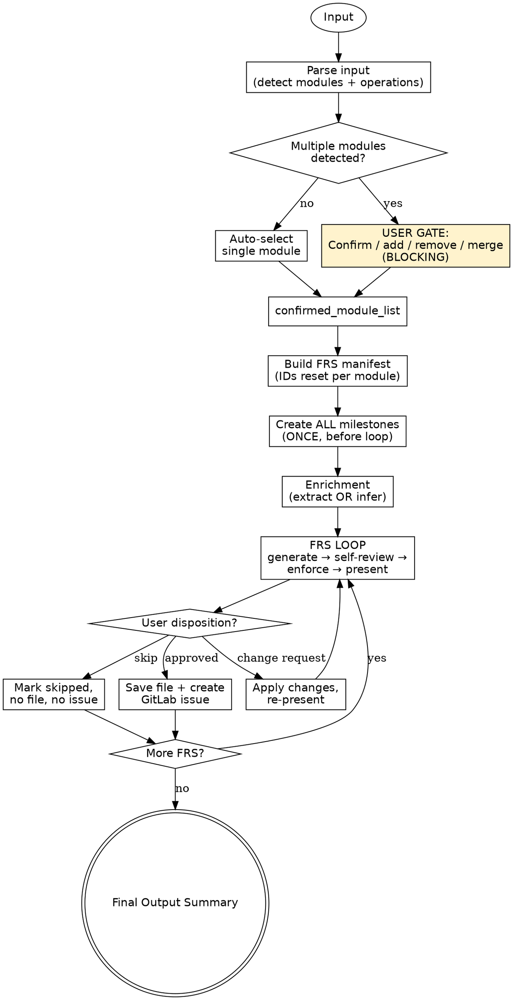

# Generate FRS

Generate FRS turns rough product input — meeting notes, feature ideas, or full briefs — into approved, business-language Functional Requirements Specifications, one per business operation, organised under GitLab milestones per module. Every FRS is gated through module confirmation, self-review, domain-expert enforcement, and a per-FRS user disposition before anything is saved or synced.

**Announce at start:** "I'm using the generate-frs skill to parse your input into modules, generate business-language FRS documents, and sync approved specs to GitLab."

<HARD-GATE>
- Do NOT generate any FRS until `confirmed_module_list` is resolved. This applies even when the input appears unambiguous — a single-looking input may still contain multiple modules.
- Do NOT create GitLab milestones inside the FRS generation loop. ALL milestones are created ONCE, before the loop begins.
- Do NOT sync a skipped FRS to GitLab under any circumstances. Skipped means no file, no issue, no trace.
- Do NOT present an FRS to the user until Self-Review Checklist AND Domain-Expert Enforcement have both passed. "Close enough" is not done.
</HARD-GATE>

---

## Overview

Use this skill whenever business operations need to be captured as traceable, testable, business-language requirements. It handles the full lifecycle: parse input → detect modules → build FRS manifest → create milestones once → generate each FRS with automatic enrichment → present each for approval → sync approved ones to GitLab → emit a summary.

**Prerequisites:** Access to the FRS template (`references/FRS-TEMPLATE.md`). A GitLab MCP connection is optional — without it, FRS files are still generated and saved, but milestones and issues are recorded as `unsynced` in the Final Output for later sync.

**Expected outcome:** One FRS file per approved business operation (`<module-slug>/frs-[MODULE-INITIALS]-[ID]-<operation-slug>.md`), one GitLab milestone per module, one GitLab issue per approved FRS linked to its milestone, and a final summary table mapping FRS → issue IDs.

**Core principle:** FRS describes WHAT the business needs — never HOW it is built. All language must be actor-facing, outcome-oriented, and free of any technical implementation detail. If a sentence could appear in a database schema, an API contract, or a deployment guide, it does not belong in an FRS.

---

## Anti-Pattern: "This FRS Is Simple Enough To Skip The Constraint"

You will be tempted — on small, obvious operations like "log out" or "view profile" — to produce an FRS with one business rule, one edge case, or no exception flow, because the operation "doesn't really need" more. This framing fails every time. The Skill Constraint is a baseline guarantee, not an enrichment target. Simple operations still have unstated policy rules (session timeout behaviour, audit retention, concurrent-session handling) and edge cases (logout while a request is in flight, logout on a revoked token). Infer them. Every FRS meets ≥2 business rules, ≥2 edge cases, ≥1 exception flow — without exception.

---

## When to Use

**Use when:**
- User asks to write, generate, or document functional requirements
- User wants a product / feature / system broken into modules or milestones
- User has meeting notes, user stories, or a feature brief to formalise
- User wants GitLab milestones and issues created from requirements
- User uses the words "FRS", "BRS", "business requirements", "spec doc", "requirements document"
- Input is rough or incomplete — the skill infers structure when nothing formal is provided

**Do NOT use when:**
- User wants a technical design document or architecture diagram — use a tech-spec skill instead
- User wants a test plan or QA checklist — FRS is input to testing, not the test plan itself
- User wants Agile user stories only — though you may offer FRS → user stories conversion after generation

---

## Checklist

You MUST complete these in order:

1. Parse input → detect modules and business operations → resolve `confirmed_module_list` (gate on ambiguity)
2. Build FRS manifest (IDs reset per module) and present it for visibility
3. Create ALL GitLab milestones — one per module — before the loop begins
4. Run enrichment: extract rules from input, or infer via Skill Constraint when nothing is provided
5. For each FRS: generate → self-review → enforce → present → record disposition → sync if approved
6. Emit Final Output summary (milestones, FRS → issue map, counters)

---

## Process Flow



**The terminal state is the Final Output Summary.** Do NOT continue into implementation, user stories, or test cases — those are separate downstream skills.

---

## The Process

### 1. Parse & Module Resolution

Scan the input for distinct business domains — these become modules (= milestones). Extract each business operation per module — these become individual FRS documents. Rank candidate modules by relevance / frequency in the input.

If a single module is detected, auto-select and proceed without a gate. If multiple modules are detected, trigger the BLOCKING user gate:

```
Modules detected:

1. <Module A>
2. <Module B>
3. <Module C>

Confirm, or add / remove / merge.
```

**Verify:** `confirmed_module_list` exists and is non-empty before advancing.
**On failure:** If the user's response is ambiguous, re-present with clarifying options. Do not guess.

### 2. FRS Manifest & Milestone Creation

Expand each confirmed module into its business operations. Assign FRS IDs — reset per module: `FRS-[MODULE-INITIALS]-01`, `FRS-[MODULE-INITIALS]-02`, … where module initials = uppercased first letter of each word in the module name (`User Management` → `UM`, `Trade Finance` → `TF`).

Derive kebab-case file path per FRS: `<module-slug>/frs-[MODULE-INITIALS]-[ID]-<operation-slug>.md` (e.g. `user-management/frs-UM-01-register-user.md`).

Set all statuses to `pending-approval`. Present the full manifest to the user for visibility (non-blocking). Run the GitLab connectivity check (see GitLab Sync — Execution) and create one milestone per module, storing `(module → milestone_id)`.

**Verify:** Every module in `confirmed_module_list` has exactly one milestone_id recorded.
**On failure:** If milestone creation fails for any module, halt the loop and surface the error. Do NOT proceed to Phase 4 with partial milestones.

### 3. Enrichment

If meeting notes or business rules were provided, extract each rule and tag it to its module, building `enrichment_map: module → [rules]`. If nothing was provided, infer business constraints, policy rules, and user-facing outcomes from the broader context using the Skill Constraint as a floor.

**Verify:** Enrichment produced a mapping (even if inferred) for every confirmed module.
**On failure:** Never block on missing enrichment — infer. Enrichment is a feed into Phase 4, not a gate.

### 4. FRS Generation Loop

For every module, for every FRS in that module:

**Step A — Generate.** Draft the full FRS internally using `references/FRS-TEMPLATE.md`. Use business language throughout, scoped to the locked module.

**Step B — Self-Review Checklist** (internal, before presenting):
- Covers exactly one business operation?
- All requirements testable by a business stakeholder?
- Zero technical / implementation details?
- Exception flows cover: invalid input, unauthorised access, failure / non-completion?
- Postconditions stated as business outcomes (not system states)?
- Skill Constraint met: ≥2 business rules, ≥2 edge cases, ≥1 exception flow?
- Dependencies (Section 5) documents BOTH inter-FRS and system dependencies?
- All referenced FRS IDs exist in the confirmed module list or approved modules?

If any item fails → refine inline → re-run the full checklist before advancing.

**Step C — Domain-Expert Enforcement** (internal, before presenting):
- All actors belong to the locked module?
- All business rules scoped to the locked module?
- No cross-module logic present?
- Outcomes affect only this module's scope?

If any violation → strip offending content → rewrite in scope → re-enforce. See the Domain-Expert Enforcement Reference below.

**Step D — Present to User.** Show the FRS and await disposition. Outcomes are handled per the *Handling Outcomes* section.

**Verify:** Each FRS has a recorded disposition (approved / change request resolved / skipped) before moving to the next.
**On failure:** Never advance past an unresolved FRS. If a change request loops more than twice, ask the user to clarify the intended change rather than guessing.

### 5. Final Output

Emit the summary after the loop completes:

```
Milestones:
  <Module A>  →  #M1
  <Module B>  →  #M2   (unsynced — no GitLab MCP)

FRS Issues:
  <Module A>:
    FRS-UM-01  <operation>  →  #<issue_id>
    FRS-UM-02  <operation>  →  #<issue_id>
    FRS-UM-03  <operation>  →  skipped
    FRS-UM-04  <operation>  →  unsynced (sync failed)

  <Module B>:
    FRS-IC-01  <operation>  →  #<issue_id>

Bundle ID      : FRS-BUNDLE-{YYYYMMDD}-001
Total FRS docs : {N} across {M} modules
Milestones     : {M}
Saved          : {N}
Skipped        : {N}
Issues created : {N}
Unsynced       : {N}
Business Rules : {N}
Edge Cases     : {N}
Open Questions : {N}
```

**Verify before declaring done:**
- Every approved FRS that synced has exactly one GitLab issue — no duplicates, no orphans.
- Every FRS contains ≥2 business rules, ≥2 edge cases, ≥1 exception flow.
- No FRS contains technical implementation detail.
- Every FRS is locked to exactly one module.
- Module list in the summary matches `confirmed_module_list` exactly.
- Skipped FRS have no saved file and no GitLab issue.
- Unsynced FRS have a saved file but no GitLab issue — and are explicitly listed in the summary.

---

## Handling Outcomes

**APPROVED** — Save file. Create GitLab issue under the module's milestone. Store `(FRS_title → issue_id)`. Proceed to the next FRS.

**CHANGE REQUEST** — Apply changes inline. Re-present the updated FRS. Await confirmation before proceeding. If the same FRS loops more than twice, ask for a clarifying statement of intent rather than iterating blindly.

**SKIPPED** — Mark as skipped. No file saved. No GitLab issue created. Proceed to the next FRS.

**CHECKLIST FAIL (internal)** — Never present. Refine inline → re-run the full checklist. Only advance once every item passes.

**ENFORCEMENT VIOLATION (internal)** — Strip offending content. Rewrite within locked module scope. Re-enforce before presenting. If stripping drops any section below Skill Constraint minimums, infer replacements within scope.

**GITLAB SYNC FAIL** — Inform the user of the failure with the MCP error surface. The file is already saved — never unsave it. Record the FRS as approved-but-unsynced, note it in Final Output, and continue with the next FRS. Do not retry the same call without a changed variable (e.g., MCP reconnection, different project ID).

---

## GitLab Sync — Execution

Run the connectivity check once at the start of Phase 2, before any sync operation.

### Connectivity Check (ONCE at Phase 2 start)

Check whether a GitLab MCP tool is available in the current session.

- **GitLab MCP connected** → proceed with sync as described below.
- **No GitLab MCP** → inform the user once: *"No GitLab MCP connection is available. I'll still generate and save FRS files, but milestones and issues will be recorded as approved-but-unsynced and you can sync them later by connecting a GitLab MCP server."* Then continue the skill with all sync steps skipped — every approved FRS is saved to disk and marked `unsynced` in the Final Output.

### Creating the milestone (Phase 2)

Use whichever milestone-creation tool the MCP server exposes (common names: `create_milestone`, `gitlab_create_milestone`). Pass:
- `title`: `"<Module Name>"`
- `description`: `"FRS milestone for <Module Name> module. Initials: [MODULE-INITIALS]"`

Store the returned `id` as `milestone_id` for the module.

### Creating the issue (Phase 4, on approval)

Use whichever issue-creation tool the MCP server exposes (common names: `create_issue`, `gitlab_create_issue`). Pass:
- `title`: `"FRS-[MODULE-INITIALS]-{ID}: {Business Operation Title}"`
- `description`: `<full FRS content read from saved file>`
- `milestone_id`: `<stored milestone_id>`
- `labels`: `["frs", "<module-name>", "pending-review"]`

Store the returned `iid` as `issue_id` for the FRS.

### When an MCP call fails mid-loop

Do not retry blindly. Record the FRS as approved-but-unsynced, note it in the Final Output, and continue with the next FRS. Never leave the loop in a partial-milestone state — if milestone creation fails in Phase 2, halt before the loop begins and surface the error to the user.

---

## FRS Document Structure

Every generated FRS follows `references/FRS-TEMPLATE.md` (17 sections):

Purpose → Scope → Actors → Preconditions → Dependencies → Trigger → Main Flow → Alternative Flows → Exception Flows → Postconditions → Form Fields → Functional Requirements → Non-Functional Requirements → Business Rules → Edge Cases → Open Questions → Revision History.

See the template for the complete section-by-section guidance.

---

## Skill Constraint (Enforced on Every FRS)

| Element | Minimum |
|---|---|
| Business rules | ≥ 2 |
| Edge cases | ≥ 2 |
| Exception flows | ≥ 1 |

Rules and edge cases must be business constraints or policy violations — not technical limits — stated in user-facing language, scoped to the locked module.

---

## Domain-Expert Enforcement Reference

| Violation | Action |
|---|---|
| Actor from a different module | Strip → replace with in-module actor |
| Business rule governing another module | Strip → rewrite to in-module scope |
| Cross-module outcome or dependency | Strip → restate as in-module postcondition |
| Any technical detail (DB, API, framework) | Strip → rewrite as business outcome |
| Inter-FRS dependency referencing non-existent FRS | Correct the FRS-ID to an approved FRS, or strip if invalid |
| Missing Dependencies section entirely | Add Section 5 with at least system dependencies; add inter-FRS if applicable |

If stripping leaves a section below Skill Constraint minimums → infer replacements within scope before re-presenting.

---

## Dependencies Section (FRS Section 5) — Inter-FRS vs Technical

Every FRS's Section 5 MUST document two categories. Never omit the section — if no inter-FRS dependency exists, state "None" explicitly.

**Inter-FRS Dependencies (Business):** Other FRS that must complete before this operation can proceed or make sense.

```
**Inter-FRS Dependencies:**
- **FRS-XX: [Operation Name]** — [why this FRS depends on FRS-XX]
  (Type: Upstream | Downstream | Parallel)
```

- **Upstream** — FRS-XX must complete first.
- **Downstream** — this FRS triggers FRS-XX on successful completion.
- **Parallel** — runs alongside FRS-XX (rare in user-facing operations).

Examples: FRS-02 (View Requests) depends on FRS-01 (Submit Request) — can't view what doesn't exist. FRS-05 (Delete Request) depends on FRS-02 (View Request) — must view before deleting.

**System & Technical Dependencies:** System capabilities, external approvals, or technical prerequisites.

```
**System & Technical Dependencies:**
- **Authentication & Authorization** — [what must be verified]
- **Entity Context** — [what data or access is required]
- [other system dependencies]
```

---

## User Gates — Where They Fire (and Where They Don't)

**Gates exist ONLY at:**
1. Module ambiguity resolution (Phase 1, multiple modules detected).
2. Per-FRS approve / change-request / skip (Phase 4, once per FRS).

**No gates for:** automatic generation steps, enrichment inference, milestone creation, Domain-Expert enforcement passes, self-review checklist runs.

---

## Common Mistakes

**❌ "The system shall store the user record in a PostgreSQL table"** — describes implementation.
**✅ "The system shall retain the registered user's details so they are available for future interactions."**

**❌ "The API will return a 404 if the user is not found"**
**✅ "If the requested record does not exist, the operation ends and the actor is informed that no matching record was found."**

**❌ Creating a milestone mid-loop** — risks duplicates and broken linkage.
**✅ Create all milestones once at the end of Phase 2, before Phase 4 begins.**

**❌ Presenting an FRS before self-review and enforcement** — wastes a user gate.
**✅ Run Self-Review → Domain-Expert Enforcement → fix → re-check BEFORE presenting.**

**❌ Asking the user to confirm enrichment rules mid-loop** — enrichment is not gated.
**✅ Surface inferred rules in the FRS text itself; let the user approve/change there.**

**❌ Generating FRS-02 before FRS-01 is fully resolved** — creates dangling dependencies.
**✅ Process FRS sequentially; record disposition before advancing.**

**❌ Dependencies section lists only system dependencies, omitting inter-FRS relationships.**
**✅ Section 5 MUST include both categories. "None" is valid for inter-FRS; silence is not.**

**❌ Referencing FRS-XX in Dependencies without confirming FRS-XX exists.**
**✅ Verify all referenced FRS IDs before presenting. If a dependency is on a future, unwritten operation, flag as Open Question.**

---

## Red Flags

**Never:**
- Include technical implementation detail in any FRS (DB, API, framework, infrastructure, or language references).
- Bundle multiple business operations into a single FRS — one operation, one FRS.
- Create more than one milestone per module.
- Skip the Skill Constraint because an operation "feels simple" — infer to meet the floor.
- Let cross-module actors, rules, or outcomes leak into a module-locked FRS.
- Advance past a failed checklist or enforcement violation by "rounding up".
- Sync a skipped FRS to GitLab under any circumstances.
- Reference a non-existent FRS ID in Section 5 — correct or strip, never leave dangling.
- Ask the user to confirm enrichment rules mid-loop — surface inferences in the FRS text.
- Proceed past a blocker by guessing — stop and ask.

**If the user responds ambiguously at a gate:**
- Re-present with clarifying options.
- Do not assume intent.
- Do not advance.

**If GitLab sync fails or no GitLab MCP is connected:**
- The FRS file is still saved — never unsave it.
- Record the FRS as approved-but-unsynced and note it in Final Output.
- Continue with the next FRS; never halt the loop on a sync error.
- Never retry blindly — change a variable (reconnect MCP, different project ID, different token) before re-attempting.

---

## Integration

**Required before:** User has an input artefact (notes, brief, user stories, or a product description) — however rough.
**Required after:** Stakeholder sign-off on approved FRS documents before any downstream skill consumes them.
**Subagents should use:** `references/FRS-TEMPLATE.md` — the 17-section structure for every generated FRS.
**Alternative workflow:** `skill:tech-spec` — when the user needs implementation design rather than business requirements; `skill:user-story-generator` — when Agile user stories are the desired output instead of FRS.