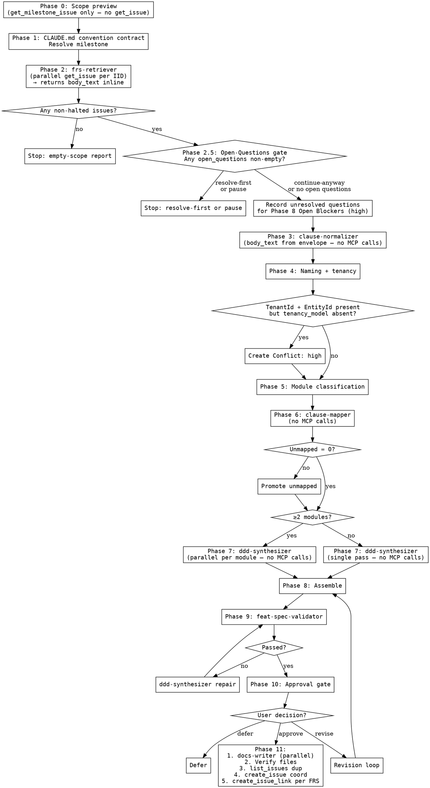

# Generate Feat Spec

**Announce at start:** "I'm using the generate-feat-spec skill to produce a high-level ABP/DDD Feature Specification from the GitLab milestone FRS issues. I'll write the spec and supporting DDD node pages to the wiki repo first, then create a short coordination issue in GitLab that links to them."

<HARD-GATE>
- Do not write any wiki files, create any GitLab artifact, or link any FRS issues until the user explicitly approves the preview.
- Do not include code, pseudocode, method bodies, C# class declarations, EF mappings, or any code fences (```) anywhere in the Feat Spec or DDD node pages. ABP base class and interface names are permitted only as labeled field values in entries (e.g., `**Base class:** FullAuditedAggregateRoot<Guid>`), never inside code fences and never with `public class ... { ... }` syntax.
- Do not read from, reference, or include content sourced from the GitLab wiki as FRS input. Output wiki links pointing to wiki pages generated by this skill are permitted.
- Do not invent domain objects without a direct FRS source.
- Do not modify, append to, or alter any FRS issue in GitLab for any reason — FRS issues are read-only inputs.
- Do not duplicate an ABP built-in entity (see `references/abp-built-in-entities.md`) as a synthesized Entity node.
- Never ask questions as prose — always use the `AskUserQuestion` tool. If `AskUserQuestion` is unavailable, fall back to a prose question prefixed with "⚠ AskUserQuestion unavailable — asking as prose:". Do NOT silently stop under any circumstance — always surface a user-facing message before halting.
- `clause-normalizer`, `clause-mapper`, and `ddd-synthesizer` are **not permitted** to call any GitLab MCP tool. All issue content must arrive via the input envelope from the main agent.
- The main agent MUST NOT call `get_issue` or `list_issue_links` at any phase. These tools are exclusively owned by `frs-retriever`.
</HARD-GATE>

---

## Overview

This skill generates a layered, ABP-shaped Feature Specification from one or more FRS issues belonging to a single GitLab milestone. The Feat Spec is produced as a set of Markdown pages in the wiki repo, not as the body of a GitLab issue. The GitLab Feat Spec issue is a short coordination artifact that points to the wiki and lists the linked FRS IIDs — nothing more.

The skill reads project context from CLAUDE.md (including ABP layout, library choices, and API routing conventions), uses GitLab MCP tools to resolve milestones and hydrate issues, classifies each issue by source type, runs a monolith detection check before normalization, and maps every requirement clause into a formal DDD/ABP category. Queries are treated as a first-class node type, separate from Commands. UI-related clauses are captured in a dedicated UI-API Integration Points section for the prototype-to-backend contract. Critical blockers are surfaced at the top of the assembled spec. The draft is validated before preview and only formalized — wiki files written, Feat Spec issue created, FRS issues linked — after explicit user approval.

Heavy phases are delegated to purpose sub-agents at the I/O boundary. Retrieval, synthesis, and file writing support parallel dispatch to minimize wall-clock time. See **Parallel Dispatch** section.

---

## Core Principle

**Every FRS clause must map to exactly one primary Feat Spec section or be escalated to Conflicts — no clause may remain as loose narrative.**

- GitLab FRS clause content is the canonical source of truth for requirement meaning.
- CLAUDE.md is the authoritative source of project conventions — module layout, library choices, API routing, naming patterns, permissions class location. Synthesis must honor every convention CLAUDE.md declares; deviations require a Decision node.
- Ambiguity is preserved in Conflicts, never silently resolved.
- UI clauses are routed to the UI-API Integration Points section (not discarded), which captures the prototype-to-backend contract.
- The approval gate is non-negotiable before any create, link, or file-write side effect.
- FRS issues are strictly read-only.
- The wiki is the canonical home of the spec. The GitLab issue is a pointer, not a duplicate.
- ABP built-in entities are referenced, never re-synthesized.
- Clause sources are deep-linked into GitLab issues via auto-generated section anchors — no opaque clause IDs appear in the published output.

---

## Phase Status Announcements (Required)

Before dispatching each phase, the main agent MUST emit a one-line status message:

```
→ Phase <N>: <action description> — dispatching <sub-agent name or 'main agent'>...
```

After each phase completes, emit a completion summary:

```
✓ Phase <N> complete. <brief result summary>
```

This applies to every phase including repair loops. Silent transitions between phases are not permitted. If a sub-agent is interrupted or returns no output, do NOT silently stop — emit a failure message and invoke `AskUserQuestion`:

> Sub-agent `<name>` did not complete in Phase `<N>`. How do you want to proceed?

Options: `retry` / `skip-and-continue (surface as high-severity blocker)` / `cancel`

---

## Sub-agent Failure Handling

If any dispatched sub-agent is interrupted, times out, or returns empty output:

1. Emit: `⚠ Phase <N> — sub-agent <name> failed or was interrupted.`
2. Do NOT silently stop or proceed with partial data.
3. Invoke `AskUserQuestion` with `retry / skip-and-continue / cancel` options.
4. On `skip-and-continue`: record the failure as a high-severity Open Blocker and continue with remaining phases where possible.
5. On `retry`: re-dispatch the same sub-agent with the same input envelope.
6. On `cancel`: emit a final status summary of completed phases and stop.

---

## CLAUDE.md Convention Contract

The skill reads the following fields from CLAUDE.md. **Required** fields block Phase 0 (via `AskUserQuestion`) if missing; **optional** fields have sensible defaults.

| Field | Required | Default | Used by |
|---|---|---|---|
| `gitlab_project_id` | yes | — | All GitLab MCP calls |
| `gitlab_base_url` | yes | — | Deep-link generation for clause sources |
| `wiki_url` | yes | — | Canonical spec URL and all wiki-style links |
| `wiki_local_path` | no | `docs` | On-disk location for wiki file writes |
| `tenancy_model` | recommended | — | Multi-tenancy resolution in Phase 4 |
| `project_root_namespace` | no | derived from project name | ABP Artifact Map namespaces |
| `module_project_layout` | no | ABP defaults | Paths for Domain, Application, EF Core projects |
| `api_routing_conventions` | no | `/api/app/...` (ABP default) | HTTP API section; Public/Private split if declared |
| `validation_library` | no | `FluentValidation` | Command validator synthesis |
| `object_mapping_library` | no | `Mapperly` | Object Mapping section |
| `permissions_class` | no | `<Module>Permissions` | Permissions Map pattern |
| `db_table_prefix` | no | `App` | Infrastructure table names |
| `sorting_strategy` | no | `explicit-switch` | Query entries; bans `System.Linq.Dynamic.Core` |
| `enum_serialization` | no | `camelCase strings, global` | State storage notes; DTO enum notes |
| `notable_gotchas` | no | — | Passed verbatim to `ddd-synthesizer` as context |

**Public/Private AppService split** — when `api_routing_conventions` declares:

```
api_routing_conventions:
  public_prefix: /api/public/app/...   # Customer-facing
  private_prefix: /api/private/app/... # Backoffice
```

…every Command and Query must be tagged `**Audience:** Public | Private` based on the invoking Actor, and route generation uses the appropriate prefix.

If CLAUDE.md does not declare an optional convention, Phase 1 emits a one-time soft warning listing the defaults being used.

---

## Wiki Link Format

Links to the wiki use **full GitLab wiki URLs**. The wiki's path on disk (`wiki_local_path`) is separate from its published URL (`wiki_url`).

| Context | Link format |
|---|---|
| Feat Spec → DDD node page | `[<node name>](<wiki_url>/<node-type>/<NodeName>)` |
| Feat Spec → another feat spec | `[<title>](<wiki_url>/feat-specs/<slug>/feat-spec)` |
| Coord issue → Feat Spec | `[feat-spec](<wiki_url>/feat-specs/<slug>/feat-spec)` |
| DDD node → related node | `[<related node>](<wiki_url>/<node-type>/<RelatedName>)` |

**Rules:**

- No `.md` extension in any rendered link.
- No `wiki_local_path` prefix (`docs/`) in any rendered link.
- Label is the human-readable node name or title, not the URL or path.
- File writes still use `wiki_local_path` for the on-disk target; only rendered Markdown strips it.

Example (for CLAUDE.md with `wiki_url: http://localhost:8080/root/trade-finance/-/wikis`):

- On-disk: `docs/entities/UserRequest.md`
- Rendered link: `[UserRequest](http://localhost:8080/root/trade-finance/-/wikis/entities/UserRequest)`

---

## Clause Source Deep-Linking (GitLab Anchors)

Every synthesized entry carries a `**Source:**` field with GitLab-rendered deep links into the source FRS issue(s) — **not** opaque clause IDs.

GitLab auto-generates anchor IDs for every Markdown heading in an issue description using this rule:

1. Lowercase the heading text.
2. Replace spaces with hyphens.
3. Strip punctuation (`.`, `,`, `:`, `;`, `(`, `)`, `[`, `]`, `!`, `?`, `'`, `"`, etc.).
4. Collapse consecutive hyphens.
5. Append `-N` (1-indexed) for duplicate headings.

Examples:

| Heading in FRS body | Rendered anchor | Full URL |
|---|---|---|
| `## 3. Actors` | `#3-actors` | `<base>/issues/11#3-actors` |
| `## 4. Success Outcomes` | `#4-success-outcomes` | `<base>/issues/11#4-success-outcomes` |
| `### 4.1 Primary flow` | `#41-primary-flow` | `<base>/issues/11#41-primary-flow` |

**In every DDD node entry, `**Source:**` lists one link per contributing section:**

```
**Source:**
- [FRS #11 — Actors](http://localhost:8080/root/trade-finance/-/issues/11#3-actors)
- [FRS #11 — Success Outcomes](http://localhost:8080/root/trade-finance/-/issues/11#4-success-outcomes)
```

**Edge cases:**

- **Issues without headings** — fall back to `<base>/issues/<iid>` (no anchor), label `FRS #<iid> — description`. `clause-normalizer` emits a warning.
- **List-item granularity** — GitLab anchors headings only, not list items. If a clause is one bullet in a longer list, the link goes to the enclosing heading.
- **Duplicate headings** — `clause-normalizer` detects and appends `-N` per GitLab's rule; warning surfaced.

Internally the normalizer still assigns stable clause keys for sub-agent handoff, but they never appear in published output.

---

## When NOT to Use

- FRS source is not in GitLab
- No active GitLab MCP connection (`mcp__gitlab` unavailable)
- CLAUDE.md is absent or lacks `gitlab_project_id` / `gitlab_base_url` / `wiki_url`
- User has not specified a milestone name or issue ID

---

## Quick Reference

| Phase | Action | Delegated to | Parallel? | Gate |
|---|---|---|---|---|
| 0 | Scope preview | main | — | User confirms before retrieval |
| 1 | Read CLAUDE.md convention contract, resolve milestone | main | — | Halt if required fields missing |
| 2 | Retrieve + hydrate issues, classify source type, detect monolith | `frs-retriever` | Yes — parallel issue fetches | Halt per-issue if halt rule triggers |
| 2.5 | Open-Questions gate — if any FRS has unresolved open questions, `AskUserQuestion` before normalizing | main | — | User chose `resolve-first` / `continue-anyway` / `pause` |
| 3 | Normalize clauses, capture section anchors, build exclusion ledger | `clause-normalizer` | No | Exclusion ledger complete |
| 4 | Context resolution (naming, tenancy) | main | — | Tenancy conflict if ambiguous |
| 5 | Module classification | main | — | Every mapped clause belongs to a module |
| 6 | Clause-to-category mapping | `clause-mapper` | No | Unmapped count = 0 |
| 7 | DDD/ABP synthesis | `ddd-synthesizer` | Yes — per module if ≥2 modules | Fully expanded; no code fences |
| 8 | Assemble Feat Spec from ABP-layered template | main | — | No compression, no stubs |
| 9 | Validation checklist | `feat-spec-validator` | No | All critical/high checks pass |
| 10 | Preview gate (`AskUserQuestion`) | main | — | **No side effects without approval** |
| 11 | Write wiki files, create coord issue, link FRS | main (+ `docs-writer`) | Yes — parallel file writes | Post-approval only; wiki first |

---

## Parallel Dispatch

The skill dispatches parallel sub-agents at phases where work is independent and can proceed without shared state. Each worker receives a focused input envelope; the main agent rejoins results.

### Phase 2 — `frs-retriever` parallel fetches

After `get_milestone_issue` returns the list of IIDs, fetch them concurrently:

- **Dispatch rule:** if milestone has ≥3 issues, dispatch parallel `get_issue` calls (plus their linked issues). For <3 issues, sequential.
- **Scope per worker:** one issue IID plus its linked issues. Worker returns hydrated body handle, classification, monolith signals, source section catalog (for anchor generation).
- **Rejoin:** main `frs-retriever` collects results into the combined compact summary.
- **Why parallel-safe:** `get_issue` is read-only, issues are independent.

### Phase 7 — `ddd-synthesizer` parallel by module

If Phase 5 produced ≥2 modules, dispatch one `ddd-synthesizer` per module in parallel:

- **Dispatch rule:** one synthesizer per module when ≥2 modules; single synthesizer otherwise.
- **Scope per worker:** one module's clause mappings and conflicts, all reference files, ABP catalogs, CLAUDE.md convention contract.
- **Rejoin:** main agent merges envelopes. If naming collision across modules detected, a Conflict is emitted and targeted repair is triggered on the affected modules.
- **Why parallel-safe:** aggregate boundaries don't cross module boundaries; cross-module references resolve at assembly.

### Phase 11 — `docs-writer` parallel file writes

File writes to distinct paths are trivially parallel:

- **Dispatch rule:** parallel batches when >5 files to write.
- **Scope per worker:** a batch of `{filepath, content}` descriptors. Returns a write manifest.
- **Rejoin:** main `docs-writer` consolidates manifests, verifies zero failures.
- **Why parallel-safe:** paths are pre-computed, non-overlapping.

### What is NOT parallelized (and why)

- `clause-normalizer` — shares exclusion ledger and naming state across issues.
- `clause-mapper` — depends on a consistent view of all clauses for contradiction and multi-match detection.
- `feat-spec-validator` — runs once against the assembled whole.
- Repair loop — surgical, serial.

### Parallelization guidance

When dispatching parallel workers, the main agent constructs each worker's input envelope with only what that worker needs. Do not forward the full session context. Per-worker input schemas are in `agents/<sub-agent>.md`.

---

## Hard Rules / Constraints

<HARD-GATE>
- **No code blocks anywhere.** No pseudocode, snippets, EF mappings, or method bodies. No code fences in any DDD page or the Feat Spec. ABP base class and interface names are bold-labeled field values only. Mermaid permitted only in Architecture Blueprints.
- No wiki content read as input. Output wiki links are allowed.
- No artifact creation, file writing, or issue linking before user approval.
- No silent conflict resolution.
- Unmapped clause count must reach zero before preview. UI-integration clauses count as mapped.
- **DDD inline entries** inside the Feat Spec body are Markdown-only — no YAML frontmatter, no YAML-style blocks. **DDD node files** written to the wiki in Phase 11 MUST carry YAML frontmatter (`id`, `name`, `type`, `version`, `created`, `last_modified`) and a `## Change History` section at the bottom. The frontmatter-on-files requirement does not apply to the Feat Spec body or any inline entry.
- FRS issues read-only. Never `update_issue` on any FRS.
- Never ask questions as prose — always use `AskUserQuestion`. If `AskUserQuestion` is unavailable, fall back to prose prefixed with "⚠ AskUserQuestion unavailable — asking as prose:". Do NOT silently stop.
- Feat Spec fully expanded. No compression.
- Empty optional sections omitted entirely — no "none identified" stubs.
- Do not duplicate ABP built-in entities.
- Wiki files written **before** the GitLab coordination issue.
- All rendered wiki links use `wiki_url` with no `.md` extension and no `wiki_local_path` prefix.
- Opaque clause IDs (`#cN`) never appear in published output. Use GitLab section anchor URLs.
- Synthesis honors every CLAUDE.md convention. Deviations require a Decision node.
- **`clause-normalizer`, `clause-mapper`, and `ddd-synthesizer` MUST NOT call any GitLab MCP tool.** All issue content arrives via input envelope.
- **The main agent MUST NOT call `get_issue` or `list_issue_links`.** These are exclusively owned by `frs-retriever`.
- Conflict node filenames MUST be derived from the Conflict's title field as a slug, never from internal identifiers.
- Phase status announcements are required before and after every phase. Silent phase transitions are not permitted.
- Sub-agent failures MUST surface a user-facing message and invoke `AskUserQuestion`. Silent stops on sub-agent failure are not permitted.
</HARD-GATE>

---

## MCP Tool Ownership (Exclusive)

The following table defines which agent **exclusively** owns each tool. No other agent may call a tool not assigned to it.

| Tool | Exclusive owner | Phase | Type |
|---|---|---|---|
| `list_milestones` | main agent **only** | 0, 1 | read |
| `get_milestone` | main agent **only** | 0, 1 | read |
| `get_milestone_issue` | main agent **only** | 0, 2 | read |
| `get_issue` | `frs-retriever` **only** | 2 | read |
| `list_issue_links` | `frs-retriever` **only** | 2, 11 pre-check | read |
| `list_issues` | main agent **only** | 11 | read |
| `create_issue` | main agent **only** | 11 | write |
| `create_issue_link` | main agent **only** | 11 | write |

`update_issue` — **never permitted, by any agent.**

`clause-normalizer`, `clause-mapper`, `ddd-synthesizer`, `feat-spec-validator`, and `docs-writer` are **not permitted to call any GitLab MCP tool** under any circumstance.

---

## frs-retriever Output Contract

`frs-retriever` returns a structured envelope to the main agent. **Raw FRS bodies are included inline — scratch_dir is internal only and must not be referenced downstream.**

Each issue entry in the envelope must include:

- `iid` — issue number
- `title` — issue title
- `source_type` — classification (FRS / linked / unknown)
- `monolith_signals` — list of detected signals, empty if none
- `halt_flag` — boolean; true if this issue must not be normalized
- `open_questions` — list of `{heading, anchor, text}` items
- `body_text` — full issue description text, **inline in the envelope**
- `section_catalog` — list of `{heading, anchor}` pairs derived from the body

The main agent forwards `body_text` and `section_catalog` directly into the `clause-normalizer` input envelope. `clause-normalizer` must not and cannot re-fetch issue content from GitLab.

---

## Conflict Node Naming

Conflict nodes use a **title-derived slug** for all file names and rendered wiki links. Internal identifiers (e.g. `CONFLICT-01`) are used only in the YAML frontmatter `id` field.

**Slug derivation rule:**

1. Take the Conflict's `title` field value.
2. Lowercase all characters.
3. Replace spaces with hyphens.
4. Strip punctuation (`.`, `,`, `:`, `;`, `(`, `)`, `[`, `]`, `!`, `?`, `'`, `"`, `#`, `&`, `/`).
5. Collapse consecutive hyphens.
6. Truncate to 48 characters maximum.

**Examples:**

| Conflict title | Correct filename | Wrong filename |
|---|---|---|
| Tenant vs Entity Scoping Ambiguity | `tenant-vs-entity-scoping-ambiguity.md` | `conflict-01.md` |
| Missing Query for Dashboard Summary | `missing-query-for-dashboard-summary.md` | `CONFLICT-02.md` |
| Duplicate Email Handling Not Specified | `duplicate-email-handling-not-specified.md` | `conflict-03.md` |

**Rendered wiki link:**

```
[Tenant vs Entity Scoping Ambiguity](<wiki_url>/conflicts/tenant-vs-entity-scoping-ambiguity)
```

The `id` field in YAML frontmatter retains the sequential identifier (`CONFLICT-01`) for internal referencing. It never appears in filenames, rendered links, or published output prose.

---

## Anti-Patterns

### ❌ Putting the full Feat Spec content in the GitLab issue body

✅ Wiki's `feat-specs/<slug>/feat-spec` is the spec. Issue is a short coordination artifact.

### ❌ Creating the GitLab issue before wiki files exist

✅ Phase 11 writes wiki files first, verifies them, then creates the issue.

### ❌ Writing base class assignments as C# class declarations

✅ Bold-labeled field values only: `**Base class:** FullAuditedAggregateRoot<Guid>`.

### ❌ Duplicating an ABP built-in entity

✅ Consult `references/abp-built-in-entities.md`. Reference built-ins via Actor / Integration / relationship target.

### ❌ Rendering wiki links with `.md` or path prefix

✅ `[UserRequest](http://localhost:8080/root/trade-finance/-/wikis/entities/UserRequest)` — no `.md`, no `docs/` prefix, human-readable label.

### ❌ Opaque clause IDs in published output

✅ `[FRS #11 — Actors](http://localhost:8080/root/trade-finance/-/issues/11#3-actors)` — GitLab-rendered deep links.

### ❌ Merging multiple clauses into one narrative block

✅ Atomic clauses; one per distinct requirement intent.

### ❌ Silently resolving ambiguous clauses

✅ Every ambiguity becomes a Conflict with `blocking_severity`.

### ❌ Treating UI clauses as discardable

✅ UI clauses go to UI-API Integration Points. Pure visual detail goes to exclusion ledger with reason `"UI prototype is source of truth"`.

### ❌ Grouping queries under Commands

✅ Queries are a distinct node type; see `references/queries.md`.

### ❌ Processing a monolith issue without splitting

✅ Detect monolith signals before normalization; halt with split suggestion.

### ❌ Inventing domain objects without FRS source

✅ No FRS source → record as a Conflict.

### ❌ Modifying any FRS issue

✅ FRS is input-only. No `update_issue` ever.

### ❌ Producing a compressed Feat Spec

✅ Every entry fully expanded. `feat-spec-validator` enforces byte-length floors.

### ❌ Asking questions as prose

✅ Always use `AskUserQuestion`. If unavailable, use the defined prose fallback — never silently stop.

### ❌ Duplicating CLAUDE.md's project structure inside the Feat Spec

✅ Feat Spec references CLAUDE.md for project-wide conventions. Only the specific layers this milestone touches are enumerated.

### ❌ Hardcoding data annotations when the project uses FluentValidation

✅ Respect CLAUDE.md `validation_library`. For FluentValidation, every Command has an implicit `<CommandName>InputValidator` companion.

### ❌ Silently assigning `IMultiTenant` when scoping is ambiguous

✅ Respect CLAUDE.md `tenancy_model`. If absent and both `TenantId` and `EntityId` appear, create a Conflict.

### ❌ Main agent calling `get_issue` or `list_issue_links`

✅ These tools are exclusively owned by `frs-retriever`. The main agent uses only `get_milestone_issue` for issue discovery. Issue body content is never fetched by the main agent.

### ❌ Downstream sub-agents (`clause-normalizer`, `clause-mapper`, `ddd-synthesizer`) calling any GitLab MCP tool

✅ These sub-agents receive all issue content via their input envelope. They must not and cannot call GitLab tools.

### ❌ Naming Conflict files by internal identifier (`conflict-01.md`)

✅ Conflict filenames are title-derived slugs. Internal identifiers (`CONFLICT-01`) appear only in YAML frontmatter `id` field.

### ❌ Transitioning between phases silently

✅ Emit `→ Phase <N>: ...` before dispatch and `✓ Phase <N> complete.` after. No silent transitions.

### ❌ Silently stopping when a sub-agent fails or is interrupted

✅ Emit a failure message, invoke `AskUserQuestion` with retry / skip / cancel options.

---

## Checklist

You MUST complete these in order:

1. Phase 0 scope preview via `list_milestones`, `get_milestone_issue`. **Do not call `get_issue` here.** Preview uses only milestone list data. Use `AskUserQuestion`.
2. Read CLAUDE.md convention contract. If any required field is missing, `AskUserQuestion`. Emit soft warning for optional defaults used.
3. Resolve milestone; `AskUserQuestion` if ambiguous.
4. Dispatch `frs-retriever` (parallel issue fetches if ≥3). Receive hydrated envelope with `body_text` inline, `section_catalog`, `open_questions` per issue. `frs-retriever` is the only agent that may call `get_issue`.
4.5. **Open-Questions gate (Phase 2.5).** If any non-halted issue has `open_questions` non-empty, halt before normalization and invoke `AskUserQuestion`:
   > FRS issues have N unresolved open question(s). Resolving these first typically avoids conflicts downstream. How do you want to proceed?
   Options: `resolve-first` (pause and return to FRS editing), `continue-anyway` (proceed with warnings; unresolved questions are surfaced in Open Blockers with severity `high`), `pause`.
   On `resolve-first` or `pause`: stop the skill. On `continue-anyway`: record the list of unresolved questions with source URLs for Phase 8 Open Blockers and Phase 10 preview.
5. Dispatch `clause-normalizer` with `body_text` and `section_catalog` from the `frs-retriever` envelope. `clause-normalizer` receives full issue text inline and must not call GitLab MCP tools.
6. Apply naming hints; resolve `tenancy_model`; Conflict if TenantId + EntityId present without `tenancy_model`.
7. Classify clauses into modules, sub-modules, bounded contexts. **Record module count.**
8. Dispatch `clause-mapper`. Unmapped count = 0.
9. Dispatch `ddd-synthesizer`. **Parallel per module if ≥2 modules**; single pass otherwise. Receive node entries, Permissions Map, ABP Artifact Map. `ddd-synthesizer` must not call GitLab MCP tools.
10. Assemble Feat Spec using ABP-layered template. Every section fully expanded.
11. Dispatch `feat-spec-validator`; targeted re-synthesis on defects; loop.
12. `AskUserQuestion` approval gate; approve / revise / defer.
13. On approval: `docs-writer` (parallel if >5 files) writes wiki files; verify files exist; `list_issues` dup check; `create_issue`; `create_issue_link` per FRS. **Never** `update_issue` on FRS.

---

## Process Flow



---

## The Process

### Phase 0: Scope Preview

1. Read `gitlab_project_id` from CLAUDE.md. If absent → `AskUserQuestion`.
2. `list_milestones(project_id)`.
3. Match user-provided milestone. If ambiguous → `AskUserQuestion`.
4. `get_milestone` + `get_milestone_issue` for count and titles.
5. **Do not call `get_issue` during Phase 0.** Preview content is derived exclusively from the `get_milestone_issue` response. If issue titles are not available in that response, show IIDs only.
6. `AskUserQuestion`:
   > I'm about to process milestone **<n>** containing **N** FRS issue(s). This will produce an estimated M–P DDD node files under your wiki and one short coordination issue in GitLab. Proceed?
   Options: `proceed` / `change scope` / `cancel`.
7. Do not continue without `proceed`.

### Phase 1: Configuration

1. Read CLAUDE.md convention contract. Extract:
   - **Required:** `gitlab_project_id`, `gitlab_base_url`, `wiki_url`. Missing → `AskUserQuestion`.
   - **Recommended:** `tenancy_model`.
   - **Optional:** as listed in the convention contract table. Use defaults if absent.
2. Emit a one-line soft warning listing optional defaults used:
   > "Using defaults for: validation_library (FluentValidation), object_mapping_library (Mapperly). Declare in CLAUDE.md to override."
3. Compute milestone slug: kebab-case of title, strip punctuation, max 48 chars.
4. Record user scope constraints.
5. If AGENTS.md present, read naming conventions.

Emit: `✓ Phase 1 complete. Convention contract loaded; milestone slug: <slug>.`

### Phase 2: Retrieval (Sub-agent: `frs-retriever`)

See `agents/frs-retriever.md`.

Emit: `→ Phase 2: Retrieving and hydrating FRS issues — dispatching frs-retriever...`

- **Input:** `project_id`, `milestone_id`, `gitlab_base_url`, list of IIDs from `get_milestone_issue`.
- **Tools (frs-retriever only):** `get_issue`, `list_issue_links`.
- **Parallel:** ≥3 issues → parallel `get_issue` per IID.
- **Returns:** envelope per issue containing `iid`, `title`, `source_type`, `monolith_signals`, `halt_flag`, `open_questions`, `body_text` (inline), `section_catalog`.

Raw FRS bodies are included inline in the envelope. `scratch_dir` is internal to `frs-retriever` only. The main agent and all downstream sub-agents receive `body_text` directly — they must never call `get_issue`.

Emit: `✓ Phase 2 complete. Retrieved N issues; M halted; open questions found in K issues.`

### Phase 3: Normalization (Sub-agent: `clause-normalizer`)

See `agents/clause-normalizer.md`.

Emit: `→ Phase 3: Normalizing clauses — dispatching clause-normalizer...`

- **Input:** non-halted issues (`body_text` and `section_catalog` from envelope), naming hints, `tenancy_model`. **No GitLab MCP access.**
- **Tools:** none.
- **Returns:** structured clauses with `source_section_heading`, `source_anchor`, classification. No opaque `#cN` IDs in output.

**Classification:**

- `ddd-mapped` — maps to a DDD/ABP category.
- `ui-integration` — UI-API contract concern (screen→endpoint, field mapping, loading/error backend requirement).
- `excluded` — pure visual detail, wiki meta-content, sprint ritual.

Emit: `✓ Phase 3 complete. N clauses normalized: X ddd-mapped, Y ui-integration, Z excluded.`

### Phase 4: Context Resolution

Main agent.

Emit: `→ Phase 4: Resolving naming and tenancy context — main agent...`

1. Apply naming hints; do not alter clause intent.
2. **Tenancy model:**
   - `tenancy_model` defined → use it; annotate Entities.
   - Absent AND both `TenantId` + `EntityId` in clauses → Conflict `scoping_ambiguity`, severity `high`.
   - Absent AND only `TenantId` → assign `IMultiTenant` normally.
3. CLAUDE.md contradicting FRS → Conflict; FRS meaning wins.

Emit: `✓ Phase 4 complete. Tenancy: <model>. Conflicts created: N.`

### Phase 5: Module Classification

Main agent.

Emit: `→ Phase 5: Classifying clauses into modules — main agent...`

1. Group clauses by business capability, aggregate boundary, integration area.
2. Business-capability grouping, not UI-page.
3. Tag cross-cutting concerns.
4. Detect duplicate/overlapping intent.
5. Every `ddd-mapped` and `ui-integration` clause belongs to a named module.
6. **Record module count** for Phase 7 parallel dispatch decision.

Emit: `✓ Phase 5 complete. N modules identified: <list>.`

### Phase 6: Clause-to-Category Mapping (Sub-agent: `clause-mapper`)

See `agents/clause-mapper.md`.

Emit: `→ Phase 6: Mapping clauses to DDD categories — dispatching clause-mapper...`

**No GitLab MCP access.**

Mapping rule table — `intended_nodes` is a **prior, not a filter**:

| If the clause… | Primary category |
|---|---|
| Identifies a participant | Actor |
| Describes persistent identity/lifecycle | Entity |
| Describes an immutable value structure | Value Object |
| Expresses a write action | Command |
| Retrieves data with no side effects | Query |
| Defines an ordered multi-step process | Flow |
| Constrains lifecycle transitions | State |
| Records an approach with trade-offs | Decision |
| Binds to an external system / ABP infra | Integration |
| Expresses topology or patterns | Architecture Blueprint |
| Is ambiguous or contradictory | Conflict |
| Concerns UI-API contract | UI-API Integration Points |
| Pure visual detail | exclusion ledger |

`System` actor permitted only when named as background job / scheduled task / event handler.

Unmapped count must reach zero.

Emit: `✓ Phase 6 complete. All N clauses mapped. Unmapped: 0.`

### Phase 7: DDD/ABP Synthesis (Sub-agent: `ddd-synthesizer`)

See `agents/ddd-synthesizer.md`.

Emit: `→ Phase 7: Synthesizing DDD/ABP nodes — dispatching ddd-synthesizer (<parallel per module / single pass>)...`

> ⚠ **Parallel by module when ≥2 modules.** Single pass when 1 module (preserves Entity↔Command↔Query↔State consistency). **No GitLab MCP access.**

- **Input per worker:** module's clauses + Conflicts, all reference files, ABP catalogs, CLAUDE.md convention contract, `body_text` is NOT needed at this phase (clause text is sufficient).
- **Returns per worker:** envelope with node entries + partial Permissions Map + partial ABP Artifact Map + naming index.

Sub-agent enforces:

- ABP built-in check before Entity creation.
- Base class per `references/abp-base-classes.md` decision tree.
- Interfaces per tenancy + `ISoftDelete` / `IHasConcurrencyStamp` rules.
- Domain events: `Required` or `Optional / future integration hook`.
- Field ownership on attribute tables.
- Commands: DTO inputs (PascalCase), `**Validation:**` references `<CommandName>InputValidator` (per `validation_library`), domain events, `**Audience:**` if Public/Private split declared.
- Queries: filter inputs, default sort per `sorting_strategy`, `PagedAndSortedResultRequestDto`, `PagedResultDto<TDto>` output, authorization, scoping, `**Audience:**`.
- Permissions Map: rows per Actor + Command/Query; pattern per CLAUDE.md `permissions_class`.
- ABP Artifact Map: all six layers; namespaces from `project_root_namespace`; Validators sub-list; Mappers sub-list; table prefix from `db_table_prefix`.
- `**Source:**` field on every entry: GitLab section-anchor links.
- **Conflict node filenames derived from title slug, never from internal identifier.**
- No code fences, no class declarations.

**Rejoin (main agent):**

- Concat per-node-type lists from all workers.
- Merge Permissions Map, ABP Artifact Map.
- Combined naming index → detect collisions → Conflict + targeted repair if any.

Emit: `✓ Phase 7 complete. N nodes synthesized across M modules.`

### Phase 8: Assembly

Main agent. See `templates/feat-spec-template.md`.

Emit: `→ Phase 8: Assembling Feat Spec — main agent...`

**Section order:**

1. Feature Title
2. Feature Overview
3. Open Blockers (only if critical/high Conflicts)
4. Related FRS
5. Bounded Context and Affected Layers (references CLAUDE.md for full ABP layout)
6. Domain Layer Design
7. Application Layer Design (Commands, Queries, DTOs, Validators, Mappers)
8. Infrastructure and Persistence Design
9. HTTP API Design (Public/Private routing per CLAUDE.md)
10. Permissions, Security, and Multi-Tenancy
11. Integration, Background Jobs, and Distributed Events
12. UI-API Integration Points (only if `ui-integration` clauses exist)
13. Error Handling, Auditing, and Logging
14. Performance and Scalability
15. Deployment Considerations
16. Open Questions and Future Enhancements

All rendered links use `wiki_url` (no `.md`, no `wiki_local_path` prefix).

Emit: `✓ Phase 8 complete. Feat Spec assembled: N sections, M DDD node entries.`

### UI-API Integration Points section (Section 12)

Included only when `ui-integration` clauses exist.

**Purpose:** capture the prototype-to-backend contract. The UI prototype is the source of truth for visual design; this section documents what the backend must deliver so the prototype works.

**Sub-sections:**

- **Screen-to-endpoint map** — for each prototype screen/component consuming the backend, list the endpoints it calls.
- **DTO field deviations** — where UI model differs from DTO (e.g., UI shows composed "display name", backend exposes `FirstName` + `LastName`).
- **Loading and error state backend requirements** — what the backend must support (pagination size expectations, polling intervals, partial responses) — not visual rendering.
- **Gap analysis** — data the UI needs that isn't produced by any Command/Query; each gap becomes a Conflict `missing_query` or `missing_command`.
- **Prototype reference** — link to prototype's canonical location.

**Not included:**

- Pure visual specs (colors, icons, toasts) — excluded.
- UI-internal routing — out of scope.

### Phase 9: Validation (Sub-agent: `feat-spec-validator`)

See `agents/feat-spec-validator.md`.

Emit: `→ Phase 9: Validating Feat Spec — dispatching feat-spec-validator...`

- **Input:** assembled Feat Spec + all DDD entries + merged Permissions Map + merged ABP Artifact Map + UI-API Integration Points + CLAUDE.md convention contract + expected file paths.
- **Returns:** `{passed, defects, defect_count_by_severity, readiness}`.

On `passed: false`: dispatch `ddd-synthesizer` in repair mode (targeted). Loop until passed.

Check categories: Structural / Content purity / ABP compliance / **Project convention compliance** / Section completeness / Byte-length floors / Required-field presence / UI-API Integration Points / Wiki link format / Source field format / **Conflict filename slug compliance** / Coord issue body / FRS integrity.

Emit: `✓ Phase 9 complete. Validation passed. Readiness: <readiness>.` or `⚠ Phase 9: N defects found. Dispatching repair...`

### Phase 10: Preview Gate

Main agent.

Emit: `→ Phase 10: Presenting preview for approval...`

1. Present assembled Feat Spec preview.
2. Highlight blocking Conflicts.
3. List halted issues + split suggestions.
4. Show validation summary.
5. List CLAUDE.md convention defaults used.
6. If the user chose `continue-anyway` in Phase 2.5, list all unresolved open questions in the Open Blockers section of the assembled spec — each with severity `high` and its FRS deep link.
7. `AskUserQuestion`:

```
Approve this preview for formal publication?

  approve  — write wiki files, create coord issue, link FRS
  revise   — revision loop; provide feedback
  defer    — keep preview only; no side effects
```

### Phase 11: Publish (post-approval only)

Emit: `→ Phase 11: Publishing — writing wiki files first...`

**Order is mandatory: wiki files first, then GitLab.**

1. **Write DDD node files** to `<wiki_local_path>/<node-type>/<NodeName>.md`.

   | Node type | Folder | Filename rule |
   |---|---|---|
   | Actor | `<wiki_local_path>/actors/` | PascalCase node name |
   | Entity | `<wiki_local_path>/entities/` | PascalCase node name |
   | Value Object | `<wiki_local_path>/value-objects/` | PascalCase node name |
   | Command | `<wiki_local_path>/commands/` | PascalCase node name |
   | Query | `<wiki_local_path>/queries/` | PascalCase node name |
   | Flow | `<wiki_local_path>/flows/` | PascalCase node name |
   | State | `<wiki_local_path>/states/` | PascalCase node name |
   | Decision | `<wiki_local_path>/decisions/` | PascalCase node name |
   | Integration | `<wiki_local_path>/integrations/` | PascalCase node name |
   | Architecture Blueprint | `<wiki_local_path>/architecture-blueprints/` | PascalCase node name |
   | **Conflict** | `<wiki_local_path>/conflicts/` | **title-derived slug (never internal ID)** |

2. **Write Feat Spec** to `<wiki_local_path>/feat-specs/<slug>/feat-spec.md`.

3. **Dispatch `docs-writer` in parallel batches** if >5 files.

4. **Verify all expected files exist on disk.** Missing → abort before any GitLab side effect.

5. **Duplicate check:** `list_issues(project_id, milestone_id)`; match by title. If match, `AskUserQuestion`.

6. **Create coordination issue** per `templates/coord-issue-template.md`. Title: `[FEAT] <Milestone> — <Title>`. Body: summary + canonical wiki URL + FRS IIDs + Open Blockers (only critical/high).

7. **Link FRS issues:**
   - `list_issue_links(project_id, frs_iid)`.
   - Existing link to Feat Spec → skip.
   - Otherwise → `create_issue_link(project_id, frs_iid, feat_spec_iid, link_type="relates_to")`.

8. **Never `update_issue` on FRS.**

9. Conflicts recorded in wiki using title-slug filenames.

10. Verify end-state; report failures; stop on any failure.

Emit: `✓ Phase 11 complete. N wiki files written. Coordination issue #<iid> created. FRS issues linked: <list>.`

---

## Handling Outcomes

**PREVIEWABLE** — Proceed to Phase 10.
**NEEDS_REPAIR** — Targeted re-synthesis; re-validate.
**MILESTONE_NOT_FOUND** — Stop. `list_milestones` + `AskUserQuestion`.
**EMPTY_MILESTONE** — Stop. Empty-scope report.
**ALL_ISSUES_HALTED** — Stop. List halted + splits.
**MONOLITH_DETECTED (partial)** — Continue non-halted; surface halted.
**CONFLICT_ESCALATION** — Promote to Conflicts; surface in Open Blockers.
**NAMING_COLLISION_ACROSS_MODULES** — Targeted repair on affected modules.
**USER_REVISION_REQUESTED** — Collect feedback; return to Phase 7 or 8.
**APPROVAL_DEFERRED** — No side effects.
**WIKI_WRITE_FAILED** — Abort before GitLab side effects.
**SUB_AGENT_INTERRUPTED** — Emit failure message; `AskUserQuestion` with retry / skip / cancel. Never silently stop.
**BLOCKED** — Do not retry without changing something.

---

## Constraints

**Never:**

- Include code blocks, method bodies, pseudocode, EF mappings, class declarations. ABP base/interface names are bold-labeled field values only.
- Use code fences except Mermaid in Architecture Blueprints.
- Put full Feat Spec content in the GitLab issue body.
- Create the GitLab issue before wiki files verified.
- Synthesize Entities duplicating ABP built-ins.
- Read wiki content as input.
- Write DDD entries as YAML.
- Invent domain objects without FRS source.
- Bare `System` actor.
- Include `ISoftDelete` without a delete/archive use case or CLAUDE.md convention.
- Commands without preconditions and postconditions.
- Queries without paging contract, default sort, scoping.
- Integrations without failure impact boundary.
- Silent Conflict resolution.
- Discard UI-integration clauses into the exclusion ledger.
- Create/link/write before approval.
- Let CLAUDE.md override FRS clause meaning.
- MCP tools outside the permitted set.
- `update_issue` on any FRS.
- Prose questions (unless `AskUserQuestion` is unavailable — use defined fallback).
- Summarize, compress, stub any section.
- `.md` extensions or `wiki_local_path` prefix in rendered links.
- Opaque clause IDs (`#cN`) in published output.
- `System.Linq.Dynamic.Core` or AutoMapper when CLAUDE.md declares explicit-switch or Mapperly.
- **Main agent calling `get_issue` or `list_issue_links`.**
- **`clause-normalizer`, `clause-mapper`, or `ddd-synthesizer` calling any GitLab MCP tool.**
- **Naming Conflict files by internal identifier.**
- **Silent phase transitions or silent sub-agent failure.**

---

## Sub-agent Contracts Summary

| Sub-agent | Phase | Model | Parallel? | GitLab MCP? | Contract |
|---|---|---|---|---|---|
| `frs-retriever` | 2 | Haiku | Yes — per issue | Yes (`get_issue`, `list_issue_links` only) | `agents/frs-retriever.md` |
| `clause-normalizer` | 3 | Sonnet | No | **No** | `agents/clause-normalizer.md` |
| `clause-mapper` | 6 | Sonnet | No | **No** | `agents/clause-mapper.md` |
| `ddd-synthesizer` | 7 + repair | Opus or Sonnet | Yes — per module | **No** | `agents/ddd-synthesizer.md` |
| `feat-spec-validator` | 9 | Haiku | No | **No** | `agents/feat-spec-validator.md` |
| `docs-writer` | 11 | Haiku | Yes — per batch | **No** | `agents/docs-writer.md` |

---

## Wiki Folder Structure

Default `wiki_local_path` is `docs`; override via CLAUDE.md.

```
<wiki_local_path>/
  actors/
  entities/
  value-objects/
  commands/
  queries/
  flows/
  states/
  decisions/
  integrations/
  architecture-blueprints/
  conflicts/
    <title-slug>.md          # e.g. tenant-vs-entity-scoping-ambiguity.md — NOT conflict-01.md
  feat-specs/
    <slug>/
      feat-spec.md
```

Rendered links use `wiki_url` with no `.md` and no prefix.

---

## Integration

**Required before:** GitLab MCP active; CLAUDE.md with required fields; milestone name/ID.

**Delegates to:** `frs-retriever`, `clause-normalizer`, `clause-mapper`, `ddd-synthesizer`, `feat-spec-validator`, `docs-writer`.

**Required after:** User approval before Phase 11 writes.

**Alternative:** If FRS isn't in GitLab, resolve source before invoking.

---

## Reference Files

| Category | File |
|---|---|
| Actors | `references/actors.md` |
| Entities | `references/entities.md` |
| Value Objects | `references/value-objects.md` |
| Commands | `references/commands.md` |
| Queries | `references/queries.md` |
| Flows | `references/flows.md` |
| States | `references/states.md` |
| Decisions | `references/decisions.md` |
| Integrations | `references/integrations.md` |
| Architecture Blueprints | `references/architecture-blueprints.md` |
| Conflicts | `references/conflicts.md` |
| ABP base classes | `references/abp-base-classes.md` |
| ABP built-in entities | `references/abp-built-in-entities.md` |
| Feat Spec template | `templates/feat-spec-template.md` |
| Coord issue template | `templates/coord-issue-template.md` |

## Sub-agent Files

| Sub-agent | File |
|---|---|
| FRS retriever | `agents/frs-retriever.md` |
| Clause normalizer | `agents/clause-normalizer.md` |
| Clause mapper | `agents/clause-mapper.md` |
| DDD synthesizer | `agents/ddd-synthesizer.md` |
| Feat Spec validator | `agents/feat-spec-validator.md` |
| Docs writer | `agents/docs-writer.md` |

---

## Next Step

After completing this skill:

→ Fully expanded DDD node pages exist under `<wiki_local_path>/<node-type>/`.
→ ABP-layered Feat Spec exists at `<wiki_local_path>/feat-specs/<slug>/feat-spec.md`, linking into every node page via `wiki_url`.
→ A short coordination issue exists in GitLab pointing at the wiki Feat Spec and listing linked FRS IIDs via `relates_to`.
→ All FRS source issues unmodified.
→ All open Conflicts recorded using title-slug filenames; critical/high surfaced in Open Blockers.
→ Monolith-detected issues listed with splits.
→ UI-integration clauses captured in the UI-API Integration Points section.
→ Every `**Source:**` field uses GitLab section-anchor deep links. No opaque clause IDs in published output.
→ Every phase emitted a status announcement. No silent transitions occurred.
→ No `get_issue` calls were made by the main agent or any sub-agent other than `frs-retriever`.