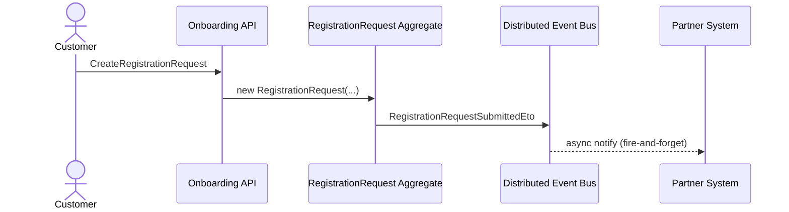

# Reference: Architecture Blueprint nodes

An Architecture Blueprint captures high-level system topology, cross-cutting patterns, or layering decisions that don't fit cleanly inside an Entity, Command, Flow, or Decision. Blueprints exist to orient implementers — they show the shape of the feature at a level above individual components.

> **Enforcement:** Architecture Blueprints are the **only** node type where Mermaid diagrams are permitted, and only inside the `**Diagram:**` field. No code fences, no C# snippets, no schemas — just topology and flow at a high level.

---

## When to create an Architecture Blueprint

Create a Blueprint when:

- The feature introduces or follows a cross-cutting pattern (CQRS split, saga, outbox, request-reply).
- The feature touches multiple ABP modules or external systems and the overall topology needs a single-page view.
- A Flow alone doesn't capture the component layout (Flows show sequence; Blueprints show structure).
- A Decision's consequences affect the overall topology and a visual aid is helpful.

Do **not** create a Blueprint for:

- A single aggregate's internal structure — use the Entity page.
- A step-by-step process — use a Flow.
- A class-level diagram — out of scope for a Feat Spec.

Expect zero to a few Blueprints per Feat Spec. Most features don't need any.

---

## Required fields

Every Architecture Blueprint entry must include these bold-labeled fields:

- `**Node type:** Architecture Blueprint`
- `**Title:** <short title>`
- `**Purpose:** <1–2 sentences>`
- `**Diagram:** <a Mermaid block OR a prose description if no diagram is needed>`
- `**Discussion:** <prose explaining the diagram's components, flows, and boundaries>`
- `**Source:** <bullet list of GitLab section-anchor deep links; see SKILL.md Clause Source Deep-Linking>`

Optional:

- `**Related Decisions:** <wiki links to Decision nodes that shaped this Blueprint>`
- `**Related Integrations:** <wiki links>`
- `**Operational considerations:** <bullet list of deployment, monitoring, or scaling notes>`

---

## Diagram

Mermaid is permitted here and only here. Keep diagrams focused — a single Blueprint should convey one idea:

- Sequence diagram for event-flow choreography.
- Component diagram for module topology.
- State diagram for complex state machines spanning multiple entities (rare; State nodes cover single-entity cases).
- Flowchart for high-level decision topology.

**Mermaid block format:**

````markdown
**Diagram:**


````

**Guidelines:**

- Keep node labels PascalCase and short (≤ 3 words).
- Prefer arrows labeled with the Command or event name over generic "calls".
- Annotate async boundaries with `-->` (dashed) vs `->` (solid) per Mermaid conventions.
- For component diagrams, group components into subgraphs when multi-module or multi-service.
- Do not inline C# code or SQL in Mermaid nodes.

If a Blueprint is more naturally described in prose (e.g., "this feature uses the transactional outbox pattern"), use prose in `**Diagram:**` and skip the Mermaid block.

---

## Discussion

Describe the Blueprint in prose:

- Identify each major component in the diagram and its role.
- Explain the flow the diagram represents.
- Call out boundaries (process, network, transactional, failure domain).
- Reference related Entities, Commands, Flows, Integrations, Decisions via wiki links.

Keep prose focused — a Blueprint's value is in the synthesis, not in restating every detail.

---

## Example entry (reference only — follow format)

> **Node type:** Architecture Blueprint
> **Title:** Registration approval with asynchronous partner notification
> **Purpose:** Show the end-to-end topology from customer submission through reviewer approval to partner system notification, including the async boundary at partner notification.
>
> **Diagram:**
>
> ```mermaid
> sequenceDiagram
>     actor Customer
>     actor Reviewer
>     participant API as Onboarding HTTP API
>     participant App as Onboarding App Service
>     participant Domain as RegistrationRequest
>     participant Bus as Distributed Event Bus
>     participant Job as BackgroundJob
>     participant Partner as Partner System
>
>     Customer->>API: POST /registration-requests
>     API->>App: CreateRegistrationRequest(dto)
>     App->>Domain: new RegistrationRequest()
>     Domain-->>Bus: RegistrationRequestSubmittedEto
>     Bus-->>Job: EmailVerificationDispatch enqueued
>
>     Note over Customer,API: ... email verification flow ...
>
>     Reviewer->>API: PUT /registration-requests/{id}/approve
>     API->>App: ApproveRegistrationRequest(id)
>     App->>Domain: Approve(reviewerId)
>     Domain-->>Bus: RegistrationRequestApprovedEto
>     Bus-->>Job: PartnerNotification enqueued
>     Job->>Partner: POST /partners/customers
>     Partner-->>Job: 200 OK (partner customer id)
>     Job->>Domain: attach partner id
> ```
>
> **Discussion:**
>
> This feature follows an event-driven, asynchronous-partner-notification topology. The critical path for reviewer approval is synchronous: the `ApproveRegistrationRequest` Command mutates the aggregate in a single transaction and commits locally. Partner notification is decoupled via the distributed event bus and an ABP background job, so partner downtime does not block reviewer workflow.
>
> Components:
> - **Onboarding HTTP API** — thin layer; auto-generated from the application service via ABP Auto API.
> - **Application service** — `RegistrationRequestAppService` orchestrates commands and enforces authorization.
> - **Domain** — [RegistrationRequest](<wiki_url>/entities/RegistrationRequest) enforces invariants and raises domain events on state transitions.
> - **Distributed event bus** — ABP's event bus (in-memory in dev; RabbitMQ in staging/prod).
> - **Background job** — [PartnerNotification](<wiki_url>/integrations/PartnerNotification) handles the outbound call with retries.
> - **Partner system** — external REST API; independent availability.
>
> Boundaries:
> - Transactional: the `Approve` command + local event dispatch are one DB transaction.
> - Async: partner notification is fire-and-forget from the reviewer's perspective.
> - Failure: partner outage does not roll back approval; see [PartnerNotification](<wiki_url>/integrations/PartnerNotification) for retry/failure modes.
>
> **Related Decisions:**
> - [PublishDistributedEventsAfterLocalCommit](<wiki_url>/decisions/PublishDistributedEventsAfterLocalCommit)
>
> **Related Integrations:**
> - [PartnerNotification](<wiki_url>/integrations/PartnerNotification)
> - [EmailVerificationDispatch](<wiki_url>/integrations/EmailVerificationDispatch)
>
> **Operational considerations:**
> - Event bus transport (RabbitMQ in prod) must be monitored; event backlog breaches should page on-call.
> - Partner notification job failure metric should alert after 24h of sustained failures (see Integration entry).
>
> **Source:**
> - [FRS #123 — Non-functional requirements](http://localhost:8080/root/trade-finance/-/issues/123#7-non-functional-requirements)
> - [FRS #125 — Integration overview](http://localhost:8080/root/trade-finance/-/issues/125#1-integration-overview)
> - [FRS #125 — Scalability targets](http://localhost:8080/root/trade-finance/-/issues/125#5-scalability-targets)

---

## Common defects

| Defect | Fix |
|---|---|
| Blueprint with detailed code or schemas | Remove; Blueprints are high-level only |
| Blueprint that restates a single Entity's internal structure | Move to the Entity page; delete Blueprint |
| Mermaid outside the `**Diagram:**` field | Move into the Diagram block; no other node type allows Mermaid |
| Diagram with 20+ nodes and unclear flow | Split into multiple Blueprints, each focused |
| Blueprint with no `**Discussion:**` | Add prose walking through the diagram |
| Blueprint that duplicates a Flow | Either merge into the Flow (if it's sequential) or keep only if showing structure |
| Blueprint with no `**Source:**` | Architecture Blueprints still need traceability; if none, reconsider whether the Blueprint is needed |
