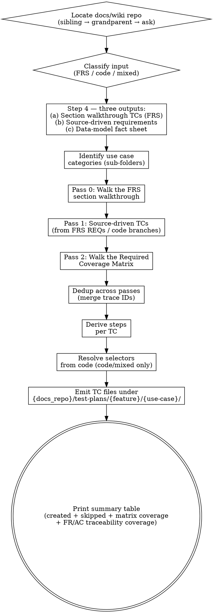

# Generate Test Plan from Source (FRS / Raw Code)

This skill produces **QA-focused E2E test plans** from a Functional Requirements Specification (FRS) or raw application source code. It does three things in parallel that QA reviews have shown are all needed for good coverage:

1. **Walks the FRS structurally** — every section that can produce TCs (FRs, ACs, Exception Flows, Edge Cases, Business Rules, Alternative Flows, Notifications, Form Fields) is processed in turn so no section is silently skipped.
2. **Walks a Required Coverage Matrix** — implicit TCs (duplicate values, max length, required fields, format, modal dismissal patterns, read-only enforcement, state transitions, cross-field rules, session edge cases, multi-tenancy, authorization, concurrency) are emitted whenever the data model or operation type implies them, regardless of whether the source enumerates them.
3. **Traces every TC back to its source** — FR-ID, AC-ID, BR-ID, EC-ID, exception flow ID, or "Matrix" — so QA can audit coverage section by section.

| Input type | Selector behaviour |
|---|---|
| **FRS** | All step selectors → `(discovered by explorer)` — FRS describes *what* the system does, not *how* the UI is wired. |
| **Raw code** | Selectors extracted from code (`data-testid`, `id`, `name`, `aria-label`, route paths). |

<HARD-GATE>
Do NOT invent selectors when the input is an FRS. Every step selector MUST be `(discovered by explorer)` or `n/a` (for pure-navigation steps). This applies to EVERY TC regardless of how obvious the UI element seems.
</HARD-GATE>

<HARD-GATE>
Do NOT write TC files inside the UI or API repo. Resolve the docs/wiki repo path via the discovery cascade in Step 1. If the cascade fails, STOP and ask the user — never silently fall back to a `./docs/` folder inside the current repo.
</HARD-GATE>

<HARD-GATE>
For FRS input, walk EVERY applicable FRS section in the Section Walkthrough (below) — Functional Requirements, Acceptance Criteria, Exception Flows, Edge Cases, Business Rules, Alternative Flows, Notifications, Form Fields. Producing TCs only from the Main Flow is a Pass-1 failure. Every FR-ID and AC-ID MUST trace to at least one TC.
</HARD-GATE>

<HARD-GATE>
Generate implicit TCs from the Required Coverage Matrix EVEN WHEN THE SOURCE DOES NOT ENUMERATE THEM. Duplicate-value, maximum-length, required-field, format, read-only enforcement, modal dismissal, state-transition, cross-field, multi-tenancy, concurrency, and authorization TCs are mandatory whenever the data model or operation type implies them. "The FRS didn't mention max length" or "the FRS didn't list ESC dismissal" is NEVER a valid reason to skip a matrix row whose conditions apply.
</HARD-GATE>

<HARD-GATE>
Every TC MUST trace to its source. Add a `**Traces to:**` line in the TC header listing the FR-IDs, AC-IDs, BR-IDs, EC-IDs, exception-flow IDs, or `Matrix` (with row name) that this TC verifies. A TC with no traceability is a Pass-1 failure.
</HARD-GATE>

<HARD-GATE>
Do NOT generate TCs for items listed in the FRS "Out of Scope" section (typically Section 3). If an out-of-scope item could plausibly appear due to a defect (e.g. an "annotation tool" that should NOT be present in a read-only modal), emit at most one low-priority **guard TC** that asserts its absence — and label it clearly.
</HARD-GATE>

<HARD-GATE>
Do NOT invent answers to FRS Open Questions (typically Section 22). If a TC depends on an unresolved OQ, prefix the TC title with `PENDING — ` and note the OQ-ID in Postconditions. The TC stays in the plan as a placeholder so it isn't forgotten when the OQ resolves.
</HARD-GATE>

---

## Workspace Layout Assumption

This skill assumes a multi-repo workspace where the docs/wiki repo lives **alongside** the UI and API repos — typically as a sibling, sometimes one level higher:

```
workspace/
  ui/        ← frontend repo (skill may be run from here)
  api/       ← backend repo (skill may be run from here)
  docs/      ← wiki / knowledge repo (TC files land here)
```

Or a nested layout where the docs repo sits at the workspace root:

```
workspace/
  frontend/
    ui/      ← skill may be run from here
  backend/
    api/     ← skill may be run from here
  wiki/      ← docs repo lives here
```

Common names for the docs/wiki repo: `docs`, `wiki`, `knowledge`, `kb`, `documentation`. The skill discovers the path automatically (Step 1) and asks the user when discovery is ambiguous or fails.

Throughout this skill, the resolved path is referred to as `{docs_repo}`. All TC paths take the form `{docs_repo}/test-plans/{feature}/{use-case}/{feature}-TC-{NNN}.md`.

---

## Directory Structure

```
{docs_repo}/test-plans/
  {feature}/
    {use-case-a}/
      {feature}-TC-001.md     ← happy path
      {feature}-TC-002.md     ← validation / edge case
    {use-case-b}/
      {feature}-TC-003.md     ← happy path
      {feature}-TC-004.md     ← error handling
    ...
```

**Naming rules:**
- Feature folder: kebab-case (`checklist`, `service-type`, `verification-preview`)
- Use case sub-folder: kebab-case verb or action (`display`, `add`, `edit`, `delete`, `toggle`, `reorder`, `search`, `export`, `view`, `preview`, `auth`)
- TC file: `{feature}-TC-{NNN}.md` — sequential across the entire feature, not per sub-folder

---

## TC File Format

```markdown
# {feature}-TC-{NNN}: {Title} ({Category})

**Feature:** {Feature Name}
**Scenario:** {Letter} — {Scenario description}
**Priority:** {High | Medium | Low}
**Type:** Functional
**Tags:** @smoke @{feature} @{feature}-TC-{NNN}
**Traces to:** {FR-ID(s) | AC-ID(s) | BR-ID(s) | EC-ID(s) | Exception-Flow-ID(s) | Matrix: <row name>}

---

## Steps

| # | Step | Selector | Expected Result |
|---|------|----------|-----------------|
| 1 | Navigate to {path} | `n/a` | Page loads, {visible landmark} |
| 2 | Click "{button}" button | `[data-testid="{testid}"]` | {what happens} |
| 3 | Enter "{value}" in {field} | `[data-testid="{testid}"]` | {what appears} |
| 4 | Verify {element} | `(discovered by explorer)` | {expected state} |

---

## Preconditions
- {precondition 1}
- {precondition 2}

## Postconditions
- {postcondition 1}
- {postcondition 2}
```

### Format rules

- Title includes the category in parentheses: `(Happy Path)`, `(Validation)`, `(Duplicate)`, `(Max Length)`, `(Authorization)`, `(Read-Only)`, `(Dismissal)`, `(Edge Case)`, `(Error Handling)`, `(State Transition)`, `(Cross-Field)`, `(Concurrency)`, `(Multi-Tenant)`, `(Guard)`, `(PENDING — OQ-NN)`
- Scenario line uses a letter prefix: `A — Preview face row (Happy Path)`, `B — Preview row with capture missing (Edge Case)`
- `**Traces to:**` line is mandatory — list every source ID this TC verifies, plus matrix row name if matrix-driven
- `@smoke` tag only on happy-path TCs
- Steps table columns: `#`, `Step`, `Selector`, `Expected Result` — in that order
- Selectors are backtick-wrapped: `` `[data-testid="..."]` ``, `` `n/a` ``, or `(discovered by explorer)` (no backticks for placeholder)
- Dynamic selectors use the template notation with curly braces: `` `[data-testid="checklist-row-{item.id}"]` ``
- Preconditions describe the required state **before** the test runs (data, role, environment, session state)
- Postconditions describe the expected system state **after** all steps pass (UI state, DB state if applicable, audit log entry, modal closed/open)
- Horizontal rules (`---`) separate the header, steps, and conditions sections
- For PENDING TCs, the title is prefixed `PENDING — OQ-NN —` and Postconditions name the OQ-ID being awaited

---

## FRS Section Walkthrough

When the input is an FRS, walk every section that produces TCs in the order below. Each section has its own extraction recipe. The frs-generator skill emits FRSes with sections numbered 1–23; this walkthrough refers to sections by name so it applies to any well-structured FRS, with the typical section number in parentheses for reference.

The walkthrough is the **first** TC source. Source-driven TCs from raw code (Step 4) and matrix-driven TCs (Step 6 Pass 2) are layered on top. Dedup across sources is done in Step 6.

### Trigger (§9) + Main Flow (§10)

- Emit **one Happy Path TC** that exercises the trigger and walks every step of the main flow.
- Tag with `@smoke`. Priority: High.
- Trace to: every FR-ID invoked along the flow + AC-IDs that map to flow steps.
- The Postconditions section quotes Section 13 (Postconditions, "On success") of the FRS verbatim where applicable.

### Alternative Flows (§11)

- **One TC per alternative flow** (11a, 11b, …).
- Title pattern: `{Feature} — {Alt flow name} (Alternative Flow)`.
- Trace to: the alt flow's branch step + FR-IDs the alt flow exercises.
- If an alt flow only changes input data (e.g. "Face Verification Row Preview" vs. main flow being agnostic), the alt flow TC may consolidate into the main flow TC for the variant; in that case, add a separate TC for the *other* variant explicitly.

### Exception Flows (§12)

- **One TC per exception flow** (12a, 12b, 12c, …).
- The exception's **Trigger** → reproduce as a Step in the TC.
- The exception's **Outcome** → assert as the Expected Result of the triggering step.
- The exception's **Resolution** → noted in Postconditions as the recovery path.
- Title pattern: `{Feature} — {Exception name} (Error Handling)` or `(Edge Case)` for non-error exceptions.
- Trace to: the exception flow ID (e.g. `EX-12a`) + any FR-IDs that mandate the exception behaviour.

### Functional Requirements (§16)

- Every FR-ID **must trace to at least one TC** by the end of Step 6. This is verified in Step 10's coverage report.
- FRs that are pure flow restatements (e.g. "system SHALL present a modal when icon is selected") are typically already covered by the Main Flow TC — note the trace, do not emit a duplicate.
- FRs that assert *negative* properties — "SHALL be read-only", "SHALL NOT allow X", "SHALL contain no input fields" — get their own dedicated **Read-Only / Guard TCs** because they require explicit absence verification, not flow execution.
- FRs that assert *quantitative* properties — "exactly two images", "at most 50 results" — get their own assertion TC.
- FRs that assert *labelling / identification* properties — "clearly labelled", "unambiguously identified" — get their own UI-content TC.

### Acceptance Criteria (§17)

- **One TC per AC-ID** unless the AC is a pure restatement of a flow already covered by an exception or alt-flow TC; in that case, attach the AC-ID to the existing TC's `Traces to` line and do not duplicate.
- AC table in the FRS already shows traceability (`Traces to: FR-VP-01-01, FR-VP-01-02`). Carry that traceability into the TC.
- ACs framed as observable conditions (`After X, the user sees Y`) translate directly: precondition = X, expected result = Y.

### Business Rules (§20)

- **One TC per verifiable BR**.
- BRs that are tautologies or pure scope statements (e.g. "this is read-only") may be skipped if a Read-Only Guard TC already covers them — in that case, attach the BR-ID to the existing TC's `Traces to`.
- BRs that constrain **availability** ("preview is available only for the Agent's currently active session") map to authorization / scope TCs.
- BRs that constrain **presentation** ("two images shall be presented in a consistent, labelled arrangement for every row type") map to UI-consistency TCs that exercise multiple inputs and assert the consistent rendering.

### Edge Cases (§21)

- **One TC per EC-ID**.
- An EC may overlap with an exception flow (e.g. EC-01 "captured image not yet taken" overlaps with 12a "image retrieval failure"). When an EC is genuinely a sub-case of an exception, attach the EC-ID to the exception TC's `Traces to` and emit a more specific TC only if the EC adds a distinct precondition or assertion.
- ECs referencing an Open Question → emit as a `PENDING — OQ-NN` TC.

### Notifications (§14)

- If the section is `None`, skip — do **not** invent notification TCs.
- Otherwise, emit one TC per notification covering: trigger event, recipient, channel, content. If the notification is sent to an external system (email, SMS, webhook), include verification of delivery in Postconditions.

### Form Fields (§15)

- If the section is `None`, skip the per-field validation walk — the operation has no actor-facing data entry.
- Otherwise, for **each field** in the table, walk the Required Coverage Matrix rows for Create/Edit (required, max length, format, duplicate, whitespace, special chars, range) using the field's declared constraints.

### Postconditions (§13) and Preconditions (§6)

- These feed the Preconditions and Postconditions sections of every TC, not standalone TCs.
- The FRS Preconditions list constrains the test setup; the FRS "On success" Postcondition is the assertion target for happy-path TCs; "On failure" Postconditions inform exception-flow TCs.

### Open Questions (§22)

- Do not invent answers.
- Any TC whose content depends on an OQ → prefix title with `PENDING — OQ-NN — ` and note the OQ in Postconditions.
- TCs that mention an OQ should still be emitted as placeholders so they aren't forgotten when the OQ resolves.

### Scope — Out of Scope (§3)

- Items in the "Out of scope" list are NOT test targets.
- If an out-of-scope item could plausibly appear in the UI as a defect (e.g. an "annotation tool" in a read-only modal), emit at most one **Guard TC** asserting its absence. Label it `(Guard)`.

### Auditability (§19)

- If the FRS specifies operation-specific audit obligations beyond cross-cutting defaults, emit one TC per audit assertion (verify the audit log entry contains the expected fields after the action).
- If the section defers entirely to cross-cutting defaults and the operation is read-only, no TCs are required from this section.

### Sections that do NOT produce TCs

- Purpose (§1), Assumptions (§2), Glossary (§4), Actors (§5), Dependencies (§7), Data Entities (§8), NFRs (§18), Revision History (§23) — these provide context for extraction but do not directly emit TCs. Data Entities (§8) feeds the data-model fact sheet used in matrix Pass 2.


---

## Required Coverage Matrix

This is the **floor** for every test plan, regardless of input type. For every use case category present in the feature, generate **at minimum** the TC types listed below. The source may add scenarios beyond these — generate those too. But matrix entries are mandatory whenever their conditions apply, even if the source never enumerates them.

The matrix exists because FRS authors describe behaviour, not exhaustive validation surface, and the same blind spots appear over and over in QA reviews — duplicate, max-length, required, format, modal dismissal patterns, read-only enforcement, cross-field rules, state transitions, multi-tenancy, concurrency, session edge cases. They're almost always implicit in the data model or operation type.

**How to apply the matrix:** For each requirement and each FRS section processed in the walkthrough, identify which categories the operation touches (Create, Update, Display, View/Modal, State Change…). Then walk the matrix rows for those categories and generate one TC per applicable row.

### Display / List

| TC type | When to generate | Priority |
|---|---|---|
| Display populated list | Always | High |
| Display empty state | Always | Medium |
| Pagination — first / middle / last page | If pagination is in scope | Medium |
| Sorting — each sortable column ascending and descending | If sorting in scope | Medium |
| Filtering — each filter applied independently | If filters in scope | Medium |
| Search — match found, no match, special chars, empty query | If search in scope | Medium |
| Loading state visible during fetch | Always | Low |
| Server error during fetch — error message + retry | Always | Medium |
| Unauthorized user attempts list view | When access control applies | High |

### View / Preview / Modal Detail (read-only views and dialogs)

This category covers any operation that opens a modal, dialog, or detail view to **display** information without editing. Drives test plans like FRS-VP-01.

| TC type | When to generate | Priority |
|---|---|---|
| Trigger opens the view (happy path) | Always | High |
| Verify expected content is displayed (count, fields, labels) | Always | High |
| Verify content labelling is correct and unambiguous | Always | High |
| Read-only enforcement — no editable inputs, no submit, no annotation tools | Always | High |
| Dismiss via primary close button | Always | High |
| Dismiss via ESC key | Always | Medium |
| Dismiss via backdrop click — verify behaviour matches design (close OR no-op) | Always | Medium |
| After dismissal — parent view returns to prior state | Always | High |
| Re-open the same target — content matches the first open | Always | Medium |
| Open view A, dismiss, open view B — view B shows B's content (no leakage) | When the trigger is on a list with multiple targets | Medium |
| Missing data — placeholder shown gracefully without breaking layout | When the source identifies a missing-data exception (e.g. image unavailable) | High |
| Partial data — some fields present, some missing — view stays usable | When partial-failure is plausible | Medium |
| Unauthorized target — view does not open, error shown | When access control applies | High |
| Session expires while view is open — view closes gracefully with notice | When session lifetime applies | Medium |

### Create / Add

| TC type | When to generate | Priority |
|---|---|---|
| Happy path — all valid input | Always | High |
| Required field missing — **one TC per required field** | Always | High |
| Maximum length exceeded — **one TC per text field with a length cap** | Always | High |
| Minimum length violation — one TC per field with a minimum | When a minimum exists | Medium |
| Duplicate value — **one TC per uniqueness constraint** | Always for unique fields | High |
| Duplicate with whitespace variants — `"Admin"` vs `" admin "` | Always for unique text fields | Medium |
| Duplicate with case variants — `"Admin"` vs `"ADMIN"` | When uniqueness is case-insensitive per spec, or when the spec is silent (flag for confirmation) | Medium |
| Invalid format — email / phone / URL / date / number / decimal precision | One TC per typed or formatted field | High |
| Whitespace-only value for required text field | Always | Medium |
| Special characters / injection-style payload in free-text fields | Always for free-text fields | Medium |
| Out-of-range numeric value (negative when not allowed, exceeds upper bound) | When numeric ranges apply | Medium |
| Foreign-key reference to non-existent parent | When FK fields exist | Medium |
| Cross-field comparison violation — `End < Start`, `Discount > Subtotal` | When the FRS or schema specifies a cross-field rule | High |
| Conditional required — Field B required only when Field A = X | When conditional rules exist | High |
| Either-or rule — at least one of A or B must be provided | When the FRS specifies either-or | High |
| Sum / total constraint — line totals must equal header total | When applicable | High |
| Unauthorized user attempts create | When access control applies | High |

### Update / Edit

| TC type | When to generate | Priority |
|---|---|---|
| Happy path — valid edit | Always | High |
| Edit creates a duplicate value — **one TC per uniqueness constraint** | Always for unique fields | High |
| All Create validations re-apply on Edit (required, max length, format, cross-field, conditional) | Always | (varies) |
| Edit non-existent record (record deleted by another user / wrong ID) | Always | Medium |
| Concurrent edit / stale record (optimistic concurrency) | **Always for ABP entities** — `ConcurrencyStamp` is default; only skip if concurrency is explicitly disabled | High |
| Unauthorized user attempts edit | When access control applies | High |
| Cancel without saving — verify no changes persisted | Always | Low |

### Delete

| TC type | When to generate | Priority |
|---|---|---|
| Happy path — delete with confirmation | Always | High |
| Cancel deletion — confirm record still exists | Always | Medium |
| Delete non-existent record | Always | Medium |
| Delete with dependent records — FK constraint blocks or cascades | When dependencies exist | High |
| Soft-delete verification — record hidden from list but retrievable | When soft delete is the policy | Medium |
| Restore after soft delete — record returns to list | When restore is in scope | Medium |
| Recreate after soft delete — uniqueness constraint behaviour | When uniqueness applies and soft delete is the policy | Medium |
| Unauthorized user attempts delete | When access control applies | High |

### State / Workflow Transitions

For entities with a `status`, `state`, or workflow stage. Drives plans for approval workflows, order lifecycles, document states.

| TC type | When to generate | Priority |
|---|---|---|
| Each valid transition (e.g. Draft → Submitted, Submitted → Approved) | One TC per valid transition | High |
| Each invalid transition is rejected (e.g. Draft → Approved when Submitted is required) | One TC per invalid transition | High |
| Terminal state — record is read-only (no edit, no further transitions) | When a terminal state exists | High |
| Pre-condition state check — action only allowed when entity is in correct state | One TC per state-gated action | High |
| Concurrent transition by another actor — second actor sees current state | When workflow is multi-actor | Medium |
| Audit trail — transitions are recorded with actor, timestamp, from-state, to-state | When auditability is in scope | Medium |

### Toggle / State change

| TC type | When to generate | Priority |
|---|---|---|
| Toggle on → off | Always | High |
| Toggle off → on | Always | High |
| Cascade effect on dependents (e.g. deactivating a parent hides children) | When toggle has cascade semantics | High |
| Unauthorized user attempts toggle | When access control applies | High |

### Reorder / Sort

| TC type | When to generate | Priority |
|---|---|---|
| Move item up | Always | High |
| Move item down | Always | High |
| Move first item up — boundary, should be no-op or disabled | Always | Medium |
| Move last item down — boundary, should be no-op or disabled | Always | Medium |
| Reorder persists across page reload | Always | Medium |

### Search / Filter

| TC type | When to generate | Priority |
|---|---|---|
| Exact match returns the record | Always | High |
| Partial match returns the record | If partial / fuzzy matching is supported | High |
| No match returns empty result with appropriate message | Always | Medium |
| Empty query — return all records or prompt | Always | Medium |
| Special characters in query do not break the search | Always | Medium |
| Case sensitivity behaviour matches spec | Always | Medium |

### Export / Download

| TC type | When to generate | Priority |
|---|---|---|
| Export with data — file downloads with correct format | Always | High |
| Export with empty result set — file format still valid | Always | Medium |
| Export respects active filters | When filters are in scope | High |
| Unauthorized user attempts export | When access control applies | High |

### Bulk Operations

| TC type | When to generate | Priority |
|---|---|---|
| Bulk select all — verify count and selection state | When bulk select is in scope | High |
| Bulk action (delete / update / export) on full selection — happy path | When bulk action is in scope | High |
| Bulk action with no selection — disabled or appropriate error | When bulk action is in scope | Medium |
| Bulk action partial failure — some succeed, some fail, summary reported | When bulk action could fail per-row | High |
| Bulk action authorization — unauthorized user blocked or partial success per-row | When access control applies | High |

### Multi-Tenancy (ABP `IMultiTenant` entities)

| TC type | When to generate | Priority |
|---|---|---|
| Tenant A user cannot read Tenant B's record | Always for `IMultiTenant` entities | High |
| Tenant A user cannot edit / delete Tenant B's record | Always for `IMultiTenant` entities | High |
| Cross-tenant duplicate is allowed — same value in Tenant A and Tenant B does not collide | Always for `IMultiTenant` entities with unique fields | High |
| Host-level user accessing tenant data — behaviour matches access policy | When host vs tenant boundaries are in scope | Medium |

### Session / Authentication Lifecycle

| TC type | When to generate | Priority |
|---|---|---|
| Action while session is active — succeeds | Always (covered by happy path) | High |
| Action while session is expired — redirected to login or rejected | Always | High |
| Session expires DURING an in-flight action — graceful handling, no orphaned UI state | When the operation has a non-trivial duration (modals open, multi-step flows) | High |
| Concurrent session limit — second login behaviour matches policy | When concurrent-session policy is in scope | Medium |
| Insufficient role / permission — request rejected with appropriate error | Always when access control applies | High |

### Notifications (when present per FRS §14)

| TC type | When to generate | Priority |
|---|---|---|
| Notification sent on trigger event — recipient, channel, content correct | One TC per notification | High |
| Notification not sent when trigger does not fire | One TC per notification | Medium |
| Notification delivery failure — retry / log behaviour | When delivery is asynchronous | Medium |

**The matrix is the floor, not the ceiling.** The source may add scenarios beyond these — generate those too. But never skip a matrix entry whose conditions apply by saying "the FRS doesn't mention it" — the matrix is what the source leaves implicit.


---

## Overview

Use this skill when a QA engineer provides an FRS document (`.md`, `.docx`, `.pdf`, or pasted text) or source code files / a directory and asks for a test plan. The skill produces individual TC files in the **docs/wiki repo**, organized by feature and use case category, covering:

1. Every FRS section that produces TCs (Section Walkthrough)
2. Every applicable Required Coverage Matrix row
3. Every source-driven scenario from raw code (when applicable)

Every TC traces to its source — FR-ID, AC-ID, BR-ID, EC-ID, exception flow ID, or matrix row — so the resulting plan is auditable section by section.

**Core principle:** One flow variant = one TC file. One use case category = one sub-folder. Never mix unrelated actions in a single TC. Always cover the matrix floor and the section walkthrough before considering the plan complete.

---

## Anti-Pattern: "I Can Guess the Selector"

When reading an FRS that says *"Agent dismisses the modal"*, it is tempting to emit `` `[data-testid="btn-close-modal"]` `` because it seems obvious. Don't. The FRS describes behaviour, not markup. Guessed selectors cause silent test failures. Leave them as `(discovered by explorer)` and let the explorer skill resolve them against the real DOM.

---

## Anti-Pattern: "I'll Just Write Files Wherever"

When the docs/wiki repo isn't immediately at `../docs/`, it is tempting to fall back to a `./docs/` folder inside the current UI or API repo, or to write into the user's home directory. Don't. TC files belong in the docs/wiki repo, full stop. Run the discovery cascade in Step 1 and, if it fails, ask the user.

---

## Anti-Pattern: "The FRS Didn't Mention It So I Won't Test It"

When the FRS describes only the happy path for "Add Service Type" — Name, Code, Description fields, Save button, success toast — it is tempting to emit only a happy-path TC. Don't. The data model implies a validation surface the FRS leaves unstated:

- Name and Code are almost certainly required → required-field TCs
- Name, Code, Description almost certainly have length caps → max-length TCs
- Code is almost certainly unique → duplicate TC
- Only authorized users can create → authorization TC
- The entity is `IMultiTenant` → cross-tenant isolation TCs

The Required Coverage Matrix is what the FRS forgets. **Generate the matrix entries even when no requirement statement maps directly to them.**

---

## Anti-Pattern: "It's Just a View, How Many TCs Could There Be?"

Read-only modal/preview operations look small at first glance — the FRS has a few FRs about showing two images, a couple of exception flows, and that's it. In reality, a single read-only modal needs around 10–18 TCs once the matrix is walked: trigger, content correctness, labelling, **read-only enforcement** (FRs that say "shall NOT allow editing" need explicit absence assertions), three or four dismissal paths (close button, ESC, backdrop click, browser back), re-open behaviour, multi-target leakage, missing data placeholders, partial data, unauthorized target, session expiry during view. The View / Preview / Modal Detail matrix category exists because this surface gets under-tested every time it's not made explicit.

---

## Anti-Pattern: "FR-04 Is Already in the Main Flow Somehow"

FRs that assert *negative* properties — "SHALL be read-only", "SHALL contain no input fields", "SHALL NOT allow annotation" — are NOT covered by the Main Flow TC. The Main Flow demonstrates that the system *does* something; the negative FR demonstrates the system *does not* do something else. These need their own dedicated TC that explicitly asserts absence (no editable fields, no submit buttons, no annotation tools, etc.). Trace the negative FR to that dedicated guard TC, not to the happy path.

---

## Anti-Pattern: "The Open Question Is Probably X, Let's Just Use That"

If the FRS has an Open Question (typically Section 22, e.g. *"For document verification rows, what are the two specific images displayed?"*), do NOT invent the answer. Emit any dependent TC with the title prefixed `PENDING — OQ-NN — ` and Postconditions noting the OQ. The TC stays as a placeholder so it isn't forgotten when the OQ resolves. Inventing answers produces TCs that test something the system was never specced to do.

---

## When to Use

**Use when:**
- A QA engineer provides an FRS document and asks for a test plan
- A QA engineer points to raw source code (components, pages, API routes) and asks for a test plan
- A QA engineer provides a mix of FRS + code and asks for a test plan
- A QA engineer wants a test plan for a new requirement that will be tested via UI / E2E

**Do NOT use when:**
- Input is user stories or acceptance criteria → use `skill:generate-test-plan-from-stories` instead
- User wants to update selectors in existing TCs → use `updateSelector` operation
- User wants to run or execute tests → different workflow entirely

---

## Checklist

You MUST complete these in order:

1. **Locate the docs/wiki repo** — run the discovery cascade (sibling → grandparent → ask) and record `{docs_repo}`
2. **Classify input** — determine FRS, raw code, or mixed
3. **Identify feature name** — derive the kebab-case feature name
4. **Extract — three parallel outputs:** (a) Section-walkthrough TC list (FRS only); (b) Source-driven requirement list; (c) Data-model fact sheet
5. **Identify use case categories** — determine the sub-folders (display, view, add, edit, delete, etc.)
6. **Group into TCs per category — three passes:** Pass 0 from the Section Walkthrough; Pass 1 from source-driven requirements; Pass 2 from the Required Coverage Matrix. Dedup across passes by attaching extra trace IDs to existing TCs rather than duplicating.
7. **Derive steps per TC** — write Step / Selector / Expected Result rows
8. **Resolve selectors (code input only)** — scan source for `data-testid`, `id`, `name`, `aria-label`
9. **Emit TC files** — create each file under the correct sub-folder in `{docs_repo}/test-plans/`
10. **Print summary** — show a table grouped by use case, including any skipped files, matrix coverage, **and FR/AC/BR/EC traceability coverage**


---

## Process Flow



---

## The Process

### Step 1: Locate the Docs/Wiki Repo

The TC files must land in the docs/wiki repo, not inside the UI or API repo. Resolve the path in this order — stop at the first match:

**1a. Check the conventional sibling path.** Test `../docs/` relative to the current working directory. If it exists and contains `.git/` (or a `test-plans/` directory from a prior run), accept it.

**1b. Scan for sibling repos with conventional names.** From the parent of the current working directory, list immediate subdirectories and match any of: `docs`, `wiki`, `knowledge`, `kb`, `documentation` (case-insensitive). Prefer ones that contain `.git/` over plain folders. If exactly one match: accept it. If multiple matches: list them and ask the user which one.

**1c. Walk up one more level.** If the current repo is nested (e.g. `workspace/frontend/ui/`), check the grandparent for the same name patterns as 1b, with the same `.git/` preference and same ambiguity rule.

**1d. Ask the user.** If 1a–1c all fail, stop and ask:
> "I couldn't find a docs/wiki repo near here. Where should I write the TC files? (e.g. `../docs`, `~/work/wiki`, or an absolute path)"

Once the user replies, validate the path exists and is writable before proceeding.

**Record the resolved base path** as `{docs_repo}`. All subsequent file operations write to `{docs_repo}/test-plans/...`.

- **Verify:** `{docs_repo}` exists, is a directory, is writable, and is **outside** the current UI/API repo.
- **On failure:** Do not fall back to writing inside the current repo. Stop and ask.

### Step 2: Classify Input

- Document (FRS, SRS, requirements doc): mode = `frs`
- Source code files or directory: mode = `code`
- Both provided: mode = `mixed` (FRS drives the section walkthrough, code provides selectors and supplements implicit behaviour)
- **Verify:** You can name the mode and list every input file/section.
- **On failure:** Ask the user to clarify what they provided.

### Step 3: Identify Feature Name

- Derive a kebab-case feature name from the FRS title or module name.
  - FRS "Service Type Management" → `service-type`
  - FRS "Preview Verification Images Side-by-Side" (FRS-VP-01) → `verification-preview`
- **Verify:** Feature name is kebab-case, module title is human-readable.
- **On failure:** Ask the user to confirm.

### Step 4: Extract — Three Parallel Outputs

This step produces **three** outputs that feed Step 6's three passes.

#### (a) Section-walkthrough TC list (FRS only)

For each FRS section in the **FRS Section Walkthrough** above, walk the section and record candidate TCs with their trace IDs. The output is a structured list:

```
Section walkthrough TCs (FRS-VP-01):
  Trigger + Main Flow:
    - TC-cand-A: Preview face row — Happy Path  [trace: FR-01, FR-02, FR-03, AC-01, AC-02]
  Alternative Flows:
    - 11a Face Verification Row Preview → consolidates with TC-cand-A
  Exception Flows:
    - TC-cand-B: Image retrieval failure — capture missing  [trace: EX-12a, FR-04, EC-01]
    - TC-cand-C: Image retrieval failure — reference missing  [trace: EX-12a, FR-04, EC-02]
    - TC-cand-D: Unauthorized session access  [trace: EX-12b, BR-01]
    - TC-cand-E: Session expired during preview  [trace: EX-12c]
  Functional Requirements (gap-fill — FRs not yet covered):
    - FR-02 (exactly two images, labelled): partly covered by A; emit dedicated assertion TC-cand-F
    - FR-05 (read-only — no input fields, no annotation, no submission): NOT covered → TC-cand-G
    - FR-06 (modal dismissible, table state restored): partly covered by A; emit dedicated dismissal TC-cand-H
  Acceptance Criteria (gap-fill):
    - AC-04 (dismissal restores table state): mapped to TC-cand-H
    - AC-05 (no input fields / submission controls): mapped to TC-cand-G
  Business Rules (gap-fill):
    - BR-04 (consistent labelling across row types): NOT covered → TC-cand-I
  Edge Cases (gap-fill):
    - EC-03 (document row preview): depends on OQ-01 → PENDING TC-cand-J
  Notifications: None — skip
  Form Fields: None — skip
  Out of scope: capture, decision recording, reference-photo management → no TCs; consider one Guard TC if absence is verifiable
```

#### (b) Source-driven requirement list

*From FRS:* requirement IDs (REQ-001, FR-01…), SHALL/MUST statements, preconditions, input constraints, expected outputs, error messages.

*From raw code:* route definitions, page components, form handlers, API endpoints, dialogs, conditional branches, validators.

*From mixed:* FRS drives the requirement list; code supplements with implicit behaviour the FRS missed.

#### (c) Data-model fact sheet

For every entity touched by the feature, capture:

- **Required fields** — `[Required]`, `NOT NULL`, FRS phrases like "mandatory".
- **Length caps** — `[StringLength(50)]`, `varchar(50)`, `maxLength={50}`, FRS phrases like "up to 50 characters".
- **Uniqueness constraints** — DB unique indexes, validators, FRS phrases like "must be unique".
- **Format constraints** — typed fields (email, URL, decimal, date), regex validators.
- **Foreign-key relationships** — navigation properties, FK columns.
- **Authorization rules** — `[Authorize]`, role attributes, FRS role mentions.
- **Cascade / dependency rules** — `OnDelete(DeleteBehavior.Cascade)`, FRS cascade phrases.
- **Numeric ranges** — `[Range]` attributes, FRS phrases like "between 1 and 100".
- **Multi-tenancy markers** — `IMultiTenant` interface, FRS phrases identifying tenant-scoped data.
- **Concurrency markers** — `ConcurrencyStamp` (default in ABP unless explicitly disabled).
- **State machine / workflow** — status enums, allowed-transitions tables, FRS workflow descriptions.
- **Cross-field rules** — comparison rules, conditional required, sum/total constraints, either-or rules.

Record any genuinely-absent fact explicitly (e.g. "no length cap on Notes field") so Step 6 knows to skip the corresponding matrix row.

- **Verify:** All three outputs exist. Section-walkthrough output identifies trace IDs for every FR/AC/BR/EC in the FRS.
- **On failure:** List what you found and ask the user to confirm scope.

### Step 5: Identify Use Case Categories

Map requirements to use case categories. Each category becomes a sub-folder:

| Category | Sub-folder name | When to create |
|---|---|---|
| Display / Read | `display` | Component renders data in a list, table, or detail view |
| View / Preview / Modal | `view` or `preview` | Modal/dialog opens to show data read-only |
| Create / Add | `add` | Form submission or dialog creates a new record |
| Update / Edit | `edit` | Form submission or dialog modifies an existing record |
| Delete / Remove | `delete` | Action removes a record (with or without confirmation) |
| State / Workflow | `workflow` | Action transitions an entity between status states |
| Toggle state | `toggle` | Switch, checkbox, or button changes a boolean property |
| Reorder / Sort | `reorder` | Drag-and-drop or arrow buttons change item order |
| Search / Filter | `search` | Input filters or searches a list |
| Export / Download | `export` | Action exports data to a file |
| Bulk Operations | `bulk` | Action operates on multiple selected records |
| Authentication | `auth` | Login, logout, session management |
| Navigation | `navigation` | Route transitions, breadcrumbs, tabs |

Only create sub-folders for categories that have at least one TC. Don't create empty folders.

- **Verify:** Every section-walkthrough candidate and every requirement maps to a category.
- **On failure:** Merge sparse categories or ask the user.

### Step 6: Group TCs per Category — Three Passes

Within each category sub-folder, generate TCs in three passes. Dedup across passes by **merging trace IDs into existing TCs** rather than emitting duplicates.

**Pass 0 — Section-walkthrough TCs (FRS only).** From Step 4(a), promote each candidate TC into a real TC. This is the primary source of TCs for FRS input.

**Pass 1 — Source-driven TCs.** For every requirement from Step 4(b) that maps to this category and is NOT already covered by a Pass-0 TC, create a TC. Variants:
1. **Happy path** — the primary success flow (Priority: High, Tag: `@smoke`)
2. **Validation / negative** — invalid inputs, boundary values (Priority: High)
3. **Edge cases** — empty states, max-length, concurrent actions (Priority: Medium)
4. **Error handling** — server errors, network failures, permission denied (Priority: Medium)

**Pass 2 — Matrix-driven TCs.** Walk the Required Coverage Matrix row for this category. For each row whose conditions are met by the data-model facts from Step 4(c), generate a TC if Pass 0 and Pass 1 didn't already cover it. Examples:

- Category is `view`, the operation is a read-only modal → walk the **View / Preview / Modal Detail** rows: dismissal via close button, ESC, backdrop click, re-open with same data, multi-target leakage, etc.
- Category is `add`, data-model facts list `Code` as a unique field → matrix row "Duplicate value" applies → emit `Add — Duplicate Code (Validation)`.
- Category is `add`, data-model facts list `Name` with `StringLength(100)` → matrix row "Maximum length exceeded" applies → emit `Add — Maximum length exceeded — Name (Validation)`.
- Category is `add`, data-model facts list `[Authorize(Roles="Admin")]` → matrix row "Unauthorized user attempts create" applies → emit `Add — Unauthorized user (Authorization)`.
- Entity is `IMultiTenant` → walk the **Multi-Tenancy** rows.
- Entity has a `ConcurrencyStamp` → emit the concurrent-edit TC (no longer conditional in ABP).

**Numbering and scenarios:** assign scenario letters and TC numbers sequentially across the entire feature (A, B, C…; TC-001 through TC-NNN), not per sub-folder. Pass-0 TCs come first within a category, then Pass-1, then Pass-2 for readability.

**Dedup rule:** if a Pass-2 matrix row maps to the same scenario as a Pass-0 or Pass-1 TC, do NOT emit a duplicate. Instead, append the matrix row name to the existing TC's `Traces to` line: `Traces to: FR-04, EX-12a, EC-01, Matrix: View — Missing data placeholder`.

- **Verify:** Each category has at least a happy path TC. Every applicable matrix row has a TC OR is merged into an existing TC's trace. Every FR-ID and AC-ID has at least one TC tracing to it. No TC exceeds 10 steps.
- **On failure:** Split large TCs; ensure every applicable matrix row is covered or explicitly justified as not-applicable in the data-model fact sheet; ensure every FR and AC traces somewhere.

### Step 7: Derive Steps per TC

Write steps in the table format:

```markdown
| # | Step | Selector | Expected Result |
|---|------|----------|-----------------|
| 1 | Navigate to {path} | `n/a` | Page loads, {landmark visible} |
| 2 | Click "{button}" | `(discovered by explorer)` | {what happens} |
```

Rules:
- Navigation steps: selector = `` `n/a` ``
- One atomic user action per step — don't combine "click Save and verify toast"
- Assertions can be their own step: `Verify {element} displays {state}`
- 2–10 steps per TC. If more, split.
- For **Read-Only** and **Guard** TCs, the steps are observation-only: `Verify modal contains no input fields`, `Verify modal contains no submit button`, `Verify modal contains no annotation tools`. Each absence assertion is its own step row.
- For **Dismissal** TCs, one TC per dismissal method (close button, ESC, backdrop click). Don't compress them into a single multi-step TC.
- For **PENDING** TCs, write the steps as best as the FRS allows and note the open question in Postconditions: `Postcondition: Pending resolution of OQ-01 — specific images for document verification rows.`

The Expected Result column is the QA assertion target. Be specific — `Modal closes; verification table is displayed in its prior state with the same row selection`, not `Modal closes`.

### Step 8: Resolve Selectors (code and mixed modes only)

Scan source files in this priority order:
1. `data-testid="..."` — highest priority, purpose-built for testing
2. `id="..."` — reliable if unique
3. `name="..."` — form fields
4. `aria-label="..."` — accessible elements
5. Route path strings — for navigation steps
6. Stable CSS class used as a semantic hook

**Rules:**
- Dynamic selectors use template notation: `` `[data-testid="checklist-row-{item.id}"]` ``
- Never use positional selectors (`:nth-child`, `div > div > span`).
- Prefer `data-testid` over `id` over `name` over `aria-label`.

- **Verify:** Each resolved selector appears literally in the source code.
- **On failure:** Fall back to `(discovered by explorer)`.

### Step 9: Emit TC Files

For each TC:
- Create directory: `{docs_repo}/test-plans/{feature}/{use-case}/` if it doesn't exist.
- Create file: `{docs_repo}/test-plans/{feature}/{use-case}/{feature}-TC-{NNN}.md`
- TC numbers are sequential across the entire feature.
- Before creating, check if the file already exists. If it does, **skip** and add it to a `skipped` list with the reason `already exists`.

Track:
- `created`: files written this run
- `skipped`: files that already existed (with their paths and reasons)
- `traceability_index`: a map of every FR-ID, AC-ID, BR-ID, EC-ID, and matrix-row to the TC(s) that cover it

- **Verify:** Each created file matches the TC template, with all sections present (header with Traces-to line, Steps, Preconditions, Postconditions). Every FR-ID and AC-ID appears in the traceability_index.
- **On failure:** Fix the malformed TC before moving to the next.


### Step 10: Print Summary

Print a grouped summary table. Always include:
- The resolved `{docs_repo}` path
- TC count by category
- Skipped files with reasons
- Matrix coverage line (M/N applicable rows covered)
- **Traceability coverage table** showing every FR-ID, AC-ID, BR-ID, and EC-ID with the TC(s) that cover it — gaps are surfaced explicitly

```markdown
## Test Plan Summary: {Feature Name}

**Total TCs:** {N}  ·  **Created:** {created}  ·  **Skipped:** {skipped_count}
**Selectors resolved:** {M}/{total}
**Matrix coverage:** {matrix_emitted}/{matrix_applicable} matrix rows covered
**Output:** `{docs_repo}/test-plans/{feature}/`

### view/
| TC | Title | Priority | Source |
|----|-------|----------|--------|
| TC-001 | Preview face row (Happy Path) | High | FR-01, FR-02, FR-03, AC-01, AC-02 |
| TC-002 | Image retrieval failure — capture missing (Error Handling) | High | EX-12a, FR-04, EC-01 |
| TC-003 | Image retrieval failure — reference missing (Error Handling) | High | EX-12a, FR-04, EC-02 |
| TC-004 | Read-only enforcement — no input / submit / annotation (Guard) | High | FR-05, AC-05, BR-02 |
| TC-005 | Modal dismissal — close button (Dismissal) | High | FR-06, AC-04 |
| TC-006 | Modal dismissal — ESC key (Dismissal) | Medium | Matrix: View — ESC dismissal |
| TC-007 | Modal dismissal — backdrop click (Dismissal) | Medium | Matrix: View — Backdrop click |
| TC-008 | Re-open same row shows same content (Edge Case) | Medium | Matrix: View — Re-open |
| TC-009 | Open row A, dismiss, open row B — no leakage (Edge Case) | Medium | Matrix: View — Multi-target |
| TC-010 | Consistent labelling across multiple rows (Validation) | Medium | BR-04 |
| TC-011 | Unauthorized session access (Authorization) | High | EX-12b, BR-01 |
| TC-012 | Session expired during preview (Error Handling) | Medium | EX-12c |
| TC-013 | PENDING — OQ-01 — Document row preview (Edge Case) | Medium | EC-03, OQ-01 |

### Skipped
*(none)*

### Traceability Coverage
| Source ID | TC(s) | Status |
|-----------|-------|--------|
| FR-VP-01-01 | TC-001 | ✓ |
| FR-VP-01-02 | TC-001 | ✓ |
| FR-VP-01-03 | TC-001 | ✓ |
| FR-VP-01-04 | TC-002, TC-003 | ✓ |
| FR-VP-01-05 | TC-004 | ✓ |
| FR-VP-01-06 | TC-005 | ✓ |
| AC-01 | TC-001 | ✓ |
| AC-02 | TC-001 | ✓ |
| AC-03 | TC-002, TC-003 | ✓ |
| AC-04 | TC-005 | ✓ |
| AC-05 | TC-004 | ✓ |
| BR-01 | TC-011 | ✓ |
| BR-02 | TC-004 | ✓ |
| BR-03 | TC-002, TC-003 | ✓ |
| BR-04 | TC-010 | ✓ |
| EC-01 | TC-002 | ✓ |
| EC-02 | TC-003 | ✓ |
| EC-03 | TC-013 (PENDING — OQ-01) | ⚠ pending |
| EX-12a | TC-002, TC-003 | ✓ |
| EX-12b | TC-011 | ✓ |
| EX-12c | TC-012 | ✓ |

📂 {docs_repo}/test-plans/{feature}/
```

If `skipped_count` is `0`, omit the `Skipped` table entirely. The `Source` column distinguishes Pass-0 (Section walkthrough — FR/AC/BR/EC IDs), Pass-1 (source-driven), and Pass-2 (Matrix) TCs so reviewers can spot which TCs came from where. The Traceability Coverage table is mandatory — its purpose is to surface any FR/AC/BR/EC that wasn't covered.

---

## Operations

### `createTC(feature, use_case, tc_number, tc_content)`

Create `{docs_repo}/test-plans/{feature}/{use_case}/{feature}-TC-{NNN}.md`. Create directories if needed. Check if file exists first; if it does, skip and report.

### `updateSelector(feature, use_case, tc_number, step_number, selector)`

Update the Selector cell of a specific step row in `{docs_repo}/test-plans/{feature}/{use_case}/{feature}-TC-{NNN}.md`. Leave all other cells untouched.

### `readTC(feature, use_case, tc_number)`

Read and parse a single TC file. Return:
```json
{
  "feature": "verification-preview",
  "use_case": "view",
  "tc_number": "TC-001",
  "title": "Preview face row (Happy Path)",
  "priority": "High",
  "traces_to": ["FR-VP-01-01", "FR-VP-01-02", "FR-VP-01-03", "AC-01", "AC-02"],
  "steps": [
    { "number": 1, "step": "Navigate to verification table", "selector": "n/a", "expected": "Table loads with rows" }
  ],
  "preconditions": ["..."],
  "postconditions": ["..."]
}
```

### `listAll(feature)`

Scan `{docs_repo}/test-plans/{feature}/` recursively. Return all TCs grouped by use case sub-folder, with their `traces_to` arrays so traceability gaps can be detected.


---

## Common Mistakes

**❌ Guessing selectors from FRS language** — "Save button" doesn't mean `[data-testid="btn-save"]` exists.
**✅ Leave as `(discovered by explorer)` — let the explorer resolve against real DOM.**

**❌ One giant TC with 20+ steps covering the whole module**
**✅ One flow variant per TC, 2–10 steps. Split by use case sub-folder.**

**❌ Combining "click Save" and "verify toast" into one step**
**✅ One atomic action per step row.**

**❌ Generating TCs only from the Main Flow** — leaves FRs, ACs, BRs, ECs uncovered.
**✅ Walk the FRS Section Walkthrough — Pass 0 is mandatory for FRS input.**

**❌ Treating a negative FR ("SHALL NOT allow editing") as covered by the Main Flow**
**✅ Negative FRs need dedicated Read-Only / Guard TCs that explicitly assert absence.**

**❌ One "modal dismissed" TC covering close button + ESC + backdrop click**
**✅ One TC per dismissal method — they exercise different code paths and can fail independently.**

**❌ Inventing answers to Open Questions in the FRS** — produces TCs that test specced-but-uncertain behaviour.
**✅ Emit `PENDING — OQ-NN` TCs and note the OQ in Postconditions; revisit when the OQ resolves.**

**❌ Skipping max-length, duplicate, or required-field TCs because the FRS didn't enumerate them**
**✅ Walk the Required Coverage Matrix in Pass 2 — emit a TC for every applicable row.**

**❌ Skipping cross-field validation TCs because the FRS lists fields individually** — comparison rules ("End Date ≥ Start Date"), conditional required ("if Type = X then Y required"), either-or rules, and sum constraints are common and frequently missed.
**✅ Capture cross-field rules in the data-model fact sheet (Step 4c) and emit a Cross-Field Validation TC for each one.**

**❌ Skipping state-transition TCs because the FRS describes a workflow as prose** — "the user can submit a draft for approval" implies a state machine even if there's no explicit transition table.
**✅ When the FRS describes a workflow, capture the state machine in the fact sheet and emit one TC per valid and invalid transition.**

**❌ Skipping multi-tenancy isolation TCs for `IMultiTenant` entities** — same-Code-different-tenants and cross-tenant read/edit/delete are security boundaries that ABP code review alone won't catch.
**✅ When the entity is `IMultiTenant`, walk the Multi-Tenancy matrix rows.**

**❌ Treating concurrency as conditional in ABP** — `ConcurrencyStamp` is the default on aggregate roots.
**✅ For ABP entities, the concurrent-edit TC is mandatory unless concurrency is explicitly disabled.**

**❌ Skipping authorization TCs because the FRS focuses on the happy path**
**✅ If the source shows any access control (`[Authorize]`, role attributes, FRS role mentions), emit the matrix's authorization rows.**

**❌ Treating Edit as "same as Add but with an existing record"** — Edit has its own duplicate-on-update and concurrent-edit cases that Add doesn't.
**✅ Re-walk the Update / Edit matrix; the duplicate row in particular has different semantics on Edit.**

**❌ Generating TCs for items in the FRS "Out of Scope" section**
**✅ Out-of-scope items are not test targets. Emit at most one Guard TC per out-of-scope item to assert it's absent if absence is verifiable.**

**❌ Generating notification TCs when FRS Section 14 says "None"**
**✅ "None" is a hard signal — no notifications, no TCs. Same for Form Fields.**

**❌ Recording only the requirement list in Step 4 and skipping the data-model fact sheet**
**✅ All three Step 4 outputs are required — section walkthrough TCs, source-driven requirements, and the data-model fact sheet.**

**❌ Emitting TCs without `Traces to` lines**
**✅ Every TC needs traceability. The Step 10 traceability coverage table depends on it.**

**❌ Using dynamic selectors verbatim** — `data-testid={`row-${id}`}` breaks at runtime.
**✅ Use template notation: `[data-testid="checklist-row-{item.id}"]` to show the pattern.**

**❌ Numbering TCs per sub-folder** — TC-001 in display/ and TC-001 in add/ causes confusion.
**✅ TC numbers are sequential across the entire feature.**

**❌ Creating empty sub-folders for categories with no TCs**
**✅ Only create sub-folders that contain at least one TC file.**

**❌ Writing TC files inside the UI or API repo**
**✅ All TC files live in the docs/wiki repo at `{docs_repo}/test-plans/{feature}/{use-case}/`.**

**❌ Stopping discovery at `../docs/` and giving up**
**✅ Run the full Step 1 cascade before asking the user.**

**❌ Silently skipping files that already exist without telling the user**
**✅ Track skipped files and report them in the Step 10 summary.**

**❌ Missing Preconditions or Postconditions sections**
**✅ Every TC must have both — even if the precondition is just "User is logged in".**

---

## Example

**Scenario:** QA engineer provides FRS-VP-01 (Preview Verification Images Side-by-Side) and asks for a test plan. The skill is invoked from inside `ui/`.

**Action taken:**
1. Ran the discovery cascade. `../docs/` did not exist. Sibling scan found `../wiki/` (a git repo). Accepted `{docs_repo} = ../wiki`.
2. Classified as `frs`.
3. Feature: `verification-preview`.
4. Step 4 outputs:
   - **(a) Section walkthrough:** 13 candidate TCs from Trigger+Main Flow (1), Exception Flows (3), FR gap-fill (3 negative/quantitative FRs), AC gap-fill (consolidated), BR gap-fill (BR-04 — consistent labelling), EC gap-fill (EC-03 → PENDING). Notifications: None — skipped. Form Fields: None — skipped. Out of scope: capture, decision, reference-photo management — no TCs (consider one Guard if verifiable).
   - **(b) Source-driven requirements:** FRs and ACs from the FRS itself.
   - **(c) Data-model fact sheet:** read-only operation, no form fields, no length/uniqueness/format constraints; authorization (Agent role + session assignment); session lifetime applies; not `IMultiTenant` at the modal level (read-only on session-scoped data).
5. Identified 1 use case category: `view` (the operation is a read-only modal preview).
6. Three passes:
   - **Pass 0 (section walkthrough):** 13 TCs as listed above.
   - **Pass 1 (source-driven):** none beyond Pass 0 — the FRS is fully captured by the section walkthrough for this read-only operation.
   - **Pass 2 (matrix — View / Preview / Modal Detail):** dismissal via close button (✓ already in Pass 0 as TC-005), dismissal via ESC (new TC-006), dismissal via backdrop click (new TC-007), re-open same target (new TC-008), open A then B — no leakage (new TC-009), missing data placeholder (✓ merged into TC-002/TC-003 trace), unauthorized target (✓ TC-011), session expires during view (✓ TC-012). 4 new TCs from matrix.
   - **Total: 13 TCs.**
7. All selectors `(discovered by explorer)` since input is FRS.
8. Created TC files:

```
../wiki/test-plans/verification-preview/
  view/
    verification-preview-TC-001.md  ← Preview face row (Happy Path)
    verification-preview-TC-002.md  ← Image retrieval failure — capture missing (Error Handling)
    verification-preview-TC-003.md  ← Image retrieval failure — reference missing (Error Handling)
    verification-preview-TC-004.md  ← Read-only enforcement — no input / submit / annotation (Guard)
    verification-preview-TC-005.md  ← Modal dismissal — close button (Dismissal)
    verification-preview-TC-006.md  ← Modal dismissal — ESC key (Dismissal)
    verification-preview-TC-007.md  ← Modal dismissal — backdrop click (Dismissal)
    verification-preview-TC-008.md  ← Re-open same row shows same content (Edge Case)
    verification-preview-TC-009.md  ← Open row A, dismiss, open row B — no leakage (Edge Case)
    verification-preview-TC-010.md  ← Consistent labelling across multiple rows (Validation)
    verification-preview-TC-011.md  ← Unauthorized session access (Authorization)
    verification-preview-TC-012.md  ← Session expired during preview (Error Handling)
    verification-preview-TC-013.md  ← PENDING — OQ-01 — Document row preview (Edge Case)
```

9. Summary: 13 TCs, 0 skipped, matrix coverage 8/8 applicable rows, traceability coverage: every FR-ID and AC-ID covered, all BR-IDs covered, all EC-IDs covered (EC-03 marked pending OQ-01), all exception flows covered.

The contrast with what the previous version of this skill would have produced: roughly 5–7 TCs from the Main Flow + three exception flows. The expanded skill emits 13 by walking the FRS sections explicitly (catching FR-05, BR-04, multi-row labelling consistency) and the View matrix category (catching ESC, backdrop, re-open, multi-target leakage).

---

## Key Principles

- **TC files live in the docs/wiki repo** — `{docs_repo}/test-plans/...`, never inside the UI or API repo.
- **Discovery before asking** — run the full Step 1 cascade (sibling → grandparent) before prompting the user for a path.
- **One flow variant = one TC file** — happy path, validation, dismissal-via-X, edge case each get their own file.
- **One use case category = one sub-folder** — all TCs for "view" live under `view/`.
- **Sequential numbering across the feature** — TC-001 through TC-NNN, never resetting per sub-folder.
- **Selector honesty** — placeholder or template notation is always better than a guess.
- **Three passes, not one** — Pass 0 walks the FRS sections; Pass 1 covers source-driven requirements; Pass 2 walks the Required Coverage Matrix. Dedup by merging trace IDs.
- **The matrix is the floor** — every applicable matrix row is mandatory.
- **Traceability is mandatory** — every TC's `Traces to` line, every FR/AC/BR/EC in the Step 10 coverage table.
- **Out of scope = no TCs** — except optional Guard TCs that assert absence.
- **Open questions stay open** — never invent answers; emit `PENDING — OQ-NN` placeholders.
- **Never overwrite, never silently skip** — check if a TC file exists before creating; if it does, skip and report it in the summary.
- **Complete sections** — every TC must include header (with `Traces to`), Steps table, Preconditions, and Postconditions.

---

## Red Flags

**Never:**
- Invent a `data-testid` that doesn't exist in the source code
- Overwrite an existing TC file without reading it first
- Silently skip an existing file without surfacing it in the summary
- Combine unrelated user actions into a single TC
- Combine multiple dismissal methods into one TC
- Emit more than 10 steps in a single TC — split into a new TC
- Skip Preconditions, Postconditions, or the `Traces to` line — all mandatory
- Use positional CSS selectors
- Write TC files outside `{docs_repo}/test-plans/{feature}/{use-case}/`
- Reset TC numbering per sub-folder
- Proceed without a confirmed `{docs_repo}` path
- Skip the FRS Section Walkthrough — Pass 0 is mandatory for FRS input
- Skip a Required Coverage Matrix row whose conditions are met by the data-model facts
- Conflate "the source didn't say so" with "this isn't applicable"
- Cover a negative FR ("SHALL NOT allow X") only via the happy path — it needs its own Guard TC
- Invent answers to Open Questions — emit PENDING TCs instead
- Generate TCs for items in the "Out of Scope" section
- Generate TCs for "None" sections (Notifications, Form Fields)
- Skip `IMultiTenant` matrix rows for tenant-scoped entities
- Skip the concurrent-edit TC for ABP entities (ConcurrencyStamp is default)

**If the FRS is ambiguous:**
- List the ambiguous requirements explicitly
- Ask the user to clarify before generating TCs
- Do not guess intent

**If the data-model facts are ambiguous (e.g. you can't tell from the FRS whether a field is unique):**
- Record the ambiguity in the fact sheet
- Generate the matrix TC with a placeholder Expected Result and flag it for review in the summary
- Ask the user to confirm before considering the plan final

**If the FRS specifies a workflow but no explicit transition table:**
- Reconstruct the state machine from the prose (e.g. "user can submit a draft for approval" implies Draft → Submitted)
- Record the reconstruction in the fact sheet
- Flag it for user confirmation in the summary
- Emit transition TCs based on the reconstruction

**If a TC depends on an Open Question:**
- Prefix title `PENDING — OQ-NN — `
- Note the OQ in Postconditions
- Mark the OQ as `⚠ pending` in the Step 10 traceability coverage table

**If the code has no testable UI elements:**
- Ask if the user wants API-level test plans instead
- Do not force UI-style TCs onto non-UI code

**If the discovery cascade fails:**
- Step 1a (`../docs/`) misses, 1b (sibling scan) misses, 1c (grandparent scan) misses
- Stop and ask the user where the docs/wiki repo lives
- Do not silently fall back to writing inside the current repo

**If the discovery cascade resolves to a path inside the current repo:**
- Treat as a failure and fall through to asking the user

**If a section is missing from the FRS:**
- Note it in the Step 10 summary as `Section absent — no TCs from this source`
- Do not invent the section's content
- Continue with other sections normally — a missing section is not a fatal error

---

## Integration

**Required before:** Input files must be accessible (uploaded or path provided). The docs/wiki repo must exist somewhere reachable by the discovery cascade — or the user must be available to provide the path.
**Required after:** Explorer skill for resolving `(discovered by explorer)` selectors against live DOM.
**Alternative workflow:** `skill:generate-test-plan-from-stories` — when input is user stories instead of FRS/code.
**Companion skill:** `skill:generate-frs` — produces FRS documents in the structure this skill walks.