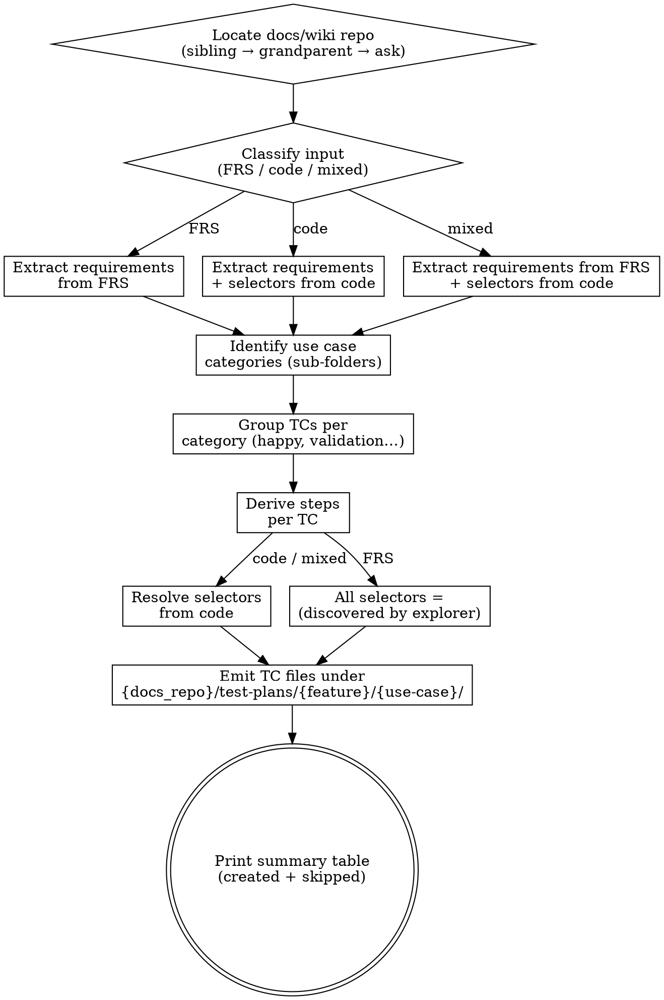

# Generate Test Plan from Source (FRS / Raw Code)

Parses a Functional Requirements Specification (FRS) document **or** raw application source code, extracts testable use cases, and emits individual TC files into the **docs/wiki repo** under `{docs_repo}/test-plans/{feature}/{use-case}/`. Each use case category (display, add, edit, delete, etc.) gets its own sub-folder. Each TC within a sub-folder covers one flow variant — happy path, validation, edge case, etc.

| Input type | Selector behaviour |
|---|---|
| **FRS** | All step selectors → `(discovered by explorer)` — FRS describes *what* the system does, not *how* the UI is wired. |
| **Raw code** | Selectors extracted from code (`data-testid`, `id`, `name`, `aria-label`, route paths). |

<HARD-GATE>
Do NOT invent selectors when the input is an FRS. Every step selector MUST be `(discovered by explorer)` or `n/a` (for pure-navigation steps). This applies to EVERY TC regardless of how obvious the UI element seems.
</HARD-GATE>

<HARD-GATE>
Do NOT write TC files inside the UI or API repo. Resolve the docs/wiki repo path via the discovery cascade in Step 1. If the cascade fails, STOP and ask the user — never silently fall back to a `./docs/` folder inside the current repo.
</HARD-GATE>

---

## Workspace Layout Assumption

This skill assumes a multi-repo workspace where the docs/wiki repo lives **alongside** the UI and API repos — typically as a sibling, sometimes one level higher:

```
workspace/
  ui/        ← frontend repo (skill may be run from here)
  api/       ← backend repo (skill may be run from here)
  docs/      ← wiki / knowledge repo (TC files land here)
```

Or a nested layout where the docs repo sits at the workspace root:

```
workspace/
  frontend/
    ui/      ← skill may be run from here
  backend/
    api/     ← skill may be run from here
  wiki/      ← docs repo lives here
```

Common names for the docs/wiki repo: `docs`, `wiki`, `knowledge`, `kb`, `documentation`. The skill discovers the path automatically (Step 1) and asks the user when discovery is ambiguous or fails.

Throughout this skill, the resolved path is referred to as `{docs_repo}`. All TC paths take the form `{docs_repo}/test-plans/{feature}/{use-case}/{feature}-TC-{NNN}.md`.

---

## Directory Structure

```
{docs_repo}/test-plans/
  {feature}/
    {use-case-a}/
      {feature}-TC-001.md     ← happy path
      {feature}-TC-002.md     ← validation / edge case
    {use-case-b}/
      {feature}-TC-003.md     ← happy path
      {feature}-TC-004.md     ← error handling
    ...
```

**Concrete example:**
```
{docs_repo}/test-plans/
  checklist/
    display/
      checklist-TC-001.md     ← Display items (Happy Path)
      checklist-TC-002.md     ← Display empty state
    add/
      checklist-TC-003.md     ← Add item (Happy Path)
      checklist-TC-004.md     ← Add item — empty description (Validation)
    edit/
      checklist-TC-005.md     ← Edit item (Happy Path)
    delete/
      checklist-TC-006.md     ← Delete item (Happy Path)
    toggle/
      checklist-TC-007.md     ← Toggle active/inactive
    reorder/
      checklist-TC-008.md     ← Reorder items up/down
```

**Naming rules:**
- Feature folder: kebab-case (`checklist`, `service-type`, `invoice`)
- Use case sub-folder: kebab-case verb or action (`display`, `add`, `edit`, `delete`, `toggle`, `reorder`, `search`, `export`)
- TC file: `{feature}-TC-{NNN}.md` — sequential across the entire feature, not per sub-folder

---

## TC File Format

```markdown
# {feature}-TC-{NNN}: {Title} ({Category})

**Feature:** {Feature Name}
**Scenario:** {Letter} — {Scenario description}
**Priority:** {High | Medium | Low}
**Type:** Functional
**Tags:** @smoke @{feature} @{feature}-TC-{NNN}

---

## Steps

| # | Step | Selector | Expected Result |
|---|------|----------|-----------------|
| 1 | Navigate to {path} | `n/a` | Page loads, {visible landmark} |
| 2 | Click "{button}" button | `[data-testid="{testid}"]` | {what happens} |
| 3 | Enter "{value}" in {field} | `[data-testid="{testid}"]` | {what appears} |
| 4 | Verify {element} | `(discovered by explorer)` | {expected state} |

---

## Preconditions
- {precondition 1}
- {precondition 2}

## Postconditions
- {postcondition 1}
- {postcondition 2}
```

### Format rules

- Title includes the category in parentheses: `(Happy Path)`, `(Validation)`, `(Edge Case)`, `(Error Handling)`
- Scenario line uses a letter prefix: `A — Create item (Happy Path)`, `B — Create item with empty name (Validation)`
- `@smoke` tag only on happy-path TCs
- Steps table columns: `#`, `Step`, `Selector`, `Expected Result` — in that order
- Selectors are backtick-wrapped: `` `[data-testid="..."]` ``, `` `n/a` ``, or `(discovered by explorer)` (no backticks for placeholder)
- Dynamic selectors use the template notation with curly braces: `` `[data-testid="checklist-row-{item.id}"]` ``
- Preconditions describe the required state **before** the test runs
- Postconditions describe the expected system state **after** all steps pass
- Horizontal rules (`---`) separate the header, steps, and conditions sections

---

## Overview

Use this skill when the user provides an FRS document (`.md`, `.docx`, `.pdf`, or pasted text) or source code files / a directory and asks for a test plan. The skill produces individual TC files in the **docs/wiki repo**, organized by feature and use case category.

**Core principle:** One flow variant = one TC file. One use case category = one sub-folder. Never mix unrelated actions in a single TC.

---

## Anti-Pattern: "I Can Guess the Selector"

When reading an FRS that says *"User clicks the Save button"*, it is tempting to emit `` `[data-testid="btn-save"]` `` because it seems obvious. Don't. The FRS describes behaviour, not markup. Guessed selectors cause silent test failures. Leave them as `(discovered by explorer)` and let the explorer skill resolve them against the real DOM.

---

## Anti-Pattern: "I'll Just Write Files Wherever"

When the docs/wiki repo isn't immediately at `../docs/`, it is tempting to fall back to a `./docs/` folder inside the current UI or API repo, or to write into the user's home directory. Don't. TC files belong in the docs/wiki repo, full stop. Run the discovery cascade in Step 1 and, if it fails, ask the user. Writing TC files into the wrong repo pollutes source control and breaks the explorer skill's downstream reads.

---

## When to Use

**Use when:**
- User provides an FRS document and asks for a test plan
- User points to raw source code (components, pages, API routes) and asks for a test plan
- User provides a mix of FRS + code and asks for a test plan

**Do NOT use when:**
- Input is user stories or acceptance criteria → use `skill:generate-test-plan-from-stories` instead
- User wants to update selectors in existing TCs → use `updateSelector` operation
- User wants to run or execute tests → different workflow entirely

---

## Checklist

You MUST complete these in order:

1. **Locate the docs/wiki repo** — run the discovery cascade (sibling → grandparent → ask) and record `{docs_repo}`
2. **Classify input** — determine FRS, raw code, or mixed
3. **Identify feature name** — derive the kebab-case feature name
4. **Extract testable requirements** — parse the source into a requirements list
5. **Identify use case categories** — determine the sub-folders (display, add, edit, delete, etc.)
6. **Group into TCs per category** — one TC per flow variant within each category
7. **Derive steps per TC** — write Step / Selector / Expected Result rows
8. **Resolve selectors (code input only)** — scan source for `data-testid`, `id`, `name`, `aria-label`
9. **Emit TC files** — create each file under the correct sub-folder in `{docs_repo}/test-plans/`
10. **Print summary** — show a table grouped by use case, including any skipped files

---

## Process Flow



---

## The Process

### Step 1: Locate the Docs/Wiki Repo

The TC files must land in the docs/wiki repo, not inside the UI or API repo. Resolve the path in this order — stop at the first match:

**1a. Check the conventional sibling path.**
- Test `../docs/` relative to the current working directory.
- If it exists and contains a `.git/` directory (or a `test-plans/` directory from a prior run), accept it.

**1b. Scan for sibling repos with conventional names.**
- From the parent of the current working directory, list immediate subdirectories.
- Match any of: `docs`, `wiki`, `knowledge`, `kb`, `documentation` (case-insensitive).
- Prefer ones that contain `.git/` (real repos) over plain folders.
- If exactly one match: accept it. If multiple matches: list them and ask the user which one.

**1c. Walk up one more level.**
- If the current repo is nested (e.g. `workspace/frontend/ui/`), the docs repo may live at the workspace root rather than as an immediate sibling.
- Check the grandparent directory for the same name patterns as 1b, with the same `.git/` preference and same ambiguity rule.

**1d. Ask the user.**
- If 1a–1c all fail, stop and ask:
  > "I couldn't find a docs/wiki repo near here. Where should I write the TC files? (e.g. `../docs`, `~/work/wiki`, or an absolute path)"
- Once the user replies, validate the path exists and is writable before proceeding.
- Optional: if the user names a path that doesn't exist yet, confirm whether to create it before continuing.

**Record the resolved base path** as `{docs_repo}`. All subsequent file operations write to `{docs_repo}/test-plans/...`.

- **Verify:**
  - `{docs_repo}` exists, is a directory, and is writable.
  - `{docs_repo}` is **outside** the current UI/API repo — guard against silently writing into a `./docs/` folder inside the source repo. If the resolved path is inside the current repo, treat it as a discovery failure and fall through to 1d.
- **On failure:** Do not fall back to writing inside the current repo. Stop and ask.

### Step 2: Classify Input

- Document (FRS, SRS, requirements doc): mode = `frs`
- Source code files or directory: mode = `code`
- Both provided: mode = `mixed` (requirements from FRS, selectors from code)
- **Verify:** You can name the mode and list every input file/section.
- **On failure:** Ask the user to clarify what they provided.

### Step 3: Identify Feature Name

- Derive a kebab-case feature name from the FRS title, module name, or dominant component name.
  - FRS "Service Type Management" → `service-type`
  - Component `BankSettingsChecklist.tsx` → `checklist`
- **Verify:** Feature name is kebab-case, module title is human-readable.
- **On failure:** Ask the user to confirm.

### Step 4: Extract Testable Requirements

**From FRS:**
- Scan for requirement identifiers (REQ-001, FR-01, SHALL/MUST statements).
- Capture each functional requirement as a single atomic statement.
- Capture preconditions, input constraints, expected outputs, error messages.
- Ignore non-functional requirements unless the user asks.

**From raw code:**
- Scan route definitions, page components, form handlers, API endpoints, dialogs.
- For each interactive element: what it does, what it validates, what it renders on success/failure.
- Capture conditional branches (if/else, switch, try/catch) — each branch is a candidate TC.
- Capture form validation rules (required fields, regex, min/max).

**From mixed:**
- FRS for the requirement list (what to test).
- Code to supplement with selectors and discover implicit behaviour the FRS missed.

- **Verify:** You have a numbered list of atomic requirements.
- **On failure:** List what you found and ask the user to confirm scope.

### Step 5: Identify Use Case Categories

Map requirements to use case categories. Each category becomes a sub-folder:

| Category | Sub-folder name | When to create |
|---|---|---|
| Display / Read | `display` | Component renders data in a list, table, or detail view |
| Create / Add | `add` | Form submission or dialog creates a new record |
| Update / Edit | `edit` | Form submission or dialog modifies an existing record |
| Delete / Remove | `delete` | Action removes a record (with or without confirmation) |
| Toggle state | `toggle` | Switch, checkbox, or button changes a boolean property |
| Reorder / Sort | `reorder` | Drag-and-drop or arrow buttons change item order |
| Search / Filter | `search` | Input filters or searches a list |
| Export / Download | `export` | Action exports data to a file |
| Authentication | `auth` | Login, logout, session management |
| Navigation | `navigation` | Route transitions, breadcrumbs, tabs |

Only create sub-folders for categories that have at least one TC. Don't create empty folders.

- **Verify:** Every requirement maps to a category. No category has zero TCs.
- **On failure:** Merge sparse categories or ask the user.

### Step 6: Group TCs per Category

Within each category sub-folder, create separate TCs for each flow variant:

1. **Happy path** — the primary success flow (Priority: High, Tag: `@smoke`)
2. **Validation / negative** — invalid inputs, boundary values (Priority: High)
3. **Edge cases** — empty states, max-length, concurrent actions (Priority: Medium)
4. **Error handling** — server errors, network failures, permission denied (Priority: Medium)

Assign scenario letters sequentially across the entire feature (A, B, C…), not per sub-folder. TC numbers are also sequential across the entire feature.

- **Verify:** Each category has at least a happy path TC. No TC exceeds 10 steps.
- **On failure:** Split large TCs; ensure every category has coverage.

### Step 7: Derive Steps per TC

Write steps in the table format:

```markdown
| # | Step | Selector | Expected Result |
|---|------|----------|-----------------|
| 1 | Navigate to {path} | `n/a` | Page loads, {landmark visible} |
| 2 | Click "{button}" | `[data-testid="{id}"]` | {what happens} |
```

Rules:
- Navigation steps: selector = `` `n/a` ``
- One atomic user action per step — don't combine "click Save and verify toast"
- Assertions can be their own step: `Verify {element} displays {state}`
- 2–10 steps per TC. If more, split.

### Step 8: Resolve Selectors (code and mixed modes only)

Scan source files in this priority order:

1. `data-testid="..."` — highest priority, purpose-built for testing
2. `id="..."` — reliable if unique
3. `name="..."` — form fields
4. `aria-label="..."` — accessible elements
5. Route path strings — for navigation steps
6. Stable CSS class used as a semantic hook

**Rules:**
- Dynamic selectors use template notation: `` `[data-testid="checklist-row-{item.id}"]` `` — preserve the `{variable}` to show the pattern.
- Never use positional selectors (`:nth-child`, `div > div > span`).
- Prefer `data-testid` over `id` over `name` over `aria-label`.

- **Verify:** Each resolved selector appears literally in the source code.
- **On failure:** Fall back to `(discovered by explorer)`.

### Step 9: Emit TC Files

For each TC:

- Create directory: `{docs_repo}/test-plans/{feature}/{use-case}/` if it doesn't exist.
- Create file: `{docs_repo}/test-plans/{feature}/{use-case}/{feature}-TC-{NNN}.md`
- TC numbers are sequential across the entire feature (not per sub-folder).
- Before creating, check if the file already exists. If it does, **skip** and add it to a `skipped` list with the reason `already exists`.

Track two counters across the entire emit phase:
- `created`: files written this run
- `skipped`: files that already existed (with their paths and reasons)

- **Verify:** Each created file matches the TC template, with all sections present (header, Steps, Preconditions, Postconditions).
- **On failure:** Fix the malformed TC before moving to the next.

### Step 10: Print Summary

Print a grouped summary table. Always include the resolved `{docs_repo}` path so the user can confirm where the files landed, and surface any skipped files at the bottom.

```markdown
## Test Plan Summary: {Feature Name}

**Total TCs:** {N}  ·  **Created:** {created}  ·  **Skipped:** {skipped_count}
**Selectors resolved:** {M}/{total}
**Output:** `{docs_repo}/test-plans/{feature}/`

### display/
| TC | Title | Priority | Selectors |
|----|-------|----------|-----------|
| TC-001 | Display Items (Happy Path) | High | 6/8 from code |
| TC-002 | Display Empty State | Medium | 2/3 from code |

### add/
| TC | Title | Priority | Selectors |
|----|-------|----------|-----------|
| TC-003 | Add Item (Happy Path) | High | 3/3 from code |
| TC-004 | Add Item — Empty Desc (Validation) | High | 2/3 from code |

### delete/
| TC | Title | Priority | Selectors |
|----|-------|----------|-----------|
| TC-005 | Delete Item (Happy Path) | High | 2/4 from code |

### Skipped
| TC | Path | Reason |
|----|------|--------|
| TC-001 | {docs_repo}/test-plans/checklist/display/checklist-TC-001.md | already exists |

📂 {docs_repo}/test-plans/{feature}/
```

If `skipped_count` is `0`, omit the `Skipped` table entirely.

---

## Operations

### `createTC(feature, use_case, tc_number, tc_content)`

Create `{docs_repo}/test-plans/{feature}/{use_case}/{feature}-TC-{NNN}.md`. Create directories if needed. Check if file exists first; if it does, skip and report.

### `updateSelector(feature, use_case, tc_number, step_number, selector)`

Update the Selector cell of a specific step row in `{docs_repo}/test-plans/{feature}/{use_case}/{feature}-TC-{NNN}.md`. Leave all other cells untouched.

### `readTC(feature, use_case, tc_number)`

Read and parse a single TC file from `{docs_repo}/test-plans/{feature}/{use_case}/{feature}-TC-{NNN}.md`. Return:
```json
{
  "feature": "checklist",
  "use_case": "display",
  "tc_number": "TC-001",
  "title": "Display Checklist Items (Happy Path)",
  "priority": "High",
  "steps": [
    { "number": 1, "step": "Navigate to checklist page", "selector": "n/a", "expected": "Page loads" }
  ],
  "preconditions": ["..."],
  "postconditions": ["..."]
}
```

### `listAll(feature)`

Scan `{docs_repo}/test-plans/{feature}/` recursively. Return all TCs grouped by use case sub-folder.

---

## Common Mistakes

**❌ Guessing selectors from FRS language** — "Save button" doesn't mean `[data-testid="btn-save"]` exists.
**✅ Leave as `(discovered by explorer)` — let the explorer resolve against real DOM.**

**❌ One giant TC with 20+ steps covering the whole module**
**✅ One flow variant per TC, 2–10 steps. Split by use case sub-folder.**

**❌ Combining "click Save" and "verify toast" into one step**
**✅ One atomic action per step row.**

**❌ Using dynamic selectors verbatim** — `data-testid={\`row-${id}\`}` breaks at runtime.
**✅ Use template notation: `[data-testid="checklist-row-{item.id}"]` to show the pattern.**

**❌ Numbering TCs per sub-folder** — TC-001 in display/ and TC-001 in add/ causes confusion.
**✅ TC numbers are sequential across the entire feature.**

**❌ Creating empty sub-folders for categories with no TCs**
**✅ Only create sub-folders that contain at least one TC file.**

**❌ Writing TC files inside the UI or API repo** — e.g. `ui/docs/test-plans/...` or `api/test-plans/...`.
**✅ All TC files live in the docs/wiki repo at `{docs_repo}/test-plans/{feature}/{use-case}/`.**

**❌ Stopping discovery at `../docs/` and giving up** — skipping the sibling-name scan and grandparent walk.
**✅ Run the full Step 1 cascade before asking the user; only ask when 1a–1c all miss.**

**❌ Silently skipping files that already exist without telling the user**
**✅ Track skipped files and report them in the Step 10 summary with paths and reasons.**

**❌ Missing Preconditions or Postconditions sections**
**✅ Every TC must have both — even if the precondition is just "User is logged in".**

---

## Example

**Scenario:** User provides `BankSettingsChecklist.tsx` (with `data-testid` attributes) from the `ui/` repo and asks for a test plan. The skill is invoked from inside `ui/`.

**Action taken:**
1. Ran the discovery cascade. `../docs/` did not exist. Sibling scan found `../wiki/` (a git repo). Accepted `{docs_repo} = ../wiki`.
2. Classified as `code`.
3. Feature: `checklist`.
4. Extracted: table rendering, add dialog, edit dialog, delete action, toggle switch, reorder buttons, empty state, validation (empty description).
5. Identified 6 use case categories: `display`, `add`, `edit`, `delete`, `toggle`, `reorder`.
6. Grouped into 8 TCs across the 6 categories.
7. Resolved 22/28 selectors from `data-testid`; 6 left as `(discovered by explorer)` or template notation.
8. Created TC files:

```
../wiki/test-plans/checklist/
  display/
    checklist-TC-001.md   ← Display Items (Happy Path)
    checklist-TC-002.md   ← Display Empty State (Edge Case)
  add/
    checklist-TC-003.md   ← Add Item (Happy Path)
    checklist-TC-004.md   ← Add Item — Empty Description (Validation)
  edit/
    checklist-TC-005.md   ← Edit Item (Happy Path)
  delete/
    checklist-TC-006.md   ← Delete Item (Happy Path)
  toggle/
    checklist-TC-007.md   ← Toggle Active/Inactive (Happy Path)
  reorder/
    checklist-TC-008.md   ← Reorder Items Up/Down (Happy Path)
```

9. Summary: 8 TCs across 6 sub-folders, 22/28 selectors from code, 0 skipped.

---

## Key Principles

- **TC files live in the docs/wiki repo** — `{docs_repo}/test-plans/...`, never inside the UI or API repo.
- **Discovery before asking** — run the full Step 1 cascade (sibling → grandparent) before prompting the user for a path.
- **One flow variant = one TC file** — happy path, validation, and edge case each get their own file.
- **One use case category = one sub-folder** — all TCs for "delete" live under `delete/`.
- **Sequential numbering across the feature** — TC-001 through TC-NNN, never resetting per sub-folder.
- **Selector honesty** — placeholder or template notation is always better than a guess.
- **Never overwrite, never silently skip** — check if a TC file exists before creating; if it does, skip and report it in the summary.
- **Complete sections** — every TC must include header, Steps table, Preconditions, and Postconditions.

---

## Red Flags

**Never:**
- Invent a `data-testid` that doesn't exist in the source code
- Overwrite an existing TC file without reading it first
- Silently skip an existing file without surfacing it in the summary
- Combine unrelated user actions into a single TC
- Emit more than 10 steps in a single TC — split into a new TC
- Skip Preconditions or Postconditions — both are mandatory
- Use positional CSS selectors
- Write TC files outside `{docs_repo}/test-plans/{feature}/{use-case}/` (i.e. inside the UI or API repo)
- Reset TC numbering per sub-folder
- Proceed without a confirmed `{docs_repo}` path

**If the FRS is ambiguous:**
- List the ambiguous requirements explicitly
- Ask the user to clarify before generating TCs
- Do not guess intent

**If the code has no testable UI elements:**
- Ask if the user wants API-level test plans instead
- Do not force UI-style TCs onto non-UI code

**If the discovery cascade fails:**
- Step 1a (`../docs/`) misses, 1b (sibling scan) misses, 1c (grandparent scan) misses
- Stop and ask the user where the docs/wiki repo lives
- Do not silently fall back to writing inside the current repo
- Do not pick one of multiple ambiguous matches without asking

**If the discovery cascade resolves to a path inside the current repo:**
- Treat as a failure and fall through to asking the user
- Writing TC files into the source repo pollutes the UI/API codebase

---

## Integration

**Required before:** Input files must be accessible (uploaded or path provided). The docs/wiki repo must exist somewhere reachable by the discovery cascade — or the user must be available to provide the path.
**Required after:** Explorer skill for resolving `(discovered by explorer)` selectors against live DOM.
**Alternative workflow:** `skill:generate-test-plan-from-stories` — when input is user stories instead of FRS/code.