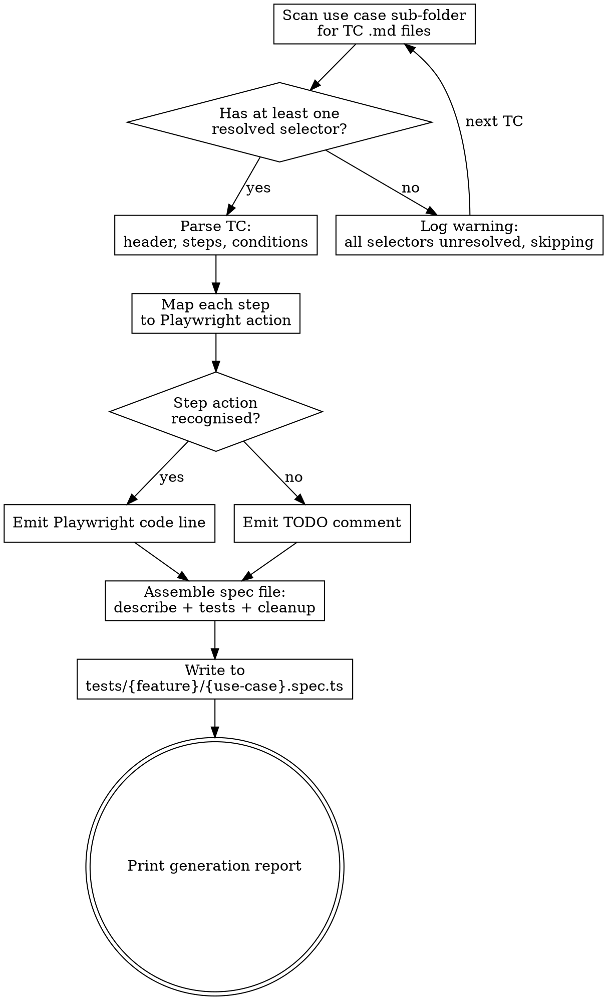

# Generate Test Suite from Test Plan

Reads TC files from `docs/wiki/test-plans/{feature}/{use-case}/`, parses each TC's Steps table, maps actions to Playwright TypeScript code, and outputs one `.spec.ts` file per use case sub-folder at `tests/{feature}/{use-case}.spec.ts`.

<HARD-GATE>
Do NOT generate test code for any TC that has `(discovered by explorer)` selectors on every interaction step. At least one step must have a resolved selector. TCs with all placeholders produce nothing but TODOs — flag them and skip.
</HARD-GATE>

---

## Overview

This skill is the bridge between test plans (documentation) and test suites (executable code). It reads the structured TC files produced by `skill:generate-test-plan`, infers Playwright actions from the step text, and emits TypeScript. One invocation processes one use case sub-folder and produces one spec file containing all TCs from that sub-folder.

**Core principle:** Generate only what the TC defines. Never fabricate selectors, invent steps, or add assertions the TC doesn't specify.

---

## Anti-Pattern: "I'll Add a Few Extra Assertions"

When generating code for a TC that checks "toast appears", it's tempting to also assert the toast disappears after 3 seconds, or that the list count incremented. Don't. The TC is the contract. If an assertion isn't in the Steps table, it doesn't belong in the generated code. File an issue or add a note — don't silently expand scope.

---

## When to Use

**Use when:**
- User asks to generate Playwright tests from the test plan
- A selector was updated in a TC and the spec file needs to be regenerated
- User asks to generate tests for a specific feature or use case

**Do NOT use when:**
- TCs have no resolved selectors — the output will be all TODOs
- User wants to create or modify the test plan itself → use `skill:generate-test-plan`
- User wants to run tests → that's `npx playwright test`

---

## Input / Output Mapping

```
INPUT:  docs/wiki/test-plans/{feature}/{use-case}/{feature}-TC-NNN.md
OUTPUT: tests/{feature}/{use-case}.spec.ts
```

**Examples:**
```
docs/wiki/test-plans/checklist/display/checklist-TC-001.md  ─┐
docs/wiki/test-plans/checklist/display/checklist-TC-002.md  ─┤→ tests/checklist/display.spec.ts
                                                              │
docs/wiki/test-plans/checklist/add/checklist-TC-003.md      ─┐
docs/wiki/test-plans/checklist/add/checklist-TC-004.md      ─┤→ tests/checklist/add.spec.ts
                                                              │
docs/wiki/test-plans/checklist/delete/checklist-TC-006.md   ─┘→ tests/checklist/delete.spec.ts
```

---

## TC File Input Format

The skill expects TC files in this exact format (produced by `skill:generate-test-plan`):

```markdown
# {feature}-TC-{NNN}: {Title} ({Category})

**Feature:** {Feature Name}
**Scenario:** {Letter} — {Scenario description}
**Priority:** {High | Medium | Low}
**Type:** Functional
**Tags:** @smoke @{feature} @{feature}-TC-{NNN}

---

## Steps

| # | Step | Selector | Expected Result |
|---|------|----------|-----------------|
| 1 | Navigate to /path | `n/a` | Page loads |
| 2 | Click "Save" button | `[data-testid="btn-save"]` | Record saved |

---

## Preconditions
- ...

## Postconditions
- ...
```

---

## Checklist

You MUST complete these in order:

1. **Read TC files** — scan the target use case sub-folder for all `.md` files
2. **Check selector coverage** — skip any TC where every interaction step is `(discovered by explorer)`
3. **Parse each TC** — extract header fields, steps table, preconditions, postconditions
4. **Map steps to Playwright** — infer action type from step text, apply code mapping
5. **Assemble spec file** — wrap all tests in a `test.describe()` with shared setup
6. **Write spec file** — output to `tests/{feature}/{use-case}.spec.ts`
7. **Print generation report** — show what was generated, what was skipped

---

## Process Flow



---

## The Process

### Step 1: Read TC Files

- Scan `docs/wiki/test-plans/{feature}/{use-case}/` for all `*.md` files.
- Sort by TC number (extract NNN from filename) to ensure deterministic test order.
- If the directory is empty or doesn't exist, stop and report "No TCs found."
- **Verify:** You have a sorted list of TC file paths.
- **On failure:** Check the feature and use-case names for typos.

### Step 2: Check Selector Coverage

- For each TC, count how many interaction steps (non-`n/a`) have a resolved selector vs `(discovered by explorer)`.
- If **every** interaction step is `(discovered by explorer)`, skip the TC: `⚠ Skipping {feature}-TC-{NNN}: no resolved selectors`.
- TCs with a mix of resolved and placeholder selectors are fine — placeholders become TODO comments.
- **Verify:** At least one TC has at least one resolved selector. If zero, stop and report — don't generate an empty spec file.
- **On failure:** Tell the user which TCs need selector resolution (via explorer or code inspection).

### Step 3: Parse Each TC

Extract from the TC file:

```json
{
  "tc_number": "checklist-TC-001",
  "title": "Display Checklist Items (Happy Path)",
  "feature": "Checklist",
  "scenario": "A — Display items in table with all columns and controls visible",
  "priority": "High",
  "type": "Functional",
  "tags": ["@smoke", "@checklist", "@checklist-TC-001"],
  "steps": [
    { "number": 1, "step": "Navigate to checklist page", "selector": "n/a", "expected": "Page loads, title visible" },
    { "number": 2, "step": "Verify page title visible", "selector": "[data-testid=\"checklist-title\"]", "expected": "Title displays with icon" }
  ],
  "preconditions": ["Checklist has at least 3 items configured"],
  "postconditions": ["Page displays without errors"]
}
```

**Parsing rules:**
- Tags: split the `**Tags:**` value by spaces, each token is a tag.
- Steps: parse the Markdown table rows. Strip backticks from selector values.
- `(discovered by explorer)` selectors → treat as `null` (emit TODO).
- `n/a` selectors → navigation or assertion step, no element targeting needed.
- **Verify:** Every TC parses without error. All required fields present.
- **On failure:** Log the parse error with file path and line number. Skip the TC.

### Step 4: Map Steps to Playwright Actions

For each step, infer the Playwright action from the **Step** text using keyword matching:

| Step text pattern | Action type | Playwright code |
|---|---|---|
| `Navigate to {path}` | `navigate` | `await page.goto('{path}');` |
| `Click "{label}" button/link/icon` | `click` | `await page.locator('{selector}').click();` |
| `Enter "{value}" in {field}` | `fill` | `await page.locator('{selector}').fill('{value}');` |
| `Select "{option}" from {dropdown}` | `select` | `await page.locator('{selector}').selectOption('{option}');` |
| `Toggle {switch/checkbox}` | `click` | `await page.locator('{selector}').click();` |
| `Verify {element} visible/present/displays` | `assert_visible` | `await expect(page.locator('{selector}')).toBeVisible();` |
| `Verify {element} contains/reads/shows "{text}"` | `assert_text` | `await expect(page.locator('{selector}')).toContainText('{text}');` |
| `Verify {element} not visible/hidden/gone` | `assert_hidden` | `await expect(page.locator('{selector}')).not.toBeVisible();` |
| `Verify URL is/contains {path}` | `assert_url` | `await expect(page).toHaveURL('{path}');` |
| `Wait for {element/event}` | `wait` | `await page.locator('{selector}').waitFor();` |
| Unrecognised pattern | `unknown` | `// TODO: Manual step — "{step text}"` |

**Expected Result column** → generate an assertion after the action:
- If the Expected Result describes visibility, add an `assert_visible` line.
- If it describes text content, add an `assert_text` line.
- If it describes navigation, add an `assert_url` line.
- If ambiguous, add a comment: `// Expected: {expected result text}`.

**Selector handling:**
- Selector is a `data-testid`: `await page.locator('[data-testid="..."]').click();`
- Selector is an `id`: `await page.locator('#...').click();`
- Selector starts with `role=`: use `page.getByRole()` syntax (see action-to-playwright.md).
- Selector is `n/a`: no locator needed (navigation or page-level assertion).
- Selector is `null` / `(discovered by explorer)`: emit `// TODO: selector not found for step {N}`.
- Selector contains `{variable}` template: emit as-is with a comment noting it's dynamic.

**Value substitution for fill actions:**
- Email fields → `process.env.TEST_EMAIL!`
- Password fields → `process.env.TEST_PASSWORD!`
- Test data values from TC → use literal string
- Unique test data → `` `TC{NNN} ${Date.now()}` `` for record names

- **Verify:** Every step produces either a Playwright code line or a TODO comment. No steps silently dropped.
- **On failure:** Emit a TODO for any step that can't be mapped.

### Step 5: Assemble Spec File

Wrap all generated test functions in the file template:

```typescript
import { test, expect } from '@playwright/test';

// Feature: {Feature Name}
// Use case: {use-case}
// Source: docs/wiki/test-plans/{feature}/{use-case}/

test.describe('{Feature Name} — {Use Case Title}', () => {
  // Include only for auth tests:
  // test.use({ storageState: { cookies: [], origins: [] } });

  let createdRecords: string[] = [];

  test.afterEach(async ({ page }) => {
    for (const record of createdRecords) {
      try {
        // TODO: implement cleanup for this feature's record type
      } catch {
        // record already gone or cleanup failed — safe to ignore
      }
    }
    createdRecords = [];
  });

  test('{TC title} {tags}', async ({ page }) => {
    // Step 1: {step text}
    await page.goto('/checklist');
    // Expected: Page loads, title visible

    // Step 2: {step text}
    await expect(page.locator('[data-testid="checklist-title"]')).toBeVisible();
    // Expected: Title displays with icon

    // ...
  });

  test('{next TC title} {tags}', async ({ page }) => {
    // ...
  });
});
```

**Assembly rules:**
- One `test.describe()` per spec file, named `{Feature Name} — {Use Case Title}`.
- One `test()` per TC, in TC number order.
- Test title = TC title + space-separated tags: `'Display Checklist Items (Happy Path) @smoke @checklist @checklist-TC-001'`.
- If any tag is `@skip`, use `test.skip(...)` instead of `test(...)`.
- `createdRecords` array and `afterEach` block always present.
- After any step that creates a record, add: `createdRecords.push(recordName);`.
- Add a comment before each step with the original step text.
- Add a comment after each step with the expected result.
- Auth override (`test.use({ storageState: ... })`) only for TCs in `auth/` or `login/` sub-folders.

### Step 6: Write Spec File

- Create directory `tests/{feature}/` if it doesn't exist.
- Write to `tests/{feature}/{use-case}.spec.ts`.
- If the file already exists, **overwrite it** — spec files are generated artifacts, not hand-edited. (This is the opposite of TC files which must never be overwritten.)
- **Verify:** File exists, TypeScript syntax is valid (no unclosed brackets, matching quotes).
- **On failure:** Fix syntax before writing.

### Step 7: Print Generation Report

```markdown
## Generation Report: {feature}/{use-case}

**Spec file:** `tests/{feature}/{use-case}.spec.ts`
**TCs processed:** {N}
**TCs skipped (no resolved selectors):** {M}

| TC | Title | Steps | TODOs | Result |
|----|-------|-------|-------|--------|
| TC-001 | Display Items (Happy Path) | 8 | 1 | ✅ generated |
| TC-002 | Display Empty State | 4 | 0 | ✅ generated |
| TC-003 | Add Item (Happy Path) | — | — | ⚠ skipped (no selectors) |

**TODOs remaining:** {count}
- TC-001 Step 8: selector not found
```

---

## Behavioral Rules (Karpathy Guidelines)

These rules govern how code is generated. Violations are bugs.

**Think before coding:**
- If a step text is ambiguous (could be a click or a fill), emit a TODO with both interpretations — don't pick silently.
- If a selector looks wrong (e.g. `data-testid` on a non-interactive element for a click action), emit a comment flagging it.
- If preconditions require test setup that can't be inferred, emit a `// TODO: setup required` block.

**Simplicity first:**
- No helper functions, no page objects, no utility wrappers. Raw Playwright calls only.
- No abstractions for "reusable steps" — each test is self-contained.
- No retry logic, no custom waits beyond what the TC specifies.
- If the generated code exceeds 50 lines for a single test, something is wrong — the TC probably needs splitting.

**Surgical changes:**
- When regenerating a spec file after a selector update, regenerate the entire file — don't try to patch individual lines. Spec files are generated artifacts.
- Never modify TC files from this skill. TC files are upstream; spec files are downstream.
- Don't add imports beyond `{ test, expect }` from `@playwright/test` unless the TC explicitly requires it.

**Goal-driven execution:**
- Each test function must have at least one `expect()` assertion. If the TC has no assertions in the Steps table, add: `// TODO: no assertions found — add expected result to TC`.
- Each test must be runnable in isolation — no dependency on other tests.
- The generated file must pass `tsc --noEmit` (TypeScript compilation without errors).

---

## Common Mistakes

**❌ Generating code for TCs with zero resolved selectors** — the output is nothing but TODO comments, useless as a test.
**✅ Skip TCs where every interaction step is `(discovered by explorer)`. Log a warning.**

**❌ Adding assertions the TC doesn't specify** — e.g. checking toast disappears when TC only says "toast appears".
**✅ Generate only what the Steps table defines. Add a comment for anything extra.**

**❌ Creating page objects or helper functions** — overcomplicates, hides logic, breaks isolation.
**✅ Raw Playwright calls in each test. Copy-paste is fine for generated code.**

**❌ Silently dropping steps that can't be mapped** — test looks complete but isn't.
**✅ Every step produces a code line or a TODO comment. No silent drops.**

**❌ Hand-editing generated spec files** — they'll be overwritten on next generation.
**✅ Fix the TC file upstream, then regenerate.**

**❌ Using `page.waitForTimeout()` for timing** — flaky and slow.
**✅ Use `page.locator().waitFor()` or Playwright auto-wait.**

---

## Example

**Scenario:** Generate tests for `checklist/display/` which contains two TCs with resolved selectors.

**Input:**
```
docs/wiki/test-plans/checklist/display/checklist-TC-001.md  (7/8 selectors resolved)
docs/wiki/test-plans/checklist/display/checklist-TC-002.md  (3/3 selectors resolved)
```

**Output:** `tests/checklist/display.spec.ts`

```typescript
import { test, expect } from '@playwright/test';

// Feature: Checklist
// Use case: display
// Source: docs/wiki/test-plans/checklist/display/

test.describe('Checklist — Display', () => {
  let createdRecords: string[] = [];

  test.afterEach(async ({ page }) => {
    for (const record of createdRecords) {
      try {
        // TODO: implement cleanup for this feature's record type
      } catch {
        // record already gone or cleanup failed — safe to ignore
      }
    }
    createdRecords = [];
  });

  test('Display Checklist Items (Happy Path) @smoke @checklist @checklist-TC-001', async ({ page }) => {
    // Step 1: Navigate to checklist page
    await page.goto('/checklist');
    // Expected: Page loads, title "LC Issuance Checklist" visible

    // Step 2: Verify page title visible
    await expect(page.locator('[data-testid="checklist-title"]')).toBeVisible();
    // Expected: Title displays with ClipboardCheck icon

    // Step 3: Verify subtitle visible
    await expect(page.locator('[data-testid="checklist-subtitle"]')).toBeVisible();
    // Expected: Subtitle reads "Configure the verification checklist..."

    // Step 4: Verify "Add Item" button present
    await expect(page.locator('[data-testid="btn-add-item"]')).toBeVisible();
    // Expected: Button visible with Plus icon

    // Step 5: Verify checklist card rendered
    await expect(page.locator('[data-testid="checklist-card"]')).toBeVisible();
    // Expected: Card displays with "Checklist Items" header

    // Step 6: Verify table headers present
    await expect(page.locator('[data-testid="checklist-table-header"]')).toBeVisible();
    // Expected: Headers show: S.N, Description, Status, Order, Actions

    // Step 7: Verify first item row displays
    await expect(page.locator('[data-testid="checklist-row-{item.id}"]')).toBeVisible();
    // Expected: Row shows item data
    // NOTE: selector is dynamic — {item.id} must be resolved at runtime

    // Step 8: Verify all columns populated per row
    // TODO: selector not found for step 8 — (discovered by explorer)
    // Expected: S.N, description, status toggle, order controls, action buttons all visible
  });

  test('Display Empty State (Edge Case) @checklist @checklist-TC-002', async ({ page }) => {
    // Step 1: Navigate to checklist page (with empty data store)
    await page.goto('/checklist');
    // Expected: Page loads

    // Step 2: Verify empty state message
    await expect(page.locator('[data-testid="checklist-empty-state"]')).toBeVisible();
    // Expected: "No checklist items configured" message visible

    // Step 3: Verify table has no data rows
    await expect(page.locator('[data-testid="checklist-table-body"]')).toBeEmpty();
    // Expected: Table body contains no item rows
  });
});
```

**Generation report:**
```
## Generation Report: checklist/display

**Spec file:** tests/checklist/display.spec.ts
**TCs processed:** 2
**TCs skipped:** 0

| TC | Title | Steps | TODOs | Result |
|----|-------|-------|-------|--------|
| TC-001 | Display Items (Happy Path) | 8 | 1 | ✅ generated |
| TC-002 | Display Empty State | 3 | 0 | ✅ generated |

**TODOs remaining:** 1
- TC-001 Step 8: selector not found — (discovered by explorer)
```

---

## Key Principles

- **TC is the contract** — generate exactly what the Steps table defines, nothing more.
- **Every step produces output** — either a Playwright code line or a TODO comment. No silent drops.
- **Spec files are disposable** — they are generated artifacts. Overwrite freely; fix upstream in TCs.
- **TC files are sacred** — this skill reads them, never writes to them.
- **No abstractions** — raw Playwright calls, no page objects, no helpers, no shared state between tests.
- **Karpathy-compliant** — simple, surgical, goal-driven, assumptions surfaced.

---

## Red Flags

**Never:**
- Generate code for a TC where every interaction step is `(discovered by explorer)`
- Fabricate a selector that doesn't appear in the TC file
- Add assertions beyond what the Steps table specifies
- Create page objects, helper functions, or utility wrappers
- Use `page.waitForTimeout()` — use Playwright auto-wait or `waitFor()`
- Modify TC files from this skill — TC files are read-only input
- Share state between `test()` functions — each test is isolated
- Skip steps silently — unmapped steps must produce a TODO

**If a selector is `(discovered by explorer)`:**
- Emit `// TODO: selector not found for step {N}`
- Do not guess or fabricate a selector
- Flag in the generation report

**If a step text can't be mapped to a Playwright action:**
- Emit `// TODO: Manual step — "{step text}"`
- Do not skip the step

---

## Integration

**Required before:** `skill:generate-test-plan` — TC files must exist with at least some resolved selectors.
**Reads from:** `docs/wiki/test-plans/{feature}/{use-case}/{feature}-TC-NNN.md`
**Writes to:** `tests/{feature}/{use-case}.spec.ts`
**Reference:** `action-to-playwright.md` — full code mapping table, value substitution, auth override rules.
**Alternative workflow:** Manual Playwright authoring — when TCs are too complex for automated generation.