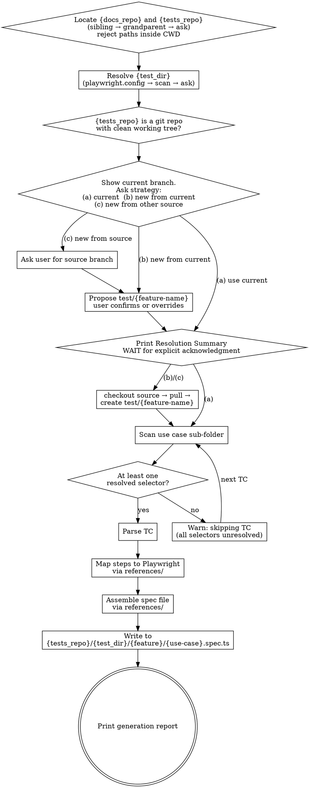

# Generate Test Suite from Test Plan

Reads TC files from `{docs_repo}/test-plans/{feature}/{use-case}/`, parses each TC's Steps table, maps actions to Playwright TypeScript via `references/action-to-playwright.md`, and outputs one `.spec.ts` file per use case sub-folder into `{tests_repo}/{test_dir}/{feature}/{use-case}.spec.ts` — on the branch the user chose (current, a new `test/{feature-name}` from current, or a new `test/{feature-name}` from a different source).

<HARD-GATE>
Do NOT generate test code for any TC where every interaction step is `(discovered by explorer)`. At least one step must have a resolved selector. TCs with all placeholders produce nothing but TODOs — flag them and skip.
</HARD-GATE>

<HARD-GATE>
Do NOT write spec files until the branching strategy has been resolved by explicit user choice in Step 4. The user must choose one of: (a) write to the current branch, (b) create a new `test/{feature-name}` from current, or (c) create a new `test/{feature-name}` from a different source branch. Never write to whatever branch happens to be checked out without that explicit choice — checking out a branch and running the skill is not the same as picking option (a). When (b) or (c) is chosen, the new branch must be created before any spec file is written.
</HARD-GATE>

<HARD-GATE>
Do NOT create any directory or write any file until `{tests_repo}` has been resolved to an absolute path that is **outside** the current working directory and confirmed to be a separate git repo. If the discovery cascade in Step 1 fails, STOP and ask the user. NEVER create a `tests/`, `e2e/`, or any other folder inside the repo the skill is invoked from. The same rule applies to `{docs_repo}`. This gate exists because past runs have silently created `./tests/` inside the UI repo when discovery failed — the single most damaging failure mode this skill can produce.
</HARD-GATE>

<HARD-GATE>
Do NOT create the feature branch (Step 8) or write any spec file (Step 14) until the Resolution Summary block (Step 7) has been printed AND the user has replied with explicit acknowledgment ("proceed", "ok", "yes") or a corrected value. Discovery completing internally is not the same as the user having seen what was discovered. The summary surfaces resolved absolute paths, branch strategy, source branch, target branch, and exact write target so a wrong tests-repo, wrong test_dir, wrong branch choice, or path-inside-CWD can be caught before any side effect lands. Silence, unrelated messages, or "looks good" without addressing the summary do NOT count as acknowledgment — re-prompt explicitly. This gate exists because Steps 1–6 alone have proven insufficient: prior runs created `./tests/` inside CWD anyway.
</HARD-GATE>

---

## Workspace Layout

The docs/wiki repo and the tests repo live alongside the UI/API repos — typically as siblings, sometimes one level higher.

```
workspace/                       workspace/
  ui/                              frontend/
  api/                               ui/
  docs/   ← {docs_repo}            backend/
  tests/  ← {tests_repo}             api/
                                   wiki/   ← {docs_repo}
                                   e2e/    ← {tests_repo}
```

Common docs-repo names: `docs`, `wiki`, `knowledge`, `kb`, `documentation`.
Common tests-repo names: `tests`, `test`, `e2e`, `qa`, `qa-automation`, `playwright`, `playwright-tests`, `automation`.

Inside `{tests_repo}`, spec files live in `{test_dir}` — the directory configured by `testDir` in `playwright.config.{ts,js,mjs}`. This skill resolves `{test_dir}` from the config (Step 2) so files land where Playwright actually looks.

---

## Overview

Bridge between test plans (documentation) and test suites (executable code). Reads the structured TC files produced by `skill:generate-test-plan`, infers Playwright actions from the step text, and emits TypeScript into a separate tests repo on a feature branch.

**Core principles:**
- Generate only what the TC defines. Never fabricate selectors, invent steps, or add assertions the TC doesn't specify.
- Always ask the user how to handle the branch — write to current, branch off current, or branch off a different source. Never write specs onto the checked-out branch without an explicit choice.
- Branch creation + file writes only — the user reviews and commits. Never auto-commit, push, or merge.
- Resolve `{tests_repo}` and `{test_dir}` from real config, not assumptions.

---

## Anti-Patterns

**"I'll just create `./tests/` here."** When the discovery cascade fails, the worst possible failure is silently creating a `tests/` folder inside the current working directory. It pollutes the source repo, won't be picked up by the actual Playwright runner, and creates the illusion the skill worked. If discovery fails, STOP and ask.

**"I'll write to the tests-repo root."** Even when `{tests_repo}` resolves correctly, writing to `{tests_repo}/{feature}/...` is wrong if `playwright.config.ts` sets `testDir`. Always resolve `{test_dir}` first.

**"I'll just write to the current branch."** Writing to the current branch is fine *when the user explicitly chose option (a) in Step 4*. What's never fine is writing to it *because it happens to be checked out*, without asking. The default proposal is still `test/{feature-name}` so the user gets a clean diff; current-branch writes are an opt-in.

**"I'll add a few extra assertions."** The TC is the contract. If an assertion isn't in the Steps table, it doesn't belong in the generated code.

---

## When to Use

**Use when:** the user asks to generate Playwright tests from the test plan, a selector was updated in a TC and the spec needs regenerating, or the user wants tests for a specific feature/use case.

**Do NOT use when:** TCs have no resolved selectors (output would be all TODOs), the user wants to modify the test plan itself (use `skill:generate-test-plan`), or the user wants to run tests (use `npx playwright test`).

---

## Input / Output

```
INPUT:  {docs_repo}/test-plans/{feature}/{use-case}/{feature}-TC-NNN.md   (read-only)
OUTPUT: {tests_repo}/{test_dir}/{feature}/{use-case}.spec.ts              (on the user-chosen branch)
```

All output files for one feature land on a single branch — either the current branch (if option (a) was chosen in Step 4) or a `test/{feature-name}` branch (e.g. `test/checklist`).

---

## TC File Input Format

The skill expects TC files produced by `skill:generate-test-plan`:

```markdown
# {feature}-TC-{NNN}: {Title} ({Category})

**Feature:** {Feature Name}
**Scenario:** {Letter} — {Scenario description}
**Priority:** {High | Medium | Low}
**Type:** Functional
**Tags:** @smoke @{feature} @{feature}-TC-{NNN}

---

## Steps

| # | Step | Selector | Expected Result |
|---|------|----------|-----------------|
| 1 | Navigate to /path | `n/a` | Page loads |
| 2 | Click "Save" button | `[data-testid="btn-save"]` | Record saved |

---

## Preconditions
- ...

## Postconditions
- ...
```

---

## Checklist

You MUST complete these in order:

1. **Locate `{docs_repo}` and `{tests_repo}`** — discovery cascade (sibling → grandparent → ask), reject any path inside CWD
2. **Resolve `{test_dir}` inside `{tests_repo}`** — read `playwright.config.{ts,js,mjs}`, fall back to folder scan, then ask
3. **Verify tests repo is a git repo** — `.git/` exists, working tree clean (or warn user)
4. **Show current branch state and ask branch strategy** — present (a) write to current, (b) new `test/` from current, (c) new `test/` from different source
5. **Resolve source branch** — auto-set to current if (b), ask user if (c), N/A if (a)
6. **Resolve feature branch name** — propose `test/{feature-name}` if creating new, target = current branch if (a)
7. **Announce Resolution Summary and wait for explicit acknowledgment** — print resolved paths/strategy/branches/write target, stop until user replies "proceed" or corrects a value
8. **Create the feature branch** — checkout source, pull, then create. Skip entirely if option (a)
9. **Read TC files** — scan the use case sub-folder, sort by TC number
10. **Check selector coverage** — skip any TC where every interaction step is `(discovered by explorer)`
11. **Parse each TC** — extract header, steps, preconditions, postconditions
12. **Map steps to Playwright** — use `references/action-to-playwright.md`
13. **Assemble spec file** — use the file template from `references/action-to-playwright.md`
14. **Write spec file** — re-confirm the CWD-containment guard before writing
15. **Print generation report** — show resolved paths, strategy, branch, generated/skipped counts, next steps

---

## Process Flow



---

## The Process

### Step 1: Locate `{docs_repo}` and `{tests_repo}`

Both must resolve **outside** CWD. Run this cascade for each, stopping at the first match:

**1a. Conventional sibling path.** Test `../docs/` (docs) or `../tests/` (tests). Accept if it exists and contains `.git/`.

**1b. Sibling scan with name variants.** From the parent of CWD, list immediate subdirectories. Match (case-insensitive):
- Docs: `docs`, `wiki`, `knowledge`, `kb`, `documentation`
- Tests: `tests`, `test`, `e2e`, `qa`, `qa-automation`, `playwright`, `playwright-tests`, `automation`

Prefer real git repos (containing `.git/`). For tests, additionally prefer candidates with `playwright.config.{ts,js,mjs}` at the root. If multiple matches → list and ask the user. If exactly one → accept.

**1c. Grandparent walk.** If CWD is nested (e.g. `workspace/frontend/ui/`), apply the same name patterns and preferences to the grandparent.

**1d. Ask the user.** If 1a–1c miss for a repo, prompt:
> "I couldn't find a docs/wiki repo near here. Where should I read TC files from? (e.g. `../docs`, `~/work/wiki`, or an absolute path)"

> "I couldn't find a tests repo near here. Where should I write spec files? (e.g. `../e2e`, `~/work/playwright`, or an absolute path)"

Validate user-provided paths exist, are directories, and (for tests) contain `.git/`.

**CWD-containment guard (critical).** Resolve both paths and CWD to absolute form. If a resolved repo path **starts with** the CWD path, reject and fall through to 1d. Catches `./tests/`, `./docs/`, `./subdir/tests/`, etc.

**Verify:** Both paths exist and are directories. Neither is inside CWD. `{tests_repo}/.git` exists. `{docs_repo}/test-plans/` exists.

**On failure:** Stop. Ask. Never silently create directories in CWD.

### Step 2: Resolve `{test_dir}` Inside `{tests_repo}`

Playwright reads test files from a directory configured by `testDir` in `playwright.config.{ts,js,mjs}`. Resolve in this order:

**2a. Read the config.** Check `{tests_repo}/playwright.config.ts`, then `.js`, then `.mjs`. Extract `testDir` with regex: `testDir:\s*['"]([^'"]+)['"]`. Resolve relative to `{tests_repo}` (e.g. `./tests` → `{tests_repo}/tests`).

If `projects:` array contains multiple `testDir` values → list project names, ask the user which to target. Don't pick silently.

If the regex misses (variable or computed value) → fall through to 2b.

**2b. Folder scan.** Look for `tests/`, `test/`, `e2e/`, `specs/`, `__tests__/` at `{tests_repo}` root. Exactly one match → use it. Multiple → ask. None → fall through to 2c.

**2c. Ask the user.** Prompt:
> "I couldn't determine where spec files should go inside `{tests_repo}`. Should I create a `tests/` directory at the root, or use a different path?"

If the user names a path that doesn't exist, confirm whether to create it.

**Special case — config exists but `testDir` unset.** Playwright defaults to the config's directory (i.e. `{tests_repo}` root). Warn:
> "`playwright.config.ts` exists but doesn't set `testDir`, so Playwright defaults to the repo root. Spec files would land at `{tests_repo}/{feature}/{use-case}.spec.ts`. Confirm or specify a different directory."

Proceed only with explicit confirmation.

**Verify:** `{test_dir}` exists (or user confirmed creating it) and is inside `{tests_repo}` (not symlinked elsewhere).

### Step 3: Verify Tests Repo is a Git Repo

```bash
git -C {tests_repo} status --porcelain
```

If `.git/` is missing → stop. If the tree is dirty → warn the user, list the changed files, ask to (a) stash, (b) abort, or (c) commit manually. Never auto-stash.

### Step 4: Show Current Branch State & Choose Branch Strategy

This is the branch-strategy gate — always asked, never assumed. Run:
```bash
git -C {tests_repo} branch --show-current
git -C {tests_repo} status --porcelain
git -C {tests_repo} log --oneline -3
```

Print exactly this prompt to the user, filling in the live values:

```
Tests repo: {tests_repo}
Current branch: {current_branch}
Working tree:   {clean | dirty: N file(s)}

How should I handle the branch for these specs?
(a) Write to current branch `{current_branch}` — no new branch created
(b) Create new `test/{feature-name}` branch from current branch `{current_branch}`
(c) Create new `test/{feature-name}` branch from a different source branch
```

**Wait for the user's choice.** Do not assume. Treat any unclear reply as a re-prompt trigger.

**On (a) — write to current:**
- Set `branch_strategy = "current"`, `target_branch = {current_branch}`, `source_branch = N/A`.
- Skip Step 5 and Step 6, jump straight to Step 7 (announce).
- Step 8 (branch creation) will be skipped.

**On (b) — new branch from current:**
- Set `branch_strategy = "new-from-current"`, `source_branch = {current_branch}`.
- Skip Step 5 (source already known), proceed to Step 6.

**On (c) — new branch from different source:**
- Set `branch_strategy = "new-from-source"`.
- Proceed to Step 5.

**Dirty working tree caveat.** If the working tree is dirty AND the user picks (a), warn explicitly: *"Working tree has uncommitted changes. Spec files will be written alongside them. Continue? (yes/no)"* — wait for confirmation. For (b)/(c), Step 3's existing dirty-tree handling already covers this.

### Step 5: Resolve Source Branch (only when strategy is `new-from-source`)

Show available branches:
```bash
git -C {tests_repo} branch -a | head -20
```

Ask: *"Which branch should the new feature branch be based on?"* — never assume `main` or `develop`. Validate with `git -C {tests_repo} rev-parse --verify {source-branch}`. If not found, list available branches and re-prompt.

If strategy is `current` or `new-from-current`, skip this step (source already determined).

### Step 6: Resolve Feature Branch Name (only when creating a new branch)

If strategy is `current`, skip — there is no new branch to name; `target_branch` is the current branch.

For `new-from-current` or `new-from-source`, propose `test/{feature-name}` (kebab-case from the TC files). Show and ask:
> "Branch name will be `test/{feature-name}` — confirm or provide a different name."

If the branch already exists locally, offer:
- (a) Switch to existing branch and add files there
- (b) Delete and recreate from source
- (c) Pick a different name

Never silently overwrite. After confirmation, set `target_branch` to the resolved name.

### Step 7: Announce Resolution Summary & Wait for Explicit Acknowledgment

Before creating any branch or writing anything, print the Resolution Summary in this exact fixed format and STOP. Do not proceed to Step 8 until the user replies "proceed" / "ok" / "yes", or provides a corrected value.

```
═══════════════════════════════════════════════════════════
RESOLUTION SUMMARY — confirm before any side effect
═══════════════════════════════════════════════════════════
cwd:                {absolute path of CWD}
docs_repo:          {absolute path}
tests_repo:         {absolute path}
test_dir:           {relative inside tests_repo}
cwd_inside_tests:   NO              ← MUST be NO
branch_strategy:    {current | new-from-current | new-from-source}
source_branch:      {branch | N/A for current}
target_branch:      {current_branch | test/{name}}    {(no creation) | (NEW) | (EXISTS-{action})}
write_target:       {tests_repo}/{test_dir}/{feature}/{use-case}.spec.ts
TCs to generate:    {N}    skipped: {M}
═══════════════════════════════════════════════════════════

Reply "proceed" to {write specs to current branch | create the branch and write specs}, or
provide corrections (e.g. tests_repo=/abs/other/path,
strategy=b, source_branch=main, target_branch=test/other-name).
```

**Why this gate exists.** Steps 1–6 specify discovery and prompting in detail, yet prior runs have still created `./tests/` inside the UI repo. The Resolution Summary is the forcing function — it makes the resolved paths and branch choice visible to the user before any branch is created or file written, turning a silent failure into a catchable one.

**Producing the values:**
- `cwd` — output of `pwd` (or `realpath .`).
- `docs_repo`, `tests_repo` — absolute paths from Step 1, run through `realpath`.
- `cwd_inside_tests` — compute: does `tests_repo` start with `cwd + /`, or do they resolve equal? If yes → this is a discovery failure; do NOT print "NO", abort and re-do Step 1. The line should only ever read `NO` when actually printed.
- `test_dir` — from Step 2, relative to `tests_repo`.
- `branch_strategy` — from Step 4.
- `source_branch` — from Step 5 (or current for `new-from-current`, or `N/A` for `current`).
- `target_branch` — from Step 6 (or current branch for strategy `current`); suffix `(no creation)` for `current`, `(NEW)` for new branches, `(EXISTS-switch)` / `(EXISTS-recreate)` per the user's choice in Step 6.
- `write_target` — joined absolute path of the first spec file to be written; if multiple use cases, list each on its own line.
- TC counts — from a dry scan in Step 1's repo; these are previewed values, not authoritative.

**On user reply:**
- "proceed" / "ok" / "yes" / "go ahead" → continue to Step 8.
- A corrected value (e.g. `tests_repo=/other/path`, `strategy=c`, `source_branch=main`) → re-run the affected step(s), re-print the full summary, wait again. Never partially apply a correction without re-printing.
- Anything else (silence, "looks good", a question, an unrelated message) → re-prompt explicitly: *"Reply `proceed` to continue, or specify what to change."* Do NOT infer acknowledgment.

**Verify:** The summary block was printed verbatim AND the user's most recent message contains an explicit acknowledgment token or a corrected value. If either is missing, you are still in Step 7.

### Step 8: Create the Feature Branch (only when strategy is `new-from-current` or `new-from-source`)

If `branch_strategy == "current"`, skip this step entirely — the target is already checked out.

Otherwise:
```bash
git -C {tests_repo} fetch origin
git -C {tests_repo} checkout {source-branch}
git -C {tests_repo} pull --ff-only origin {source-branch}     # if upstream exists
git -C {tests_repo} checkout -b {target-branch}
```

If `pull --ff-only` fails (diverged history) → stop, surface the error. Don't force or rebase. If `fetch` fails (offline) → ask whether to proceed against the local source branch only.

**Verify:** `git -C {tests_repo} branch --show-current` returns `target_branch` (whether a fresh `test/...` or the originally-current branch when strategy is `current`).

### Step 9: Read TC Files

Scan `{docs_repo}/test-plans/{feature}/{use-case}/` for `*.md` files. Sort by TC number (extract NNN from filename) for deterministic test order.

If empty or missing → stop and report. If a feature branch was created in Step 8 (strategy `new-from-current` or `new-from-source`), tell the user and offer to delete it:
```bash
git -C {tests_repo} checkout {source-branch} && git -C {tests_repo} branch -D {target_branch}
```
If strategy was `current`, no branch was created — just report and stop.

### Step 10: Check Selector Coverage

For each TC, count interaction steps (non-`n/a`) with resolved selectors vs `(discovered by explorer)`. If **every** interaction step is unresolved → skip the TC and log:
> ⚠ Skipping {feature}-TC-{NNN}: no resolved selectors

Mixed (some resolved, some placeholder) is fine — placeholders become TODO comments downstream.

If **zero** TCs have any resolved selectors → stop and report. Don't generate an empty spec file. If a feature branch was created in Step 8, offer to delete it.

### Step 11: Parse Each TC

Extract: `tc_number`, `title`, `feature`, `scenario`, `priority`, `type`, `tags[]`, `steps[]` (each with `number`, `step`, `selector`, `expected`), `preconditions[]`, `postconditions[]`.

**Parsing rules:**
- Tags: split the `**Tags:**` value by spaces, each token is a tag.
- Steps: parse the Markdown table rows. Strip backticks from selector values.
- `(discovered by explorer)` selector → treat as `null` (becomes TODO).
- `n/a` selector → navigation or page-level assertion, no element targeting needed.

**On failure:** Log the parse error with file path and line number. Skip the TC.

### Step 12: Map Steps to Playwright Actions

Use `references/action-to-playwright.md` for the action → code mapping. That file is authoritative for:

- The action → Playwright code mapping table (`navigate`, `click`, `fill`, `select`, `assert_visible`, `assert_text`, `assert_url`, `wait`, `unknown`)
- Value substitution rules (email → `process.env.TEST_EMAIL!`, password → `process.env.TEST_PASSWORD!`, unique data → `` `TC{NNN} ${Date.now()}` ``)
- Selector resolution (CSS vs `getByRole`, null/missing → TODO)
- Auth override (`test.use({ storageState: ... })`) for login tests
- SSO/OAuth wait strategy

**Inference rules** (which action a step text maps to — these stay here because they're decisions, not code):

| Step text starts with… | Action |
|---|---|
| `Navigate to` | `navigate` |
| `Click "{label}"` | `click` |
| `Enter "{value}"` | `fill` |
| `Select "{option}"` | `select` |
| `Toggle` | `click` |
| `Verify {x} visible/present/displays` | `assert_visible` |
| `Verify {x} contains/reads/shows "{text}"` | `assert_text` |
| `Verify {x} not visible/hidden/gone` | `assert_hidden` |
| `Verify URL` | `assert_url` |
| `Wait for` | `wait` |
| Anything else | `unknown` (emit TODO) |

**Expected Result column:** if it describes visibility/text/navigation, generate the matching assertion after the action. If ambiguous, append `// Expected: {expected result text}`.

**Ambiguity:** if a step text could plausibly be two actions (click vs fill), emit a TODO listing both interpretations — don't pick silently.

**Verify:** Every step produces either a Playwright code line or a TODO comment. No silent drops.

### Step 13: Assemble Spec File

Use the file template from `references/action-to-playwright.md` (the "Full file template" section). Don't duplicate it here.

**Assembly rules** (these stay here — they're decisions about how to apply the template, not the template itself):

- One `test.describe()` per spec file, named `{Feature Name} — {Use Case Title}`.
- One `test()` per TC, in TC number order.
- Test title = TC title + space-separated tags: `'Display Items (Happy Path) @smoke @checklist @checklist-TC-001'`.
- Tag `@skip` → use `test.skip(...)` instead of `test(...)`.
- `createdRecords` array and `afterEach` block always present (per template).
- Step that creates a record → append `createdRecords.push(recordName);` after it.
- Comment before each step with the original step text.
- Comment after each step with the expected result.
- Auth override (`test.use({ storageState: ... })`) only for TCs in `auth/` or `login/` sub-folders.
- `// Source:` comment uses the resolved `{docs_repo}/test-plans/{feature}/{use-case}/`.
- Imports: only `{ test, expect }` from `@playwright/test`. Don't add others unless the TC explicitly requires them.

### Step 14: Write Spec File

Confirm the branch:
```bash
git -C {tests_repo} branch --show-current
```
If it doesn't match `target_branch` from the Resolution Summary → stop, something went wrong.

**Re-confirm the CWD-containment guard.** The resolved write path must NOT be inside CWD. If it is, abort and report — this is the failure mode the third hard gate exists to prevent.

Create `{tests_repo}/{test_dir}/{feature}/` if missing. Write `{tests_repo}/{test_dir}/{feature}/{use-case}.spec.ts`. If the file already exists on this branch, **overwrite it** — spec files are generated artifacts. (TC files are the opposite — never overwrite those.)

Do not auto-commit.

**Verify:** File exists at the expected path on the correct branch. TypeScript syntax is valid (no unclosed brackets, matching quotes).

### Step 15: Print Generation Report

```markdown
## Generation Report: {feature}/{use-case}

**Tests repo:** `{tests_repo}` (test dir: `{test_dir}`)
**Docs repo:** `{docs_repo}`
**Branch strategy:** `{current | new-from-current | new-from-source}`
**Branch:** `{target_branch}` {(no creation, used existing) | (NEW, based on `{source-branch}`)}
**Spec file:** `{tests_repo}/{test_dir}/{feature}/{use-case}.spec.ts`
**TCs processed:** {N}  ·  **TCs skipped (no resolved selectors):** {M}

| TC | Title | Steps | TODOs | Result |
|----|-------|-------|-------|--------|
| TC-001 | Display Items (Happy Path) | 8 | 1 | ✅ generated |
| TC-002 | Display Empty State | 4 | 0 | ✅ generated |
| TC-003 | Add Item (Happy Path) | — | — | ⚠ skipped (no selectors) |

**TODOs remaining:** {count}
- TC-001 Step 8: selector not found

**Next steps:**
1. Review: `{tests_repo}/{test_dir}/{feature}/{use-case}.spec.ts`
2. Run: `cd {tests_repo} && npx playwright test {feature}/{use-case}`
3. Commit: `git -C {tests_repo} add . && git -C {tests_repo} commit -m "test({feature}): add {use-case} suite"`
4. Push: `git -C {tests_repo} push -u origin {target_branch}`
```

---

## Behavioral Rules

**Think before coding.** Ambiguous step text → TODO with both interpretations, don't pick. Selector that looks wrong (e.g. `data-testid` on a non-interactive element for a click) → emit a comment flagging it. Preconditions that can't be inferred → `// TODO: setup required` block.

**Simplicity first.** No helper functions, no page objects, no utility wrappers. Raw Playwright calls only. No abstractions for "reusable steps" — each test is self-contained. No retry logic, no custom waits beyond what the TC specifies. If a generated test exceeds 50 lines, the TC probably needs splitting.

**Surgical changes.** Regenerate the entire spec file when re-running — don't try to patch individual lines. Spec files are generated artifacts. Never modify TC files. Never auto-commit, push, or merge. Imports stay at `{ test, expect }` unless the TC explicitly requires more.

**Goal-driven execution.** Each test must have at least one `expect()`. If a TC has no assertions, add `// TODO: no assertions found — add expected result to TC`. Each test runnable in isolation. The generated file must pass `tsc --noEmit`.

---

## Common Mistakes

**❌ Creating a `tests/` folder inside CWD as a fallback for failed discovery** — the worst failure mode.
**✅ Run the full Step 1 cascade. If it fails, ASK. Never write to a path inside CWD.**

**❌ Skipping the Resolution Summary and going straight from Step 6 to branch creation** — this is what lets silent CWD-fallback failures slip through despite the discovery cascade.
**✅ Print the Step 7 summary verbatim, wait for explicit "proceed" or a corrected value, only then continue.**

**❌ Writing spec files at `{tests_repo}` root** — Playwright won't pick them up if `testDir` is set.
**✅ Resolve `{test_dir}` from `playwright.config.ts` (Step 2), write inside it.**

**❌ Stopping at `../tests/` and giving up** — skipping the sibling-name scan and grandparent walk.
**✅ Run the full cascade across name variants and parent levels before asking.**

**❌ Picking a Playwright project's `testDir` silently when the config has multiple projects.**
**✅ List the projects, ask the user.**

**❌ Writing files onto whatever branch is currently checked out without asking** — the user has to actively choose option (a) in Step 4.
**✅ Always ask the Step 4 strategy question. Default proposal is `test/{feature-name}`; current-branch is opt-in only.**

**❌ Auto-committing or pushing the generated specs.**
**✅ Branch + files only. User reviews, commits, pushes.**

**❌ Overwriting an existing `test/{feature-name}` branch silently.**
**✅ Detect existing branches, ask how to proceed.**

**❌ Generating code for TCs with zero resolved selectors** — output is all TODOs, useless.
**✅ Skip and log a warning.**

**❌ Adding assertions the TC doesn't specify.**
**✅ Generate only what the Steps table defines. Comment for anything extra.**

**❌ Creating page objects, helper functions, or utility wrappers.**
**✅ Raw Playwright calls. Copy-paste is fine for generated code.**

**❌ Silently dropping unmappable steps.**
**✅ Every step produces a code line or a TODO. No silent drops.**

**❌ Hand-editing generated spec files** — they'll be overwritten next run.
**✅ Fix the TC upstream, regenerate.**

**❌ `page.waitForTimeout()` for timing.**
**✅ `page.locator().waitFor()` or Playwright auto-wait.**

---

## Example

**Scenario:** Generate tests for `checklist/display/`. Skill is invoked from inside `ui/`. Workspace has `wiki/` and `e2e/` (not `docs/` and `tests/`). The `e2e/` repo has `playwright.config.ts` with `testDir: './tests'`.

**Resolution:**
- Discovery: `../docs/` missed → sibling scan → `../wiki/` (git repo). `{docs_repo}` = `../wiki`.
- Discovery: `../tests/` missed → sibling scan → `../e2e/` (git repo, has `playwright.config.ts`). `{tests_repo}` = `../e2e`.
- Config read: `testDir: './tests'`. `{test_dir}` = `tests`.
- Current branch in `../e2e/`: `develop` (clean working tree).
- Strategy (Step 4): user picked (b) — new branch from current.
- Source branch: `develop` (auto-set from current).
- Feature branch: `test/checklist`.

**Input:** `../wiki/test-plans/checklist/display/checklist-TC-001.md` (7/8 selectors), `…-TC-002.md` (3/3 selectors).

**Output:** `../e2e/tests/checklist/display.spec.ts` on `test/checklist`. (Spec body follows the template from `references/action-to-playwright.md`.)

**Generation report:**
```
## Generation Report: checklist/display

**Tests repo:** `../e2e` (test dir: `tests`)
**Docs repo:** `../wiki`
**Branch strategy:** `new-from-current`
**Branch:** `test/checklist` (NEW, based on `develop`)
**Spec file:** `../e2e/tests/checklist/display.spec.ts`
**TCs processed:** 2  ·  **TCs skipped:** 0

| TC | Title | Steps | TODOs | Result |
|----|-------|-------|-------|--------|
| TC-001 | Display Items (Happy Path) | 8 | 1 | ✅ generated |
| TC-002 | Display Empty State | 3 | 0 | ✅ generated |

**TODOs remaining:** 1
- TC-001 Step 8: selector not found — (discovered by explorer)
```

---

## Key Principles

- **Spec files live in the resolved tests repo** — `{tests_repo}/{test_dir}/...`, never inside the UI/API repo, never inside CWD.
- **TC files live in the resolved docs repo** — `{docs_repo}/test-plans/...`.
- **Discovery before asking** — full Step 1 cascade for both repos before prompting.
- **CWD-containment guard is non-negotiable** — any resolved path inside CWD is a discovery failure.
- **`{test_dir}` comes from real config**, not assumptions.
- **Branch strategy is always asked** — Step 4 presents (a) current, (b) new from current, (c) new from source. Default proposal favors `test/{feature-name}`, but the user owns the choice.
- **Never auto-commit or push.**
- **TC is the contract** — generate exactly what the Steps table defines.
- **Every step produces output** — code line or TODO. No silent drops.
- **Spec files are disposable**, TC files are sacred.
- **No abstractions** — raw Playwright calls only.
- **Code generation lives in `references/action-to-playwright.md`.** This skill describes behavior; the reference describes code shape.

---

## Red Flags

**Never:**
- Create a `tests/`, `e2e/`, or any folder inside CWD as a fallback
- Write spec files outside `{tests_repo}/{test_dir}/{feature}/{use-case}.spec.ts`
- Write at `{tests_repo}` root when `playwright.config.ts` sets a `testDir`
- Skip the Step 4 branch-strategy question (always ask, never assume the user wants the current branch)
- Skip branch creation when strategy is `new-from-current` or `new-from-source`
- Commit, push, merge, or rebase from this skill
- Overwrite an existing branch without explicit user permission
- Force-push, hard-reset, or rewrite git history
- Generate code for a TC where every interaction step is `(discovered by explorer)`
- Fabricate a selector that doesn't appear in the TC
- Add assertions beyond the Steps table
- Create page objects, helper functions, or utility wrappers
- Use `page.waitForTimeout()`
- Modify TC files
- Share state between `test()` functions
- Skip steps silently

**If discovery fails (1a/1b/1c all miss):** stop, ask. Don't fall back to CWD. Don't pick one of multiple ambiguous matches without asking.

**If discovery resolves to a path inside CWD:** treat as failure, fall through to asking.

**If `playwright.config.ts` has multiple projects with different `testDir`:** list projects, ask which to target.

**If `playwright.config.ts` has no `testDir`:** warn about repo-root default, ask for explicit confirmation.

**If the tests repo has uncommitted changes:** surface the dirty files, wait for direction. Never auto-stash.

**If the source branch can't be fast-forwarded:** surface the git error, stop. Don't force or rebase.

**If a selector is `(discovered by explorer)`:** emit `// TODO: selector not found for step {N}`. Never guess.

**If a step text can't be mapped:** emit `// TODO: Manual step — "{step text}"`. Never skip.

---

## Integration

**Required before:** `skill:generate-test-plan` — TC files exist with at least some resolved selectors. Tests repo reachable by the discovery cascade.
**Reads from:** `{docs_repo}/test-plans/{feature}/{use-case}/{feature}-TC-NNN.md` (read-only)
**Writes to:** `{tests_repo}/{test_dir}/{feature}/{use-case}.spec.ts` on the user-chosen branch (current, new `test/{feature-name}` from current, or new `test/{feature-name}` from a different source)
**Does not:** commit, push, merge, or modify TC files
**Reference:** `references/action-to-playwright.md` — code mapping table, value substitution, selector handling, auth override, SSO wait strategy, full file template
**Alternative:** manual Playwright authoring when TCs are too complex for automated generation