# COMPILER — OPERATIONS INDEX

This file provides quick access to command procedures and decision guidance. For detailed step-by-step instructions, load the corresponding file from `operations/`.

## How to Use This Index

**Three-step execution pattern:**

1. **Read this index** — Understand available commands and decide which operation matches your need.
2. **Load `operations/<OPERATION>.md`** — Read the detailed step-by-step procedure BEFORE executing.
3. **Follow the procedure exactly** — Deviations require CNF creation (see Red Flags in SKILL.md).

**Example:**
```
You: Need to ingest an FRS document.
Read OPERATIONS.md → see INGEST command.
Load operations/INGEST.md.
Follow INGEST.md steps 1-6.
Append to log.md, update home.md, rebuild snapshot.md.
```

**Important:** Never guess procedure steps. Always load the operation file.

---

## Quick Reference

| Command | Procedure File | Summary |
|---------|----------------|---------|
| `boot` | `BOOT.md` | Load snapshot, recover if dirty, surface pending work |
| `ingest <frs-id>` | `INGEST.md` | FRS → DDD nodes with active defense |
| `compile <module>` | `COMPILE.md` | DDD → Feature Spec with BA review |
| `reject <feat-id>` | `COMPILE_REJECT.md` | Mark Feature Spec rejected |
| `issue <feat-id>` | `ISSUE.md` | Feature Spec → GitLab Issue body |
| `implement <feat-id>` | `IMPLEMENT.md` | Mark Feature Spec implemented (requires TRUN) |
| `supersede <old> <new>` | `SUPERSEDE.md` | Replace old FEAT with new |
| `query [options] <q>` | `QUERY.md` | Wiki synthesis (scoped/full) |
| `query archaeology <id>` | `ARCHAEOLOGY.md` | Chronological evolution trace |
| `generate testplan <feat>` | `GENERATE.md` | Wiki → ephemeral Test Plan |
| `generate testrun <tplan>` | `GENERATE.md` | TPLAN → durable Test Run |
| `generate apidoc <ver>` | `GENERATE.md` | Wiki → versioned API Doc |
| `generate topology <mod>` | `GENERATE.md` | Wiki → Mermaid topology |
| `generate changelog <M>` | `GENERATE.md` | Wiki → audience-scoped changelog |
| `lint` | `LINT.md` | Full 28-class debt audit |
| `resolve cnf <id>` | `RESOLVE_CNF.md` | Close resolved CNF- (BA-gated) |
| `resolve dfb <id>` | `RESOLVE_DFB.md` | Close resolved DFB- |
| `reject dfb <id>` | `RESOLVE_DFB.md` | Reject DFB- |
| `milestone close <M>` | `MILESTONE_CLOSE.md` | 6-gate milestone closure |
| `end` | `END.md` | Session handoff + snapshot seal |

## Operation Categories

### Startup & Recovery
- **`BOOT.md`** — Session initialization, snapshot validation, pending work surfacing
- **`RECOVER.md`** — Auto-triggered snapshot rebuild when dirty or stale

### Ingestion & Compilation
- **`INGEST.md`** — Parse FRS documents into DDD nodes (ACT-, ENT-, CMD-, FLOW-, etc.)
- **`COMPILE.md`** — Aggregate FRS into Feature Specs with dependency ordering
- **`COMPILE_REJECT.md`** — Reject a Feature Spec (terminal state)

### Feature Lifecycle
- **`ISSUE.md`** — Generate GitLab issue body from approved Feature Spec
- **`IMPLEMENT.md`** — Mark feature implemented (requires signed TRUN)
- **`SUPERSEDE.md`** — Replace old Feature Spec with new version

### Query & Synthesis
- **`QUERY.md`** — General architecture queries (scoped by module/milestone/node type)
- **`ARCHAEOLOGY.md`** — Chronological evolution of a node or FRS impact
- **`GENERATE.md`** — Generate artifacts: testplan, testrun, apidoc, topology, changelog

### Quality & Closure
- **`LINT.md`** — Comprehensive 28-class debt audit
- **`RESOLVE_CNF.md`** — Close resolved conflict nodes (BA-gated)
- **`RESOLVE_DFB.md`** — Close or reject developer feedback (BA-gated)
- **`MILESTONE_CLOSE.md`** — 6-gate milestone closure validation

### Session Management
- **`END.md`** — Clean session handoff and snapshot sealing
- **`LOGGING.md`** — Audit trail and node catalog conventions

---

## Prerequisites & Dependencies

**Quick lookup: Which operation requires what?**

| Operation | Must Run First | Inputs | Outputs | Preconditions |
|-----------|---------------|--------|---------|---------------|
| `INGEST` | `BOOT` with clean snapshot | FRS file path (`/raw_sources/<id>.frs`) | ACT-/ENT-/CMD-/FLOW-/STATE- nodes | Source FRS exists in `/raw_sources/` |
| `COMPILE` | `INGEST` for all target FRS | Module name (e.g., "Payments") | FEAT- node with linked flows | All FRS logged; no blocking CNF- nodes |
| `ISSUE` | `COMPILE` (FEAT `status: approved`) | FEAT- ID (e.g., "FEAT-123") | GitLab issue body (copy-paste) | Manual GitLab issue creation after generation |
| `IMPLEMENT` | `ISSUE` (GitLab closed), `GENERATE testrun` with signed TRUN | FEAT- ID | `status: implemented` set on FEAT | At least one TRUN with `status: pass` and `sign_off_by` |
| `SUPERSEDE` | New FEAT in `review` or `approved` | Old FEAT- ID, New FEAT- ID | Bidirectional linking (`superseded_by`, `supersedes`) | Old FEAT not terminal (`rejected`/`superseded`) |
| `GENERATE testplan` | `COMPILE` (FEAT with linked FLOWs) | FEAT- ID | TPLAN- node (ephemeral) | Source nodes current (not stale) |
| `GENERATE testrun` | `GENERATE testplan` | TPLAN- ID | TRUN- node (durable, sign-off) | TPLAN not stale (verify `wiki_snapshot_ref`) |
| `GENERATE apidoc` | `IMPLEMENT` for features | Version string (e.g., "v2.0") | APIDOC- node (versioned) | Only FEAT with `status: implemented` and empty `covered_by_apidoc` |
| `GENERATE changelog` | `IMPLEMENT` for milestone | Milestone name (e.g., "M3") | CHGLOG- node (audience-scoped) | At least one `internal` variant always generated |
| `MILESTONE CLOSE` | All features `implemented/rejected/superseded` | Milestone name | `status: closed` on milestone | All 6 gates must pass (see procedure) |
| `RESOLVE CNF` | BA filled resolution block | CNF- ID | `status: resolved` on CNF | CNF `status: pending`; BA block present |
| `RESOLVE/REJECT DFB` | BA reviewed feedback | DFB- ID | `status: resolved` or `rejected` | DFB `status: open` or `acknowledged` |
| `LINT` | `BOOT` with clean snapshot | None | Debt report (28 classes) | None (can run anytime) |
| `QUERY/ARCHAEOLOGY` | `BOOT` (to load snapshot) | Query string + optional scopes | SYN- node (if insight preserved) | None (read-only) |
| `END` | All work complete | None | Session handoff log | No dirty snapshot without rebuild |

---

## Decision Flowchart: Which Command?

```dot
digraph command_selection {
    rankdir=LR;
    
    start [label="Start?\nBOOT", shape=box];
    pending [label="Pending\nFRS?", shape=diamond];
    ingest [label="INGEST", shape=box];
    compile [label="COMPILE", shape=box];
    query [label="QUERY or\nARCH?", shape=diamond];
    qry [label="Query", shape=box];
    arch [label="Archaeology", shape=box];
    gen [label="GENERATE\nNeeded?", shape=diamond];
    generate [label="Generate", shape=box];
    qa [label="LINT/\nRESOLVE?", shape=diamond];
    resolve [label="Quality\nGates", shape=box];
    close [label="MILESTONE\nCLOSE?", shape=diamond];
    milestone [label="Close\nMilestone", shape=box];
    end [label="END", shape=box];
    
    start -> pending;
    pending -> ingest [label="yes"];
    pending -> compile [label="no"];
    ingest -> compile;
    compile -> query;
    query -> qry [label="general"];
    query -> arch [label="trace"];
    qry -> gen;
    arch -> gen;
    gen -> generate [label="yes"];
    gen -> qa [label="no"];
    generate -> qa;
    qa -> resolve [label="issues"];
    qa -> close [label="clean"];
    resolve -> close;
    close -> milestone [label="yes"];
    close -> end [label="no"];
    milestone -> end;
}
```



### Flow Interpretation

1. **BOOT** always first (check snapshot health and pending ingests)
2. **INGEST** if FRS documents await processing
3. **COMPILE** to create Feature Specs from compiled nodes
4. **QUERY or ARCHAEOLOGY** anytime architecture information is needed
5. **GENERATE** to produce artifacts (test plans, API docs, topologies, changelogs)
6. **LINT/RESOLVE** to handle quality gates and conflicts (may loop until clean)
7. **MILESTONE CLOSE** when all features complete and all gates pass
8. **END** for final session handoff

### Common Decision Points

| Question | Command | Notes |
|----------|---------|-------|
| "What's in the wiki?" | `QUERY` | General synthesis, optionally scoped |
| "How did this evolve?" | `ARCHAEOLOGY` | Chronological trace of node or FRS |
| "Any quality debt?" | `LINT` | Full 28-class audit |
| "Conflicts to resolve?" | `LINT` then `RESOLVE CNF/DFB` | BA-gated resolution |
| "Ready to close milestone?" | `MILESTONE CLOSE` | Runs all 6 gates automatically |
| "Need test evidence?" | `GENERATE testplan` → `GENERATE testrun` | Durable TRUN required for IMPLEMENT |
| "Feature done?" | `IMPLEMENT` | Only after TRUN sign-off |
| "Starting fresh?" | `BOOT` (first time) | Initializes snapshot |

---

## Common Workflow Sequences

### New Feature Development
```
BOOT → INGEST <frs-id> → COMPILE <module> → ISSUE <feat-id> → 
[development work] → GENERATE testplan → GENERATE testrun → 
[QA execution] → IMPLEMENT <feat-id>
```

### Milestone Closure
```
BOOT → LINT → [RESOLVE any CNFs/DFBs] → 
MILESTONE CLOSE <M> → GENERATE changelog <M> → GENERATE apidoc <next-version>
```

### Information Requests (Read-Only)
```
BOOT → QUERY --module M "architecture?" → 
QUERY archaeology <node-id> → [file SYN- if insight preserved]
```

### Quality Debt Reduction Sprint
```
BOOT → LINT → 
[for each debt class found] → appropriate RESOLVE or manual fix → 
repeat LINT until clean → END
```

### Supersede Outdated Feature
```
BOOT → COMPILE <module> (new FRS) → 
SUPERSEDE <old-feat-id> <new-feat-id> → 
[BA review of new FEAT] → ISSUE <new-feat-id>
```

---

## Related Files

- `SKILL.md` — Core philosophy, quick reference, red flags, rationalization table
- `SCHEMAS.md` — All 23 node type schemas and constraints
- `node-definitions/` — Node templates (ACT.md, ENT.md, CMD.md, FLOW.md, etc.), prompts (BA_REVIEW_PROMPT.md), and output templates
- `templates/FILESYSTEM.md` — Directory layout description
- `templates/KARAPATHY.md` — Alignment guidelines
- `operations/` — Individual command procedure files (this index references them)

---

## Loading Pattern

```bash
# Standard agent execution pattern:
# 1. Read OPERATIONS.md (this file) to understand available commands and decide which to use
# 2. Load the corresponding file from `operations/` for detailed step-by-step procedure
# 3. Execute the operation following the procedure exactly
# 4. Log results and update snapshot as specified

# Example:
#   Read OPERATIONS.md → decide need is "ingest FRS"
#   Load operations/INGEST.md
#   Follow INGEST.md steps 1-6
#   Append to log.md, update home.md, rebuild snapshot.md
```

## Notes on Command Variants

- **`query archaeology`** is a subcommand of `query`, not a standalone top-level command. Always use `query archaeology <id>` (not `archaeology <id>`).
- **`generate`** has 5 variants (testplan, testrun, apidoc, topology, changelog) all documented in `GENERATE.md`.
- **`resolve dfb`** and **`reject dfb`** share the same procedure file (`RESOLVE_DFB.md`) with separate sections.
- **`RECOVER`** is auto-triggered by `BOOT`, never user-invoked directly.

---

## Error Handling Philosophy

All procedures follow consistent error handling:

1. **Precondition checks** → HALT immediately if failed, surface clear error message
2. **BA-gated operations** → Cannot proceed without explicit BA blocks (CNF resolution, DFB resolution, milestone close)
3. **Role boundaries** → Verify caller has permission for the operation
4. **Dirty snapshot** → Trigger RECOVER before any write operation
5. **Conflicts found** → Create CNF- nodes, never silently skip or override

Refer to individual operation files for specific error conditions and required checks.
