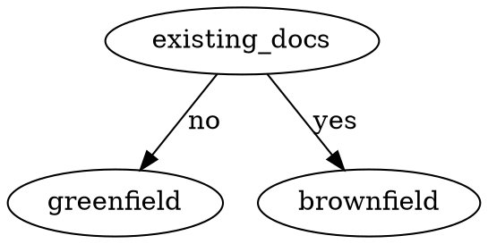
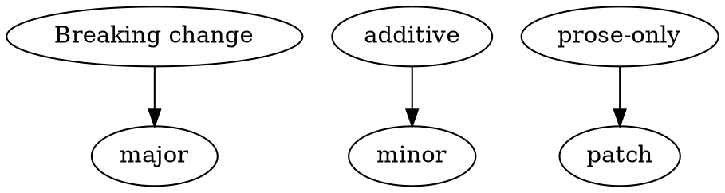

# COMPILER SKILL

## Overview

Architectural compiler: FRS (immutable) → DDD knowledge graph (23 node types) → artifacts (Feature Specs, GitLab Issues, Test Plans, API Docs, topologies, changelogs). Enforces 28 LINT classes, role boundaries (BA/Agent/Developer/QA), consistency rules. Core: compile (not summarize), immutable sources, fail-fast (CNF- nodes), file SYN- back, snapshot = RAM, Shadow QA in Flows (FEATs reference only), terminal states (rejected/superseded/deprecated).

**Companions:** `SCHEMAS.md` (quick node reference), `node-definitions/` (complete node templates), `OPERATIONS.md` (procedure index), `operations/` (detailed procedures), `templates/FILESYSTEM.md` (layout), `templates/KARAPATHY.md` (alignment), `templates/TDD_VALIDATION.md` (testing).

---

## When to Use

- **Ingest FRS** → extract to ACT-/ENT-/CMD-/FLOW-/STATE- nodes
- **Generate artifacts** → Feature Specs, GitLab Issues, Test Plans, API docs
- **Query architecture** → module relationships, version deps, impact traces
- **Resolve conflicts** → CNF- (blocking) or DFB- (feedback)
- **Milestone closure** → 6-gate validation
- **LINT audit** → 28 debt classes

**Symptoms:** need FRS→impl traceability, version drift, duplicated Shadow QA, large home.md, deprecated refs still active.

---

## When NOT to Use

- **Free-form wiki editing** → This skill enforces DDD structure. Use standard wiki editor for unstructured content.
- **Bypass Business Analyst gates** → Role boundaries are non-negotiable. See Role Boundaries table.
- **Ingest monolithic FRS** → Violates "one use case per document". Split first, then `ingest`.
- **Modify raw FRS files** → `/raw_sources/` is immutable. Document corrections as SYN- nodes and submit via `ingest --role dev --feedback`.
- **Implement without test sign-off** → Even if feature works, TRUN with `sign_off_by` is mandatory. See `IMPLEMENT` prerequisites in OPERATIONS.md.
- **Quick typo fixes in sources** → Any modification to raw sources requires SYN- + CNF flow, regardless of size.
- **Rapid prototyping** → This system is for production-grade knowledge graphs with BA gates. For throwaway exploration, use separate workspace.

---

## Execution Workflow

**Never guess steps. Always load the operation file before execution.**

1. **Read SKILL.md** — understand which command category applies
2. **Read OPERATIONS.md** — decide specific operation from the index
3. **Load `operations/<OPERATION>.md`** — follow step-by-step procedure exactly
4. **Execute & log** — append to `log.md`, update `snapshot.md`, rebuild if dirty
5. **Verify preconditions** — run Pre-Operation Checklist before any write operation

**Key insight:** Procedures live in `operations/`, not in SKILL.md. SKILL.md tells you **when** to use which command; OPERATIONS.md tells you **which** command file to load; the operation file tells you **how**.

---

## Common Confusions

| Confusion | Clarification |
|-----------|---------------|
| `query archaeology` vs scoped query | Archaeology is chronological evolution; scoped query is general synthesis. Both use `query` command: `query archaeology <id>` vs `query --module M "question?"` |
| `IMPLEMENT` requires what | Requires **signed TRUN node** (`sign_off_by` populated) **AND** `status: pass`. CI URL optional but recommended. Test pass alone ≠ sufficient. |
| CNF vs DFB | **CNF** = blocking conflict between wiki nodes (logic, version drift, deprecation). **DFB** = developer feedback that wiki doesn't match reality. CNF halts compilation; DFB routes to BA for review. |
| Ephemeral vs durable artifacts | **Ephemeral** (regenerate): TPLAN, TOPO. **Durable** (versioned): TRUN, APIDOC, CHGLOG. Ephemeral artifacts reference a wiki snapshot; stale ones must be regenerated. |
| `resolve dfb` vs `reject dfb` | Both in `RESOLVE_DFB.md`. **Resolve** = BA agrees, fixes wiki, closes DFB. **Reject** = BA disagrees, documents rationale, closes DFB. Both require BA blocks. |
| RECOVER is auto-triggered | Never invoke `RECOVER` directly. `BOOT` auto-triggers it when `dirty: true` or `last_compiled` is stale. |
| `SUPERSEDE` vs `REJECT` | **SUPERSEDE** = new FEAT replaces old (both remain, linked). **REJECT** = FEAT terminal state with reason. Use supersede for replacements; reject for dead ends. |
| `SCHEMAS.md` vs `node-definitions/` | **SCHEMAS.md** = quick lookup only (prefix, directory, one-line constraints). **NEVER** use it to create nodes. **ALWAYS** load the specific `node-definitions/<TYPE>.md` file (e.g., `ACT.md`, `FEAT.md`) for complete frontmatter template, body structure, examples, and common mistakes. |

---

## What If Something Fails? — Troubleshooting

| Failure Symptom | Likely Cause | Fix |
|-----------------|--------------|-----|
| **BOOT:** "dirty: true" | Previous session crashed or interrupted | Let RECOVER run automatically. Do NOT manually edit `snapshot.md`. |
| **COMPILE:** "open CNFs pending" | Version drift, logic conflict, or deprecation citation unresolved | Resolve CNFs first via `RESOLVE CNF` (BA required). Cannot proceed with blocking conflicts. |
| **LINT:** `shadow_qa_drift` | FEAT copied Shadow QA text instead of wikilinking | Restore wikilink reference: "See FLOW-{id} → ## Shadow QA". Delete copied scenarios. |
| **IMPLEMENT:** "no signed TRUN" | Test run completed but QA didn't sign off | Run `GENERATE testplan` → `GENERATE testrun` → obtain QA sign-off (`sign_off_by` field). |
| **QUERY:** slow (>5s) | `home.md` >150 nodes, still in `scale_mode: index` | Switch to `scale_mode: search` in `snapshot.md`. Use scoped queries (`--module M`) instead of full-wiki. |
| **INGEST:** monolith detected | FRS covers multiple independent use cases | Split FRS into separate documents per use case. Create CNF if BA decides to proceed anyway. |
| **GENERATE:** "stale TPLAN" | TPLAN `wiki_snapshot_ref` predates covered node modifications | Regenerate TPLAN first. TRUN must use current TPLAN. |
| **MILESTONE CLOSE:** gate failures | One or more 6-gates not passed (CNFs, LINT, FEAT status) | Fix root cause (resolve CNFs, ensure all FEAT `implemented/rejected/superseded`, LINT clean). |

---

## Directory Structure

The compiler skill uses three complementary documentation layers:

- **`SCHEMAS.md`** — Quick reference index. Use to lookup node type prefix, directory, and key constraints in one glance.
- **`node-definitions/`** — Complete node type templates (ACT.md, ENT.md, CMD.md, FLOW.md, etc.). **LOAD THESE** when creating or editing specific node instances. Each contains full frontmatter template, body structure, schema rules, common mistakes, and runnable examples.
- **`templates/`** — Supporting documents (FILESYSTEM.md, KARAPATHY.md, prompts, validation docs). Use for guidelines, workflows, and procedural documentation.

**Never confuse these:** Node templates are always in `node-definitions/`, not `templates/`. SCHEMAS.md is just an index; it does not contain complete templates.

---

## Decision Flowcharts

### Greenfield vs Brownfield

**Greenfield:** Create skeleton, stub snapshot, await first FRS (§10).
**Brownfield:** Archaeology pass → extract nodes → flag contradictions as CNF-.

### Version Increment

**Major** (breaking): rename/remove field, change type, restructure state machine, remove transition, revise SLA materially. Triggers deprecation propagation for ENT/CMD.  
**Minor** (additive): new attribute, new scenario, new constraint without breaking, new linked node.  
**Patch** (prose-only): typo fix, clarification with no behavioral change, reformatting.

---

## Common Mistakes

| Mistake | What goes wrong |
|---------|----------------|
| Monolithic FRS | Violates "One FRS Per Use Case" |
| Shadow QA duplication | FEAT copies Flow tests → drift |
| Version drift unflagged | CMD/ENT version > FLOW min_version → breakage |
| Deprecation bypass | No CNF- for references |
| Raw source modification | Violates immutability |
| CNF resolution without BA | BA-gate bypass |
| home.md blowout | >150 nodes → slow queries |
| IMPLEMENT without TRUN | No test evidence |
| LINT as warning | Debt accumulates |
| Milestone close with open CNFs | 6-gate violation |

---

## Red Flags — STOP and Verify

**MUST NOT proceed. HALT and create CNF- with `conflict_class: rule_violation` if pressured.**

- ❌ Modify `/raw_sources/` — **IMMUTABLE** (see Overview)
- ❌ Skip deprecation propagation
- ❌ Resolve CNF- without BA block
- ❌ Bypass DFB escalation (7+ days)
- ❌ Copy Shadow QA into FEAT
- ❌ Set `implemented` without signed TRUN
- ❌ Ignore home.md scale (>150 nodes)
- ❌ Treat version drift as "compatible"
- ❌ Proceed with monolith FRS
- ❌ "Quick fix" typo in source
- ❌ MILESTONE CLOSE with open CNFs
- ❌ Continue after LINT failures

**Violating letter = violating spirit.** All pressures (time, authority, sunk cost, exhaustion) → CNF gating.

---

## Common Rationalizations — Reality Check

When under pressure, agents rationalize violations. Every excuse below is a STOP signal:

| Excuse | Reality |
|--------|---------|
| "Just a typo fix" | IMMUTABILITY applies to all changes, regardless of size. Create SYN + CNF for BA to handle. |
| "Backward compatible enough" | Version drift is binary: new_version > pinned_min_version = blocking CNF. |
| "Too much BA work this sprint" | Technical debt left unaddressed compounds. CNF must be created NOW, not later. |
| "Feature works in production" | TRUN is the gate. No sign-off = cannot set implemented status. Milestone closure integrity fails. |
| "Makes FEAT more self-contained" | Shadow QA drift creates stale test scenarios. Reference only; duplication forbidden. |
| "It's well-written, splitting would create more work" | Monolithic FRS violates one-use-case-per-document principle. CNF required regardless of doc quality. |
| "It's obvious, no need to wait for BA" | CNF resolution is BA-gated by design. Agent cannot unilaterally decide "obvious" conflicts. |
| "Minor, developer overthinking" | DFB nodes require BA resolution regardless of perceived severity. 7+ days = automatic escalation. |
| "Still readable, user didn't ask to switch" | Scale threshold is a hard rule at ~150 nodes, not a preference. Switch to search mode automatically. |
| "Flag it in description but no CNF needed" | Version drift is a blocking event. Notes in description do not substitute for CNF creation. |
| "Status change is enough" | Supersede requires bidirectional linking: `status: superseded` + `superseded_by` populated. Traceability mandatory. |
| "Minor, can carry over" | Milestone close requires zero open CNFs (6-gate rule). No exceptions for "minor" conflicts. |

---

## System Invariants

These non-negotiable constraints govern all operations:

- **Immutable sources:** `/raw_sources/` is read-only. All corrections via SYN- nodes + BA approval.
- **Snapshot = RAM:** `snapshot.md` rebuilt from filesystem after every write; never trust in-memory state.
- **Dirty flag gating:** Any write sets `dirty: true`. BOOT auto-triggers RECOVER if dirty.
- **CNF = blocking:** Any rule violation creates CNF- node. Must be resolved before proceeding.
- **BA gates:** CNF resolution, DFB rejection, milestone closure, IMPLEMENT trigger require BA blocks.
- **Role boundaries:** Agent cannot perform BA functions; Developer/QA cannot approve FEATs.
- **Terminal states:** `rejected`, `superseded`, `deprecated` are final — no further edits allowed.
- **Traceability chain:** Every node must link to source FRS; every change must be logged.

**Violating letter = violating spirit.** See `operations/BOOT.md` for pre-operation checklist and detailed procedures.

---

## Role Boundaries

| Role | CAN | CANNOT |
|------|-----|--------|
| **Business Analyst (BA)** | Write FRS, resolve CNF-, approve/reject FEAT, trigger IMPLEMENT/SUPERSEDE, close milestones, define modules, resolve/reject DFB | Modify DDD nodes (except via CNF resolution) |
| **Backend Architect** | INGEST, COMPILE, QUERY, LINT, ISSUE, IMPLEMENT/SUPERSEDE/RESOLVE (exec), GENERATE, ARCHAEOLOGY, MILESTONE CLOSE | Write FRS, modify raw sources, approve FEAT, resolve CNF/DFB (that's BA), name classes/files |
| **Developer** | INGEST --role dev (SYN-), INGEST --role dev --feedback (DFB-), request GENERATE, populate TRUN, sign off TRUN | Modify FRS, approve FEAT, close CNF-, close/reject DFB (BA only) |

**Key principles:**
- BA gates: CNF resolution, DFB resolution/rejection, milestone closure, FEAT approval
- Backend Architect executes procedures but cannot bypass BA gates
- Developers generate test evidence (TRUN) but cannot approve features
- All modifications to raw sources are prohibited (immutability)
- DFB escalation after 7 days automatic regardless of role

---

## Testing & Validation

Pressure-tested with 23 scenarios (`templates/test-pressure-scenarios.md`). 3 RED-GREEN-REFACTOR iterations closed 12 rationalizations. 100% compliance achieved under combined pressures (time + authority + exhaustion). See `templates/TDD_VALIDATION.md`. **Iron Law satisfied:** validated against failures before deployment.

---

## Reference Material

**Quick indexes (load first):**
- `SCHEMAS.md` — Node type quick reference table (prefix, directory, purpose). **WARNING:** For lookup only. **NEVER** use to create nodes.
- `OPERATIONS.md` — Command procedure index

**Complete node templates (load when creating/validating specific nodes):**
- `node-definitions/{ACT,ENT,CMD,FLOW,STATE,DEC,INT,VM,CNF,SYN,FEAT,TRUN,APIDOC,CHGLOG,CAP,ARCH,TOPO,GLOSS,DFB,CONV,SNAPSHOT,MODULES}.md` — Full frontmatter, body structure, examples, common mistakes. **THESE ARE YOUR SOURCE OF TRUTH** for node creation.

**Procedures & guidelines:**
- `operations/` — Detailed command procedures (indexed by OPERATIONS.md)
- `templates/FILESYSTEM.md` — Directory layout
- `templates/KARAPATHY.md` — Alignment guidelines
- `templates/TDD_VALIDATION.md` — Test pressure scenarios & validation results
- `templates/test-pressure-scenarios.md` — Scenario definitions
- `templates/FRS.md` — FRS authoring template

Load heavy references only when needed.

---

## Keywords

FRS ingestion, DDD nodes, knowledge graph, Feature Specs, GitLab Issues, test plans, topology, changelog, apidoc, LINT, version bump, deprecation propagation, CNF conflict, DFB feedback, milestone closure, immutable sources, Shadow QA, version drift, monolith FRS, scale mode, snapshot, RECOVER, BA gates, role boundaries, terminal states, traceability chain.

**LINT classes:** `missing_actor`, `floating_convention`, `shadow_qa_drift`, `decomposition_violation`, `missing_module_registration`, `version_drift`, `deprecated_citation`, `broken_state`, `logic_conflict`, `scale_threshold`, `dirty_snapshot`, `unclosed_cnf`, `dfb_escalation`, `trun_signoff_missing`, `apidoc_overwrite`, `changelog_audience_missing`, `home.md_blowout`, `linter_failed`, `milestone_gate_violation`, `raw_source_modification`, `immutability_violation`, `role_boundary_bypass`, `terminal_state_bypass`, `traceability_gap`, `deprecation_propagation_skipped`, `shadow_qa_duplication`, `schema_mismatch`, `linked_node_missing`.

**Error patterns:** `conflict_class: rule_violation`, `conflict_class: deprecated_citation`, `conflict_class: version_drift`, `conflict_class: decomposition_violation`, `CNF resolution requires BA block`, `DFB escalation 7 days`, `home.md >150 nodes scale_mode:search`, `TRUN sign-off required`, `ephemeral vs durable artifacts`, `pending_ingests`, `open_conflicts`, `open_feedback`, `dirty: true`, `last_compiled older than log.md`.
