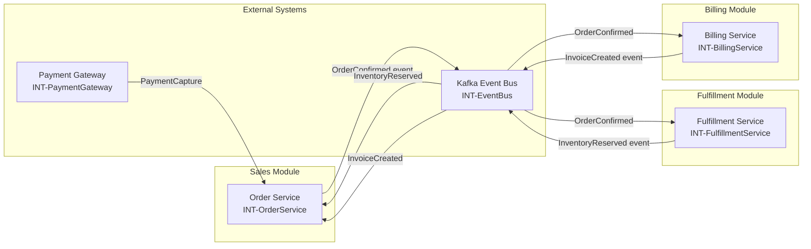

# ARCH- Node (Architecture Blueprint)

**Node type:** Architecture Blueprint  
**Prefix:** `ARCH-`  
**Directory:** `/11_Architecture/`

## When to Use

Architecture Blueprints are high-level design documents that describe system-wide structural 
or behavioral concerns. They are cross-module, citing DEC- nodes that mandate the patterns 
and showing INT- nodes involved. Every ARCH must include a Mermaid topology diagram.

---

## Quick Template (Copy This)

```yaml
---
type: architecture_blueprint
id: ARCH-{ID}
version: "1.0.0"
milestone: {M}
status: active
description: "{One sentence: what architectural concern this addresses.}"
linked_decisions: ["[[DEC-{ID}"]"]
linked_integrations: ["[[INT-{ID}"]"]
---
```

```markdown
# ARCH-{ID} — {Title}

## Topology

```mermaid
graph LR
    {ServiceA} --> {ServiceB}
```

## Communication Pattern

{How components communicate. Cite the DEC- that mandated the pattern.}

## Key Constraints

{Non-negotiable invariants. Each must trace to a DEC- node.}

## Known Gaps

{Decisions not yet formalised. Each gap should become a DEC- or CNF- node.}
```

---

## Frontmatter Fields

| Field | Required? | Rules | Example |
|-------|-----------|-------|---------|
| `id` | Yes | Must start with `ARCH-` + PascalCase | `ARCH-EventDrivenArchitecture` |
| `type` | Yes | Must be `architecture_blueprint` | `architecture_blueprint` |
| `version` | Yes | Semantic version | `"1.0.0"` |
| `milestone` | Yes | Current milestone | `M1` |
| `status` | Yes | `active`, `deprecated`, `superseded` | `active` |
| `description` | Yes | One sentence: architectural concern | `"Cross-module event-driven integration topology"` |
| `module` | No | **Cross-module:** omit or leave empty | *(omit)* |
| `linked_decisions` | Yes | Array of DEC- IDs mandating patterns | `["[[DEC-EventualConsistency]]"]` |
| `linked_integrations` | Yes | Array of INT- IDs involved in topology | `["[[INT-EventBus]]", "[[INT-OrderService]]"]` |
| `deprecated_by` | No | If set, triggers deprecation propagation | `ARCH-EventSourcing` |
| `deprecation_note` | Conditional | Required if deprecated | `"Replaced by event-sourcing blueprint"` |

---

## Body Structure

### Required Sections

1. **Title:** `# ARCH-{ID} — {Title}`  
2. **`## Topology`** — Mermaid diagram showing component relationships (services, databases, message brokers, external systems). Must be **module-scoped or cross-module overview**. Use `graph LR` (left-right) or `graph TB` (top-bottom). Label edges with communication protocols (REST, gRPC, Kafka).
3. **`## Communication Pattern`** — Narrative explaining how components interact. Cite DEC- nodes that mandated this pattern (e.g., "Per DEC-EventualConsistency, we use asynchronous events...").
4. **`## Key Constraints`** — Non-negotiable invariants that architects and developers must respect. Each should trace back to a DEC- node. Examples: "All cross-module state changes must be event-driven," "No direct database sharing between modules."
5. **`## Known Gaps`** — Decisions not yet formalized; each gap should become a DEC- or CNF- node. Shows transparency about incomplete architecture.

### Optional Sections

- `## Performance Characteristics` — Latency targets, throughput expectations, scalability bounds
- `## Security Posture` — Authentication, authorization, network segmentation, compliance boundaries
- `## Failure Modes` — How the system behaves under partial outage (cite INT- circuit breakers)
- `## Evolution` — Anticipated changes, upgrade paths, deprecation plans

---

## Schema Rules

- **Cross-Module:** ARCH- nodes are intentionally cross-module and carry **no `module:` field**. Exempt from `missing_module_registration` LINT. In `home.md` they appear under `## Cross-Module`.
- **Diagram Mandatory:** Body **must** contain a Mermaid `graph` in the Topology section. LINT: `missing_topology_diagram` if absent.
- **Decision Citations:** All architectural choices documented in this blueprint must cite the DEC- that mandated them in `linked_decisions` and in body prose. LINT: `unmandated_architecture` if pattern lacks DEC link.
- **Integration References:** All external systems shown in topology must have corresponding INT- nodes listed in `linked_integrations`. LINT: `broken_reference` if INT- missing.
- **Deprecation:** When `deprecated_by` is set, CNF- nodes created for every active node citing this ARCH- (in body or `linked_decisions`). BA must resolve.

---

## Common Mistakes

| Mistake | What happens | Fix |
|---------|--------------|-----|
| No Mermaid diagram | LINT `missing_topology_diagram` | Add graph showing component relationships |
| Topology shows detail, not pattern | Diagram becomes noise | Abstract: services, not individual endpoints |
| Patterns not linked to DEC | Architectural decisions not traceable | Add DEC- IDs to `linked_decisions` and cite in body |
| INT- shown but not linked | LINT `broken_reference` | Add INT- IDs to `linked_integrations` |
| ARCH mutated after stage | Architecture drift | Create new ARCH- with `supersedes`, mark old `supersenced` |
| Bounded context boundaries missing | Unclear module responsibilities | Add `## Bounded Context` section with explicit scope |

---

## Complete Example

```yaml
---
type: architecture_blueprint
id: ARCH-EventDrivenOrderEcosystem
version: "1.0.0"
milestone: M1
status: active
description: "Event-driven architecture for order status propagation across Sales, Fulfillment, and Billing"
linked_decisions: ["[[DEC-EventualConsistency]]"]
linked_integrations: ["[[INT-EventBus]]", "[[INT-OrderService]]", "[[INT-FulfillmentService]]", "[[INT-BillingService]]"]
---
# ARCH-EventDrivenOrderEcosystem — Event-Driven Order Processing

## Topology



## Communication Pattern

Per DEC-EventualConsistency, modules communicate asynchronously via Kafka events. No direct 
REST calls between modules for state propagation. Each module publishes domain events when 
its state changes; other modules subscribe and update their local state accordingly.

**Event flow example:** Order Service (Sales) publishes `OrderConfirmed` to Event Bus after 
payment capture. Fulfillment Service consumes `OrderConfirmed`, reserves inventory, then 
publishes `InventoryReserved`. Order Service consumes `InventoryReserved` to mark order 
`fulfillable`. Billing Service consumes `OrderConfirmed` to create invoice.

**Command flow remains synchronous:** User actions (PlaceOrder, CancelOrder) are synchronous 
REST commands to Order Service; internal propagation to other modules is asynchronous.

## Key Constraints

- **No cross-module direct database access:** Module boundaries are enforced; no shared tables.
- **Events are idempotent:** All consumers must handle duplicate events gracefully (use event ID deduplication).
- **Event schema evolution:** Additive changes only; breaking changes require new event type and deprecation cycle (see APIDOC for event contracts).
- **Dead-letter queue:** All consumers must configure DLQ; unprocessable events routed to DLQ for manual inspection after 3 retries.
- **Order status is eventually consistent:** UI may show slightly stale status as events propagate (< 5s window).

## Known Gaps

- **Event replay for new subscribers:** How does a new module (e.g., Analytics) bootstrap state from historical events? Not yet designed; CNF- to be created.
- **Event ordering guarantees:** Kafka partitions provide ordering per key (order_id), but what about cross-aggregate ordering? Undetermined; DEC needed.
- **Schema registry:** We lack a centralized schema registry for event payloads; currently relying on ad-hoc JSON schema files in repo. CNF- to evaluate Confluent Schema Registry.

## Performance Characteristics

- Event propagation latency: p99 < 5 seconds from publish to all consumer acknowledgments
- Order Service command latency (PlaceOrder) remains < 1500ms regardless of async propagation (fire-and-forget)
- Event Bus throughput: target 10,000 events/sec sustained

## Security Posture

- Event Bus (Kafka) cluster in private VPC; mTLS between services
- Events do not contain PII (personal data); only IDs and business-level state changes
- Authentication/authorization at REST command layer; events themselves not auth-checked (assume internal network)

## Failure Modes

- Event Bus outage: Modules continue processing commands; events pile up in producer buffer (max 5min). After buffer full, commands that rely on event publication may fail (circuit breaker on Event Bus producer).
- Consumer lag: Fulfillment Service down → `OrderConfirmed` events backlog. Order Service continues unaffected; eventual consistency window extends.
- Poison pill event: Malformed event triggers DLQ after 3 retries; alert sent to platform team for manual inspection.

## Evolution

- Anticipate migration to event-sourcing for Order Service (ARCH-EventSourcedOrders) within 2 years. Current design is a stepping stone.
- Event Bus may split into multiple topics per bounded context for better isolation; current single-topic approach may hit scaling limits.

---

## See Also

- **SCHEMAS.md** — Index
- **node-definitions/DEC.md** — Decision schema (mandates patterns)
- **node-definitions/INT.md** — Integration schema (external systems)
- **node-definitions/CAP.md** — Capability (this blueprint scopes multiple capabilities)
- **OPERATIONS.md** → `INGEST`, `QUERY archaeology` (to trace architectural evolution)
- **WORKFLOWS.md** — Architecture review workflows
- **templates/FRS.md** — FRS section for Architecture Blueprints

---

## LINT Classes

- `missing_topology_diagram` — No Mermaid graph in Topology section
- `unmandated_architecture` — Pattern described without citing a DEC- in `linked_decisions` or body
- `broken_reference` — INT- in diagram or text not listed in `linked_integrations` or does not exist
- `missing_module_registration` — (exempt for ARCH-; cross-module)
- `deprecated_citation` — Active nodes cite deprecated ARCH- without replacement
- `floating_architecture` — ARCH- not referenced by any CAP- or other blueprint (may be valid but unused)
