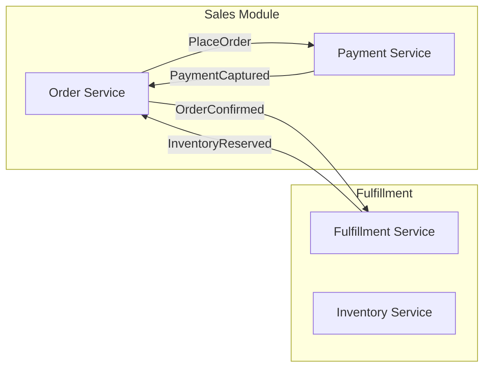
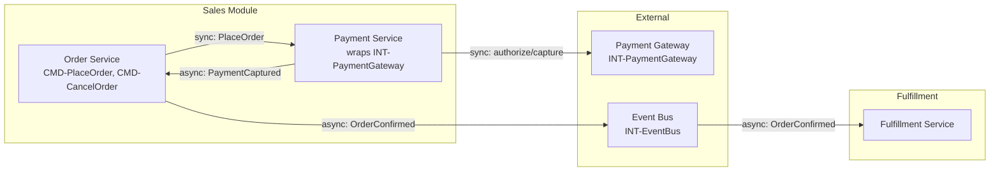

# TOPO- Node (Topology Output)

**Node type:** Topology Output  
**Prefix:** `TOPO-`  
**Directory:** `/14_Outputs/topology/`

## When to Use

A Topology is a **generated, module-scoped Mermaid diagram** assembled from ARCH-, INT-, CAP-, 
and ACT- nodes. It is regenerated on demand and is not versioned. Topologies provide the 
at-a-glance system map for architecture reviews, onboarding, and stakeholder walkthroughs.

---

## Quick Template (Copy This)

```yaml
---
type: topology_output
id: TOPO-{Module}-{ID}
version: "1.0.0"
module: {Module}
milestone: {M}
status: active
ephemeral: true
wiki_snapshot_ref: "{YYYY-MM-DDTHH:MM:SSZ}"
source_nodes: ["[[ARCH-{ID}"]", "[[CAP-{ID}"]", "[[INT-{ID}"]", "[[ACT-{ID}"]"]
---
```

```markdown
# TOPO-{Module} — {Scope}

## Overview

{One paragraph: what this topology shows and for what audience.}

## Service Map

```mermaid
graph LR
    subgraph {Module}
        A[Service A] --> B[Service B]
    end
```

## Ownership & Capabilities

| Capability | Owner Actor | Entry Commands |
|------------|-------------|----------------|
| [[CAP-{ID}]] | [[ACT-{ID}]] | {CMD list} |

## Integration SLA Summary

| Integration | SLA | Circuit Breaker | Blast Radius |
|-------------|-----|-----------------|--------------|
| [[INT-{ID}]] | {SLA} | {N}ms | {Impact} |
```

---

## Full Template (Recommended)

```yaml
---
type: topology_output
id: TOPO-{Module}-{ID}
version: "1.0.0"
module: {Module}
milestone: {M}
status: active
ephemeral: true
wiki_snapshot_ref: ""  # filled by GENERATE at runtime
source_nodes: ["[[ARCH-{ID}"]", "[[CAP-{ID}"]", "[[INT-{ID}"]"]
---
```

```markdown
# TOPO-{Module} — {Scope Description}

## Overview

{What does this diagram cover? Is it the entire module or a specific capability/feature? 
Intended audience: architects, developers, QA, stakeholders?}

## Service Map



## Ownership & Capabilities

| Capability | Owner Actor | Entry Commands |
|------------|-------------|----------------|
| [[CAP-OrderManagement]] | [[ACT-Customer]] | CMD-PlaceOrder, CMD-CancelOrder |
| [[CAP-InventoryManagement]] | [[ACT-Fulfillment]] | CMD-ReserveInventory, CMD-ReleaseStock |

## Integration SLA Summary

| Integration | SLA | Circuit Breaker | Blast Radius |
|-------------|-----|-----------------|--------------|
| [[INT-PaymentGateway]] | 99.9% | 5 failures/30s | Checkout blocked |
| [[INT-EmailService]] | 99.5% | 10 failures/60s | Notifications delayed |

## Notes

- Generated from: `GENERATE topology {module}`
- Staleness: This TOPO is `ephemeral`; regenerate when source ARCH-/CAP-/INT- nodes modified.
- For detailed architecture decisions, see linked ARCH- nodes.
```

---

## Frontmatter Fields

| Field | Required? | Rules | Example |
|-------|-----------|-------|---------|
| `id` | Yes | `TOPO-{Module}-{ShortID}` | `TOPO-Sales-OrderMgmt` |
| `type` | Yes | `topology_output` | `topology_output` |
| `version` | Yes | `"1.0.0"` | `"1.0.0"` |
| `module` | Yes | Must exist in `modules.md` | `sales` |
| `milestone` | Yes | Current milestone | `M1` |
| `status` | Yes | `active` (always; regenerated) | `active` |
| `ephemeral` | Yes | **Must be `true`** (topologies are generated, not versioned) | `true` |
| `wiki_snapshot_ref` | Yes | Timestamp when generated; used to detect staleness | `"2025-04-07T14:30:00Z"` |
| `source_nodes` | Yes | Array of ARCH-, CAP-, INT-, ACT- IDs that compose this topology | `["[[ARCH-EventDrivenOrders]]", "[[CAP-OrderManagement]]"]` |
| `deprecated_by` | No | If topology superseded by new diagram | `TOPO-Sales-OrderMgmtV2` |

---

## Body Structure

### Required Sections

1. **`# TOPO-{Module} — {Scope}`** — Title describes scope (e.g., "Order Management Subsystem")
2. **`## Overview`** — What the diagram covers, intended audience, generation context
3. **`## Service Map`** — **MANDATORY:** Mermaid `graph` diagram. Can use `graph LR` (left-right) or `graph TB` (top-bottom). Show:
   - Subgraphs for modules or bounded contexts
   - Services/components as nodes (label with name and optional type)
   - Edges showing communication with labels (protocol, event name)
   - External systems (INT- nodes)
4. **`## Ownership & Capabilities`** — Table: Capability (CAP-), Owner Actor (ACT-), Entry Commands (CMD- list)
5. **`## Integration SLA Summary`** — Table: Integration (INT-), SLA %, Circuit Breaker config, Blast Radius summary

### Optional Sections

- `## Data Stores` — Databases, message queues not shown in Service Map
- `## Deployment Zones` — Cloud regions, on-prem vs cloud
- `## Notes` — Generation timestamp, source nodes, staleness reminder

---

## Schema Rules

- **Ephemeral:** `ephemeral: true` is mandatory. TOPO nodes are **never** versioned; they are regenerated on demand. LINT: `ephemeral_mismatch` if `ephemeral: false`.
- **Staleness:** When `wiki_snapshot_ref` predates any modification of any `source_nodes`, the TOPO is stale and must be regenerated via `GENERATE topology`. LINT: `stale_artifact` if stale.
- **Source Nodes:** All nodes listed in `source_nodes` must exist and be `active`. These are the upstream artifacts that feed the diagram. LINT: `broken_reference` if missing.
- **Diagram Only:** TOPO body should contain primarily the Mermaid diagram and explanatory tables. Do not duplicate prose from ARCH- nodes; link to them instead.
- **Module Scope:** The TOPO's `module` should match the primary module of its `source_nodes`. It can be a module-level topology or a sub-system within a module.

---

## Common Mistakes

| Mistake | What happens | Fix |
|---------|--------------|-----|
| Missing Mermaid diagram | LINT `missing_topology_diagram` | Add `graph` in Service Map section |
| Diagram shows implementation (classes) not services | Too detailed; violates abstraction level | Show services/components, not classes or endpoints |
| `ephemeral: false` | Violates TOPO semantics; LINT error | Set `ephemeral: true` |
| `wiki_snapshot_ref` outdated | Stale; LINT `stale_artifact` | Regenerate with `GENERATE topology` |
| source_nodes empty or broken | Cannot regenerate | Add valid ARCH-/CAP-/INT- IDs |
| TOPO used as authoritative source | TOPO is derivative; source is ARCH- | Always consult ARCH- for architectural decisions |
| Duplicating ARCH content | Copy-paste becomes stale | Link to ARCH- nodes instead; keep TOPO as diagram + summary |

---

## Complete Example

```yaml
---
type: topology_output
id: TOPO-Sales-OrderMgmt
version: "1.0.0"
module: sales
milestone: M1
status: active
ephemeral: true
wiki_snapshot_ref: "2025-04-07T14:30:00Z"
source_nodes: ["[[ARCH-EventDrivenOrderEcosystem]]", "[[CAP-OrderManagement]]", "[[INT-EventBus]]", "[[INT-PaymentGateway]]"]
---
# TOPO-Sales-OrderMgmt — Order Management Subsystem

## Overview

This topology shows the order management services within the Sales module and their 
integration points with external systems. Audience: architects, onboarding developers. 
Generated from ARCH-EventDrivenOrderEcosystem and CAP-OrderManagement.

## Service Map



**Legend:** Solid lines = synchronous API calls; dashed = asynchronous events.

## Ownership & Capabilities

| Capability | Owner Actor | Entry Commands |
|------------|-------------|----------------|
| [[CAP-OrderManagement]] | [[ACT-Customer]] | CMD-PlaceOrder, CMD-CancelOrder |
| [[CAP-PaymentProcessing]] | [[ACT-System]] (internal) | CMD-AuthorizePayment, CMD-CapturePayment |

## Integration SLA Summary

| Integration | SLA | Circuit Breaker | Blast Radius |
|-------------|-----|-----------------|--------------|
| [[INT-PaymentGateway]] | 99.9% | 5 failures/30s | Checkout blocked, orders queued |
| [[INT-EventBus]] | 99.95% | 10 failures/60s | Async propagation delayed |

## Notes

- **Generated:** 2025-04-07T14:30:00Z from ARCH-EventDrivenOrderEcosystem, CAP-OrderManagement, INT-EventBus, INT-PaymentGateway
- **Staleness check:** If any source node modified, regenerate with `GENERATE topology sales`
- **Detailed design:** See ARCH-EventDrivenOrderEcosystem for patterns, DEC-EventualConsistency for decision rationale
- **Circuit breaker configuration:** See each INT- node for exact thresholds; this table summarizes

---

## See Also

- **SCHEMAS.md** — Index
- **node-definitions/ARCH.md** — Architecture Blueprint (source of design)
- **node-definitions/CAP.md** — Capability (ownership)
- **node-definitions/INT.md** — Integration (SLA details)
- **OPERATIONS.md** → `GENERATE topology`
- **WORKFLOWS.md** — When to regenerate topology
- **templates/FRS.md** — Not applicable (TOPO is output)

---

## LINT Classes

- `stale_artifact` — `wiki_snapshot_ref` older than any `source_nodes` last modification
- `broken_reference` — `source_nodes` contains non-existent node ID
- `ephemeral_mismatch` — `ephemeral` not `true` (violates TOPO semantics)
- `missing_topology_diagram` — No Mermaid graph in body
- `deprecated_citation` — Source nodes deprecated without regeneration
